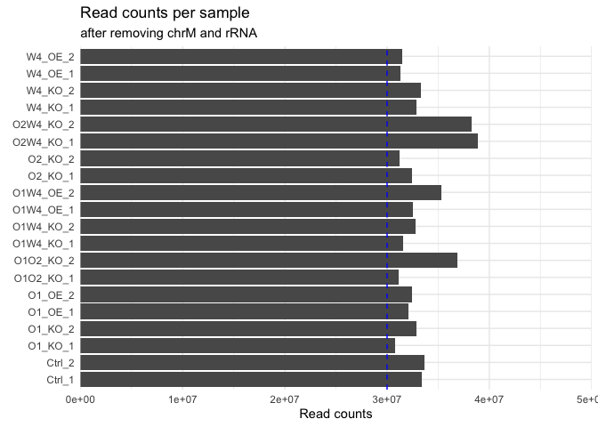
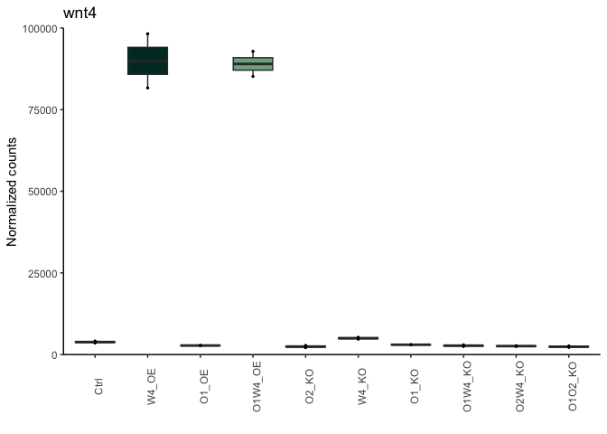
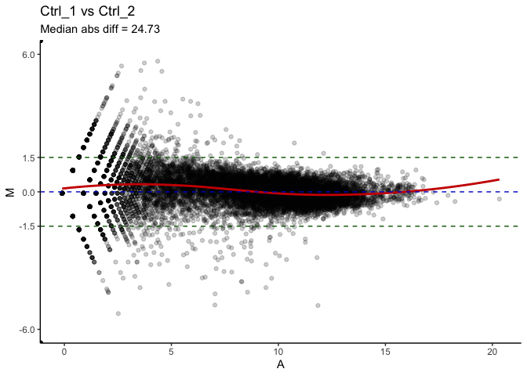
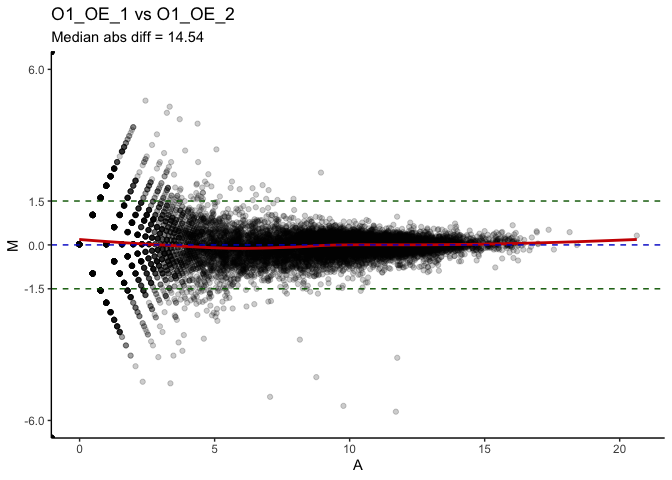
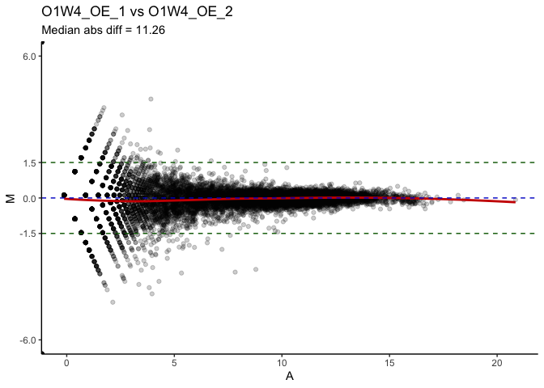
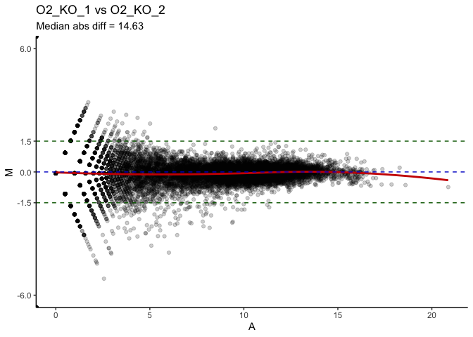

# 01_QC
Qian Hui TAN
2023-10-05

- [<span class="toc-section-number">1</span> 01_QC](#qc)
- [<span class="toc-section-number">2</span> Setup](#setup)
- [<span class="toc-section-number">3</span> Preparing objects for
  DESeq](#preparing-objects-for-deseq)
  - [<span class="toc-section-number">3.1</span> Metadata
    wrangling](#metadata-wrangling)
  - [<span class="toc-section-number">3.2</span> Creating the data
    matrix](#creating-the-data-matrix)
  - [<span class="toc-section-number">3.3</span> Create DESeq
    object](#create-deseq-object)
  - [<span class="toc-section-number">3.4</span> How many non-zero
    rows?](#how-many-non-zero-rows)
- [<span class="toc-section-number">4</span> DESeq QC](#deseq-qc)
  - [<span class="toc-section-number">4.1</span> Setup
    colors](#setup-colors)
  - [<span class="toc-section-number">4.2</span> Dispersion
    estimates](#dispersion-estimates)
  - [<span class="toc-section-number">4.3</span> QC - number of detected
    genes](#qc---number-of-detected-genes)
  - [<span class="toc-section-number">4.4</span> QC -
    clustering](#qc---clustering)
- [<span class="toc-section-number">5</span> Remove rRNA and
  mitochondrial genome](#remove-rrna-and-mitochondrial-genome)
  - [<span class="toc-section-number">5.1</span> Check rRNA
    removed](#check-rrna-removed)
  - [<span class="toc-section-number">5.2</span> QC - number of
    genes](#qc---number-of-genes)
  - [<span class="toc-section-number">5.3</span> QC-
    clustering](#qc--clustering)
- [<span class="toc-section-number">6</span> Check Wnt4, Otk1 and Otk2
  levels](#check-wnt4-otk1-and-otk2-levels)
  - [<span class="toc-section-number">6.1</span> Otk1
    counts](#otk1-counts)
  - [<span class="toc-section-number">6.2</span> Otk2
    counts](#otk2-counts)
  - [<span class="toc-section-number">6.3</span> Wnt4
    counts](#wnt4-counts)
- [<span class="toc-section-number">7</span> MA plots](#ma-plots)
- [<span class="toc-section-number">8</span> Save output](#save-output)
- [<span class="toc-section-number">9</span> Summary](#summary)
- [<span class="toc-section-number">10</span> Sessioninfo](#sessioninfo)

# 01_QC

In this notebook, we perform quality control on bulk RNA-seq data
obtained from Drosophila embryos. The various conditions are summarized
below:

| RNA-seq label | Experimental label | Description                                             |
|---------------|--------------------|---------------------------------------------------------|
| Ctrl          | Control            | Embryos from control flies.                             |
| W4_OE         | UAS-Wnt4           | Embryos in which Wnt4 is over-expressed.                |
| O1_OE         | UAS-Otk1           | Embryos in which Otk1 is over-expressed.                |
| O1W4_OE       | UAS-Otk1, UAS-Wnt4 | Embryos in which Otk1 and Wnt4 are both over-expressed. |
| O2_KO         | Otk2 RNAi          | Embryos in which Otk2 is downregulated.                 |
| W4_KO         | Wnt4 RNAi          | Embryos in which Wnt4 is downregulated.                 |
| O1_KO         | Otk1 RNAi          | Embryos in which Otk1 is downregulated.                 |
| O1W4_KO       | Otk1, Wnt4 RNAi    | Embryos in which Otk1 and Wnt4 are both downregulated.  |
| O2W4_KO       | Otk2, Wnt4 RNAi    | Embryos in which Otk2 and Wnt4 are both downregulated.  |
| O1O2_KO       | Otk1, Otk2 RNAi    | Embryos in which Otk1 and Otk2 are both downregulated.  |

# Setup

``` r
## If output directory doesn't exist, create it
if(!dir.exists("../output")){
    dir.create("../output")
  }
  
if(!dir.exists("../output/01_QC")){
    dir.create("../output/01_QC")
  }
  
output_dir <- "../output/01_QC/"


manual_colors = c("darkgrey",
                   "#1f78b4", "#33a02c","#6600FF","#e31a1c",
                  
                   "#a6cee3", "#b2df8a","#CC99FF", "lightpink", 
                   "coral")
```

``` r
suppressPackageStartupMessages({
    library(dplyr)
    library(readr)
    library(tidyr)
    library(ggplot2)
    library(janitor)
    library(GEOquery)
    library(DESeq2)
    library(reshape2) # melt function
    library(biomaRt)
    library(GenomicFeatures)
    library(scales)
    library(ggrepel)
    library(pheatmap)
    library(viridis)
    library(lubridate)
    library(DT)
})

source("../../scripts/R/qc_functions.R")
source("../../scripts/R/ma_plot_function.R")
```

``` r
# Generic theme
th <- theme(
         plot.title = element_text(size = 15),
         plot.subtitle = element_text(size = 12),
         axis.title.x = element_blank(),
         axis.title.y = element_blank())

# PCA theme
pca_th <- theme(plot.title = element_text(size = 15),
         axis.title.x = element_text(size = 10), 
         axis.title.y = element_text(size = 10),
         axis.text.x = element_text(size = 10),
         axis.text.y = element_text(size = 10))
```

We first create gene-level annotations:

``` r
# Create transcript annotations from the Drosophila genome
fg.gtf.db <- makeTxDbFromGFF("../../data/04_annotations/Drosophila_melanogaster.BDGP6.22.97.chr.gtf", format = "gtf")

# Extract genes from the transcript annotation.
ensembl.genes = genes(fg.gtf.db)

## -- Retrieving biomaRt annotations -- ##

# For each ensembl gene in the drosophila genome, we retrieve additional 
# information such as the gene biotype, gene name, entrez id. These will be
# useful for downstream analysis steps. 

# Set fly 
fly = useEnsembl(
  biomart = "ENSEMBL_MART_ENSEMBL",
  host = "https://asia.ensembl.org",
  dataset = "dmelanogaster_gene_ensembl",
  version = "97"
)

# For each gene, retrieve the following annotations from biomaRt
bm.annotations = getBM(
  attributes = c("ensembl_gene_id",# FBgn, highly specific identifier"
                 "external_gene_name", # normal gene name
                 "gene_biotype",
                 "go_id", # go term accession
                 "name_1006", # go term name,
                 "entrezgene_id",# entrezid for pathway
                 "description"
  ),
  mart = fly,
  filters = "ensembl_gene_id",
  values = ensembl.genes$gene_id,
  uniqueRows = TRUE
)

# Checking bm.annotations
head(bm.annotations)

## -- Creating the object -- ##
# Create ensembl.genes object
ensembl.genes$ensembl_gene_id = bm.annotations$ensembl_gene_id[
  match(ensembl.genes$gene_id, bm.annotations$ensembl_gene_id)]
ensembl.genes$external_gene_name = bm.annotations$external_gene_name[
  match(ensembl.genes$gene_id, bm.annotations$ensembl_gene_id)]
ensembl.genes$gene_biotype = bm.annotations$gene_biotype[
  match(ensembl.genes$gene_id,bm.annotations$ensembl_gene_id)]
ensembl.genes$go_id = bm.annotations$go_id[
  match(ensembl.genes$gene_id,bm.annotations$ensembl_gene_id)]
ensembl.genes$name_1006 = bm.annotations$name_1006[
  match(ensembl.genes$gene_id, bm.annotations$ensembl_gene_id)]
ensembl.genes$entrezgene_id = bm.annotations$entrezgene_id[
  match(ensembl.genes$gene_id, bm.annotations$ensembl_gene_id)]

head(ensembl.genes)

# Save the output
saveRDS(ensembl.genes, file = "../output/01_QC/ensembl_genes.RDS")
```

``` r
ensembl.genes <- readRDS("../output/01_QC/ensembl_genes.RDS")
```

# Preparing objects for DESeq

## Metadata wrangling

``` r
experimental_metadata = na.omit(read.delim("../../data/03_metadata/metadata.csv", 
                                           sep = ",", 
                                   header = TRUE, stringsAsFactors = FALSE,
                                   blank.lines.skip = TRUE))

# Remove empty row(s), if any 
experimental_metadata <- experimental_metadata[!experimental_metadata$condition == "", ]

dim(experimental_metadata)
```

    [1] 20  4

``` r
experimental_metadata
```

|     | sample_id | condition | batch | description                                             |
|:----|:----------|:----------|------:|:--------------------------------------------------------|
| 1   | Ctrl_1    | Ctrl      |     1 | Embryos from wild-type flies.                           |
| 2   | Ctrl_2    | Ctrl      |     2 | Embryos from wild-type flies.                           |
| 4   | W4_OE_1   | W4_OE     |     1 | Embryos in which Wnt4 is over-expressed.                |
| 5   | W4_OE_2   | W4_OE     |     2 | Embryos in which Wnt4 is over-expressed.                |
| 7   | O1_OE_1   | O1_OE     |     1 | Embryos in which Otk1 is over-expressed.                |
| 8   | O1_OE_2   | O1_OE     |     2 | Embryos in which Otk1 is over-expressed.                |
| 10  | O1W4_OE_1 | O1W4_OE   |     1 | Embryos in which Otk1 and Wnt4 are both over-expressed. |
| 11  | O1W4_OE_2 | O1W4_OE   |     2 | Embryos in which Otk1 and Wnt4 are both over-expressed. |
| 13  | O2_KO_1   | O2_KO     |     1 | Embryos in which Otk2 is downregulated.                 |
| 14  | O2_KO_2   | O2_KO     |     2 | Embryos in which Otk2 is downregulated.                 |
| 16  | W4_KO_1   | W4_KO     |     1 | Embryos in which Wnt4 is downregulated.                 |
| 17  | W4_KO_2   | W4_KO     |     2 | Embryos in which Wnt4 is downregulated.                 |
| 19  | O1_KO_1   | O1_KO     |     1 | Embryos in which Otk1 is downregulated.                 |
| 20  | O1_KO_2   | O1_KO     |     2 | Embryos in which Otk1 is downregulated.                 |
| 22  | O1W4_KO_1 | O1W4_KO   |     1 | Embryos in which Otk1 and Wnt4 are both downregulated.  |
| 23  | O1W4_KO_2 | O1W4_KO   |     2 | Embryos in which Otk1 and Wnt4 are both downregulated.  |
| 25  | O2W4_KO_1 | O2W4_KO   |     1 | Embryos in which Otk2 and Wnt4 are both downregulated.  |
| 26  | O2W4_KO_2 | O2W4_KO   |     2 | Embryos in which Otk2 and Wnt4 are both downregulated.  |
| 28  | O1O2_KO_1 | O1O2_KO   |     1 | Embryos in which Otk1 and Otk2 are both downregulated.  |
| 29  | O1O2_KO_2 | O1O2_KO   |     2 | Embryos in which Otk1 and Otk2 are both downregulated.  |

## Creating the data matrix

``` r
# Create a matrix of the data (nrow can be obtained by calling wc -l *.genes.results in terminal; note -1 for header)
data = matrix(0, ncol = length(experimental_metadata$sample_id), 
              nrow = 17714) 
colnames(data) = experimental_metadata$sample_id

for (i in experimental_metadata$sample_id){
 data[ ,i] = read.table(paste("../../data/02_aligned/02_RSEM/", i, ".genes.results",
                              sep = ""),
                         header = TRUE)$expected_count
  row.names(data) = read.table(paste("../../data/02_aligned/02_RSEM/", i, ".genes.results", 
                                     sep=""), 
                               header=TRUE)$gene_id
}


# DESeq needs read counts to be integers
data_mat = apply(round(data), c(1,2), as.integer)

#head(data_mat)
```

## Create DESeq object

``` r
# Create DESeq object
dds = DESeqDataSetFromMatrix(data_mat, experimental_metadata, ~ condition)
```

    Warning in DESeqDataSet(se, design = design, ignoreRank): some variables in
    design formula are characters, converting to factors

``` r
colnames(dds) = colnames(data_mat)

#head(colData(dds)) # Check that condition matches sample
```

``` r
#Estimates the size factors using the "median ratio method" described by Equation 5 in Anders and Huber (2010)
dds <- estimateSizeFactors(dds) 
#This function obtains dispersion estimates for a count data set
dds <- estimateDispersions(dds)
```

    gene-wise dispersion estimates

    mean-dispersion relationship

    final dispersion estimates

``` r
#This function transforms the count data to the log2 scale in a way which minimizes differences between samples for rows with small counts
rld <- rlog(dds, blind = TRUE) # use blind = TRUE for QC
```

``` r
data_mat_nonzero = data_mat[rowSums(data_mat) > 0, ] # Remove non-zero rows
```

## How many non-zero rows?

How many genes are there in the human genome?

``` r
nrow(data_mat)
```

    [1] 17714

How many genes are expressed (at least 1 read in at least 1 sample)?

``` r
nrow(data_mat_nonzero)
```

    [1] 15684

What percentage is this?

``` r
nrow(data_mat_nonzero)/nrow(data_mat) * 100
```

    [1] 88.54014

89% of all rows are nonzero.

# DESeq QC

## Setup colors

``` r
sample_order = colData(dds)$sample_id
condition_order <- c("Ctrl", 
                     "W4_OE", "O1_OE", "O1W4_OE", "O2_KO", 
                     "W4_KO", "O1_KO", "O1W4_KO", "O2W4_KO", "O1O2_KO")

col_colors <- c("darkgrey", #Ctrls
                '#00362d', '#3a6f60', '#80ac95', '#ceebcb', #OEs
                '#552200', '#834a25', '#b0764f', '#daa680', '#ffdab8' #KOs
                )
```

## Dispersion estimates

``` r
## Plot dispersion estimates
plotDispEsts(dds, main = "Dispersion estimates, before filtering")
```


## QC - number of detected genes

Examining our dataset:

``` r
dds
```

    class: DESeqDataSet 
    dim: 17714 20 
    metadata(1): version
    assays(2): counts mu
    rownames(17714): FBgn0000003 FBgn0000008 ... FBgn0286213 FBgn0286222
    rowData names(10): baseMean baseVar ... dispOutlier dispMAP
    colnames(20): Ctrl_1 Ctrl_2 ... O1O2_KO_1 O1O2_KO_2
    colData names(5): sample_id condition batch description sizeFactor

We plot a few key metrics to check our data quality:

``` r
plt_title = "Before Filtering"
```

<div class="panel-tabset">

### Read counts per sample

``` r
total_counts <- as.data.frame(colSums(counts(dds)))
colnames(total_counts) <- "total_counts"
total_counts$name = rownames(total_counts)
# Convert to factor to preserve order
total_counts$name <- factor(total_counts$name, 
                            levels = rev(experimental_metadata$sample_id))
```

``` r
# Plot
ggplot(total_counts, aes(x = name, y = total_counts)) +
    geom_bar(stat = "identity") +
    scale_y_continuous("Read counts", 
                       limits = c(0, 5e7),
                       expand = c(0, 0),
                       breaks = seq(0, 5e7, 1e7)) +
    geom_hline(yintercept = 3e7, color = "blue", linetype = "dashed") +
    labs(title = "Read counts per sample",
         x = element_blank()) +
    theme_minimal() +
    coord_flip()
```


### Number of genes detected per sample

``` r
detected = apply(counts(dds), 2, function(col) sum(col > 0 ))
detected = as.data.frame(detected)
detected$name = row.names(detected)
detected$name = factor(detected$name, rev(experimental_metadata$sample_id))
                 
ggplot(detected, aes(x=name, y=detected)) + 
                 geom_bar(stat="identity") + 
                 theme_minimal() + 
                 coord_flip() + 
                 scale_y_continuous("Number of Genes detected", expand=c(0,0),
                                    breaks = seq(0, 15000, 2500),
                                    limits = c(0, 1.5e4)
                                    ) + 
                 scale_x_discrete("") +
                 labs(title = "# of genes detected", 
                     subtitle = plt_title) +
                 geom_hline(yintercept = 12500, color = "blue", linetype = "dashed") 
```


### Size factors

``` r
df = data.frame(sample_id = names(sizeFactors(dds)), 
                sizeFactors = sizeFactors(dds))

ggplot(df, aes(x = sample_id, y = sizeFactors)) + 
    geom_bar(stat="identity") + 
    scale_y_continuous(limits = c(0,2), expand = c(0,0)) + 
    labs(title = "Size factors for each sample",
         subtitle = plt_title, 
         x = element_blank()) +
    theme_minimal() + 
    theme(axis.text.x = element_text(angle = 90, hjust=1, 
                                     colour="black", size = 10))
```


### Normalized counts (boxplot)

``` r
nc = counts(dds, normalized=TRUE)
nc.melt = melt(nc)

ggplot(nc.melt, aes(x=Var2, y=value)) + 
    geom_boxplot() + 
    theme_classic() + 
    theme(axis.text.x = element_text(angle = 90, colour="black", hjust = 1,
                                     size = 10)) + 
    scale_x_discrete("Sample") + 
    scale_y_continuous("Normalised counts") +
    labs(title = "Normalized counts",
        subtitle = plt_title) +
    th
```


``` r
nc.threshold = 1e6
test = apply(nc, 1, function(x){ any(x > nc.threshold) })
```

The genes with normalized counts greater than 10^{6} are:

``` r
above_threshold <- as.data.frame(ensembl.genes[names(test[test])])

above_threshold[ ,colnames(above_threshold) %in% 
                   c("gene_id", "gene_biotype", "external_gene_name")]
```

|             | gene_id     | external_gene_name | gene_biotype |
|:------------|:------------|:-------------------|:-------------|
| FBgn0013686 | FBgn0013686 | mt:lrRNA           | rRNA         |

That’s an rRNA.

Plotting the rRNA graph:

``` r
rrna.genes = names(ensembl.genes[ensembl.genes$gene_biotype %in% c("Mt_rRNA", "rRNA")])
percentage.of.rrna = (colSums(counts(dds[ rownames(counts(dds)) %in% rrna.genes])) / colSums(counts(dds))) * 100

percentage.of.rrna = as.data.frame(percentage.of.rrna)
percentage.of.rrna$name = rownames(percentage.of.rrna)
percentage.of.rrna$name = factor(percentage.of.rrna$name, 
                                 rev(experimental_metadata$sample_id))

ggplot(percentage.of.rrna, 
       aes(x = name, y = percentage.of.rrna)) + 
        geom_bar(stat="identity") + 
        geom_hline(yintercept = 5, color = "blue", linetype = "dashed") +
        theme_classic() + 
        coord_flip() + 
        scale_y_continuous("% rRNA",
                           expand=c(0,0), limits = c(0, 30), breaks = seq(0, 30, 5)) +
        labs(title = "% rRNA", x = "") 
```


Checking summary statistics for rRNA:

``` r
summary(percentage.of.rrna$percentage.of.rrna)
```

       Min. 1st Qu.  Median    Mean 3rd Qu.    Max. 
      3.658   4.487   5.164   5.167   5.610   6.921 

There’s some rRNA, but they are all less than 7%. That’s good - it
indicates that most reads still belong to non-rRNA reads. Regardless, we
will filter out these rRNA reads from our analysis later.

### Proportions of gene biotypes

``` r
pc = ensembl.genes$gene_id[ensembl.genes$gene_biotype == "protein_coding"]
pg = ensembl.genes$gene_id[ensembl.genes$gene_biotype %in% unique(ensembl.genes$gene_biotype)[grep("pseudogene", unique(ensembl.genes$gene_biotype))]]
lc = ensembl.genes$gene_id[ensembl.genes$gene_biotype == "lincRNA"]

totalcounts.pc = colSums(counts(dds)[rownames(counts(dds)) %in% pc,])
totalcounts.pg = colSums(counts(dds)[rownames(counts(dds)) %in% pg,])
totalcounts.lc = colSums(counts(dds)[rownames(counts(dds)) %in% lc,])

totalcounts.other = colSums(counts(dds)[!(rownames(counts(dds)) %in% c(lc,pc,pg)),])

counts.by.biotype = data.frame(name = names(totalcounts.pc),
                         protein_coding = totalcounts.pc,
                         pseudogene = totalcounts.pg,
                         lincRNA = totalcounts.lc,
                         other = totalcounts.other
                         
                         )


counts.by.biotype = as.data.frame(t(apply(counts.by.biotype[,2:5], 1, function(x){ 100 * (x / sum(x)) }) ))
counts.by.biotype$name = names(totalcounts.pc)

counts.by.biotype.melt = melt(counts.by.biotype)
```

    Using name as id variables

``` r
counts.by.biotype.melt$name = factor(counts.by.biotype.melt$name, 
                                     levels = experimental_metadata$sample_id)


ggplot(counts.by.biotype.melt, aes(x=name, y=value, fill=variable)) +  
    geom_bar(stat="identity") + 
    theme_classic() + 
    scale_x_discrete("") +
    scale_y_continuous("% reads", labels = dollar_format(suffix = "%", prefix = ""),  
                       expand=c(0,0)) + 
    theme(axis.text.x = element_text(angle = 90, colour="black", #family="Arial", 
                                     hjust = 1, size = 11)) +
    labs(title = "Proportions of gene biotypes", 
        subtitle = plt_title) 
```


Most genes are protein-coding, as expected.

</div>

## QC - clustering

We perform 3 types of Quality Control to assess our DESeq dataset:

- Correlation matrix heatmap
- Hierarchical clustering
- PCA

<div class="panel-tabset">

### Correlation matrix heatmap

``` r
### Extract the rld matrix from the object
rld_mat <- assay(rld)  
### Compute pairwise correlation values
rld_cor <- cor(rld_mat)
### Plot heatmap
pheatmap(rld_cor, main = "Correlation heatmap, before filtering")
```


### Hierarchical clustering

``` r
sampleDists <- dist(t(assay(rld)))
plot(hclust(sampleDists), main = paste0("Cluster Dendrogram, ", plt_title))
```


### PCA

``` r
source("../../scripts/R/qc_functions.R")
```

``` r
intgroup = "condition"
intgroup_order = unique(experimental_metadata$condition)

pca_xlim <- c(-30, 30)
pca_ylim <- c(-20, 20)


pca_plot <- make_pca(rld, intgroup = "condition",
         xlimits = pca_xlim, 
         ylimits = pca_ylim,
         manual_colors = col_colors, 
         title = "PCA, before filtering",
         rearrange_intgroup = TRUE,
         intgroup_order = intgroup_order)
```

    Warning: useNames = NA is deprecated. Instead, specify either useNames = TRUE
    or useNames = TRUE.

``` r
pca_plot
```


### PCA, labelled

``` r
make_pca(rld, intgroup = "condition", label = TRUE,
         manual_colors = col_colors, 
         title = "PCA, before filtering",
         rearrange_intgroup = TRUE, 
         intgroup_order = intgroup_order)
```

    Warning: useNames = NA is deprecated. Instead, specify either useNames = TRUE
    or useNames = TRUE.


### PCA, by size factor

``` r
make_pca(rld, intgroup = "sizeFactor",
         title = "PCA plot, before filtering") +
  scale_color_viridis(option = "A")
```

    Warning: useNames = NA is deprecated. Instead, specify either useNames = TRUE
    or useNames = TRUE.


</div>

This looks good - PC1 and 2 both capture biological variation. Samples
also cluster within conditions.

All our key metrics look good. Read counts per sample, number of genes
per sample are all high, and relatively similar across all samples. Most
genes are protein-coding, as expected. Data is of high quality.

# Remove rRNA and mitochondrial genome

We remove all genes that map to rRNA, as well as the mitochondrial
chromosome before we proceed with downstream analysis.

``` r
plt_title = "after removing rRNA and mitochondrial genome"
```

Checking MT chromosome intact:

``` r
in_dds = ensembl.genes[match(rownames(counts(dds)), ensembl.genes$gene_id), ]
table(seqnames(in_dds))
```


    chr2L chr2R chr3L chr3R  chr4  chrX  chrY  chrM 
     3496  3624  3460  4199   111  2673   113    38 

Remove MT chromosome, rerun DESeq:

``` r
# Remove mitochondrial genome
mit_genes <- ensembl.genes[seqnames(ensembl.genes) %in% "chrM", ]$gene_id
length(mit_genes)
```

    [1] 38

``` r
dds_rm_mit <- dds[!rownames(counts(dds)) %in% mit_genes, ]

# Remove rRNA
dds_filt = dds_rm_mit[!(row.names(counts(dds_rm_mit)) %in% 
                   ensembl.genes$gene_id[ensembl.genes$gene_biotype %in% 
                                           c("rRNA", "snoRNA", "snRNA", "Mt_rRNA")]), ]
dds_filt = dds_filt[rowSums(counts(dds_filt)) > 0, ]

# Re-estimate dispersions
dds_filt <- estimateSizeFactors(dds_filt) 
dds_filt <- estimateDispersions(dds_filt)
```

    found already estimated dispersions, replacing these

    gene-wise dispersion estimates

    mean-dispersion relationship

    final dispersion estimates

``` r
rld_filt <- rlog(dds, blind = TRUE) # use blind = TRUE for QC
```

Check that mitochondrial genome has been removed:

``` r
in_dds = ensembl.genes[match(rownames(counts(dds_filt)), ensembl.genes$gene_id), ]
table(seqnames(in_dds))
```


    chr2L chr2R chr3L chr3R  chr4  chrX  chrY  chrM 
     2960  3139  3138  3798   107  2434    79     0 

## Check rRNA removed

``` r
rrna.genes = names(ensembl.genes[ensembl.genes$gene_biotype %in% c("Mt_rRNA", "rRNA", 
                                                                   "snoRNA", "snRNA")])

percentage.of.rrna = (colSums(counts(dds_filt[rownames(counts(dds_filt)) %in% rrna.genes])) / colSums(counts(dds_filt))) * 100
percentage.of.rrna = as.data.frame(percentage.of.rrna)
percentage.of.rrna$name = row.names(percentage.of.rrna)
#percentage.of.rrna$name = factor(percentage.of.rrna$name, rev(experimental_metadata$sample_id))


ggplot(percentage.of.rrna, aes(x=name, y=percentage.of.rrna)) +
  geom_bar(stat="identity") + theme_classic() + coord_flip() + scale_y_continuous("% rRNA", expand=c(0,0)) +
  scale_x_discrete("Sample") +
  ggtitle(paste0("% rRNA, ", plt_title))
```


Checking that rRNA percentage is now zero:

``` r
summary(percentage.of.rrna$percentage.of.rrna)
```

       Min. 1st Qu.  Median    Mean 3rd Qu.    Max. 
          0       0       0       0       0       0 

## QC - number of genes

<div class="panel-tabset">

### Size Factors after rRNA removal

``` r
df = data.frame(sample_id = names(sizeFactors(dds_filt)), sizeFactors = sizeFactors(dds_filt))

df$sample_id = factor(df$sample_id, experimental_metadata$sample_id)

ggplot(df, aes(x = sample_id, y=sizeFactors)) + 
  geom_bar(stat="identity") + 
  scale_y_continuous(limits=c(0,2), expand=c(0,0)) + 
  theme_classic() + 
  theme(axis.text.x = element_text(angle = 90, hjust=1, colour="black", size=11)) +
  geom_hline(yintercept = 1, color = "blue", linetype = "dashed") +
  ggtitle(paste0("Size Factors, ", plt_title)) + 
  th
```


Summary of size factors:

``` r
summary(sizeFactors(dds_filt))
```

       Min. 1st Qu.  Median    Mean 3rd Qu.    Max. 
     0.8131  0.9407  1.0126  1.0061  1.0638  1.1319 

Size factors for each sample:

``` r
print(sizeFactors(dds_filt))
```

       Ctrl_1    Ctrl_2   W4_OE_1   W4_OE_2   O1_OE_1   O1_OE_2 O1W4_OE_1 O1W4_OE_2 
    1.0999289 1.0526837 1.0378320 0.9965829 1.0015226 1.0182475 1.0443977 1.1318862 
      O2_KO_1   O2_KO_2   W4_KO_1   W4_KO_2   O1_KO_1   O1_KO_2 O1W4_KO_1 O1W4_KO_2 
    1.0259569 0.9790215 0.8944856 0.9301420 0.9410265 1.0069593 0.8930973 0.8130668 
    O2W4_KO_1 O2W4_KO_2 O1O2_KO_1 O1O2_KO_2 
    1.0970052 1.1114787 0.9395419 1.1077430 

### Read counts per sample after rRNA and chrM removal

``` r
total_counts <- as.data.frame(colSums(counts(dds_filt)))
colnames(total_counts) <- "total_counts"
total_counts$name = rownames(total_counts)
```

``` r
# Plot
ggplot(total_counts, aes(x = name, y = total_counts)) +
    geom_bar(stat = "identity") +
    scale_y_continuous("Read counts", 
                       limits = c(0, 5e7),
                       expand = c(0, 0),
                       breaks = seq(0, 5e7, 1e7)) +
    geom_hline(yintercept = 3e7, color = "blue", linetype = "dashed") +
    labs(title = "Read counts per sample",
         subtitle = "after removing chrM and rRNA",
         x = element_blank()) +
    theme_minimal() +
    coord_flip()
```



### Number of genes detected per sample after rRNA and chrM removal

``` r
detected = apply(counts(dds_filt), 2, function(col) sum(col > 0 ))
detected = as.data.frame(detected)
detected$name = row.names(detected)
#detected$name = factor(detected$name, rev(experimental_metadata$sample_id))
                 
ggplot(detected, aes(x=name, y=detected)) + 
                 geom_bar(stat="identity") + 
                 theme_minimal() + 
                 coord_flip() + 
                 scale_y_continuous("Number of Genes detected", 
                                    breaks = c(seq(0, 20000, 2500)), 
                                      expand=c(0,0),
                                    limits = c(0, 20000)) + 
                 scale_x_discrete("Sample") +
                 labs(title = "# of genes detected", 
                     subtitle = plt_title) +
                 geom_hline(yintercept = 12500, color = "blue", linetype = "dashed") 
```


</div>

## QC- clustering

<div class="panel-tabset">

### Heatmap after rRNA removal

``` r
### Extract the vst matrix from the object
rld_mat <- assay(rld_filt)  

### Compute pairwise correlation values
rld_cor <- cor(rld_mat)

### Plot heatmap
pheatmap(rld_cor, main = "Correlation heatmap, after rRNA removal")
```


### Clustering after rRNA removal

``` r
sampleDists <- dist(t(assay(rld_filt)))
plot(hclust(sampleDists), main = paste0("Cluster Dendrogram, ", plt_title))
```


### PCA after rRNA removal

``` r
pca_rmrna <- make_pca(rld_filt, intgroup = "condition",
         title = "PCA plot, after removing rRNA and chrM",
         xlimits = pca_xlim, 
         ylimits = pca_ylim,
         manual_colors = col_colors, 
         rearrange_intgroup = TRUE, 
         intgroup_order = intgroup_order) 
```

    Warning: useNames = NA is deprecated. Instead, specify either useNames = TRUE
    or useNames = TRUE.

``` r
pca_rmrna
```


``` r
# Save this
saveRDS(rld_filt, file = paste0(output_dir, "rld_filt.RDS"))
saveRDS(pca_rmrna, file = paste0(output_dir, "pca_rmrna.RDS"))
```

### PCA, labelled

``` r
pca_rmrna_label <- make_pca(rld_filt, intgroup = "condition", label = TRUE, 
         title = "PCA plot, after removing rRNA and chrM",
         xlimits = pca_xlim, 
         ylimits = pca_ylim,
         manual_colors = col_colors, 
         rearrange_intgroup = TRUE, 
         intgroup_order = intgroup_order) 
```

    Warning: useNames = NA is deprecated. Instead, specify either useNames = TRUE
    or useNames = TRUE.

``` r
pca_rmrna_label
```


``` r
# Save this

saveRDS(pca_rmrna_label, file = paste0(output_dir, "pca_rmrna_label.RDS"))
```

### PCA, by size factor

``` r
make_pca(rld_filt, intgroup = "sizeFactor", 
         title = "PCA plot, after removing rRNA and chrM") +
  scale_color_viridis(option = "A")
```

    Warning: useNames = NA is deprecated. Instead, specify either useNames = TRUE
    or useNames = TRUE.

    Scale for colour is already present.
    Adding another scale for colour, which will replace the existing scale.


</div>

# Check Wnt4, Otk1 and Otk2 levels

## Otk1 counts

We plot the normalized counts of Otk1 in each sample:

``` r
otk1_fbgn <- "FBgn0004839"

# Get normalized counts
otk1_norm <- as.data.frame(counts(dds_filt, normalized = TRUE)[otk1_fbgn, ])
otk1_norm$sample <- rownames(otk1_norm)
colnames(otk1_norm) <- c("counts", "sample")
otk1_norm$sample = factor(otk1_norm$sample, 
                          levels = experimental_metadata$sample_id)
otk1_norm$condition = otk1_norm$sample
otk1_norm$condition = gsub("_[0-9]", "", otk1_norm$condition)
otk1_norm$condition = factor(otk1_norm$condition, 
                             levels = unique(experimental_metadata$condition))

write.csv(otk1_norm, file = paste0(output_dir, "otk1_norm_counts.csv"))

# Plot
otk1_plot <- ggplot(otk1_norm, aes(x = condition, y = counts, fill = condition)) +
  geom_boxplot() +
  geom_point(size = 0.5) +
  labs(title = "otk1", 
       x = "", y = "Normalized counts") +
  scale_fill_manual(values = col_colors) +
  scale_y_continuous(expand = c(0, NA), limits = c(0, 1e5)) +
  theme_classic() +
  theme(axis.text.x = element_text(angle = 90), 
        legend.position = "none") 

otk1_plot
```


``` r
saveRDS(otk1_plot, file = paste0(output_dir, "otk1_plot.RDS"))
```

## Otk2 counts

``` r
otk2_fbgn <- "FBgn0267728"

# Get normalized counts
otk2_norm <- as.data.frame(counts(dds_filt, normalized = TRUE)[otk2_fbgn, ])
otk2_norm$sample <- rownames(otk2_norm)
colnames(otk2_norm) <- c("counts", "sample")
otk2_norm$sample = factor(otk2_norm$sample, 
                          levels = experimental_metadata$sample_id)
otk2_norm$condition = otk2_norm$sample
otk2_norm$condition = gsub("_[0-9]", "", otk2_norm$condition)
otk2_norm$condition = factor(otk2_norm$condition, 
                             levels = unique(experimental_metadata$condition))

write.csv(otk2_norm, file = paste0(output_dir, "otk2_norm_counts.csv"))

# Plot
otk2_plot <- ggplot(otk2_norm, aes(x = condition, y = counts, fill = condition)) +
  geom_boxplot() +
  geom_point(size = 0.5) +
  labs(title = "otk2", 
       x = "", y = "Normalized counts") +
  scale_fill_manual(values = col_colors) +
  scale_color_manual(values = col_colors) +
  scale_y_continuous(expand = c(0, NA), limits = c(0, 1e5)) +
  theme_classic() +
  theme(axis.text.x = element_text(angle = 90), 
        legend.position = "none") 

otk2_plot
```


``` r
saveRDS(otk2_plot, file = paste0(output_dir, "otk2_plot.RDS"))
```

## Wnt4 counts

``` r
wnt4_fbgn <- "FBgn0010453"

# Get normalized counts
wnt4_norm <- as.data.frame(counts(dds_filt, normalized = TRUE)[wnt4_fbgn, ])
wnt4_norm$sample <- rownames(wnt4_norm)
colnames(wnt4_norm) <- c("counts", "sample")
wnt4_norm$sample = factor(wnt4_norm$sample, 
                          levels = experimental_metadata$sample_id)
wnt4_norm$condition = wnt4_norm$sample
wnt4_norm$condition = gsub("_[0-9]", "", wnt4_norm$condition)
wnt4_norm$condition = factor(wnt4_norm$condition, 
                             levels = unique(experimental_metadata$condition))

write.csv(wnt4_norm, file = paste0(output_dir, "wnt4_norm_counts.csv"))

# Plot
wnt4_plot <- ggplot(wnt4_norm, aes(x = condition, y = counts, fill = condition)) +
  geom_boxplot() +
  geom_point(size = 0.5) +
  labs(title = "wnt4", 
       x = "", y = "Normalized counts") +
  scale_fill_manual(values = col_colors) +
  scale_y_continuous(expand = c(0, NA), limits = c(0, 1e5)) +
  theme_classic() +
  theme(axis.text.x = element_text(angle = 90),
        legend.position = "none") 


wnt4_plot
```



``` r
saveRDS(wnt4_plot, file = paste0(output_dir, "wnt4_plot.RDS"))
```

# MA plots

Plots to assess whether samples are good replicates.

<div class="panel-tabset">

## Ctrl

``` r
plot_ma_by_rep(condition_combis = generate_condition_combinations(dds_filt, "Ctrl"))
```

    [[1]]



## W4_OE

``` r
plot_ma_by_rep(condition_combis = generate_condition_combinations(dds_filt, "W4_OE"))
```

    [[1]]


## O1_OE

``` r
plot_ma_by_rep(condition_combis = generate_condition_combinations(dds_filt, "O1_OE"))
```

    [[1]]



## O1W4_OE

``` r
plot_ma_by_rep(condition_combis = generate_condition_combinations(dds_filt, "O1W4_OE"))
```

    [[1]]



## O2_KO

``` r
plot_ma_by_rep(condition_combis = generate_condition_combinations(dds_filt, "O2_KO"))
```

    [[1]]



## O2W4_KO

``` r
plot_ma_by_rep(condition_combis = generate_condition_combinations(dds_filt, "O2W4_KO"))
```

    [[1]]


## W4_KO

``` r
plot_ma_by_rep(condition_combis = generate_condition_combinations(dds_filt, "W4_KO"))
```

    [[1]]


## O1_KO

``` r
plot_ma_by_rep(condition_combis = generate_condition_combinations(dds_filt, "O1_KO"))
```

    [[1]]


## O1W4_KO

``` r
plot_ma_by_rep(condition_combis = generate_condition_combinations(dds_filt, "O1W4_KO"))
```

    [[1]]


## O1O2_KO

``` r
plot_ma_by_rep(condition_combis = generate_condition_combinations(dds_filt, "O1O2_KO"))
```

    [[1]]


</div>

Everything looks good.

# Save output

``` r
saveRDS(ensembl.genes, file = paste0(output_dir, "ensembl_genes.RDS"))
saveRDS(data_mat, file = paste0(output_dir, "data_mat.RDS"))
saveRDS(experimental_metadata, file = paste0(output_dir, "metadata.RDS"))
saveRDS(dds_filt, file = paste0(output_dir, "dds_filt.RDS"))
```

# Summary

- Everything looks good!
- Same conditions cluster together on the PCA, as expected.
- MA plots look amazing - no visible batch effect.

# Sessioninfo

``` r
sessionInfo()
```

    R version 4.2.2 (2022-10-31)
    Platform: aarch64-apple-darwin20 (64-bit)
    Running under: macOS Ventura 13.1

    Matrix products: default
    BLAS:   /Library/Frameworks/R.framework/Versions/4.2-arm64/Resources/lib/libRblas.0.dylib
    LAPACK: /Library/Frameworks/R.framework/Versions/4.2-arm64/Resources/lib/libRlapack.dylib

    locale:
    [1] en_US.UTF-8/en_US.UTF-8/en_US.UTF-8/C/en_US.UTF-8/en_US.UTF-8

    attached base packages:
    [1] stats4    stats     graphics  grDevices utils     datasets  methods  
    [8] base     

    other attached packages:
     [1] DT_0.27                     lubridate_1.9.1            
     [3] viridis_0.6.3               viridisLite_0.4.2          
     [5] pheatmap_1.0.12             ggrepel_0.9.3              
     [7] scales_1.2.1                GenomicFeatures_1.50.4     
     [9] AnnotationDbi_1.60.2        biomaRt_2.54.1             
    [11] reshape2_1.4.4              DESeq2_1.38.3              
    [13] SummarizedExperiment_1.28.0 MatrixGenerics_1.10.0      
    [15] matrixStats_1.0.0           GenomicRanges_1.50.2       
    [17] GenomeInfoDb_1.34.9         IRanges_2.32.0             
    [19] S4Vectors_0.36.2            GEOquery_2.66.0            
    [21] Biobase_2.58.0              BiocGenerics_0.44.0        
    [23] janitor_2.2.0               ggplot2_3.4.2              
    [25] tidyr_1.3.0                 readr_2.1.3                
    [27] dplyr_1.1.3                

    loaded via a namespace (and not attached):
     [1] colorspace_2.1-0         rjson_0.2.21             snakecase_0.11.0        
     [4] XVector_0.38.0           rstudioapi_0.14          farver_2.1.1            
     [7] bit64_4.0.5              fansi_1.0.4              xml2_1.3.5              
    [10] splines_4.2.2            codetools_0.2-19         cachem_1.0.8            
    [13] geneplotter_1.76.0       knitr_1.42               jsonlite_1.8.7          
    [16] Rsamtools_2.14.0         annotate_1.76.0          dbplyr_2.3.3            
    [19] png_0.1-8                compiler_4.2.2           httr_1.4.6              
    [22] Matrix_1.5-4.1           fastmap_1.1.1            limma_3.54.1            
    [25] cli_3.6.1                htmltools_0.5.4          prettyunits_1.1.1       
    [28] tools_4.2.2              gtable_0.3.3             glue_1.6.2              
    [31] GenomeInfoDbData_1.2.9   rappdirs_0.3.3           Rcpp_1.0.11             
    [34] vctrs_0.6.3              Biostrings_2.66.0        nlme_3.1-162            
    [37] rtracklayer_1.58.0       xfun_0.37                stringr_1.5.0           
    [40] timechange_0.2.0         lifecycle_1.0.3          restfulr_0.0.15         
    [43] XML_3.99-0.14            zlibbioc_1.44.0          hms_1.1.3               
    [46] parallel_4.2.2           RColorBrewer_1.1-3       yaml_2.3.7              
    [49] curl_5.0.1               memoise_2.0.1            gridExtra_2.3           
    [52] stringi_1.7.12           RSQLite_2.3.1            BiocIO_1.8.0            
    [55] filelock_1.0.2           BiocParallel_1.32.6      rlang_1.1.1             
    [58] pkgconfig_2.0.3          bitops_1.0-7             evaluate_0.20           
    [61] lattice_0.20-45          purrr_1.0.1              GenomicAlignments_1.34.1
    [64] htmlwidgets_1.6.1        labeling_0.4.2           bit_4.0.5               
    [67] tidyselect_1.2.0         plyr_1.8.8               magrittr_2.0.3          
    [70] R6_2.5.1                 generics_0.1.3           DelayedArray_0.24.0     
    [73] DBI_1.1.3                mgcv_1.8-41              pillar_1.9.0            
    [76] withr_2.5.0              KEGGREST_1.38.0          RCurl_1.98-1.12         
    [79] tibble_3.2.1             crayon_1.5.2             utf8_1.2.3              
    [82] BiocFileCache_2.6.1      tzdb_0.3.0               rmarkdown_2.20          
    [85] progress_1.2.2           locfit_1.5-9.7           grid_4.2.2              
    [88] data.table_1.14.8        blob_1.2.4               digest_0.6.33           
    [91] xtable_1.8-4             munsell_0.5.0           
