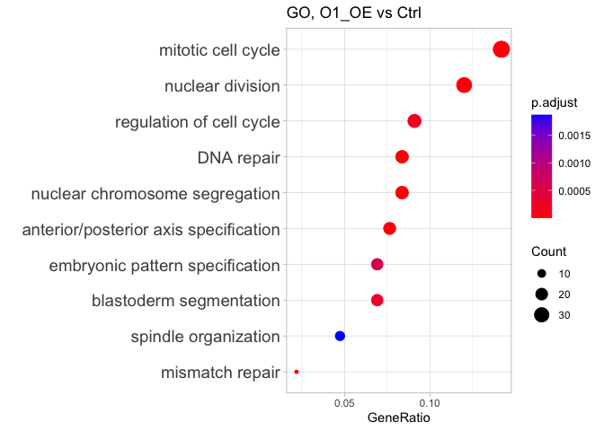

# 02_DE
Qian Hui TAN
2023-09-19

- [<span class="toc-section-number">1</span> 02_DE](#de)
  - [<span class="toc-section-number">1.1</span> Functions](#functions)
  - [<span class="toc-section-number">1.2</span> RLE plot](#rle-plot)
- [<span class="toc-section-number">2</span> Wald Tests](#wald-tests)
  - [<span class="toc-section-number">2.1</span> W4_OE](#w4_oe)
  - [<span class="toc-section-number">2.2</span> O1_OE](#o1_oe)

# 02_DE

In this notebook, we run quick DE volcano plots, p-value histograms and
pairwise cross plots for our conditions.

``` r
source("../../scripts/R/de_functions.R")
source("../../scripts/R/go_kegg_functions.R")

suppressPackageStartupMessages({
  library(DESeq2)
  library(GenomicFeatures)
  library(RColorBrewer)
  library(gplots)
  library(biomaRt)
  library(grid)
  library(gridExtra)
  library(ggplot2)
  library(lattice)
  library(reshape)
  library(geneplotter)
  library(ggrepel)
  library(limma)
  library(tidyverse)
  library(eulerr)
  library(gghighlight)
  library(clusterProfiler) # install from github
  library(org.Dm.eg.db)
})
```

## Functions

``` r
## If the output directory doesn't exist, create it
if(!dir.exists("../output/02_DE")){
  dir.create("../output/02_DE")
}

output_dir <- "../output/02_DE/"
```

Loading data:

``` r
dds = readRDS("../output/01_QC/dds_filt.RDS")
ensembl.genes= readRDS("../output/01_QC/ensembl_genes.RDS")
lfc.threshold = log2(1.5)


dim(dds)
```

    [1] 15669    20

Remove lowly expressed genes:

``` r
# Set control as reference
#colData(dds)$condition <- relevel(colData(dds)$condition, ref = "WT")


# Removing lowly expressed genes, only to be done once at the start of the differential expression step
filter = apply(counts(dds, normalized = TRUE), 1, function(x){ mean(x) >= 10 })
dds = dds[filter, ]
dim(dds)
```

    [1] 11157    20

Run DESeq:

``` r
dds <- DESeq(dds, test = "Wald", parallel = TRUE)
```

    using pre-existing size factors

    estimating dispersions

    gene-wise dispersion estimates: 6 workers

    mean-dispersion relationship

    final dispersion estimates, fitting model and testing: 6 workers

``` r
rld <- rlog(dds, blind = FALSE) # blind = FALSE for downstream DE

design(dds) 
```

    ~condition

List of samples in here

``` r
colData(dds)$sample_id
```

     [1] "Ctrl_1"    "Ctrl_2"    "W4_OE_1"   "W4_OE_2"   "O1_OE_1"   "O1_OE_2"  
     [7] "O1W4_OE_1" "O1W4_OE_2" "O2_KO_1"   "O2_KO_2"   "W4_KO_1"   "W4_KO_2"  
    [13] "O1_KO_1"   "O1_KO_2"   "O1W4_KO_1" "O1W4_KO_2" "O2W4_KO_1" "O2W4_KO_2"
    [19] "O1O2_KO_1" "O1O2_KO_2"

## RLE plot

``` r
assay(rld) %>%
  as.data.frame() %>%
  gather() %>%
  ggplot(aes(x=key, y=value)) + 
  geom_boxplot() + ylab("Log Expression ") + xlab("Sample") +
  theme(axis.text.x = element_text(angle = 90))
```


Run Wald test

``` r
wald_dds = nbinomWaldTest(dds)
```

    found results columns, replacing these

Check names of coefficients

``` r
resultsNames(wald_dds)
```

     [1] "Intercept"                 "condition_O1_KO_vs_Ctrl"  
     [3] "condition_O1_OE_vs_Ctrl"   "condition_O1O2_KO_vs_Ctrl"
     [5] "condition_O1W4_KO_vs_Ctrl" "condition_O1W4_OE_vs_Ctrl"
     [7] "condition_O2_KO_vs_Ctrl"   "condition_O2W4_KO_vs_Ctrl"
     [9] "condition_W4_KO_vs_Ctrl"   "condition_W4_OE_vs_Ctrl"  

# Wald Tests

## W4_OE

<div class="panel-tabset">

### Histogram

``` r
### Note the order of W4_OE and CTRL - W4_OE here is the numerator, CTRL is the denominator

results_W4OE_CTRL = get_dds_res(wald_dds, 
                             contrast = c("condition", "W4_OE", "Ctrl"),
                             ensembl.genes, 
                             shrink = TRUE)
```

    [1] "condition_W4_OE_vs_Ctrl"

    using 'apeglm' for LFC shrinkage. If used in published research, please cite:
        Zhu, A., Ibrahim, J.G., Love, M.I. (2018) Heavy-tailed prior distributions for
        sequence count data: removing the noise and preserving large differences.
        Bioinformatics. https://doi.org/10.1093/bioinformatics/bty895

``` r
res = results_W4OE_CTRL 

hist(res$pvalue, xlab = "p-value", ylab = "Frequency")
```


**Number of significant genes (padj \< 0.1 & log2FoldChange \<
log2(1.5)):**

``` r
sum(res$padj < 0.1 & abs(res$log2FoldChange) > lfc.threshold, na.rm = T)
```

    [1] 46

Compile and export:

``` r
## Saving this to compile later

compname <- "W4OE_vs_Ctrl"

df_res <- res[ ,c("baseMean", "log2FoldChange", "padj")]
colnames(df_res) <- c(paste0(compname, "_baseMean"),
                         paste0(compname, "_log2fc"), 
                         paste0(compname, "_padj"))

write.csv(df_res, file = paste0(output_dir, "compile_W4OEvsCTRL.csv"))

### Writing out .csv files
write_files(res, "W4OE", "CTRL")
```

    Warning in write.csv(results, paste0(output_directory, numerator, "_",
    denominator, : attempt to set 'col.names' ignored

    Warning in write.csv(results, paste0(output_directory, numerator, "_",
    denominator, : attempt to set 'sep' ignored

    Warning in write.csv(sig_padj_fc_genes, paste0(output_dir, numerator, "_", :
    attempt to set 'col.names' ignored

### MA plot

``` r
### MA plot
generate_ma(res)
```


### Volcano plot

``` r
### Volcano plot
generate_volcano(res, "W4_OE", "Ctrl")
```


### GO - up

``` r
df_res = as.data.frame(res)
# Drop rows with NAs in pvalue - these are genes with high variability
df_res = df_res[complete.cases(df_res[ ,c("pvalue", "padj")]), ] 
```

``` r
up_genes <- rownames(res[res$padj < 0.1 &
                      res$log2FoldChange > lfc.threshold, ])

length(up_genes)
```

    [1] 26

``` r
ego <- plotEGO_dm(up_genes, universe = rownames(dds), 
               ont = "BP",
               title = "GO, upregulated genes")
```

    Running GO for organism = drosophila melanogaster


    [1] "7 enrichments found"

``` r
ego
```

| ID         | Description                                                               | GeneRatio | BgRatio |    pvalue |  p.adjust |    qvalue | geneID          | Count |
|:-----------|:--------------------------------------------------------------------------|:----------|:--------|----------:|----------:|----------:|:----------------|------:|
| GO:0046058 | cAMP metabolic process                                                    | 2/19      | 11/8890 | 0.0002353 | 0.0336700 | 0.0273870 | CG32301/CG32305 |     2 |
| GO:0050878 | regulation of body fluid levels                                           | 2/19      | 14/8890 | 0.0003879 | 0.0336700 | 0.0273870 | Spn28Da/CG42259 |     2 |
| GO:0007193 | adenylate cyclase-inhibiting G protein-coupled receptor signaling pathway | 2/19      | 16/8890 | 0.0005102 | 0.0336700 | 0.0273870 | CG32301/CG32305 |     2 |
| GO:0052652 | cyclic purine nucleotide metabolic process                                | 2/19      | 20/8890 | 0.0008036 | 0.0351289 | 0.0285737 | CG32301/CG32305 |     2 |
| GO:0009190 | cyclic nucleotide biosynthetic process                                    | 2/19      | 21/8890 | 0.0008871 | 0.0351289 | 0.0285737 | CG32301/CG32305 |     2 |
| GO:0009187 | cyclic nucleotide metabolic process                                       | 2/19      | 26/8890 | 0.0013642 | 0.0450175 | 0.0366171 | CG32301/CG32305 |     2 |
| GO:0007189 | adenylate cyclase-activating G protein-coupled receptor signaling pathway | 2/19      | 37/8890 | 0.0027566 | 0.0779728 | 0.0634229 | CG32301/CG32305 |     2 |

### GO - down

``` r
down_genes <- rownames(df_res[df_res$padj < 0.1 &
                      df_res$log2FoldChange < lfc.threshold, ])

length(down_genes)
```

    [1] 83

``` r
ego <- plotEGO_dm(down_genes, universe = rownames(dds), 
               ont = "BP",
               title = "GO, downregulated genes")
```

    Running GO for organism = drosophila melanogaster


    [1] "4 enrichments found"

``` r
ego
```

| ID         | Description                       | GeneRatio | BgRatio  |    pvalue |  p.adjust |    qvalue | geneID                               | Count |
|:-----------|:----------------------------------|:----------|:---------|----------:|----------:|----------:|:-------------------------------------|------:|
| GO:0044242 | cellular lipid catabolic process  | 5/55      | 86/8890  | 0.0001792 | 0.0651282 | 0.0593340 | Pepck2/CG7900/CG15533/CG15534/CG3699 |     5 |
| GO:0046395 | carboxylic acid catabolic process | 5/55      | 106/8890 | 0.0004749 | 0.0651282 | 0.0593340 | cn/Oat/Pepck2/CG7900/CG3699          |     5 |
| GO:0016054 | organic acid catabolic process    | 5/55      | 107/8890 | 0.0004959 | 0.0651282 | 0.0593340 | cn/Oat/Pepck2/CG7900/CG3699          |     5 |
| GO:0016042 | lipid catabolic process           | 5/55      | 117/8890 | 0.0007459 | 0.0734677 | 0.0669315 | Pepck2/CG7900/CG15533/CG15534/CG3699 |     5 |

### KEGG, up

``` r
# Get the entrez IDs
up_entrez <- na.omit(ensembl.genes[ensembl.genes$gene_id %in% up_genes, ]$entrezgene_id)

up_ekegg <- plotKEGG_dm(up_entrez, title = "KEGG, upregulated genes")
```

    Running KEGG for organism = drosophila melanogaster

    Reading KEGG annotation online: "https://rest.kegg.jp/link/dme/pathway"...

    Reading KEGG annotation online: "https://rest.kegg.jp/list/pathway/dme"...

    Reading KEGG annotation online: "https://rest.kegg.jp/conv/ncbi-geneid/dme"...


    [1] "1 enrichments found"

``` r
#write.csv(up_ekegg, file = paste0(output_dir, "upregulated_kegg.csv"))
```

### KEGG - down

``` r
# Get the entrez IDs
down_entrez <- na.omit(ensembl.genes[ensembl.genes$gene_id %in% down_genes, ]$entrezgene_id)

down_ekegg <- plotKEGG_dm(down_entrez, title = "KEGG, downregulated genes")
```

    Running KEGG for organism = drosophila melanogaster


    [1] "7 enrichments found"

``` r
write.csv(down_ekegg, file = paste0(output_dir, "kegg_down_w4oe_vs_ctrl.csv"))
```

</div>

## O1_OE

<div class="panel-tabset">

### Histogram

``` r
### Note the order of W4_OE and CTRL - W4_OE here is the numerator, CTRL is the denominator

results_O1OE_CTRL = get_dds_res(wald_dds, 
                             contrast = c("condition", "O1_OE", "Ctrl"),
                             ensembl.genes, 
                             shrink = TRUE)
```

    [1] "condition_O1_OE_vs_Ctrl"

    using 'apeglm' for LFC shrinkage. If used in published research, please cite:
        Zhu, A., Ibrahim, J.G., Love, M.I. (2018) Heavy-tailed prior distributions for
        sequence count data: removing the noise and preserving large differences.
        Bioinformatics. https://doi.org/10.1093/bioinformatics/bty895

``` r
res = results_O1OE_CTRL 

hist(res$pvalue, xlab = "p-value", ylab = "Frequency")
```


**Number of significant genes (padj \< 0.1 & log2FoldChange \<
log2(1.5)):**

``` r
sum(res$padj < 0.1 & abs(res$log2FoldChange) > lfc.threshold, na.rm = T)
```

    [1] 571

Compile and export:

``` r
## Saving this to compile later

compname <- "O1OE_vs_Ctrl"

df_res <- res[ ,c("baseMean", "log2FoldChange", "padj")]
colnames(df_res) <- c(paste0(compname, "_baseMean"),
                         paste0(compname, "_log2fc"), 
                         paste0(compname, "_padj"))

write.csv(df_res, file = paste0(output_dir, "compile_O1OEvsCTRL.csv"))

### Writing out .csv files
write_files(res, "O1OE", "CTRL")
```

    Warning in write.csv(results, paste0(output_directory, numerator, "_",
    denominator, : attempt to set 'col.names' ignored

    Warning in write.csv(results, paste0(output_directory, numerator, "_",
    denominator, : attempt to set 'sep' ignored

    Warning in write.csv(sig_padj_fc_genes, paste0(output_dir, numerator, "_", :
    attempt to set 'col.names' ignored

### MA plot

``` r
### MA plot
generate_ma(res)
```


### Volcano plot

``` r
### Volcano plot
generate_volcano(res, "O1_OE", "Ctrl")
```

    Warning: Removed 217 rows containing missing values (`geom_point()`).


### GO - up

``` r
df_res = as.data.frame(res)
# Drop rows with NAs in pvalue - these are genes with high variability
df_res = df_res[complete.cases(df_res[ ,c("pvalue", "padj")]), ] 
```

``` r
up_genes <- rownames(df_res[df_res$padj < 0.1 &
                      df_res$log2FoldChange > lfc.threshold, ])

length(up_genes)
```

    [1] 325

``` r
ego_up <- plotEGO_dm(up_genes, universe = rownames(dds), 
               ont = "BP",
               title = "GO, upregulated genes")
```

    Running GO for organism = drosophila melanogaster


    [1] "168 enrichments found"

``` r
#ego_up
```

### Custom GO, up

``` r
interesting_pathways <- c("nuclear division", 
                          "regulation of cell cycle",
                          "blastoderm segmentation",
                          "embryonic pattern specification",
                          "anterior/posterior axis specification", 
                          "nuclear chromosome segregation", 
                          "mitotic cell cycle",
                          "DNA repair", 
                          "mismatch repair",
                          "spindle organization")

# Takes in an ego tibble, subsets interesting pathways. 
custom_ego_table(ego_up, interesting_pathways)
```

| Description                           | GeneRatio |  p.adjust | geneID                                                                                                                                                                                                                     |
|:--------------------------------------|:----------|----------:|:---------------------------------------------------------------------------------------------------------------------------------------------------------------------------------------------------------------------------|
| nuclear division                      | 33/275    | 0.0000000 | bru1/aub/Axs/cort/cup/CycA/CycB/Grip91/mus301/spn-E/tws/yem/gammaTub37C/dhd/mst/Grip128/Ercc1/c(2)M/APC7/Nek2/Fign/Grip71/mms4/Mos/Sse/CG6985/mus81/cid/Nnf1b/Zwilch/alphaTub67C/gwl/vas                                   |
| anterior/posterior axis specification | 21/275    | 0.0000002 | aub/bcd/cad/cup/esc/exu/mus301/nos/spn-E/swa/tor/orb/fs(1)M3/Grip128/krimp/CG9925/armi/clos/vret/qin/vas                                                                                                                   |
| nuclear chromosome segregation        | 23/275    | 0.0000009 | aub/Axs/cort/cup/CycA/CycB/mus301/spn-E/tws/gammaTub37C/mst/Ercc1/c(2)M/APC7/Fign/mms4/Mos/Sse/mus81/cid/Nnf1b/Zwilch/vas                                                                                                  |
| mitotic cell cycle                    | 39/275    | 0.0000011 | bru1/aub/CycA/CycB/png/fs(1)Ya/gnu/Grip91/mus101/spn-E/tws/gammaTub37C/CycJ/l(2)dtl/lok/mre11/mst/Rad9/Grip128/ana2/APC7/Nek2/Fign/Grip71/mms4/Ctf4/nopo/Sse/mus81/cid/Nnf1b/Tap42/Zwilch/del/alphaTub67C/gwl/grp/Cdk7/vas |
| DNA repair                            | 23/275    | 0.0000014 | Pms2/Irbp/spel1/tos/lok/mre11/agt/Rad9/Ercc1/Xrcc2/CG13690/Nse1/mms4/Ctf4/rad50/Msh6/Snm1/CG10445/CG9601/timeout/CG6985/mus81/gkt                                                                                          |
| mismatch repair                       | 6/275     | 0.0000540 | Pms2/spel1/tos/Ercc1/CG13690/Msh6                                                                                                                                                                                          |
| regulation of cell cycle              | 25/275    | 0.0001931 | bru1/CycA/CycB/png/gnu/mus101/tws/CycJ/l(2)dtl/lok/mre11/Rad9/APC7/Nek2/Grip71/mms4/Mos/nopo/timeout/mus81/armi/Zwilch/gwl/grp/Cdk7                                                                                        |
| blastoderm segmentation               | 19/275    | 0.0002354 | aub/bcd/cad/cup/exu/nos/spn-E/swa/tor/orb/fs(1)M3/Grip128/krimp/CG9925/armi/clos/vret/qin/vas                                                                                                                              |
| embryonic pattern specification       | 19/275    | 0.0006131 | aub/bcd/cad/cup/exu/nos/spn-E/swa/tor/orb/fs(1)M3/Grip128/krimp/CG9925/armi/clos/vret/qin/vas                                                                                                                              |
| spindle organization                  | 13/275    | 0.0018505 | Axs/Grip91/gammaTub37C/mst/Grip128/spd-2/Grip71/CG18190/cid/Tap42/del/alphaTub67C/grp                                                                                                                                      |

``` r
custom_ego(ego_up, interesting_pathways,
           title = "GO, O1_OE vs Ctrl")
```



### GO - down

``` r
down_genes <- rownames(df_res[df_res$padj < 0.1 &
                      df_res$log2FoldChange < lfc.threshold, ])

length(down_genes)
```

    [1] 1023

``` r
ego_down <- plotEGO_dm(down_genes, universe = rownames(dds), 
               ont = "BP",
               title = "GO, downregulated genes")
```

    Running GO for organism = drosophila melanogaster


    [1] "16 enrichments found"

### Custom GO, down

``` r
interesting_pathways <- c("DNA replication", 
                          "DNA repair",
                          "recombinational repair",
                          "double-strand break repair")

custom_ego(ego_down, interesting_pathways, 
           title = "GO, downregulated, O1OE vs Ctrl")
```


``` r
custom_ego_table(ego_down, interesting_pathways)
```

| Description                | GeneRatio |  p.adjust | geneID                                                                                                                                                                                                                                           |
|:---------------------------|:----------|----------:|:-------------------------------------------------------------------------------------------------------------------------------------------------------------------------------------------------------------------------------------------------|
| DNA replication            | 32/816    | 0.0000235 | Blm/otu/pn/spn-A/Cdk1/tam/PCNA/CycE/RnrL/DNApol-alpha50/Orc5/Mcm5/Orc6/Cdc45/Pol31/Cdc7/RfC38/CG4078/Psf3/DNAlig4/Pif1/Marcal1/CG3430/RfC3/PCNA2/CG7457/RecQ4/Chrac-14/RfC4/Psf2/DNAlig1/DNApol-delta                                            |
| DNA repair                 | 39/816    | 0.0003907 | aurA/lds/DNApol-zeta/mus304/Blm/phr/spn-A/spn-B/tam/PCNA/Parp/Mcm5/CG14814/Rad17/Cdc45/Rad23/Cdc7/RfC38/CG4078/DNAlig4/Pif1/Marcal1/Mnn1/CG5181/RfC3/Nse4/PCNA2/CG8679/CG9062/CG5543/CG7457/dgrn/CG5466/RecQ4/RfC4/Xpd/Psf2/DNAlig1/DNApol-delta |
| recombinational repair     | 17/816    | 0.0108569 | DNApol-zeta/Blm/spn-A/spn-B/Mcm5/Cdc45/Cdc7/CG4078/Pif1/Marcal1/CG5181/CG8679/CG9062/CG7457/dgrn/RecQ4/Psf2                                                                                                                                      |
| double-strand break repair | 20/816    | 0.0881687 | DNApol-zeta/Blm/spn-A/spn-B/Parp/Mcm5/Cdc45/Cdc7/CG4078/DNAlig4/Pif1/Marcal1/CG5181/CG8679/CG9062/CG5543/CG7457/dgrn/RecQ4/Psf2                                                                                                                  |

### KEGG, up

``` r
# Get the entrez IDs
up_entrez <- na.omit(ensembl.genes[ensembl.genes$gene_id %in% up_genes, ]$entrezgene_id)

up_ekegg <- plotKEGG_dm(up_entrez, title = "KEGG, upregulated genes")
```

    Running KEGG for organism = drosophila melanogaster


    [1] "6 enrichments found"

### Custom KEGG, up

``` r
custom_ekegg(up_ekegg, interesting_pathways = up_ekegg$Description,
             title = "KEGG, up, O1OE vs Ctrl")
```


``` r
write.csv(up_ekegg, file = paste0(output_dir, "o1oe_ctrl_kegg_up.csv"))
```

### KEGG - down

``` r
# Get the entrez IDs
down_entrez <- na.omit(ensembl.genes[ensembl.genes$gene_id %in% down_genes, ]$entrezgene_id)

down_ekegg <- plotKEGG_dm(down_entrez, title = "KEGG, downregulated genes")
```

    Running KEGG for organism = drosophila melanogaster


    [1] "12 enrichments found"

``` r
down_ekegg
```

|          | ID       | Description                                                                        | GeneRatio | BgRatio  |    pvalue |  p.adjust |    qvalue | geneID                                                                                                                                  | Count |
|:---------|:---------|:-----------------------------------------------------------------------------------|:----------|:---------|----------:|----------:|----------:|:----------------------------------------------------------------------------------------------------------------------------------------|------:|
| dme03030 | dme03030 | DNA replication - Drosophila melanogaster (fruit fly)                              | 11/273    | 34/3487  | 0.0000311 | 0.0028034 | 0.0023551 | PCNA/DNApol-alpha50/Mcm5/Pol31/RfC38/RfC3/PCNA2/Chrac-14/CG30105/RfC4/DNApol-delta                                                      |    11 |
| dme03410 | dme03410 | Base excision repair - Drosophila melanogaster (fruit fly)                         | 10/273    | 30/3487  | 0.0000539 | 0.0028034 | 0.0023551 | tam/PCNA/Parp/Pol31/RfC38/RfC3/PCNA2/Chrac-14/RfC4/DNApol-delta                                                                         |    10 |
| dme00983 | dme00983 | Drug metabolism - other enzymes - Drosophila melanogaster (fruit fly)              | 19/273    | 94/3487  | 0.0000845 | 0.0029301 | 0.0024615 | bur/GstD7/RnrL/CRMP/Ugt37C1/Ugt36E1/Ugt49B1/nmdyn-D7/GstT3/CG15117/pyd3/Ugt303A1/Ugt37D1/Ugt37C2/GstD10/GstE5/GstE2/su(r)/dUTPase       |    19 |
| dme03430 | dme03430 | Mismatch repair - Drosophila melanogaster (fruit fly)                              | 7/273     | 19/3487  | 0.0003702 | 0.0096245 | 0.0080854 | PCNA/Pol31/RfC38/RfC3/PCNA2/RfC4/DNApol-delta                                                                                           |     7 |
| dme01240 | dme01240 | Biosynthesis of cofactors - Drosophila melanogaster (fruit fly)                    | 21/273    | 138/3487 | 0.0020642 | 0.0429344 | 0.0360684 | Dhod/Alp4/Ugt37C1/Ugt36E1/Ugt49B1/nmdyn-D7/Nadsyn/CG12237/Naprt/CG15117/Alp7/Alp8/Alp10/Alp9/UGP/Hpd/Ugt303A1/Ugt37D1/Ugt37C2/sgll/Alp1 |    21 |
| dme00770 | dme00770 | Pantothenate and CoA biosynthesis - Drosophila melanogaster (fruit fly)            | 5/273     | 14/3487  | 0.0031483 | 0.0482230 | 0.0405112 | b/CRMP/CG5618/pyd3/su(r)                                                                                                                |     5 |
| dme03013 | dme03013 | Nucleocytoplasmic transport - Drosophila melanogaster (fruit fly)                  | 16/273    | 99/3487  | 0.0037704 | 0.0482230 | 0.0405112 | RanGAP/msk/Nup93-1/Ranbp21/Tnpo-SR/Nup54/Rae1/thoc7/thoc6/Nup43/Nup58/Nup133/Ndc1/Arts/Fs(2)Ket/Kr-h2                                   |    16 |
| dme00730 | dme00730 | Thiamine metabolism - Drosophila melanogaster (fruit fly)                          | 6/273     | 21/3487  | 0.0043232 | 0.0482230 | 0.0405112 | Alp4/Alp7/Alp8/Alp10/Alp9/Alp1                                                                                                          |     6 |
| dme00982 | dme00982 | Drug metabolism - cytochrome P450 - Drosophila melanogaster (fruit fly)            | 12/273    | 66/3487  | 0.0044258 | 0.0482230 | 0.0405112 | GstD7/Fdh/Ugt37C1/Ugt36E1/Ugt49B1/GstT3/Ugt303A1/Ugt37D1/Ugt37C2/GstD10/GstE5/GstE2                                                     |    12 |
| dme00053 | dme00053 | Ascorbate and aldarate metabolism - Drosophila melanogaster (fruit fly)            | 8/273     | 35/3487  | 0.0046368 | 0.0482230 | 0.0405112 | Ugt37C1/Ugt36E1/Ugt49B1/CG15117/CG6910/Ugt303A1/Ugt37D1/Ugt37C2                                                                         |     8 |
| dme03420 | dme03420 | Nucleotide excision repair - Drosophila melanogaster (fruit fly)                   | 10/273    | 51/3487  | 0.0052508 | 0.0492765 | 0.0413962 | PCNA/Rad23/Pol31/RfC38/RfC3/PCNA2/Chrac-14/RfC4/Xpd/DNApol-delta                                                                        |    10 |
| dme00980 | dme00980 | Metabolism of xenobiotics by cytochrome P450 - Drosophila melanogaster (fruit fly) | 12/273    | 68/3487  | 0.0056857 | 0.0492765 | 0.0413962 | GstD7/Fdh/Ugt37C1/Ugt36E1/Ugt49B1/GstT3/Ugt303A1/Ugt37D1/Ugt37C2/GstD10/GstE5/GstE2                                                     |    12 |

### Custom KEGG, down

``` r
interesting_pathways = c("DNA replication",
                         "Base excision repair",
                         "Mismatch repair",
                         "Nucleotide excision repair")

custom_ekegg(down_ekegg, 
             interesting_pathways, 
             title = "KEGG, down, O1OE vs Ctrl")
```


``` r
write.csv(down_ekegg, file = paste0(output_dir, "kegg_down_o1oe_vs_ctrl.csv"))
```

</div>

``` r
sessionInfo()
```

    R version 4.2.2 (2022-10-31)
    Platform: aarch64-apple-darwin20 (64-bit)
    Running under: macOS Ventura 13.1

    Matrix products: default
    BLAS:   /Library/Frameworks/R.framework/Versions/4.2-arm64/Resources/lib/libRblas.0.dylib
    LAPACK: /Library/Frameworks/R.framework/Versions/4.2-arm64/Resources/lib/libRlapack.dylib

    locale:
    [1] en_US.UTF-8/en_US.UTF-8/en_US.UTF-8/C/en_US.UTF-8/en_US.UTF-8

    attached base packages:
    [1] grid      stats4    stats     graphics  grDevices utils     datasets 
    [8] methods   base     

    other attached packages:
     [1] org.Dm.eg.db_3.16.0         clusterProfiler_4.7.1.003  
     [3] gghighlight_0.4.0           eulerr_7.0.0               
     [5] forcats_1.0.0               stringr_1.5.0              
     [7] dplyr_1.1.3                 purrr_1.0.1                
     [9] readr_2.1.3                 tidyr_1.3.0                
    [11] tibble_3.2.1                tidyverse_1.3.2            
    [13] limma_3.54.1                ggrepel_0.9.3              
    [15] geneplotter_1.76.0          annotate_1.76.0            
    [17] XML_3.99-0.14               reshape_0.8.9              
    [19] lattice_0.20-45             ggplot2_3.4.2              
    [21] gridExtra_2.3               biomaRt_2.54.1             
    [23] gplots_3.1.3                RColorBrewer_1.1-3         
    [25] GenomicFeatures_1.50.4      AnnotationDbi_1.60.2       
    [27] DESeq2_1.38.3               SummarizedExperiment_1.28.0
    [29] Biobase_2.58.0              MatrixGenerics_1.10.0      
    [31] matrixStats_1.0.0           GenomicRanges_1.50.2       
    [33] GenomeInfoDb_1.34.9         IRanges_2.32.0             
    [35] S4Vectors_0.36.2            BiocGenerics_0.44.0        

    loaded via a namespace (and not attached):
      [1] utf8_1.2.3               tidyselect_1.2.0         RSQLite_2.3.1           
      [4] BiocParallel_1.32.6      scatterpie_0.2.1         munsell_0.5.0           
      [7] codetools_0.2-19         withr_2.5.0              colorspace_2.1-0        
     [10] GOSemSim_2.24.0          filelock_1.0.2           knitr_1.42              
     [13] rstudioapi_0.14          DOSE_3.24.2              labeling_0.4.2          
     [16] bbmle_1.0.25             GenomeInfoDbData_1.2.9   polyclip_1.10-4         
     [19] bit64_4.0.5              farver_2.1.1             downloader_0.4          
     [22] coda_0.19-4              vctrs_0.6.3              treeio_1.22.0           
     [25] generics_0.1.3           gson_0.1.0               xfun_0.37               
     [28] timechange_0.2.0         BiocFileCache_2.6.1      R6_2.5.1                
     [31] apeglm_1.20.0            graphlayouts_1.0.0       locfit_1.5-9.7          
     [34] bitops_1.0-7             cachem_1.0.8             fgsea_1.24.0            
     [37] gridGraphics_0.5-1       DelayedArray_0.24.0      BiocIO_1.8.0            
     [40] scales_1.2.1             ggraph_2.1.0             enrichplot_1.18.4       
     [43] googlesheets4_1.0.1      gtable_0.3.3             tidygraph_1.2.3         
     [46] rlang_1.1.1              splines_4.2.2            rtracklayer_1.58.0      
     [49] lazyeval_0.2.2           gargle_1.3.0             broom_1.0.3             
     [52] yaml_2.3.7               reshape2_1.4.4           modelr_0.1.10           
     [55] backports_1.4.1          qvalue_2.30.0            tools_4.2.2             
     [58] ggplotify_0.1.1          Rcpp_1.0.11              plyr_1.8.8              
     [61] progress_1.2.2           zlibbioc_1.44.0          RCurl_1.98-1.12         
     [64] prettyunits_1.1.1        viridis_0.6.3            cowplot_1.1.1           
     [67] haven_2.5.1              fs_1.6.2                 magrittr_2.0.3          
     [70] data.table_1.14.8        reprex_2.0.2             mvtnorm_1.1-3           
     [73] googledrive_2.0.0        hms_1.1.3                patchwork_1.1.2         
     [76] evaluate_0.20            xtable_1.8-4             HDO.db_0.99.1           
     [79] emdbook_1.3.12           readxl_1.4.1             bdsmatrix_1.3-6         
     [82] compiler_4.2.2           KernSmooth_2.23-20       crayon_1.5.2            
     [85] shadowtext_0.1.2         htmltools_0.5.4          ggfun_0.1.1             
     [88] tzdb_0.3.0               aplot_0.1.10             lubridate_1.9.1         
     [91] DBI_1.1.3                tweenr_2.0.2             dbplyr_2.3.3            
     [94] MASS_7.3-58.2            rappdirs_0.3.3           Matrix_1.5-4.1          
     [97] cli_3.6.1                parallel_4.2.2           igraph_1.5.0            
    [100] pkgconfig_2.0.3          GenomicAlignments_1.34.1 numDeriv_2016.8-1.1     
    [103] xml2_1.3.5               ggtree_3.6.2             XVector_0.38.0          
    [106] rvest_1.0.3              yulab.utils_0.0.6        digest_0.6.33           
    [109] Biostrings_2.66.0        rmarkdown_2.20           cellranger_1.1.0        
    [112] fastmatch_1.1-3          tidytree_0.4.4           restfulr_0.0.15         
    [115] curl_5.0.1               Rsamtools_2.14.0         gtools_3.9.4            
    [118] rjson_0.2.21             lifecycle_1.0.3          nlme_3.1-162            
    [121] jsonlite_1.8.7           viridisLite_0.4.2        fansi_1.0.4             
    [124] pillar_1.9.0             KEGGREST_1.38.0          fastmap_1.1.1           
    [127] httr_1.4.6               GO.db_3.16.0             glue_1.6.2              
    [130] png_0.1-8                bit_4.0.5                ggforce_0.4.1           
    [133] stringi_1.7.12           blob_1.2.4               caTools_1.18.2          
    [136] memoise_2.0.1            ape_5.7-1               
