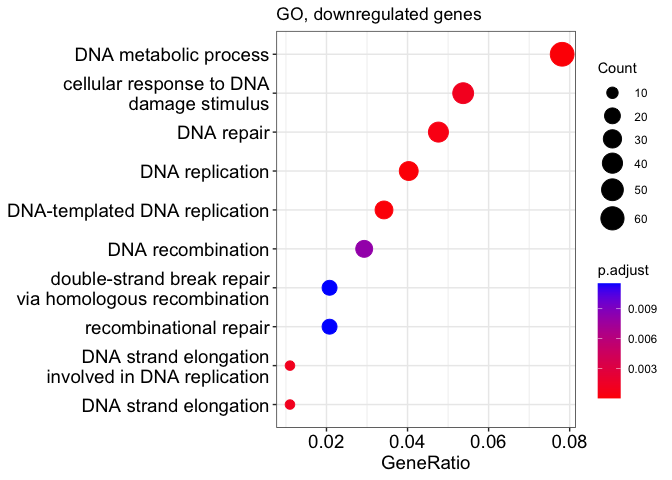
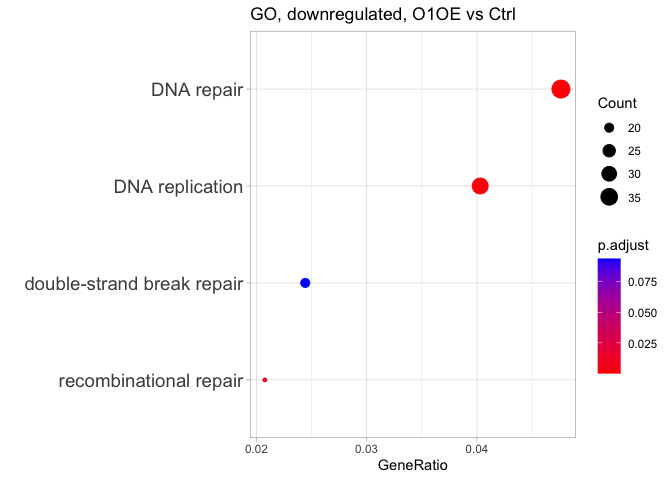
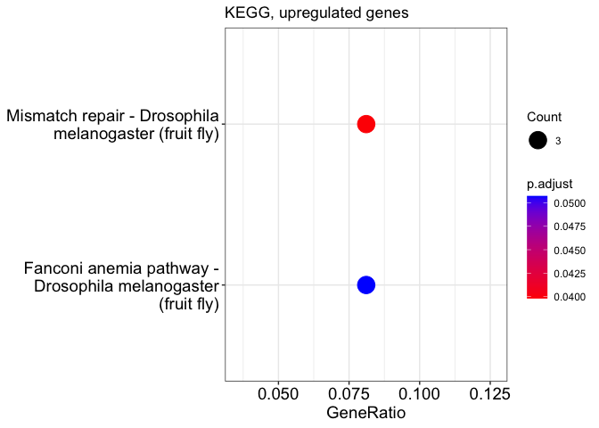
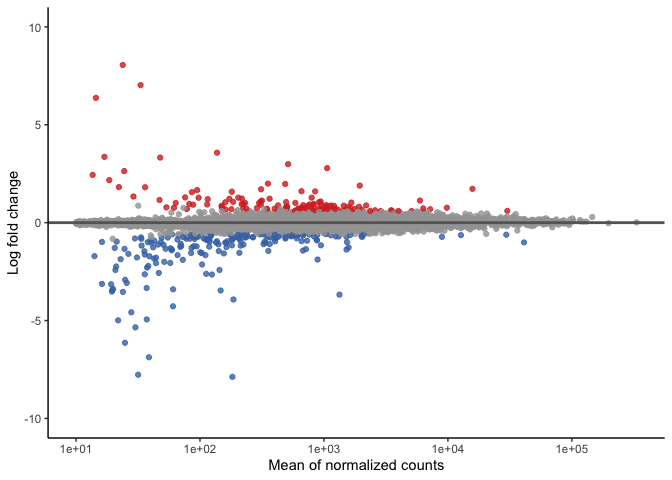
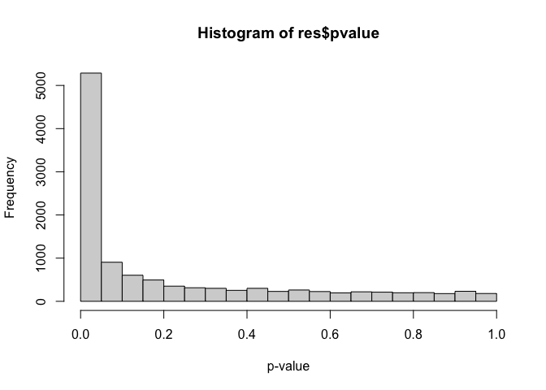

# 02_DE
Qian Hui TAN
2023-10-05

- [<span class="toc-section-number">1</span> 02_DE](#de)
  - [<span class="toc-section-number">1.1</span> Functions](#functions)
  - [<span class="toc-section-number">1.2</span> RLE plot](#rle-plot)
- [<span class="toc-section-number">2</span> Wald Tests -
  all](#wald-tests---all)
- [<span class="toc-section-number">3</span> Wald Tests](#wald-tests)
  - [<span class="toc-section-number">3.1</span> W4_OE](#w4_oe)
  - [<span class="toc-section-number">3.2</span> O1_OE](#o1_oe)
  - [<span class="toc-section-number">3.3</span> O1W4_OE](#o1w4_oe)
  - [<span class="toc-section-number">3.4</span> O2_KO](#o2_ko)
  - [<span class="toc-section-number">3.5</span> W4_KO](#w4_ko)
  - [<span class="toc-section-number">3.6</span> O1_KO](#o1_ko)
  - [<span class="toc-section-number">3.7</span> O1W4_KO](#o1w4_ko)
  - [<span class="toc-section-number">3.8</span> O2W4_KO](#o2w4_ko)
  - [<span class="toc-section-number">3.9</span> O1O2_KO](#o1o2_ko)
- [<span class="toc-section-number">4</span> sessionInfo](#sessioninfo)

# 02_DE

In this notebook, we run quick DE volcano plots, p-value histograms and
pairwise cross plots for our conditions.

``` r
source("../../scripts/R/de_functions.R")
source("../../scripts/R/go_kegg_functions.R")

suppressPackageStartupMessages({
  library(DESeq2)
  library(GenomicFeatures)
  library(RColorBrewer)
  library(gplots)
  library(biomaRt)
  library(grid)
  library(gridExtra)
  library(ggplot2)
  library(lattice)
  library(reshape)
  library(geneplotter)
  library(ggrepel)
  library(limma)
  library(tidyverse)
  library(eulerr)
  library(gghighlight)
  library(clusterProfiler) # install from github
  library(org.Dm.eg.db)
})
```

## Functions

``` r
## If the output directory doesn't exist, create it
if(!dir.exists("../output/02_DE")){
  dir.create("../output/02_DE")
}

output_dir <- "../output/02_DE/"
```

Loading data:

``` r
dds = readRDS("../output/01_QC/dds_filt.RDS")
ensembl.genes= readRDS("../output/01_QC/ensembl_genes.RDS")
lfc.threshold = log2(1.5)


dim(dds)
```

    [1] 15655    20

Remove lowly expressed genes:

``` r
# Set control as reference
#colData(dds)$condition <- relevel(colData(dds)$condition, ref = "WT")


# Removing lowly expressed genes, only to be done once at the start of the differential expression step
filter = apply(counts(dds, normalized = TRUE), 1, function(x){ mean(x) >= 10 })
dds = dds[filter, ]
dim(dds)
```

    [1] 11145    20

Run DESeq:

``` r
dds <- DESeq(dds, test = "Wald", parallel = TRUE)
```

    using pre-existing size factors

    estimating dispersions

    gene-wise dispersion estimates: 6 workers

    mean-dispersion relationship

    final dispersion estimates, fitting model and testing: 6 workers

``` r
rld <- rlog(dds, blind = FALSE) # blind = FALSE for downstream DE

design(dds) 
```

    ~condition

List of samples in here

``` r
colData(dds)$sample_id
```

     [1] "Ctrl_1"    "Ctrl_2"    "W4_OE_1"   "W4_OE_2"   "O1_OE_1"   "O1_OE_2"  
     [7] "O1W4_OE_1" "O1W4_OE_2" "O2_KO_1"   "O2_KO_2"   "W4_KO_1"   "W4_KO_2"  
    [13] "O1_KO_1"   "O1_KO_2"   "O1W4_KO_1" "O1W4_KO_2" "O2W4_KO_1" "O2W4_KO_2"
    [19] "O1O2_KO_1" "O1O2_KO_2"

## RLE plot

``` r
assay(rld) %>%
  as.data.frame() %>%
  gather() %>%
  ggplot(aes(x=key, y=value)) + 
  geom_boxplot() + ylab("Log Expression ") + xlab("Sample") +
  theme(axis.text.x = element_text(angle = 90))
```


Run Wald test

``` r
wald_dds = nbinomWaldTest(dds)
```

    found results columns, replacing these

Check names of coefficients

``` r
res_names <- resultsNames(wald_dds)

res_names
```

     [1] "Intercept"                 "condition_O1_KO_vs_Ctrl"  
     [3] "condition_O1_OE_vs_Ctrl"   "condition_O1O2_KO_vs_Ctrl"
     [5] "condition_O1W4_KO_vs_Ctrl" "condition_O1W4_OE_vs_Ctrl"
     [7] "condition_O2_KO_vs_Ctrl"   "condition_O2W4_KO_vs_Ctrl"
     [9] "condition_W4_KO_vs_Ctrl"   "condition_W4_OE_vs_Ctrl"  

# Wald Tests - all

In this section, we export all the pairwise comparisons (W4_OE vs Ctrl,
O1_OE vs Ctrl, etc) as an excel sheet. Each sheet will contain one
comparison.

``` r
# Function to extract results from a given comparison 
get_res <- function(x) {
  res = results(wald_dds, name = x) 
  res$ensembl_gene_id = rownames(res)
  res$external_gene_name = ensembl.genes$external_gene_name[match(rownames(res), ensembl.genes$ensembl_gene_id)]
  res$gene_biotype = ensembl.genes$gene_biotype[match(rownames(res), ensembl.genes$ensembl_gene_id)]
  
  res <- as_tibble(res) %>% 
    dplyr::select(ensembl_gene_id, log2FoldChange, pvalue, padj, gene_biotype, external_gene_name)
  
  return(res)
  }

wald_res_all <- lapply(res_names, get_res)
names(wald_res_all) <- res_names

head(wald_res_all)
```

    $Intercept
    # A tibble: 11,145 × 6
       ensembl_gene_id log2FoldChange    pvalue      padj gene_biotype  
       <chr>                    <dbl>     <dbl>     <dbl> <chr>         
     1 FBgn0000003               8.07 2.13e-134 2.71e-134 ncRNA         
     2 FBgn0000008              11.4  0         0         protein_coding
     3 FBgn0000014              12.6  0         0         protein_coding
     4 FBgn0000015              11.9  0         0         protein_coding
     5 FBgn0000017              12.7  0         0         protein_coding
     6 FBgn0000018               7.91 0         0         protein_coding
     7 FBgn0000022               8.17 0         0         protein_coding
     8 FBgn0000024               9.42 0         0         protein_coding
     9 FBgn0000028               7.81 0         0         protein_coding
    10 FBgn0000032              10.3  0         0         protein_coding
    # ℹ 11,135 more rows
    # ℹ 1 more variable: external_gene_name <chr>

    $condition_O1_KO_vs_Ctrl
    # A tibble: 11,145 × 6
       ensembl_gene_id log2FoldChange    pvalue     padj gene_biotype  
       <chr>                    <dbl>     <dbl>    <dbl> <chr>         
     1 FBgn0000003             -0.323 0.486     0.604    ncRNA         
     2 FBgn0000008             -0.464 0.000288  0.00244  protein_coding
     3 FBgn0000014             -0.548 0.00233   0.0112   protein_coding
     4 FBgn0000015             -0.339 0.0353    0.0810   protein_coding
     5 FBgn0000017              0.154 0.280     0.398    protein_coding
     6 FBgn0000018              0.323 0.0848    0.158    protein_coding
     7 FBgn0000022             -0.124 0.658     0.751    protein_coding
     8 FBgn0000024             -1.17  0.0000568 0.000739 protein_coding
     9 FBgn0000028             -0.185 0.515     0.629    protein_coding
    10 FBgn0000032              0.858 0.000360  0.00291  protein_coding
    # ℹ 11,135 more rows
    # ℹ 1 more variable: external_gene_name <chr>

    $condition_O1_OE_vs_Ctrl
    # A tibble: 11,145 × 6
       ensembl_gene_id log2FoldChange  pvalue   padj gene_biotype external_gene_name
       <chr>                    <dbl>   <dbl>  <dbl> <chr>        <chr>             
     1 FBgn0000003             -0.250 0.590   0.724  ncRNA        7SLRNA:CR32864    
     2 FBgn0000008             -0.147 0.250   0.429  protein_cod… a                 
     3 FBgn0000014             -0.225 0.211   0.390  protein_cod… abd-A             
     4 FBgn0000015             -0.245 0.127   0.295  protein_cod… Abd-B             
     5 FBgn0000017              0.184 0.194   0.372  protein_cod… Abl               
     6 FBgn0000018              0.208 0.268   0.446  protein_cod… abo               
     7 FBgn0000022              0.217 0.435   0.601  protein_cod… ac                
     8 FBgn0000024             -0.532 0.0653  0.207  protein_cod… Ace               
     9 FBgn0000028             -0.440 0.123   0.288  protein_cod… acj6              
    10 FBgn0000032              0.666 0.00565 0.0694 protein_cod… Acph-1            
    # ℹ 11,135 more rows

    $condition_O1O2_KO_vs_Ctrl
    # A tibble: 11,145 × 6
       ensembl_gene_id log2FoldChange      pvalue       padj gene_biotype  
       <chr>                    <dbl>       <dbl>      <dbl> <chr>         
     1 FBgn0000003            0.173   0.709       0.788      ncRNA         
     2 FBgn0000008           -0.343   0.00724     0.0229     protein_coding
     3 FBgn0000014           -0.678   0.000167    0.00123    protein_coding
     4 FBgn0000015           -0.477   0.00309     0.0119     protein_coding
     5 FBgn0000017            0.214   0.131       0.219      protein_coding
     6 FBgn0000018            0.00347 0.985       0.991      protein_coding
     7 FBgn0000022           -0.551   0.0500      0.104      protein_coding
     8 FBgn0000024           -1.49    0.000000336 0.00000930 protein_coding
     9 FBgn0000028           -0.309   0.276       0.391      protein_coding
    10 FBgn0000032            0.893   0.000203    0.00143    protein_coding
    # ℹ 11,135 more rows
    # ℹ 1 more variable: external_gene_name <chr>

    $condition_O1W4_KO_vs_Ctrl
    # A tibble: 11,145 × 6
       ensembl_gene_id log2FoldChange   pvalue     padj gene_biotype  
       <chr>                    <dbl>    <dbl>    <dbl> <chr>         
     1 FBgn0000003              0.510 2.70e- 1 3.47e- 1 ncRNA         
     2 FBgn0000008             -0.889 5.53e-12 1.26e-10 protein_coding
     3 FBgn0000014             -1.11  7.27e-10 9.37e- 9 protein_coding
     4 FBgn0000015             -0.876 6.17e- 8 4.62e- 7 protein_coding
     5 FBgn0000017              0.756 1.02e- 7 7.23e- 7 protein_coding
     6 FBgn0000018              0.238 2.09e- 1 2.80e- 1 protein_coding
     7 FBgn0000022             -0.447 1.13e- 1 1.67e- 1 protein_coding
     8 FBgn0000024             -1.30  8.41e- 6 3.76e- 5 protein_coding
     9 FBgn0000028             -0.813 5.22e- 3 1.16e- 2 protein_coding
    10 FBgn0000032              1.77  1.46e-13 5.19e-12 protein_coding
    # ℹ 11,135 more rows
    # ℹ 1 more variable: external_gene_name <chr>

    $condition_O1W4_OE_vs_Ctrl
    # A tibble: 11,145 × 6
       ensembl_gene_id log2FoldChange  pvalue   padj gene_biotype external_gene_name
       <chr>                    <dbl>   <dbl>  <dbl> <chr>        <chr>             
     1 FBgn0000003             0.269  0.561   0.773  ncRNA        7SLRNA:CR32864    
     2 FBgn0000008            -0.213  0.0944  0.301  protein_cod… a                 
     3 FBgn0000014            -0.314  0.0805  0.279  protein_cod… abd-A             
     4 FBgn0000015            -0.323  0.0450  0.209  protein_cod… Abd-B             
     5 FBgn0000017            -0.116  0.413   0.663  protein_cod… Abl               
     6 FBgn0000018             0.117  0.532   0.754  protein_cod… abo               
     7 FBgn0000022             0.473  0.0865  0.288  protein_cod… ac                
     8 FBgn0000024            -0.900  0.00185 0.0364 protein_cod… Ace               
     9 FBgn0000028             0.0268 0.924   0.971  protein_cod… acj6              
    10 FBgn0000032             0.136  0.571   0.779  protein_cod… Acph-1            
    # ℹ 11,135 more rows

``` r
# export this
openxlsx::write.xlsx(wald_res_all, 
                     file = paste0(output_dir, "logfoldchanges.xlsx"), 
                     sheetName = names(wald_res_all), 
                     rowNames = FALSE)
```

# Wald Tests

## W4_OE

<div class="panel-tabset">

### Histogram

``` r
### Note the order of W4_OE and CTRL - W4_OE here is the numerator, CTRL is the denominator

results_W4OE_CTRL = get_dds_res(wald_dds, 
                             contrast = c("condition", "W4_OE", "Ctrl"),
                             ensembl.genes, 
                             shrink = TRUE)
```

    [1] "condition_W4_OE_vs_Ctrl"

    using 'apeglm' for LFC shrinkage. If used in published research, please cite:
        Zhu, A., Ibrahim, J.G., Love, M.I. (2018) Heavy-tailed prior distributions for
        sequence count data: removing the noise and preserving large differences.
        Bioinformatics. https://doi.org/10.1093/bioinformatics/bty895

``` r
res = results_W4OE_CTRL 

hist(res$pvalue, xlab = "p-value", ylab = "Frequency")
```


**Number of significant genes (padj \< 0.1 & log2FoldChange \<
log2(1.5)):**

``` r
sum(res$padj < 0.1 & abs(res$log2FoldChange) > lfc.threshold, na.rm = T)
```

    [1] 47

### MA plot

``` r
### MA plot
generate_ma(res)
```


### Volcano plot

``` r
### Volcano plot
generate_volcano(res, "W4_OE", "Ctrl")
```


### GO - up

``` r
df_res = as.data.frame(res)
# Drop rows with NAs in pvalue - these are genes with high variability
df_res = df_res[complete.cases(df_res[ ,c("pvalue", "padj")]), ] 
```

``` r
up_genes <- rownames(res[res$padj < 0.1 &
                      res$log2FoldChange > lfc.threshold, ])

length(up_genes)
```

    [1] 26

``` r
ego <- plotEGO_dm(up_genes, universe = rownames(dds), 
               ont = "BP",
               title = "GO, upregulated genes")
```

    Running GO for organism = drosophila melanogaster


    [1] "7 enrichments found"

``` r
ego
```

| ID         | Description                                                               | GeneRatio | BgRatio |    pvalue |  p.adjust |    qvalue | geneID          | Count |
|:-----------|:--------------------------------------------------------------------------|:----------|:--------|----------:|----------:|----------:|:----------------|------:|
| GO:0046058 | cAMP metabolic process                                                    | 2/19      | 11/8880 | 0.0002358 | 0.0337452 | 0.0274482 | CG32301/CG32305 |     2 |
| GO:0050878 | regulation of body fluid levels                                           | 2/19      | 14/8880 | 0.0003887 | 0.0337452 | 0.0274482 | Spn28Da/CG42259 |     2 |
| GO:0007193 | adenylate cyclase-inhibiting G protein-coupled receptor signaling pathway | 2/19      | 16/8880 | 0.0005113 | 0.0337452 | 0.0274482 | CG32301/CG32305 |     2 |
| GO:0052652 | cyclic purine nucleotide metabolic process                                | 2/19      | 20/8880 | 0.0008054 | 0.0352071 | 0.0286374 | CG32301/CG32305 |     2 |
| GO:0009190 | cyclic nucleotide biosynthetic process                                    | 2/19      | 21/8880 | 0.0008891 | 0.0352071 | 0.0286374 | CG32301/CG32305 |     2 |
| GO:0009187 | cyclic nucleotide metabolic process                                       | 2/19      | 26/8880 | 0.0013672 | 0.0451174 | 0.0366983 | CG32301/CG32305 |     2 |
| GO:0007189 | adenylate cyclase-activating G protein-coupled receptor signaling pathway | 2/19      | 37/8880 | 0.0027627 | 0.0781446 | 0.0635626 | CG32301/CG32305 |     2 |

### GO - down

``` r
down_genes <- rownames(df_res[df_res$padj < 0.1 &
                      df_res$log2FoldChange < lfc.threshold, ])

length(down_genes)
```

    [1] 83

``` r
ego <- plotEGO_dm(down_genes, universe = rownames(dds), 
               ont = "BP",
               title = "GO, downregulated genes")
```

    Running GO for organism = drosophila melanogaster


    [1] "4 enrichments found"

``` r
ego
```

| ID         | Description                       | GeneRatio | BgRatio  |    pvalue |  p.adjust |    qvalue | geneID                               | Count |
|:-----------|:----------------------------------|:----------|:---------|----------:|----------:|----------:|:-------------------------------------|------:|
| GO:0044242 | cellular lipid catabolic process  | 5/55      | 86/8880  | 0.0001802 | 0.0654606 | 0.0596368 | Pepck2/CG7900/CG15533/CG15534/CG3699 |     5 |
| GO:0046395 | carboxylic acid catabolic process | 5/55      | 106/8880 | 0.0004774 | 0.0654606 | 0.0596368 | cn/Oat/Pepck2/CG7900/CG3699          |     5 |
| GO:0016054 | organic acid catabolic process    | 5/55      | 107/8880 | 0.0004984 | 0.0654606 | 0.0596368 | cn/Oat/Pepck2/CG7900/CG3699          |     5 |
| GO:0016042 | lipid catabolic process           | 5/55      | 117/8880 | 0.0007496 | 0.0738387 | 0.0672695 | Pepck2/CG7900/CG15533/CG15534/CG3699 |     5 |

### KEGG, up

``` r
# Get the entrez IDs
up_entrez <- na.omit(ensembl.genes[ensembl.genes$gene_id %in% up_genes, ]$entrezgene_id)

up_ekegg <- plotKEGG_dm(up_entrez, title = "KEGG, upregulated genes")
```

    Running KEGG for organism = drosophila melanogaster

    Reading KEGG annotation online: "https://rest.kegg.jp/link/dme/pathway"...

    Reading KEGG annotation online: "https://rest.kegg.jp/list/pathway/dme"...

    Reading KEGG annotation online: "https://rest.kegg.jp/conv/ncbi-geneid/dme"...


    [1] "2 enrichments found"

``` r
write.csv(up_ekegg, file = paste0(output_dir, "w4oe_vs_ctrl_up_kegg.csv"))
```

### KEGG - down

``` r
# Get the entrez IDs
down_entrez <- na.omit(ensembl.genes[ensembl.genes$gene_id %in% down_genes, ]$entrezgene_id)

down_ekegg <- plotKEGG_dm(down_entrez, title = "KEGG, downregulated genes")
```

    Running KEGG for organism = drosophila melanogaster


    [1] "10 enrichments found"

``` r
write.csv(down_ekegg, file = paste0(output_dir, "w4oe_vs_ctrl_down_kegg.csv"))
```

</div>

## O1_OE

<div class="panel-tabset">

### Histogram

``` r
### Note the order of W4_OE and CTRL - W4_OE here is the numerator, CTRL is the denominator

results_O1OE_CTRL = get_dds_res(wald_dds, 
                             contrast = c("condition", "O1_OE", "Ctrl"),
                             ensembl.genes, 
                             shrink = TRUE)
```

    [1] "condition_O1_OE_vs_Ctrl"

    using 'apeglm' for LFC shrinkage. If used in published research, please cite:
        Zhu, A., Ibrahim, J.G., Love, M.I. (2018) Heavy-tailed prior distributions for
        sequence count data: removing the noise and preserving large differences.
        Bioinformatics. https://doi.org/10.1093/bioinformatics/bty895

``` r
res = results_O1OE_CTRL 

hist(res$pvalue, xlab = "p-value", ylab = "Frequency")
```


**Number of significant genes (padj \< 0.1 & log2FoldChange \<
log2(1.5)):**

``` r
sum(res$padj < 0.1 & abs(res$log2FoldChange) > lfc.threshold, na.rm = T)
```

    [1] 571

### MA plot

``` r
### MA plot
generate_ma(res)
```


### Volcano plot

``` r
### Volcano plot
generate_volcano(res, "O1_OE", "Ctrl")
```

    Warning: Removed 217 rows containing missing values (`geom_point()`).


### GO - up

``` r
df_res = as.data.frame(res)
# Drop rows with NAs in pvalue - these are genes with high variability
df_res = df_res[complete.cases(df_res[ ,c("pvalue", "padj")]), ] 
```

``` r
up_genes <- rownames(df_res[df_res$padj < 0.1 &
                      df_res$log2FoldChange > lfc.threshold, ])

length(up_genes)
```

    [1] 325

``` r
ego_up <- plotEGO_dm(up_genes, universe = rownames(dds), 
               ont = "BP",
               title = "GO, upregulated genes")
```

    Running GO for organism = drosophila melanogaster


    [1] "168 enrichments found"

``` r
#ego_up
```

### Custom GO, up

``` r
interesting_pathways <- c("nuclear division", 
                          "regulation of cell cycle",
                          "blastoderm segmentation",
                          "embryonic pattern specification",
                          "anterior/posterior axis specification", 
                          "nuclear chromosome segregation", 
                          "mitotic cell cycle",
                          "DNA repair", 
                          "mismatch repair",
                          "spindle organization")

# Takes in an ego tibble, subsets interesting pathways. 
custom_ego_table(ego_up, interesting_pathways)
```

| Description                           | GeneRatio |  p.adjust | geneID                                                                                                                                                                                                                     |
|:--------------------------------------|:----------|----------:|:---------------------------------------------------------------------------------------------------------------------------------------------------------------------------------------------------------------------------|
| nuclear division                      | 33/275    | 0.0000000 | bru1/aub/Axs/cort/cup/CycA/CycB/Grip91/mus301/spn-E/tws/yem/gammaTub37C/dhd/mst/Grip128/Ercc1/c(2)M/APC7/Nek2/Fign/Grip71/mms4/Mos/Sse/CG6985/mus81/cid/Nnf1b/Zwilch/alphaTub67C/gwl/vas                                   |
| anterior/posterior axis specification | 21/275    | 0.0000002 | aub/bcd/cad/cup/esc/exu/mus301/nos/spn-E/swa/tor/orb/fs(1)M3/Grip128/krimp/CG9925/armi/clos/vret/qin/vas                                                                                                                   |
| nuclear chromosome segregation        | 23/275    | 0.0000009 | aub/Axs/cort/cup/CycA/CycB/mus301/spn-E/tws/gammaTub37C/mst/Ercc1/c(2)M/APC7/Fign/mms4/Mos/Sse/mus81/cid/Nnf1b/Zwilch/vas                                                                                                  |
| mitotic cell cycle                    | 39/275    | 0.0000012 | bru1/aub/CycA/CycB/png/fs(1)Ya/gnu/Grip91/mus101/spn-E/tws/gammaTub37C/CycJ/l(2)dtl/lok/mre11/mst/Rad9/Grip128/ana2/APC7/Nek2/Fign/Grip71/mms4/Ctf4/nopo/Sse/mus81/cid/Nnf1b/Tap42/Zwilch/del/alphaTub67C/gwl/grp/Cdk7/vas |
| DNA repair                            | 23/275    | 0.0000014 | Pms2/Irbp/spel1/tos/lok/mre11/agt/Rad9/Ercc1/Xrcc2/CG13690/Nse1/mms4/Ctf4/rad50/Msh6/Snm1/CG10445/CG9601/timeout/CG6985/mus81/gkt                                                                                          |
| mismatch repair                       | 6/275     | 0.0000543 | Pms2/spel1/tos/Ercc1/CG13690/Msh6                                                                                                                                                                                          |
| regulation of cell cycle              | 25/275    | 0.0001969 | bru1/CycA/CycB/png/gnu/mus101/tws/CycJ/l(2)dtl/lok/mre11/Rad9/APC7/Nek2/Grip71/mms4/Mos/nopo/timeout/mus81/armi/Zwilch/gwl/grp/Cdk7                                                                                        |
| blastoderm segmentation               | 19/275    | 0.0002392 | aub/bcd/cad/cup/exu/nos/spn-E/swa/tor/orb/fs(1)M3/Grip128/krimp/CG9925/armi/clos/vret/qin/vas                                                                                                                              |
| embryonic pattern specification       | 19/275    | 0.0006195 | aub/bcd/cad/cup/exu/nos/spn-E/swa/tor/orb/fs(1)M3/Grip128/krimp/CG9925/armi/clos/vret/qin/vas                                                                                                                              |
| spindle organization                  | 13/275    | 0.0018714 | Axs/Grip91/gammaTub37C/mst/Grip128/spd-2/Grip71/CG18190/cid/Tap42/del/alphaTub67C/grp                                                                                                                                      |

``` r
custom_ego(ego_up, interesting_pathways,
           title = "GO, O1_OE vs Ctrl")
```


### GO - down

``` r
down_genes <- rownames(df_res[df_res$padj < 0.1 &
                      df_res$log2FoldChange < lfc.threshold, ])

length(down_genes)
```

    [1] 1026

``` r
ego_down <- plotEGO_dm(down_genes, universe = rownames(dds), 
               ont = "BP",
               title = "GO, downregulated genes")
```

    Running GO for organism = drosophila melanogaster



    [1] "16 enrichments found"

### Custom GO, down

``` r
interesting_pathways <- c("DNA replication", 
                          "DNA repair",
                          "recombinational repair",
                          "double-strand break repair")

custom_ego(ego_down, interesting_pathways, 
           title = "GO, downregulated, O1OE vs Ctrl")
```



``` r
custom_ego_table(ego_down, interesting_pathways)
```

| Description                | GeneRatio |  p.adjust | geneID                                                                                                                                                                                                                                           |
|:---------------------------|:----------|----------:|:-------------------------------------------------------------------------------------------------------------------------------------------------------------------------------------------------------------------------------------------------|
| DNA replication            | 33/819    | 0.0000068 | Blm/otu/pn/spn-A/Cdk1/tam/PCNA/CycE/RnrL/DNApol-alpha50/Orc5/Mcm5/Orc6/Cdc45/Pol31/Cdc7/RfC38/CG4078/Psf3/DNAlig4/Pif1/Marcal1/CG3430/RfC3/PCNA2/Mcm10/CG7457/RecQ4/Chrac-14/RfC4/Psf2/DNAlig1/DNApol-delta                                      |
| DNA repair                 | 39/819    | 0.0004417 | aurA/lds/DNApol-zeta/mus304/Blm/phr/spn-A/spn-B/tam/PCNA/Parp/Mcm5/CG14814/Rad17/Cdc45/Rad23/Cdc7/RfC38/CG4078/DNAlig4/Pif1/Marcal1/Mnn1/CG5181/RfC3/Nse4/PCNA2/CG8679/CG9062/CG5543/CG7457/dgrn/CG5466/RecQ4/RfC4/Xpd/Psf2/DNAlig1/DNApol-delta |
| recombinational repair     | 17/819    | 0.0115503 | DNApol-zeta/Blm/spn-A/spn-B/Mcm5/Cdc45/Cdc7/CG4078/Pif1/Marcal1/CG5181/CG8679/CG9062/CG7457/dgrn/RecQ4/Psf2                                                                                                                                      |
| double-strand break repair | 20/819    | 0.0938205 | DNApol-zeta/Blm/spn-A/spn-B/Parp/Mcm5/Cdc45/Cdc7/CG4078/DNAlig4/Pif1/Marcal1/CG5181/CG8679/CG9062/CG5543/CG7457/dgrn/RecQ4/Psf2                                                                                                                  |

### KEGG, up

``` r
# Get the entrez IDs
up_entrez <- na.omit(ensembl.genes[ensembl.genes$gene_id %in% up_genes, ]$entrezgene_id)

up_ekegg <- plotKEGG_dm(up_entrez, title = "KEGG, upregulated genes")
```

    Running KEGG for organism = drosophila melanogaster


    [1] "6 enrichments found"

### Custom KEGG, up

``` r
custom_ekegg(up_ekegg, interesting_pathways = up_ekegg$Description,
             title = "KEGG, up, O1OE vs Ctrl")
```


``` r
write.csv(up_ekegg, file = paste0(output_dir, "o1oe_vs_ctrl_up_kegg.csv"))
```

### KEGG - down

``` r
# Get the entrez IDs
down_entrez <- na.omit(ensembl.genes[ensembl.genes$gene_id %in% down_genes, ]$entrezgene_id)

down_ekegg <- plotKEGG_dm(down_entrez, title = "KEGG, downregulated genes")
```

    Running KEGG for organism = drosophila melanogaster


    [1] "16 enrichments found"

``` r
down_ekegg
```

|          | ID       | Description                                                                        | GeneRatio | BgRatio  |    pvalue |  p.adjust |    qvalue | geneID                                                                                                                                  | Count |
|:---------|:---------|:-----------------------------------------------------------------------------------|:----------|:---------|----------:|----------:|----------:|:----------------------------------------------------------------------------------------------------------------------------------------|------:|
| dme03030 | dme03030 | DNA replication - Drosophila melanogaster (fruit fly)                              | 11/273    | 34/3488  | 0.0000310 | 0.0027965 | 0.0023493 | PCNA/DNApol-alpha50/Mcm5/Pol31/RfC38/RfC3/PCNA2/Chrac-14/CG30105/RfC4/DNApol-delta                                                      |    11 |
| dme03410 | dme03410 | Base excision repair - Drosophila melanogaster (fruit fly)                         | 10/273    | 30/3488  | 0.0000538 | 0.0027965 | 0.0023493 | tam/PCNA/Parp/Pol31/RfC38/RfC3/PCNA2/Chrac-14/RfC4/DNApol-delta                                                                         |    10 |
| dme00983 | dme00983 | Drug metabolism - other enzymes - Drosophila melanogaster (fruit fly)              | 19/273    | 94/3488  | 0.0000842 | 0.0029189 | 0.0024521 | bur/GstD7/RnrL/CRMP/Ugt37C1/Ugt36E1/Ugt49B1/nmdyn-D7/GstT3/CG15117/pyd3/Ugt303A1/Ugt37D1/Ugt37C2/GstD10/GstE5/GstE2/su(r)/dUTPase       |    19 |
| dme03430 | dme03430 | Mismatch repair - Drosophila melanogaster (fruit fly)                              | 7/273     | 19/3488  | 0.0003695 | 0.0096076 | 0.0080711 | PCNA/Pol31/RfC38/RfC3/PCNA2/RfC4/DNApol-delta                                                                                           |     7 |
| dme01240 | dme01240 | Biosynthesis of cofactors - Drosophila melanogaster (fruit fly)                    | 21/273    | 138/3488 | 0.0020569 | 0.0427837 | 0.0359418 | Dhod/Alp4/Ugt37C1/Ugt36E1/Ugt49B1/nmdyn-D7/Nadsyn/CG12237/Naprt/CG15117/Alp7/Alp8/Alp10/Alp9/UGP/Hpd/Ugt303A1/Ugt37D1/Ugt37C2/sgll/Alp1 |    21 |
| dme00770 | dme00770 | Pantothenate and CoA biosynthesis - Drosophila melanogaster (fruit fly)            | 5/273     | 14/3488  | 0.0031444 | 0.0481389 | 0.0404406 | b/CRMP/CG5618/pyd3/su(r)                                                                                                                |     5 |
| dme03013 | dme03013 | Nucleocytoplasmic transport - Drosophila melanogaster (fruit fly)                  | 16/273    | 99/3488  | 0.0037598 | 0.0481389 | 0.0404406 | RanGAP/msk/Nup93-1/Ranbp21/Tnpo-SR/Nup54/Rae1/thoc7/thoc6/Nup43/Nup58/Nup133/Ndc1/Arts/Fs(2)Ket/Kr-h2                                   |    16 |
| dme00730 | dme00730 | Thiamine metabolism - Drosophila melanogaster (fruit fly)                          | 6/273     | 21/3488  | 0.0043171 | 0.0481389 | 0.0404406 | Alp4/Alp7/Alp8/Alp10/Alp9/Alp1                                                                                                          |     6 |
| dme00982 | dme00982 | Drug metabolism - cytochrome P450 - Drosophila melanogaster (fruit fly)            | 12/273    | 66/3488  | 0.0044156 | 0.0481389 | 0.0404406 | GstD7/Fdh/Ugt37C1/Ugt36E1/Ugt49B1/GstT3/Ugt303A1/Ugt37D1/Ugt37C2/GstD10/GstE5/GstE2                                                     |    12 |
| dme00053 | dme00053 | Ascorbate and aldarate metabolism - Drosophila melanogaster (fruit fly)            | 8/273     | 35/3488  | 0.0046287 | 0.0481389 | 0.0404406 | Ugt37C1/Ugt36E1/Ugt49B1/CG15117/CG6910/Ugt303A1/Ugt37D1/Ugt37C2                                                                         |     8 |
| dme03420 | dme03420 | Nucleotide excision repair - Drosophila melanogaster (fruit fly)                   | 10/273    | 51/3488  | 0.0052402 | 0.0491647 | 0.0413024 | PCNA/Rad23/Pol31/RfC38/RfC3/PCNA2/Chrac-14/RfC4/Xpd/DNApol-delta                                                                        |    10 |
| dme00980 | dme00980 | Metabolism of xenobiotics by cytochrome P450 - Drosophila melanogaster (fruit fly) | 12/273    | 68/3488  | 0.0056729 | 0.0491647 | 0.0413024 | GstD7/Fdh/Ugt37C1/Ugt36E1/Ugt49B1/GstT3/Ugt303A1/Ugt37D1/Ugt37C2/GstD10/GstE5/GstE2                                                     |    12 |
| dme00240 | dme00240 | Pyrimidine metabolism - Drosophila melanogaster (fruit fly)                        | 8/273     | 38/3488  | 0.0078333 | 0.0626666 | 0.0526450 | Dhod/RnrL/dnk/CRMP/nmdyn-D7/pyd3/su(r)/dUTPase                                                                                          |     8 |
| dme00410 | dme00410 | beta-Alanine metabolism - Drosophila melanogaster (fruit fly)                      | 6/273     | 25/3488  | 0.0108042 | 0.0802600 | 0.0674249 | b/CRMP/CG17896/CG5618/pyd3/su(r)                                                                                                        |     6 |
| dme00830 | dme00830 | Retinol metabolism - Drosophila melanogaster (fruit fly)                           | 7/273     | 33/3488  | 0.0121210 | 0.0840390 | 0.0705996 | Fdh/Ugt37C1/Ugt36E1/Ugt49B1/Ugt303A1/Ugt37D1/Ugt37C2                                                                                    |     7 |
| dme00040 | dme00040 | Pentose and glucuronate interconversions - Drosophila melanogaster (fruit fly)     | 9/273     | 50/3488  | 0.0139376 | 0.0905942 | 0.0761065 | Ugt37C1/Ugt36E1/Ugt49B1/Had2/CG15117/UGP/Ugt303A1/Ugt37D1/Ugt37C2                                                                       |     9 |

### Custom KEGG, down

``` r
interesting_pathways = c("DNA replication",
                         "Base excision repair",
                         "Mismatch repair",
                         "Nucleotide excision repair")

custom_ekegg(down_ekegg, 
             interesting_pathways, 
             title = "KEGG, down, O1OE vs Ctrl")
```


``` r
write.csv(down_ekegg, file = paste0(output_dir, "o1oe_vs_ctrl_down_kegg.csv"))
```

</div>

## O1W4_OE

<div class="panel-tabset">

### Histogram

``` r
results_O1W4OE_CTRL = get_dds_res(wald_dds, 
                             contrast = c("condition", "O1W4_OE", "Ctrl"),
                             ensembl.genes, 
                             shrink = TRUE)
```

    [1] "condition_O1W4_OE_vs_Ctrl"

    using 'apeglm' for LFC shrinkage. If used in published research, please cite:
        Zhu, A., Ibrahim, J.G., Love, M.I. (2018) Heavy-tailed prior distributions for
        sequence count data: removing the noise and preserving large differences.
        Bioinformatics. https://doi.org/10.1093/bioinformatics/bty895

``` r
res = results_O1W4OE_CTRL 

hist(res$pvalue, xlab = "p-value", ylab = "Frequency")
```


**Number of significant genes (padj \< 0.1 & log2FoldChange \<
log2(1.5)):**

``` r
sum(res$padj < 0.1 & abs(res$log2FoldChange) > lfc.threshold, na.rm = T)
```

    [1] 662

### MA plot

``` r
### MA plot
generate_ma(res)
```

    Warning: Removed 1 rows containing missing values (`geom_point()`).


### Volcano plot

``` r
### Volcano plot
generate_volcano(res, "O1W4_OE", "Ctrl")
```

    Warning: Removed 1 rows containing missing values (`geom_point()`).


### GO - up

``` r
df_res = as.data.frame(res)
# Drop rows with NAs in pvalue - these are genes with high variability
df_res = df_res[complete.cases(df_res[ ,c("pvalue", "padj")]), ] 
```

``` r
up_genes <- rownames(res[res$padj < 0.1 &
                      res$log2FoldChange > lfc.threshold, ])

length(up_genes)
```

    [1] 141

``` r
ego <- plotEGO_dm(up_genes, universe = rownames(dds), 
               ont = "BP",
               title = "GO, upregulated genes")
```

    Running GO for organism = drosophila melanogaster


    [1] "15 enrichments found"

``` r
nrow(ego)
```

    [1] 15

``` r
write.csv(ego, file = paste0(output_dir, "o1w4oe_vs_ctrl_down_go.csv"))
```

``` r
head(ego)
```

| ID         | Description                              | GeneRatio | BgRatio  |   pvalue |  p.adjust |    qvalue | geneID                                                                        | Count |
|:-----------|:-----------------------------------------|:----------|:---------|---------:|----------:|----------:|:------------------------------------------------------------------------------|------:|
| GO:0098813 | nuclear chromosome segregation           | 10/103    | 178/8880 | 3.83e-05 | 0.0128926 | 0.0118573 | cort/mus301/gammaTub37C/Ercc1/Fign/RfC3/mms4/Mos/Nnf1a/vas                    |    10 |
| GO:0061982 | meiosis I cell cycle process             | 8/103     | 110/8880 | 3.85e-05 | 0.0128926 | 0.0118573 | cort/mus301/gammaTub37C/Ercc1/Grip71/mms4/del/vas                             |     8 |
| GO:0006281 | DNA repair                               | 10/103    | 186/8880 | 5.57e-05 | 0.0128926 | 0.0118573 | aurA/Pms2/tos/Rad9/Ercc1/Xrcc2/Nse1/RfC3/mms4/gkt                             |    10 |
| GO:0048285 | organelle fission                        | 13/103    | 312/8880 | 6.01e-05 | 0.0128926 | 0.0118573 | aurA/cort/mus301/gammaTub37C/dhd/Ercc1/Fign/Grip71/mms4/Mos/Nnf1a/CG33474/vas |    13 |
| GO:0006974 | cellular response to DNA damage stimulus | 11/103    | 233/8880 | 7.63e-05 | 0.0128926 | 0.0118573 | aurA/Pms2/tos/Rad9/Ercc1/Xrcc2/Nse1/RfC3/mms4/armi/gkt                        |    11 |
| GO:0007059 | chromosome segregation                   | 10/103    | 198/8880 | 9.42e-05 | 0.0128926 | 0.0118573 | cort/mus301/gammaTub37C/Ercc1/Fign/RfC3/mms4/Mos/Nnf1a/vas                    |    10 |

### GO - down

``` r
down_genes <- rownames(df_res[df_res$padj < 0.1 &
                      df_res$log2FoldChange < lfc.threshold, ])

length(down_genes)
```

    [1] 1063

``` r
ego <- plotEGO_dm(down_genes, universe = rownames(dds), 
               ont = "BP",
               title = "GO, downregulated genes")
```

    Running GO for organism = drosophila melanogaster


    [1] "42 enrichments found"

``` r
nrow(ego)
```

    [1] 42

``` r
write.csv(ego, file = paste0(output_dir, "o1w4oe_vs_ctrl_down_go.csv"))
```

``` r
head(ego)
```

| ID         | Description                      | GeneRatio | BgRatio  |  pvalue |  p.adjust |    qvalue | geneID                                                                                                                                                                                                                                                                                                                                                                                                                                     | Count |
|:-----------|:---------------------------------|:----------|:---------|--------:|----------:|----------:|:-------------------------------------------------------------------------------------------------------------------------------------------------------------------------------------------------------------------------------------------------------------------------------------------------------------------------------------------------------------------------------------------------------------------------------------------|------:|
| GO:0040003 | chitin-based cuticle development | 37/809    | 147/8880 | 0.0e+00 | 0.0000148 | 0.0000145 | Gld/Ccp84Ag/fz2/Gasp/Idgf4/Vajk3/Vajk1/obst-A/TwdlE/Vajk2/Twdlbeta/Cpr49Ae/Cpr49Ag/Cpr50Cb/Cpr51A/Cpr62Bb/Cht7/Cpr64Ab/Cpr64Ad/Cpr67B/Cpr67Fa1/Cpr78Cc/TwdlW/TwdlO/TwdlD/TwdlQ/Vajk4/TwdlH/fred/Cpr66D/TwdlY/TwdlX/dpy/Tb/pot/drd/verm                                                                                                                                                                                                     |    37 |
| GO:0042335 | cuticle development              | 40/809    | 185/8880 | 2.0e-07 | 0.0001548 | 0.0001517 | Gld/Ccp84Ag/Cyp4g1/fz2/Gasp/Idgf4/Vajk3/Vajk1/obst-A/snsl/TwdlE/Vajk2/Twdlbeta/Cpr49Ae/Cpr49Ag/Cpr50Cb/Cpr51A/Cpr62Bb/Cht7/Cpr64Ab/Cpr64Ad/Cpr67B/Cpr67Fa1/Cpr78Cc/TwdlW/TwdlO/TwdlD/TwdlQ/snu/Vajk4/TwdlH/fred/Cpr66D/TwdlY/TwdlX/dpy/Tb/pot/drd/verm                                                                                                                                                                                     |    40 |
| GO:0003008 | system process                   | 77/809    | 472/8880 | 2.0e-07 | 0.0001548 | 0.0001517 | nAChRalpha1/nAChRbeta1/Col4a1/eag/Hn/Mlc2/na/Pkc98E/Rh4/Sh/ss/w/Tm2/5-HT1A/up/ct/Rdl/me31B/Shal/Galphaf/Mdr50/Dop1R1/Drip/H15/nompC/mGluR/ppk/b6/GluClalpha/Scgdelta/CG4928/nAChRalpha5/Nha1/Obp44a/KCNQ/CAP/dpr13/Eglp2/DopEcR/Or71a/CG14636/Nrx-1/Root/robo3/Obp83g/ClC-a/wry/dpr8/dpr11/Nmdar2/Dop2R/Unc-89/dpr12/Nox/sif/futsch/brp/drd/Mp/2mit/stj/rdgA/Npc1b/Shab/cac/Fic/dysc/CG43778/Ca-alpha1T/Mhc/tn/rad/rdgC/Fhos/SclB/Tmc/para |    77 |
| GO:0003012 | muscle system process            | 13/809    | 33/8880  | 2.8e-06 | 0.0015546 | 0.0015231 | Mlc2/Tm2/up/CG4928/KCNQ/robo3/Unc-89/Nox/Mp/Mhc/tn/Fhos/SclB                                                                                                                                                                                                                                                                                                                                                                               |    13 |
| GO:0099536 | synaptic signaling               | 51/809    | 296/8880 | 5.3e-06 | 0.0022051 | 0.0021605 | Ace/nAChRalpha1/mAChR-A/nAChRbeta1/Cat/na/Sh/slo/5-HT1A/Rdl/Cbp53E/Shal/Rab3/Dop1R1/nSyb/stnB/mGluR/b6/GluClalpha/unc-13/GABA-B-R2/nAChRalpha5/Rab3-GEF/stas/Nlg2/CG6583/atilla/Dyb/spz5/unc-13-4A/twf/Nrx-1/Tusp/CDase/dj-1beta/kek6/CG31676/scramb1/Rim/Nlg3/brp/Dys/stj/Shab/cac/Ih/nwk/cpo/dysc/Fife/Esyt2                                                                                                                             |    51 |
| GO:0007268 | chemical synaptic transmission   | 50/809    | 291/8880 | 7.1e-06 | 0.0022051 | 0.0021605 | Ace/nAChRalpha1/mAChR-A/nAChRbeta1/Cat/na/Sh/slo/5-HT1A/Rdl/Cbp53E/Shal/Rab3/Dop1R1/nSyb/stnB/mGluR/b6/GluClalpha/unc-13/GABA-B-R2/nAChRalpha5/Rab3-GEF/stas/Nlg2/CG6583/atilla/Dyb/spz5/unc-13-4A/twf/Nrx-1/CDase/dj-1beta/kek6/CG31676/scramb1/Rim/Nlg3/brp/Dys/stj/Shab/cac/Ih/nwk/cpo/dysc/Fife/Esyt2                                                                                                                                  |    50 |

### KEGG, up

``` r
# Get the entrez IDs
up_entrez <- na.omit(ensembl.genes[ensembl.genes$gene_id %in% up_genes, ]$entrezgene_id)

up_ekegg <- plotKEGG_dm(up_entrez, title = "KEGG, upregulated genes")
```

    Running KEGG for organism = drosophila melanogaster



    [1] "2 enrichments found"

``` r
nrow(up_ekegg)
```

    [1] 2

``` r
write.csv(up_ekegg, file = paste0(output_dir, "o1w4oe_vs_ctrl_up_kegg.csv"))
```

``` r
head(up_ekegg)
```

|          | ID       | Description                                                  | GeneRatio | BgRatio |    pvalue |  p.adjust |    qvalue | geneID          | Count |
|:---------|:---------|:-------------------------------------------------------------|:----------|:--------|----------:|----------:|----------:|:----------------|------:|
| dme03430 | dme03430 | Mismatch repair - Drosophila melanogaster (fruit fly)        | 3/37      | 19/3488 | 0.0009476 | 0.0397980 | 0.0309208 | Pms2/tos/RfC3   |     3 |
| dme03460 | dme03460 | Fanconi anemia pathway - Drosophila melanogaster (fruit fly) | 3/37      | 26/3488 | 0.0024158 | 0.0507308 | 0.0394149 | Pms2/Ercc1/mms4 |     3 |

### KEGG - down

``` r
# Get the entrez IDs
down_entrez <- na.omit(ensembl.genes[ensembl.genes$gene_id %in% down_genes, ]$entrezgene_id)

down_ekegg <- plotKEGG_dm(down_entrez, title = "KEGG, downregulated genes")
```

    Running KEGG for organism = drosophila melanogaster


    [1] "9 enrichments found"

``` r
nrow(down_ekegg)
```

    [1] 9

``` r
write.csv(down_ekegg, file = paste0(output_dir, "o1w4oe_vs_ctrl_down_kegg.csv"))
```

``` r
head(down_ekegg)
```

|          | ID       | Description                                                                   | GeneRatio | BgRatio  |    pvalue |  p.adjust |    qvalue | geneID                                                                                                                                      | Count |
|:---------|:---------|:------------------------------------------------------------------------------|:----------|:---------|----------:|----------:|----------:|:--------------------------------------------------------------------------------------------------------------------------------------------|------:|
| dme04080 | dme04080 | Neuroactive ligand-receptor interaction - Drosophila melanogaster (fruit fly) | 17/206    | 67/3488  | 0.0000002 | 0.0000165 | 0.0000143 | mAChR-A/5-HT1A/Rdl/deltaTry/gammaTry/epsilonTry/Dop1R1/mGluR/GABA-B-R2/CCKLR-17D3/GABA-B-R3/SIFaR/lambdaTry/kappaTry/Nmdar2/Dop2R/GABA-B-R1 |    17 |
| dme00790 | dme00790 | Folate biosynthesis - Drosophila melanogaster (fruit fly)                     | 10/206    | 40/3488  | 0.0000737 | 0.0037221 | 0.0032198 | Hn/Pcd/CG12116/Alp6/Alp7/Alp8/Alp10/GstO3/Alp5/Mocs1                                                                                        |    10 |
| dme04512 | dme04512 | ECM-receptor interaction - Drosophila melanogaster (fruit fly)                | 5/206     | 11/3488  | 0.0002361 | 0.0079484 | 0.0068756 | Col4a1/vkg/Hml/CG3168/Tsp                                                                                                                   |     5 |
| dme00230 | dme00230 | Purine metabolism - Drosophila melanogaster (fruit fly)                       | 13/206    | 92/3488  | 0.0025482 | 0.0455990 | 0.0394447 | ry/Ac76E/Gycalpha99B/dnk/nmdyn-D7/nmdyn-D6/Pde6/Gyc88E/CG34357/DhpD/Pde1c/Pde8/AOX1                                                         |    13 |
| dme01240 | dme01240 | Biosynthesis of cofactors - Drosophila melanogaster (fruit fly)               | 17/206    | 138/3488 | 0.0027009 | 0.0455990 | 0.0394447 | v/Ugt37B1/nmdyn-D7/CG12116/nmdyn-D6/Alp6/Alp7/Alp8/Alp10/Hpd/Alp5/Ugt303A1/Ugt35E2/Ugt37D1/Ugt37C2/Mocs1/CG44243                            |    17 |
| dme00410 | dme00410 | beta-Alanine metabolism - Drosophila melanogaster (fruit fly)                 | 6/206     | 25/3488  | 0.0027089 | 0.0455990 | 0.0394447 | b/Aldh-III/CG9527/CG15093/Gabat/su(r)                                                                                                       |     6 |

</div>

## O2_KO

<div class="panel-tabset">

### Histogram

``` r
results_O2KO_CTRL = get_dds_res(wald_dds, 
                             contrast = c("condition", "O2_KO", "Ctrl"),
                             ensembl.genes, 
                             shrink = TRUE)
```

    [1] "condition_O2_KO_vs_Ctrl"

    using 'apeglm' for LFC shrinkage. If used in published research, please cite:
        Zhu, A., Ibrahim, J.G., Love, M.I. (2018) Heavy-tailed prior distributions for
        sequence count data: removing the noise and preserving large differences.
        Bioinformatics. https://doi.org/10.1093/bioinformatics/bty895

``` r
res = results_O2KO_CTRL 

hist(res$pvalue, xlab = "p-value", ylab = "Frequency")
```


**Number of significant genes (padj \< 0.1 & log2FoldChange \<
log2(1.5)):**

``` r
sum(res$padj < 0.1 & abs(res$log2FoldChange) > lfc.threshold, na.rm = T)
```

    [1] 320

### MA plot

``` r
### MA plot
generate_ma(res)
```



### Volcano plot

``` r
### Volcano plot
generate_volcano(res, "O2_KO", "Ctrl")
```


### GO - up

``` r
df_res = as.data.frame(res)
# Drop rows with NAs in pvalue - these are genes with high variability
df_res = df_res[complete.cases(df_res[ ,c("pvalue", "padj")]), ] 
```

``` r
up_genes <- rownames(res[res$padj < 0.1 &
                      res$log2FoldChange > lfc.threshold, ])

length(up_genes)
```

    [1] 129

``` r
ego <- plotEGO_dm(up_genes, universe = rownames(dds), 
               ont = "BP",
               title = "GO, upregulated genes")
```

    Running GO for organism = drosophila melanogaster

    Warning in plotEGO_dm(up_genes, universe = rownames(dds), ont = "BP", title =
    "GO, upregulated genes"): No GO enrichment found. Returning a NA tibble.

``` r
nrow(ego)
```

    [1] 1

``` r
write.csv(ego, file = paste0(output_dir, "O2KO_vs_ctrl_down_go.csv"))
```

### GO - down

``` r
down_genes <- rownames(df_res[df_res$padj < 0.1 &
                      df_res$log2FoldChange < lfc.threshold, ])

length(down_genes)
```

    [1] 500

``` r
ego <- plotEGO_dm(down_genes, universe = rownames(dds), 
               ont = "BP",
               title = "GO, downregulated genes")
```

    Running GO for organism = drosophila melanogaster

    Warning in plotEGO_dm(down_genes, universe = rownames(dds), ont = "BP", : No GO
    enrichment found. Returning a NA tibble.

``` r
nrow(ego)
```

    [1] 1

``` r
write.csv(ego, file = paste0(output_dir, "O2KO_vs_ctrl_down_go.csv"))
```

### KEGG, up

``` r
# Get the entrez IDs
up_entrez <- na.omit(ensembl.genes[ensembl.genes$gene_id %in% up_genes, ]$entrezgene_id)

up_ekegg <- plotKEGG_dm(up_entrez, title = "KEGG, upregulated genes")
```

    Running KEGG for organism = drosophila melanogaster


    [1] "2 enrichments found"

``` r
nrow(up_ekegg)
```

    [1] 2

``` r
write.csv(up_ekegg, file = paste0(output_dir, "O2KO_vs_ctrl_up_kegg.csv"))
```

### KEGG - down

``` r
# Get the entrez IDs
down_entrez <- na.omit(ensembl.genes[ensembl.genes$gene_id %in% down_genes, ]$entrezgene_id)

down_ekegg <- plotKEGG_dm(down_entrez, title = "KEGG, downregulated genes")
```

    Running KEGG for organism = drosophila melanogaster


    [1] "3 enrichments found"

``` r
nrow(down_ekegg)
```

    [1] 3

``` r
write.csv(down_ekegg, file = paste0(output_dir, "O2KO_vs_ctrl_down_kegg.csv"))
```

</div>

## W4_KO

<div class="panel-tabset">

### Histogram

``` r
results_W4KO_CTRL = get_dds_res(wald_dds, 
                             contrast = c("condition", "W4_KO", "Ctrl"),
                             ensembl.genes, 
                             shrink = TRUE)
```

    [1] "condition_W4_KO_vs_Ctrl"

    using 'apeglm' for LFC shrinkage. If used in published research, please cite:
        Zhu, A., Ibrahim, J.G., Love, M.I. (2018) Heavy-tailed prior distributions for
        sequence count data: removing the noise and preserving large differences.
        Bioinformatics. https://doi.org/10.1093/bioinformatics/bty895

``` r
res = results_W4KO_CTRL 

hist(res$pvalue, xlab = "p-value", ylab = "Frequency")
```


**Number of significant genes (padj \< 0.1 & log2FoldChange \<
log2(1.5)):**

``` r
sum(res$padj < 0.1 & abs(res$log2FoldChange) > lfc.threshold, na.rm = T)
```

    [1] 4355

### MA plot

``` r
### MA plot
generate_ma(res)
```


### Volcano plot

``` r
### Volcano plot
generate_volcano(res, "W4_KO", "Ctrl")
```


### GO - up

``` r
df_res = as.data.frame(res)
# Drop rows with NAs in pvalue - these are genes with high variability
df_res = df_res[complete.cases(df_res[ ,c("pvalue", "padj")]), ] 
```

``` r
up_genes <- rownames(res[res$padj < 0.1 &
                      res$log2FoldChange > lfc.threshold, ])

length(up_genes)
```

    [1] 2149

``` r
ego <- plotEGO_dm(up_genes, universe = rownames(dds), 
               ont = "BP",
               title = "GO, upregulated genes")
```

    Running GO for organism = drosophila melanogaster


    [1] "398 enrichments found"

``` r
nrow(ego)
```

    [1] 398

``` r
write.csv(ego, file = paste0(output_dir, "W4KO_vs_ctrl_down_go.csv"))
```

``` r
head(ego)
```

| ID         | Description                 | GeneRatio | BgRatio  | pvalue | p.adjust | qvalue | geneID                                                                                                                                                                                                                                                                                                                                                                                                                                                                                                                                                                                                                                                                                                                                                                                                                                                                                                                                                                                                                         | Count |
|:-----------|:----------------------------|:----------|:---------|-------:|---------:|-------:|:-------------------------------------------------------------------------------------------------------------------------------------------------------------------------------------------------------------------------------------------------------------------------------------------------------------------------------------------------------------------------------------------------------------------------------------------------------------------------------------------------------------------------------------------------------------------------------------------------------------------------------------------------------------------------------------------------------------------------------------------------------------------------------------------------------------------------------------------------------------------------------------------------------------------------------------------------------------------------------------------------------------------------------|------:|
| GO:0051276 | chromosome organization     | 141/1819  | 298/8880 |      0 |        0 |      0 | asp/aub/Cam/CycA/CycB/Hmr/kel/pho/mei-S332/mod(mdg4)/mr/ms(3)K81/mu2/mus301/mus304/Blm/ncd/pim/polo/spn-B/spn-D/spn-E/sub/Su(var)3-7/Su(var)205/Su(var)2-10/thr/Klp61F/Klp67A/shtd/rhi/wapl/piwi/enc/tws/Top1/gammaTub37C/Parp/pav/Irbp/Mtor/prod/glu/Cul1/spel1/HDAC1/pgc/Stat92E/mre11/Mcm7/chb/Nup154/DCTN2-p50/san/aurB/SuUR/Bub3/Bap60/Cdc16/Mcm6/Rok/cav/Mad1/Nipped-B/Su(var)2-HP2/RecQ5/MRG15/Nup93-1/SMC2/ball/MBD-like/RfC38/CG4078/APC7/Fign/Pif1/HP6/Marcal1/lid/Nuf2/borr/Mcm10/Nup50/Mos/mars/tej/krimp/Nup62/Oxp/Panx/Rae1/Sse/mad2/nudE/PCID2/Smn/Snm1/Hat1/CG8223/BigH1/Mau2/cal1/Nup133/HP1c/Nup98-96/Mink/Kat60/cana/Ku80/Chrac-14/SA-2/Chro/tefu/Haspin/Rif1/nenya/Nnf1b/His1:CG33801/His1:CG33861/Zwilch/del/tum/egg/Spc25/lmgA/pds5/Su(var)3-3/gwl/gammaTub23C/vtd/Incenp/zuc/CoRest/Xpd/Psf2/Mi-2/ver/BubR1/Topors/solo/Top2                                                                                                                                                                            |   141 |
| GO:0006259 | DNA metabolic process       | 141/1819  | 329/8880 |      0 |        0 |      0 | ben/chif/DNaseII/dup/gnu/hay/Hmr/pho/mago/ms(3)K81/mu2/mus101/DNApol-zeta/mus304/Blm/mus312/otu/plu/pn/stwl/spn-B/spn-D/spn-E/Su(var)205/Su(var)2-10/Cdk1/tam/Xpc/RpII15/piwi/Top1/PCNA/Parp/Pms2/RnrL/Irbp/mof/CkIalpha/spel1/tos/smid/mre11/Mcm7/rnh1/Pp4-19C/Orc6/Parg/CG14803/CG14805/flfl/Drep1/agt/SuUR/Rad9/Rad17/Mcm6/cav/Nipped-B/Dek/ADD1/CG6171/XRCC1/Rad23/RecQ5/Pol31/Ercc1/c(2)M/RfC38/CG4078/Caf1-180/cerv/Arp8/CG13690/Tfb4/Pif1/HP6/Marcal1/Nse1/Rat1/Mnn1/CG5181/Nse4/CG10336/CG9272/Mcm10/CG8679/geminin/CG9062/Dcr-2/mip40/DMAP1/pita/Psf1/Uev1A/Sse/Cdc6/CG3448/ssp/Msh6/Ssl1/Snm1/dgrn/MAGE/CG9601/RnpS1/Tctp/timeout/BigH1/CG5466/CG6985/Sld5/mus81/ago/Ku80/Chrac-14/tefu/Rif1/nenya/pch2/Tengl3/CG31807/His1:CG33801/His1:CG33861/AlkB/Ino80/CG42374/pds5/gkt/pic/mei-38/vtd/Prp19/Xpd/Psf2/ver/Nup160/Gen/Caf1-55/Tfb5/RPA3/Top2                                                                                                                                                                     |   141 |
| GO:0000278 | mitotic cell cycle          | 178/1819  | 465/8880 |      0 |        0 |      0 | bru1/asp/aub/awd/ben/csw/CycA/CycB/dsh/png/dup/fzy/gnu/Hmr/Grip91/l(3)mbt/sti/Rcc1/Map205/twe/mor/mr/mud/mus101/mus304/ncd/pim/plu/polo/PpV/pum/smo/spn-E/sub/Su(var)205/thr/alphaTub84D/Cdk1/Klp61F/Klp67A/shtd/wapl/Su(H)/RpII15/tws/PCNA/PpD3/gammaTub37C/CycD/CycJ/dia/Mad/pav/tsr/Wee1/Arp53D/l(2)dtl/pnut/Mtor/prod/noi/glu/CycB3/Ran/mre11/asun/chb/DCTN2-p50/Pp4-19C/Orc6/san/aurB/Dlc90F/Bub3/Cdc16/Rad9/Rad17/Mcm6/JTBR/Rok/Mad1/Nipped-B/Su(var)2-HP2/Grip75/Grip163/Apc2/RecQ5/SMC2/ball/Pol31/CHORD/Aos1/APC7/Nek2/Aladin/PPP4R2r/Sap30/CG8173/Rab35/Fign/Mnn1/Nuf2/CG5181/borr/CG10336/Grip71/Mcm10/geminin/dgt5/mars/dgt3/Rae1/JMJD5/Psf1/Sse/mad2/Cdc6/nudE/Syx13/Skp2/PEK/Tctp/Rrp6/Mau2/cal1/CG13599/Dis3/Mink/Sld5/CG5003/dgt6/pont/pins/Kat60/cana/MED22/mus81/ago/Chro/tefu/Haspin/Rif1/Nnf1b/Tap42/Claspin/Zwilch/del/ALiX/tum/Spc25/alphaTub67C/lmgA/zld/bora/pds5/gwl/gammaTub23C/wisp/mei-38/vtd/Incenp/grp/scra/nej/SmD2/Xpd/aPKC/CG43295/Cdk7/BubR1/Caf1-55/Det/smt3/Smr/Ptp61F/Tlk/Top2/betaTub56D |   178 |
| GO:0051726 | regulation of cell cycle    | 127/1819  | 303/8880 |      0 |        0 |      0 | bru1/ben/chif/CycA/CycB/png/dup/gnu/l(3)mbt/sti/Rcc1/twe/mor/mr/mus101/mus304/ncd/otu/plu/polo/pum/smo/sub/Cdk1/shtd/wapl/Su(H)/tws/CycD/CycJ/mtrm/Mad/Wee1/l(2)dtl/Mtor/mof/Cul1/CycB3/Gcn2/Ran/mre11/asun/chb/Pp4-19C/aurB/SuUR/CG12179/Bub3/Cdc16/Rad9/Rad17/Rok/Tsc1/Mad1/Sep5/CSN5/Stam/RecQ5/CHORD/Aos1/APC7/Nek2/Sap30/CG8173/Hrs/Mnn1/CG5181/CycY/Ing5/CG10336/Grip71/Mcm10/geminin/Br140/dgt5/Mos/mars/dgt3/Rae1/Eaf6/mad2/Cdc6/ssp/Skp2/PEK/CG17816/Tctp/timeout/Hexim/CG5466/CG13599/CG5003/dgt6/cana/mus81/armi/ago/Chro/tefu/Haspin/Rif1/nenya/pch2/Claspin/Zwilch/tum/lmgA/mnb/bora/pds5/gwl/gammaTub23C/Incenp/asl/grp/scra/nej/Xpd/Mi-2/CG43295/Cdk7/BubR1/Caf1-55/SNF4Agamma/Smr/elgi/Tlk                                                                                                                                                                                                                                                                                                                     |   127 |
| GO:1903047 | mitotic cell cycle process  | 133/1819  | 327/8880 |      0 |        0 |      0 | bru1/asp/aub/CycA/CycB/dsh/Hmr/sti/twe/mor/mr/mud/mus101/mus304/ncd/pim/polo/PpV/smo/spn-E/sub/thr/Cdk1/Klp61F/Klp67A/shtd/Su(H)/tws/PCNA/gammaTub37C/CycD/CycJ/dia/Mad/pav/tsr/Wee1/Arp53D/l(2)dtl/pnut/Mtor/prod/glu/CycB3/Ran/mre11/chb/DCTN2-p50/san/aurB/Bub3/Cdc16/Rad9/Rad17/Mcm6/JTBR/Rok/Mad1/Nipped-B/Su(var)2-HP2/Apc2/RecQ5/SMC2/ball/Pol31/CHORD/APC7/Nek2/Aladin/Sap30/CG8173/Rab35/Fign/Mnn1/Nuf2/CG5181/borr/CG10336/dgt5/mars/dgt3/Rae1/JMJD5/Psf1/Sse/mad2/Cdc6/nudE/PEK/Tctp/Mau2/CG13599/Mink/CG5003/dgt6/pont/pins/Kat60/cana/mus81/ago/Chro/tefu/Haspin/Rif1/Nnf1b/Tap42/Claspin/Zwilch/del/ALiX/tum/Spc25/alphaTub67C/lmgA/bora/pds5/gwl/gammaTub23C/wisp/mei-38/vtd/Incenp/grp/scra/nej/Xpd/aPKC/CG43295/BubR1/Det/smt3/Top2                                                                                                                                                                                                                                                                           |   133 |
| GO:0006913 | nucleocytoplasmic transport | 68/1819   | 124/8880 |      0 |        0 |      0 | Abl/Pka-C1/e(y)2/fu/Rcc1/RanGAP/Su(fu)/Nup214/Ref1/Mtor/Hel25E/Ran/emb/Nup154/Cse1/Cbp80/Dbp80/Kap-alpha1/Tnpo/Torsin/mbo/msk/Kap-alpha3/Nup93-1/Nxt1/Aladin/CG9915/Nup35/CG18259/CG6961/Ranbp21/Ntf-2/tho2/Tnpo-SR/Ripalpha/Nup50/Gle1/Nup54/Nup62/Mapmodulin/Rae1/thoc5/thoc7/PCID2/thoc6/nxf2/Hpr1/Ranbp9/Nup93-2/Nup133/RanBP3/Nup98-96/Nup358/tamo/Arts/Apl/Ranbp16/Nup153/Snup/Mat89Ba/cdm/aPKC/Nup160/Nxf3/Rpb4/ebo/Gp210/Pen                                                                                                                                                                                                                                                                                                                                                                                                                                                                                                                                                                                           |    68 |

### GO - down

``` r
down_genes <- rownames(df_res[df_res$padj < 0.1 &
                      df_res$log2FoldChange < lfc.threshold, ])

length(down_genes)
```

    [1] 4433

``` r
ego <- plotEGO_dm(down_genes, universe = rownames(dds), 
               ont = "BP",
               title = "GO, downregulated genes")
```

    Running GO for organism = drosophila melanogaster


    [1] "342 enrichments found"

``` r
nrow(ego)
```

    [1] 342

``` r
write.csv(ego, file = paste0(output_dir, "W4KO_vs_ctrl_down_go.csv"))
```

``` r
head(ego)
```

| ID         | Description                | GeneRatio | BgRatio  | pvalue | p.adjust | qvalue | geneID                                                                                                                                                                                                                                                                                                                                                                                                                                                                                                                                                                                                                                                                                                                                                                                                                                                                                                                                                                                                                                                                                                                                                                                                                                                                                                                                                                                                                                                                                                                                             | Count |
|:-----------|:---------------------------|:----------|:---------|-------:|---------:|-------:|:---------------------------------------------------------------------------------------------------------------------------------------------------------------------------------------------------------------------------------------------------------------------------------------------------------------------------------------------------------------------------------------------------------------------------------------------------------------------------------------------------------------------------------------------------------------------------------------------------------------------------------------------------------------------------------------------------------------------------------------------------------------------------------------------------------------------------------------------------------------------------------------------------------------------------------------------------------------------------------------------------------------------------------------------------------------------------------------------------------------------------------------------------------------------------------------------------------------------------------------------------------------------------------------------------------------------------------------------------------------------------------------------------------------------------------------------------------------------------------------------------------------------------------------------------|------:|
| GO:0040011 | locomotion                 | 251/3620  | 429/8880 |      0 |        0 |      0 | Arl1/brm/bsk/chic/eya/Dab/Lar/E(Pc)/Fas2/Fas3/FER/Glt/grn/if/kay/dlg1/Sos/Gli/Ca-alpha1D/Catsup/Lim3/sas/LanA/robo2/sens/Mlc2/peb/pk/Pu/sm/svp/Egfr/ttk/tup/vir/vn/w/Pp1-87B/ct/Ptp99A/Ptp10D/Ten-m/mew/pros/zfh1/hh/fru/sim/Hrb27C/otk/tok/eIF2beta/ple/robo1/nvy/slbo/Orc3/dac/Con/comm/Tbh/Rac1/Cdc42/htl/Nmdar1/Sdc/trn/Wnt4/tutl/kermit/msn/fbl/Sema1a/Dop1R1/Moe/Tig/nmo/beat-Ia/shot/Cdk5/Gycalpha99B/Rac2/Rho1/Tie/bnl/cher/gcm/mirr/tim/drl/mbc/tap/CadN/Lis-1/NetA/NetB/Rab6/Vang/side/wun/fz2/14-3-3epsilon/ko/dom/Nrk/Dad/CG7179/Pka-R2/caps/Pdf/CG3857/trio/stan/DAAM/Bap55/TBPH/Timp/Cdk5alpha/jbug/bdl/Rich/beat-Ic/beat-Ib/nerfin-1/SoxN/raptor/pod1/Clic/hiw/CG9784/CG6867/wgn/Nup205/daw/Pvr/Bug22/Oli/CarT/Dscam1/Mmp2/ths/Drl-2/ckn/Hr51/unc-5/Syn2/Toll-7/Lrt/spz5/RhoGEF64C/CCDC151/atk/M6/Syn1/laza/ATP6AP2/beat-Va/beat-Vb/Sra-1/beat-IIb/beat-IIa/Lrrk/Ktl/RhoGAP93B/Nrx-1/AP-1sigma/XNP/CG6330/beat-VI/DIP-gamma/RhoGAP100F/Vav/Ephrin/Alk/tai/robo3/comm2/dlp/SCAR/mask/Proc/CG30456/Unc-115a/Trim9/CG32100/Krn/gogo/shep/beat-IIIb/dpr11/Mical/pain/CG34353/Pvf3/spri/lap/stl/vvl/l(3)L1231/iav/sls/psidin/puc/kra/beta-Spec/meigo/mmy/kuz/flr/Diap1/Mp/Pdfr/Dscam3/conv/haf/NT1/wb/pdm3/Bsg/Msp300/mid/Ptpmeg/CadN2/Src64B/Evi5/Acsl/hts/Hmgcr/dally/Stacl/dysc/sli/Sema2b/ab/Mhc/Nrg/CG44153/Neto/beat-IIIa/rdgC/lov/Sec15/Ten-a/unc-104/SelR/ap/br/InR/Sac1/Sema5c/trol                                                                                                                                             |   251 |
| GO:0034330 | cell junction organization | 220/3620  | 371/8880 |      0 |        0 |      0 | Act57B/Appl/arm/baz/Lar/Fas2/Galphas/Gs2/Jra/kay/dlg1/Gli/l(2)gl/LanA/Atpalpha/rut/sax/shi/slo/stau/kst/Ten-m/Fur1/Gad1/Syn/pros/Rap1/gig/Rab3/comm/Rac1/Cdc42/htl/Itgbn/Sdc/cora/sinu/jar/Sema1a/cpb/Nos/repo/Hem/nmo/Cdk5/Nrx-IV/Rab2/Rac2/Rho1/drl/nrv2/Rab11/RtGEF/lbm/wun/fz2/klg/mGluR/Pdk1/Dad/caps/wit/sns/WASp/trio/Tsp2A/Flo1/stan/Syx4/moody/SkpA/Srpk79D/TBPH/wrapper/Top3beta/Tip60/drpr/cindr/kirre/Rich/Vap33/Grip/raptor/pod1/dpr14/Upf2/hiw/Lrp4/dpr18/Frq1/shv/bark/DIP-eta/Nlg2/dpr19/PICK1/Cul2/kune/Tbce/Mmp2/Dyb/Syn2/dpr13/Magi/Liprin-gamma/CG13506/PIP5K59B/CG10339/Mmp1/Eps-15/dpr20/CG13704/crim/Tsf2/CG9628/sff/Dysb/Ssk/cmpy/M6/CG7166/Syn1/beag/ATP6AP2/dpr5/dpr15/Octbeta2R/dpr9/Sra-1/Lrrk/Nrx-1/Octbeta1R/spas/BOD1/DIP-gamma/Cul5/ppk30/RhoGAP100F/mav/Cals/Vav/dbo/Aplip1/dpr1/Prosap/Atx2/dlp/cpx/Fsn/bchs/metro/mesh/Nlg1/dpr17/CG31475/DIP-theta/DIP-zeta/DIP-kappa/dpr10/dpr8/DIP-alpha/Synd/dpr11/Mical/dpr4/dpr3/Frq2/Nlg3/Nlg4/shakB/dpr12/DIP-delta/beta-Spec/futsch/DIP-beta/brp/Mob2/DIP-epsilon/Ca-beta/mtg/p120ctn/Atg1/dpr21/wol/stj/bou/CG42673/Thor/Ank2/CG42748/dpr2/sdt/Rbp/Rab8/Arp3/Src64B/cac/scrib/nwk/dysc/Fife/CaMKII/Nrg/l(3)neo38/CG44325/Neto/CrebB/rg/ringer/Nsf2/GckIII/btsz/Ten-a/unc-104/Mcr/Sac1/wg/Adf1/btl/Imp                                                                                                                                                                                                                                                                 |   220 |
| GO:0003008 | system process             | 269/3620  | 472/8880 |      0 |        0 |      0 | nAChRalpha1/nAChRbeta1/nAChRalpha2/Appl/arm/boss/bsk/bw/salr/Col4a1/eag/eas/EcR/Fas2/Galphas/Hn/if/inaD/Jra/Ca-alpha1D/Mlc1/Mlc2/na/Atpalpha/neur/Pkc98E/ru/rut/Sh/shi/Btk29A/ss/stau/sws/Egfr/vn/w/Pp1-87B/Tm2/5-HT1A/up/ct/Rdl/Ptp10D/Klp64D/Klp68D/mew/Mdr65/Oct-TyrR/Gad1/Syn/pros/gl/TkR99D/drk/svr/hop/14-3-3zeta/Shal/Orc3/Itpr/Galphaf/Lcch3/Tbh/Rac1/Cdc42/Nmdar1/cora/sinu/Obp28a/RyR/Ms/Dop1R1/ine/Mvl/Nos/Fdh/Nrx-IV/cher/tim/drl/ktub/nrv2/Drip/nompA/vri/H15/nompB/Dyrk2/klg/mGluR/ppk/geko/Rfx/CRMP/Clk/btv/teq/CG3078/sns/b6/Oamb/GluClalpha/Scgdelta/Amnionless/Eb1/Inx7/Amph/CG4928/kirre/Kap3/nAChRalpha5/aru/NtR/CG5921/dpr14/Uba5/Tomosyn/hiw/dpr18/Mec2/nAChRbeta3/Ir25a/meng/Nha1/PrBP/nAChRalpha6/dpr19/AstC/MRP/CarT/nrv3/Dscam1/Obp44a/CG2121/KCNQ/CAP/Sans/dpr13/Eglp2/Eglp4/ITP/mri/dpr20/Chd64/DopEcR/Fitm/CG10226/ppk26/Bmcp/Or71a/SecCl/Dysb/Ir76b/SLC22A/CG14636/NPFR/Neurochondrin/ATP6AP2/mura/dpr5/ATP8B/dpr15/dpr9/Nrx-1/CCAP/CG6972/Root/sosie/PQBP1/BOD1/Obp99a/Obp99c/Obp99b/Cad99C/CG15537/G9a/Alk/dpr1/robo3/Socs36E/Atx2/HDAC4/prt/Proc/Obp83g/Obp83ef/Obp83cd/ClC-a/SKIP/dpr17/Gba1b/wry/dpr10/Rbfox1/Krn/dpr8/Cubn/dpr11/pxb/dpr4/Nmdar2/dpr3/Dop2R/Unc-89/pain/Ctr1A/Or19b/Lasp/dbr/dpr12/Nox/sif/Tpi/iav/kra/DCX-EMAP/futsch/brp/Mob2/drd/qvr/Mp/2mit/Atg1/stj/Atg13/pdm3/salm/nemy/Npc1b/Ank2/dpr2/dikar/mid/f/Shab/Tmhs/Src64B/AGO1/Ptr/SERCA/cac/Fic/scrib/Nha2/spoon/dysc/orb2/CG43778/Ca-alpha1T/CaMKII/Mhc/Rgk1/tn/rad/CrebB/rdgC/rg/nAChRalpha4/SclA/SclB/Ggamma30A/Tmc/wupA/Phm/wg/Adf1/para |   269 |
| GO:0042330 | taxis                      | 200/3620  | 332/8880 |      0 |        0 |      0 | brm/bsk/chic/eya/Dab/Lar/E(Pc)/Fas2/Fas3/FER/Glt/grn/if/dlg1/Sos/Lim3/sas/LanA/robo2/sens/peb/pk/sm/svp/tup/w/Pp1-87B/ct/Ptp99A/Ptp10D/Ten-m/mew/pros/zfh1/hh/fru/otk/tok/eIF2beta/ple/robo1/nvy/dac/Con/comm/Rac1/Cdc42/Nmdar1/Sdc/trn/Wnt4/tutl/kermit/Sema1a/Dop1R1/Moe/Tig/nmo/beat-Ia/shot/Cdk5/Gycalpha99B/Rac2/Rho1/cher/gcm/mirr/tim/drl/tap/CadN/Lis-1/NetA/NetB/Rab6/Vang/side/wun/fz2/14-3-3epsilon/ko/dom/Nrk/Dad/Pka-R2/caps/Pdf/CG3857/trio/stan/DAAM/Bap55/Timp/Cdk5alpha/jbug/bdl/Rich/beat-Ic/beat-Ib/nerfin-1/SoxN/raptor/pod1/Clic/hiw/CG6867/wgn/Nup205/daw/Oli/CarT/Dscam1/Mmp2/Drl-2/ckn/Hr51/unc-5/Toll-7/Lrt/spz5/RhoGEF64C/CCDC151/M6/laza/ATP6AP2/beat-Va/beat-Vb/Sra-1/beat-IIb/beat-IIa/RhoGAP93B/AP-1sigma/XNP/CG6330/beat-VI/DIP-gamma/RhoGAP100F/Vav/Ephrin/Alk/robo3/comm2/dlp/SCAR/CG30456/Unc-115a/Trim9/CG32100/gogo/shep/beat-IIIb/dpr11/Mical/pain/CG34353/lap/vvl/l(3)L1231/iav/psidin/kra/beta-Spec/meigo/mmy/kuz/Mp/Pdfr/Dscam3/conv/haf/NT1/wb/pdm3/Bsg/mid/Ptpmeg/CadN2/Src64B/Acsl/hts/Hmgcr/dally/dysc/sli/Sema2b/ab/Nrg/CG44153/beat-IIIa/rdgC/lov/Sec15/Ten-a/SelR/ap/br/InR/Sac1/Sema5c/trol                                                                                                                                                                                                                                                                                                                                                                                                        |   200 |
| GO:0006935 | chemotaxis                 | 169/3620  | 279/8880 |      0 |        0 |      0 | brm/bsk/chic/eya/Dab/Lar/E(Pc)/Fas2/Fas3/FER/Glt/grn/if/Sos/Lim3/sas/LanA/robo2/sens/peb/pk/sm/tup/Pp1-87B/ct/Ptp99A/Ptp10D/Ten-m/mew/pros/zfh1/hh/fru/otk/tok/eIF2beta/robo1/nvy/dac/Con/comm/Rac1/Cdc42/Sdc/trn/Wnt4/tutl/kermit/Sema1a/Moe/Tig/beat-Ia/shot/Cdk5/Rac2/Rho1/cher/gcm/mirr/drl/tap/CadN/Lis-1/NetA/NetB/Rab6/Vang/side/wun/fz2/14-3-3epsilon/ko/dom/Nrk/Dad/Pka-R2/caps/trio/stan/DAAM/Bap55/Cdk5alpha/jbug/bdl/Rich/beat-Ic/beat-Ib/nerfin-1/SoxN/raptor/pod1/hiw/CG6867/wgn/daw/Oli/Dscam1/Mmp2/Drl-2/ckn/Hr51/unc-5/Toll-7/Lrt/spz5/RhoGEF64C/beat-Va/beat-Vb/Sra-1/beat-IIb/beat-IIa/RhoGAP93B/AP-1sigma/XNP/beat-VI/DIP-gamma/RhoGAP100F/Vav/Ephrin/Alk/robo3/comm2/dlp/SCAR/CG30456/Unc-115a/Trim9/gogo/beat-IIIb/dpr11/Mical/vvl/psidin/kra/beta-Spec/meigo/mmy/kuz/Mp/Dscam3/conv/haf/NT1/wb/pdm3/Bsg/mid/Ptpmeg/CadN2/Src64B/Acsl/hts/Hmgcr/dally/dysc/sli/Sema2b/ab/Nrg/CG44153/beat-IIIa/Sec15/Ten-a/SelR/ap/InR/Sac1/Sema5c/trol                                                                                                                                                                                                                                                                                                                                                                                                                                                                                                                                                                                      |   169 |
| GO:0097485 | neuron projection guidance | 164/3620  | 270/8880 |      0 |        0 |      0 | brm/bsk/chic/eya/Dab/Lar/E(Pc)/Fas2/Fas3/FER/Glt/grn/if/Sos/Lim3/sas/LanA/robo2/sens/peb/pk/sm/tup/Pp1-87B/ct/Ptp99A/Ptp10D/Ten-m/mew/pros/zfh1/fru/otk/tok/eIF2beta/robo1/nvy/dac/comm/Rac1/Cdc42/Sdc/trn/Wnt4/tutl/kermit/Sema1a/Moe/Tig/beat-Ia/shot/Cdk5/Rac2/Rho1/cher/gcm/mirr/drl/tap/CadN/Lis-1/NetA/NetB/Rab6/Vang/side/fz2/14-3-3epsilon/ko/dom/Nrk/Dad/Pka-R2/caps/trio/stan/DAAM/Bap55/Cdk5alpha/jbug/bdl/Rich/beat-Ic/beat-Ib/nerfin-1/SoxN/raptor/pod1/hiw/CG6867/wgn/daw/Oli/Dscam1/Mmp2/Drl-2/ckn/Hr51/unc-5/Toll-7/spz5/RhoGEF64C/beat-Va/beat-Vb/Sra-1/beat-IIb/beat-IIa/RhoGAP93B/AP-1sigma/XNP/beat-VI/DIP-gamma/RhoGAP100F/Vav/Ephrin/Alk/robo3/comm2/dlp/SCAR/CG30456/Unc-115a/Trim9/gogo/beat-IIIb/dpr11/Mical/vvl/psidin/kra/beta-Spec/meigo/mmy/kuz/Mp/Dscam3/conv/haf/NT1/wb/pdm3/Bsg/mid/Ptpmeg/CadN2/Src64B/Acsl/hts/dally/dysc/sli/Sema2b/ab/Nrg/CG44153/beat-IIIa/Sec15/Ten-a/SelR/ap/InR/Sac1/Sema5c/trol                                                                                                                                                                                                                                                                                                                                                                                                                                                                                                                                                                                                           |   164 |

### KEGG, up

``` r
# Get the entrez IDs
up_entrez <- na.omit(ensembl.genes[ensembl.genes$gene_id %in% up_genes, ]$entrezgene_id)

up_ekegg <- plotKEGG_dm(up_entrez, title = "KEGG, upregulated genes")
```

    Running KEGG for organism = drosophila melanogaster


    [1] "11 enrichments found"

``` r
nrow(up_ekegg)
```

    [1] 11

``` r
write.csv(up_ekegg, file = paste0(output_dir, "W4KO_vs_ctrl_up_kegg.csv"))
```

``` r
head(up_ekegg)
```

|          | ID       | Description                                                              | GeneRatio | BgRatio  |   pvalue |  p.adjust |    qvalue | geneID                                                                                                                                                                                                                                                                                                                                                               | Count |
|:---------|:---------|:-------------------------------------------------------------------------|:----------|:---------|---------:|----------:|----------:|:---------------------------------------------------------------------------------------------------------------------------------------------------------------------------------------------------------------------------------------------------------------------------------------------------------------------------------------------------------------------|------:|
| dme03013 | dme03013 | Nucleocytoplasmic transport - Drosophila melanogaster (fruit fly)        | 59/675    | 99/3488  | 0.00e+00 | 0.0000000 | 0.0000000 | mago/RanGAP/Nup214/Ref1/Mtor/Hel25E/Ran/emb/Nup154/Cse1/Cbp80/Cbp20/Bin1/Dbp80/Kap-alpha1/Tnpo/mbo/msk/Kap-alpha3/Nup93-1/Nxt1/Aladin/Nup35/Ranbp21/Elys/tho2/Tnpo-SR/Nup50/Gle1/Nup54/Nup62/Rae1/Pym/thoc5/thoc7/thoc6/Srrm1/Hpr1/RnpS1/Pnn/Ranbp9/Nup93-2/Nup133/Nup98-96/Nup37/Nup358/CG18787/Arts/Apl/Ranbp16/Nup153/Snup/cdm/Nup160/Nxf3/CG34334/smt3/ebo/Gp210 |    59 |
| dme03082 | dme03082 | ATP-dependent chromatin remodeling - Drosophila melanogaster (fruit fly) | 37/675    | 81/3488  | 0.00e+00 | 0.0000026 | 0.0000023 | His2Av/pho/mor/Uch-L5/Iswi/Snr1/HDAC1/Bap60/BCL7-like/CG8677/MRG15/MBD-like/Bap111/CDK2AP1/Arp8/CG31917/CG7154/YL-1/d4/CG10395/MrgBP/CG18004/DMAP1/Eaf6/polybromo/rept/pont/CG12659/Bap170/Chrac-16/Chrac-14/CG33695/Ino80/e(y)3/Mi-2/Rcd5/Caf1-55                                                                                                                   |    37 |
| dme03022 | dme03022 | Basal transcription factors - Drosophila melanogaster (fruit fly)        | 21/675    | 40/3488  | 2.50e-06 | 0.0000943 | 0.0000827 | e(y)1/hay/TfIIB/TfIIFalpha/Trf/Taf1/TfIIFbeta/TfIIA-L/Taf12/Taf11/Taf2/TfIIA-S/Taf8/Taf7/Taf10b/Tfb4/Ssl1/Trf2/Xpd/Cdk7/Tfb5                                                                                                                                                                                                                                         |    21 |
| dme03040 | dme03040 | Spliceosome - Drosophila melanogaster (fruit fly)                        | 48/675    | 141/3488 | 1.88e-05 | 0.0005355 | 0.0004698 | crn/SmF/l(1)10Bb/mago/Bx42/Ref1/Hel25E/noi/Spx/U2af38/ytr/Cbp80/Cbp20/CG2685/l(1)G0007/Prp18/CG4119/x16/hfp/Tango4/CG1622/CG6227/Usp39/tho2/CG3542/Phf5a/CG12343/Cypl/CG2021/CG11586/CG6610/Sf3b6/CG6418/U4-U6-60K/CG14641/Hpr1/BCAS2/c12.1/LSm3/pea/Prp19/SmD2/SmE/SNRPG/SmD1/SmB/Cdc5/caz                                                                          |    48 |
| dme03250 | dme03250 | Viral life cycle - HIV-1 - Drosophila melanogaster (fruit fly)           | 17/675    | 33/3488  | 3.20e-05 | 0.0007289 | 0.0006394 | BicD/Fur2/Snr1/Cdk9/Ran/Gcn5/emb/ear/fal/Hrs/Tnpo-SR/Cpsf6/Nup358/Jasper/Nup153/ALiX/nej                                                                                                                                                                                                                                                                             |    17 |
| dme04330 | dme04330 | Notch signaling pathway - Drosophila melanogaster (fruit fly)            | 14/675    | 25/3488  | 4.85e-05 | 0.0009213 | 0.0008082 | dsh/gro/H/Su(H)/Bx42/HDAC1/Gcn5/Atx-1/aph-1/CG6843/Nct/pen-2/nej/Psn                                                                                                                                                                                                                                                                                                 |    14 |

### KEGG - down

``` r
# Get the entrez IDs
down_entrez <- na.omit(ensembl.genes[ensembl.genes$gene_id %in% down_genes, ]$entrezgene_id)

down_ekegg <- plotKEGG_dm(down_entrez, title = "KEGG, downregulated genes")
```

    Running KEGG for organism = drosophila melanogaster


    [1] "3 enrichments found"

``` r
nrow(down_ekegg)
```

    [1] 3

``` r
write.csv(down_ekegg, file = paste0(output_dir, "W4KO_vs_ctrl_down_kegg.csv"))
```

``` r
head(down_ekegg)
```

|          | ID       | Description                                                                   | GeneRatio | BgRatio |    pvalue |  p.adjust |    qvalue | geneID                                                                                                                                                                                                                                               | Count |
|:---------|:---------|:------------------------------------------------------------------------------|:----------|:--------|----------:|----------:|----------:|:-----------------------------------------------------------------------------------------------------------------------------------------------------------------------------------------------------------------------------------------------------|------:|
| dme04391 | dme04391 | Hippo signaling pathway - fly - Drosophila melanogaster (fruit fly)           | 35/1081   | 56/3488 | 0.0000010 | 0.0001131 | 0.0001000 | Act5C/baz/bsk/fj/ft/hth/dlg1/l(2)gl/sd/tsh/vn/mts/ex/14-3-3zeta/CycE/Gug/wts/14-3-3epsilon/jub/wgn/lft/Dlg5/mats/p53/fred/Krn/Mer/app/sdt/d/Myc/scrib/dally/wg/ds                                                                                    |    35 |
| dme04013 | dme04013 | MAPK signaling pathway - fly - Drosophila melanogaster (fruit fly)            | 48/1081   | 93/3488 | 0.0000216 | 0.0012871 | 0.0011385 | bi/boss/bsk/chic/Jra/kay/Sos/peb/Raf/pnt/raw/sev/Btk29A/Egfr/ttk/vap/vn/mts/aos/pros/drk/14-3-3zeta/Dsor1/Rac1/msn/eff/Mef2/Ask1/Rac2/RhoL/sty/kek1/ksr/p38a/PTP-ER/edl/Mkk4/Mekk1/Tak1/slpr/wgn/CYLD/Krn/Tab2/alph/puc/cic/Src64B                   |    48 |
| dme04080 | dme04080 | Neuroactive ligand-receptor interaction - Drosophila melanogaster (fruit fly) | 33/1081   | 67/3488 | 0.0012238 | 0.0485425 | 0.0429390 | mAChR-A/baz/alphaTry/5-HT1A/Rdl/5-HT7/GluRIA/TkR99D/TkR86C/Lcch3/deltaTry/Nmdar1/zetaTry/Dop1R1/mGluR/GABA-B-R2/MSBP/CCKLR-17D3/GABA-B-R3/CCHa2-R/Dh44-R2/Dh44-R1/CrzR/mAChR-B/CCAP-R/lambdaTry/kappaTry/Dh31-R/Nmdar2/Dop2R/GABA-B-R1/5-HT1B/GluRIB |    33 |

</div>

## O1_KO

<div class="panel-tabset">

### Histogram

``` r
results_O1KO_CTRL = get_dds_res(wald_dds, 
                             contrast = c("condition", "O1_KO", "Ctrl"),
                             ensembl.genes, 
                             shrink = TRUE)
```

    [1] "condition_O1_KO_vs_Ctrl"

    using 'apeglm' for LFC shrinkage. If used in published research, please cite:
        Zhu, A., Ibrahim, J.G., Love, M.I. (2018) Heavy-tailed prior distributions for
        sequence count data: removing the noise and preserving large differences.
        Bioinformatics. https://doi.org/10.1093/bioinformatics/bty895

``` r
res = results_O1KO_CTRL 

hist(res$pvalue, xlab = "p-value", ylab = "Frequency")
```



**Number of significant genes (padj \< 0.1 & log2FoldChange \<
log2(1.5)):**

``` r
sum(res$padj < 0.1 & abs(res$log2FoldChange) > lfc.threshold, na.rm = T)
```

    [1] 2827

### MA plot

``` r
### MA plot
generate_ma(res)
```

    Warning: Removed 1 rows containing missing values (`geom_point()`).


### Volcano plot

``` r
### Volcano plot
generate_volcano(res, "O1_KO", "Ctrl")
```

    Warning: Removed 1 rows containing missing values (`geom_point()`).


### GO - up

``` r
df_res = as.data.frame(res)
# Drop rows with NAs in pvalue - these are genes with high variability
df_res = df_res[complete.cases(df_res[ ,c("pvalue", "padj")]), ] 
```

``` r
up_genes <- rownames(res[res$padj < 0.1 &
                      res$log2FoldChange > lfc.threshold, ])

length(up_genes)
```

    [1] 1027

``` r
ego <- plotEGO_dm(up_genes, universe = rownames(dds), 
               ont = "BP",
               title = "GO, upregulated genes")
```

    Running GO for organism = drosophila melanogaster


    [1] "199 enrichments found"

``` r
nrow(ego)
```

    [1] 199

``` r
write.csv(ego, file = paste0(output_dir, "O1KO_vs_ctrl_down_go.csv"))
```

``` r
head(ego)
```

| ID         | Description                              | GeneRatio | BgRatio  | pvalue | p.adjust | qvalue | geneID                                                                                                                                                                                                                                                                                                                                                                                                                                                                                                                                                                       | Count |
|:-----------|:-----------------------------------------|:----------|:---------|-------:|---------:|-------:|:-----------------------------------------------------------------------------------------------------------------------------------------------------------------------------------------------------------------------------------------------------------------------------------------------------------------------------------------------------------------------------------------------------------------------------------------------------------------------------------------------------------------------------------------------------------------------------|------:|
| GO:0006259 | DNA metabolic process                    | 96/841    | 329/8880 |      0 |        0 |      0 | aurA/fs(1)Ya/gnu/hay/Hmr/lds/mei-9/mei-218/mago/mu2/mus101/DNApol-zeta/mus304/mus312/otu/phr/plu/rec/spn-B/spn-D/spn-E/Su(var)205/Cdk1/tam/piwi/PCNA/CycE/Mlh1/Pms2/RnrL/Irbp/mof/Orc5/spel1/tos/lok/mre11/rnh1/Orc6/CG14803/CG14814/Drep1/Rad9/CG6171/Cdc7/Ercc1/mei-217/CG4078/Caf1-180/CG2990/Psf3/Arp8/CG13690/HP6/Nse1/Mnn1/RfC3/RPA2/CG8679/mms4/CG9062/Ctf4/nopo/CG11788/Mes4/rad50/Psf1/Sse/CG3448/Msh6/HipHop/Snm1/dgrn/CG10445/CG9601/Fancl/BigH1/Fancd2/CG6985/Top3alpha/RecQ4/mus81/Ku80/Chrac-14/tefu/Tengl3/CG31807/SMC5/hd/gkt/RfC4/Xpd/Psf2/ver/Caf1-55/RPA3 |    96 |
| GO:0006974 | cellular response to DNA damage stimulus | 74/841    | 233/8880 |      0 |        0 |      0 | aurA/hay/lds/mei-9/mei-218/mu2/mus101/DNApol-zeta/mus304/mus312/phr/spn-B/spn-D/Cdk1/tam/PCNA/Dsor1/Mlh1/Pms2/Irbp/l(2)dtl/mof/spel1/tos/lok/mre11/CG14803/CG14814/Rad9/CG6171/Cdc7/Ercc1/CG4078/Corp/Caf1-180/CG8173/Arp8/CG13690/Nse1/Mnn1/RfC3/RPA2/CG8679/mms4/CG9062/Ctf4/rad50/CG3448/Msh6/HipHop/Snm1/CG1218/dgrn/CG10445/CG9601/Fancl/Fancd2/CG6985/Top3alpha/RecQ4/mus81/armi/Ku80/Chrac-14/tefu/CG31807/Claspin/SMC5/gkt/RfC4/grp/Xpd/Psf2/RPA3                                                                                                                    |    74 |
| GO:0006281 | DNA repair                               | 62/841    | 186/8880 |      0 |        0 |      0 | aurA/hay/lds/mei-9/mei-218/mu2/DNApol-zeta/mus304/mus312/phr/spn-B/spn-D/tam/PCNA/Mlh1/Pms2/Irbp/mof/spel1/tos/lok/mre11/CG14803/CG14814/Rad9/CG6171/Cdc7/Ercc1/CG4078/Caf1-180/Arp8/CG13690/Nse1/Mnn1/RfC3/RPA2/CG8679/mms4/CG9062/Ctf4/rad50/CG3448/Msh6/Snm1/dgrn/CG10445/CG9601/Fancl/Fancd2/CG6985/Top3alpha/RecQ4/mus81/Ku80/tefu/CG31807/SMC5/gkt/RfC4/Xpd/Psf2/RPA3                                                                                                                                                                                                  |    62 |
| GO:0051276 | chromosome organization                  | 79/841    | 298/8880 |      0 |        0 |      0 | aub/CycA/CycB/fs(1)Ya/Hmr/mei-218/mu2/mus301/mus304/rec/spn-B/spn-D/spn-E/Su(var)3-7/Su(var)205/Klp67A/shtd/rhi/wapl/piwi/gammaTub37C/Irbp/prod/Orc5/spel1/pgc/lok/mre11/san/CG11403/ball/CG4078/APC7/Fign/HP6/lid/RfC3/Cdc23/Nup50/Mos/tej/krimp/CG11788/Panx/Rae1/rad50/Sse/mad2/PCID2/HipHop/Snm1/Hat1/CG8223/BigH1/cal1/Fancd2/Nup133/Mink/Top3alpha/RecQ4/ida/Ku80/Chrac-14/SA-2/tefu/Haspin/Nnf1b/Zwilch/del/gwl/gammaTub23C/cuff/RfC4/Incenp/Xpd/Psf2/ver/BubR1/vas                                                                                                   |    79 |
| GO:1903046 | meiotic cell cycle process               | 61/841    | 201/8880 |      0 |        0 |      0 | aub/Axs/cup/Grip91/lds/twe/mei-9/mei-218/mus301/mus304/mus312/rec/RanGAP/spn-B/spn-D/spn-E/Cdk1/Klp67A/yem/gammaTub37C/Cks30A/mtrm/dhd/Pp2B-14D/mael/lok/Ran/mre11/Grip75/Grip128/ball/Ercc1/mei-217/HP6/lid/Grip71/CG8679/mms4/Mos/tej/krimp/Rae1/rad50/Sse/Syx13/Msh6/cal1/Fancd2/CG6985/mus81/tefu/del/tef/sra/gwl/gammaTub23C/wisp/cuff/Incenp/BubR1/vas                                                                                                                                                                                                                 |    61 |
| GO:0051321 | meiotic cell cycle                       | 62/841    | 215/8880 |      0 |        0 |      0 | aub/Axs/cup/Grip91/lds/twe/mei-9/mei-218/mus301/mus304/mus312/rec/RanGAP/spn-B/spn-D/spn-E/Cdk1/Klp67A/yem/gammaTub37C/Cks30A/mtrm/dhd/Pp2B-14D/mael/lok/Ran/mre11/mei-P26/Grip75/Grip128/ball/Ercc1/mei-217/HP6/lid/Grip71/CG8679/mms4/Mos/tej/krimp/Rae1/rad50/Sse/Syx13/Msh6/cal1/Fancd2/CG6985/mus81/tefu/del/tef/sra/gwl/gammaTub23C/wisp/cuff/Incenp/BubR1/vas                                                                                                                                                                                                         |    62 |

### GO - down

``` r
down_genes <- rownames(df_res[df_res$padj < 0.1 &
                      df_res$log2FoldChange < lfc.threshold, ])

length(down_genes)
```

    [1] 4169

``` r
ego <- plotEGO_dm(down_genes, universe = rownames(dds), 
               ont = "BP",
               title = "GO, downregulated genes")
```

    Running GO for organism = drosophila melanogaster


    [1] "75 enrichments found"

``` r
nrow(ego)
```

    [1] 75

``` r
write.csv(ego, file = paste0(output_dir, "O1KO_vs_ctrl_down_go.csv"))
```

``` r
head(ego)
```

| ID         | Description                      | GeneRatio | BgRatio  | pvalue |  p.adjust |    qvalue | geneID                                                                                                                                                                                                                                                                                                                                                                                                                                                                                                                                                                                                                                                                                                                                                                                                                                                                                                                                                              | Count |
|:-----------|:---------------------------------|:----------|:---------|-------:|----------:|----------:|:--------------------------------------------------------------------------------------------------------------------------------------------------------------------------------------------------------------------------------------------------------------------------------------------------------------------------------------------------------------------------------------------------------------------------------------------------------------------------------------------------------------------------------------------------------------------------------------------------------------------------------------------------------------------------------------------------------------------------------------------------------------------------------------------------------------------------------------------------------------------------------------------------------------------------------------------------------------------|------:|
| GO:0040003 | chitin-based cuticle development | 107/3366  | 147/8880 |  0e+00 | 0.0000000 | 0.0000000 | amd/ck/dib/ecd/Gld/kkv/knk/l(2)gl/Lcp4/Pu/Ccp84Ag/Ccp84Ae/Ccp84Ad/Ccp84Ac/Ccp84Ab/Ccp84Aa/Acp1/fz2/Idgf1/pio/Lcp65Ag2/Lcp65Ag2/Lcp65Af/Lcp65Ac/Lcp65Ab2/Alas/Cht2/Gasp/Axn/Vajk3/Cpr35B/Vajk1/gammaCOP/Chs2/Cpr11A/obst-A/obst-E/TwdlE/Vajk2/Hakai/Cpr47Ef/Twdlbeta/Cpr49Ac/Cpr49Ae/Cpr49Ag/Cpr50Cb/Cpr51A/Cpr56F/Cpr62Bb/Cpr62Bc/Cht7/Cpr64Ab/Cpr64Ad/Cpr65Ea/Cpr65Ec/Cpr66Cb/Cpr67B/Cpr67Fa1/Cpr67Fa2/Cpr76Bc/Cpr78Cb/Cpr78Cc/TwdlG/Cht5/TwdlW/Cpr92F/TwdlM/TwdlP/TwdlB/TwdlL/TwdlN/TwdlD/TwdlQ/TwdlC/Cpr97Ea/Cpr97Eb/Cpr100A/Cpr65Ax2/Vajk4/TwdlH/fred/Cpr66D/Cpr65Av/TwdlY/TwdlX/Twdlalpha/dpy/Cpr31A/Idgf5/pan/Cpr47Eg/Lcp65Ag3/puc/Tb/CG34461/pot/mmy/drd/serp/wol/mgl/verm/dsx-c73A/sdt/Sec24CD/Eogt/stw                                                                                                                                                                                                                                                     |   107 |
| GO:0042335 | cuticle development              | 126/3366  | 185/8880 |  0e+00 | 0.0000000 | 0.0000000 | amd/ck/Ddc/dib/ect/ecd/Gld/kkv/knk/l(2)gl/Lcp4/m/Pu/sha/Ser/Ccp84Ag/Ccp84Ae/Ccp84Ad/Ccp84Ac/Ccp84Ab/Ccp84Aa/ple/Cyp4g1/fng/Acp1/p38a/fz2/Idgf1/pio/Lcp65Ag2/Lcp65Ag2/Lcp65Af/Lcp65Ac/Lcp65Ab2/Alas/Cht2/WASp/Mkk4/Gasp/gus/Axn/Vajk3/Cpr35B/Vajk1/gammaCOP/Chs2/Cpr11A/obst-A/snsl/obst-E/TwdlE/Vajk2/Hakai/Cpr47Ef/Twdlbeta/Cpr49Ac/Cpr49Ae/Cpr49Ag/Cpr50Cb/Cpr51A/Cpr56F/Cpr62Bb/Cpr62Bc/Cht7/Cpr64Ab/Cpr64Ad/Cpr65Ea/Cpr65Ec/Cpr66Cb/Cpr67B/Cpr67Fa1/Cpr67Fa2/wls/Cpr76Bc/Cpr78Cb/Cpr78Cc/TwdlG/Cht5/TwdlW/Cpr92F/TwdlM/TwdlP/TwdlB/TwdlL/TwdlN/TwdlD/TwdlQ/TwdlC/Cpr97Ea/Cpr97Eb/snu/Cpr100A/boi/Cpr65Ax2/FASN2/Vajk4/TwdlH/fred/Cpr66D/Cpr65Av/TwdlY/TwdlX/Twdlalpha/dpy/Cpr31A/Idgf5/pan/Cpr47Eg/Lcp65Ag3/Desat1/puc/Tb/CG34461/pot/mmy/drd/serp/wol/mgl/verm/dsx-c73A/sdt/f/Sec24CD/Eogt/stw                                                                                                                                                                 |   126 |
| GO:0008045 | motor neuron axon guidance       | 51/3366   | 75/8880  |  1e-07 | 0.0001060 | 0.0001033 | dsh/Fas2/for/Glt/grn/Lim3/spz/tup/Ten-m/zfh1/robo1/Sdc/Wnt4/fra/beat-Ia/Cdk5/Ptp69D/Rac2/Rho1/cher/NetA/NetB/side/fz2/ko/caps/Cdk5alpha/beat-Ic/fend/CG6867/beat-IIIc/Oli/Mmp2/Drl-2/unc-5/spz5/beat-Va/beat-IIb/beat-IIa/beat-VI/beat-IIIb/vvl/Mp/CG42637/haf/NT1/dally/Nrg/beat-IIIa/CG42637/trol                                                                                                                                                                                                                                                                                                                                                                                                                                                                                                                                                                                                                                                                 |    51 |
| GO:0099536 | synaptic signaling               | 155/3366  | 296/8880 |  2e-07 | 0.0001117 | 0.0001088 | Ace/nAChRalpha1/mAChR-A/nAChRbeta1/nAChRalpha2/boss/Cat/ChAT/comt/dnc/Fas2/Galphas/mr/na/Atpalpha/pum/rt/rut/sesB/Sh/slo/svp/nAChRbeta2/5-HT1A/Csp/Syt1/Rdl/Ten-m/5-HT7/Rop/Syn/Cbp53E/TkR99D/Rap1/Rab3/CanB/Lcch3/Nmdar1/Dcp-1/Snap25/Dop1R1/nSyb/stnB/mGluR/dtr/wit/b6/Oamb/GluClalpha/Srpk79D/X11L/Rep/Eaat1/Rab3-GAP/GABA-B-R2/Syt4/GluRIID/nAChRalpha5/NtR/Vap33/Pink1/BTBD9/hiw/Rab3-GEF/Frq1/wgn/VGlut/Nlg2/CG7781/CG14275/nAChRalpha6/atilla/CG9336/CG9338/Dyb/CG6329/VGAT/Dg/DAT/P32/CG10339/spz5/unc-13-4A/PGRP-LC/Smn/rogdi/Neurochondrin/mAChR-B/Kcmf1/DCAF12/KaiR1D/Nrx-1/spas/Tusp/CDase/kek6/Syt7/Ekar/CG11155/Scamp/Alk/cpx/Fsn/GluRIIC/RIC-3/Nlg1/GluRIIE/CG31475/CG31675/CG31676/scramb1/Csas/CG32447/be/X11Lbeta/Rim/Cadps/Frq2/Nlg3/Nlg4/stmA/beta-Spec/alpha-Spec/Pka-R1/brp/Ca-beta/Hip14/Dys/qvr/Atg1/stj/Syt12/Sytalpha/Sytbeta/NT1/Exn/nemy/Ank2/Rbp/Shab/cac/5-HT1B/Acsl/Ih/nwk/cpo/dysc/Slob/Fife/Neto/nAChRalpha4/Sec8/Esyt2/VAChT/cv-c |   155 |
| GO:0099537 | trans-synaptic signaling         | 153/3366  | 292/8880 |  2e-07 | 0.0001117 | 0.0001088 | Ace/nAChRalpha1/mAChR-A/nAChRbeta1/nAChRalpha2/boss/Cat/ChAT/comt/dnc/Fas2/Galphas/mr/na/Atpalpha/pum/rt/rut/sesB/Sh/slo/svp/nAChRbeta2/5-HT1A/Csp/Syt1/Rdl/Ten-m/5-HT7/Rop/Syn/Cbp53E/TkR99D/Rap1/Rab3/CanB/Lcch3/Nmdar1/Dcp-1/Snap25/Dop1R1/nSyb/stnB/mGluR/dtr/wit/b6/Oamb/GluClalpha/Srpk79D/X11L/Rep/Eaat1/Rab3-GAP/GABA-B-R2/Syt4/GluRIID/nAChRalpha5/NtR/Vap33/Pink1/BTBD9/hiw/Rab3-GEF/Frq1/wgn/VGlut/Nlg2/CG7781/CG14275/nAChRalpha6/atilla/CG9336/CG9338/Dyb/CG6329/VGAT/Dg/DAT/P32/CG10339/spz5/unc-13-4A/PGRP-LC/Smn/rogdi/Neurochondrin/mAChR-B/DCAF12/KaiR1D/Nrx-1/spas/CDase/kek6/Syt7/Ekar/CG11155/Scamp/Alk/cpx/Fsn/GluRIIC/RIC-3/Nlg1/GluRIIE/CG31475/CG31675/CG31676/scramb1/Csas/CG32447/be/X11Lbeta/Rim/Cadps/Frq2/Nlg3/Nlg4/stmA/beta-Spec/alpha-Spec/Pka-R1/brp/Ca-beta/Hip14/Dys/qvr/Atg1/stj/Syt12/Sytalpha/Sytbeta/NT1/Exn/nemy/Ank2/Rbp/Shab/cac/5-HT1B/Acsl/Ih/nwk/cpo/dysc/Slob/Fife/Neto/nAChRalpha4/Sec8/Esyt2/VAChT/cv-c            |   153 |
| GO:0003012 | muscle system process            | 27/3366   | 33/8880  |  3e-07 | 0.0001117 | 0.0001088 | Ca-alpha1D/Mlc1/Mlc2/Tm2/up/RyR/Ms/CG3078/Eaat1/Amph/CG4928/slmo/KCNQ/Chd64/Neurochondrin/CG6972/robo3/Unc-89/Lasp/Nox/Mp/Mhc/tn/Fhos/SclA/SclB/wupA                                                                                                                                                                                                                                                                                                                                                                                                                                                                                                                                                                                                                                                                                                                                                                                                                |    27 |

### KEGG, up

``` r
# Get the entrez IDs
up_entrez <- na.omit(ensembl.genes[ensembl.genes$gene_id %in% up_genes, ]$entrezgene_id)

up_ekegg <- plotKEGG_dm(up_entrez, title = "KEGG, upregulated genes")
```

    Running KEGG for organism = drosophila melanogaster


    [1] "12 enrichments found"

``` r
nrow(up_ekegg)
```

    [1] 12

``` r
write.csv(up_ekegg, file = paste0(output_dir, "O1KO_vs_ctrl_up_kegg.csv"))
```

``` r
head(up_ekegg)
```

|          | ID       | Description                                                       | GeneRatio | BgRatio |    pvalue |  p.adjust |    qvalue | geneID                                                                                                                                                                  | Count |
|:---------|:---------|:------------------------------------------------------------------|:----------|:--------|----------:|----------:|----------:|:------------------------------------------------------------------------------------------------------------------------------------------------------------------------|------:|
| dme03460 | dme03460 | Fanconi anemia pathway - Drosophila melanogaster (fruit fly)      | 13/294    | 26/3488 | 0.0000000 | 0.0000034 | 0.0000031 | mei-9/DNApol-zeta/spn-D/Mlh1/Pms2/Ercc1/Usp1/mms4/CG9062/Fancl/Fancd2/Top3alpha/mus81                                                                                   |    13 |
| dme03050 | dme03050 | Proteasome - Drosophila melanogaster (fruit fly)                  | 18/294    | 53/3488 | 0.0000001 | 0.0000063 | 0.0000057 | Prosbeta6/Prosalpha4/Prosbeta1/Prosalpha5/Prosalpha7/Prosbeta3/Rpn12/Prosbeta5/Prosbeta4/Pomp/Rpt3R/Rpt6R/CG30382/Prosalpha2/Prosbeta7/Prosalpha6/Prosalpha3/Prosalpha1 |    18 |
| dme03440 | dme03440 | Homologous recombination - Drosophila melanogaster (fruit fly)    | 9/294     | 23/3488 | 0.0000539 | 0.0019209 | 0.0017385 | mus101/spn-B/spn-D/mre11/mms4/rad50/Top3alpha/mus81/tefu                                                                                                                |     9 |
| dme03430 | dme03430 | Mismatch repair - Drosophila melanogaster (fruit fly)             | 8/294     | 19/3488 | 0.0000768 | 0.0020547 | 0.0018596 | PCNA/Mlh1/Pms2/spel1/tos/RfC3/Msh6/RfC4                                                                                                                                 |     8 |
| dme03013 | dme03013 | Nucleocytoplasmic transport - Drosophila melanogaster (fruit fly) | 19/294    | 99/3488 | 0.0004581 | 0.0098036 | 0.0088729 | mago/RanGAP/Ref1/Ran/Cse1/Nup35/Tnpo-SR/Nup50/Nup54/Rae1/Pym/thoc6/Ranbp9/Nup133/Ndc1/Nup37/Apl/Nxf3/smt3                                                               |    19 |
| dme00240 | dme00240 | Pyrimidine metabolism - Drosophila melanogaster (fruit fly)       | 10/294    | 38/3488 | 0.0008693 | 0.0155022 | 0.0140305 | awd/Dhod/RnrL/dnk/Ts/nmdyn-D6/CG5757/CG3788/cN-IIIB/dUTPase                                                                                                             |    10 |

### KEGG - down

``` r
# Get the entrez IDs
down_entrez <- na.omit(ensembl.genes[ensembl.genes$gene_id %in% down_genes, ]$entrezgene_id)

down_ekegg <- plotKEGG_dm(down_entrez, title = "KEGG, downregulated genes")
```

    Running KEGG for organism = drosophila melanogaster


    [1] "9 enrichments found"

``` r
nrow(down_ekegg)
```

    [1] 9

``` r
write.csv(down_ekegg, file = paste0(output_dir, "O1KO_vs_ctrl_down_kegg.csv"))
```

``` r
head(down_ekegg)
```

|          | ID       | Description                                                                   | GeneRatio | BgRatio |    pvalue |  p.adjust |    qvalue | geneID                                                                                                                                                                                                                                                                       | Count |
|:---------|:---------|:------------------------------------------------------------------------------|:----------|:--------|----------:|----------:|----------:|:-----------------------------------------------------------------------------------------------------------------------------------------------------------------------------------------------------------------------------------------------------------------------------|------:|
| dme04512 | dme04512 | ECM-receptor interaction - Drosophila melanogaster (fruit fly)                | 10/1011   | 11/3488 | 0.0000329 | 0.0039189 | 0.0035012 | Col4a1/LanA/vkg/Hml/CG3168/Tsp/Dg/wb/LanB1/LanB2                                                                                                                                                                                                                             |    10 |
| dme04080 | dme04080 | Neuroactive ligand-receptor interaction - Drosophila melanogaster (fruit fly) | 34/1011   | 67/3488 | 0.0001256 | 0.0074760 | 0.0066791 | mAChR-A/baz/alphaTry/5-HT1A/Rdl/5-HT7/GluRIA/TkR99D/Lcch3/betaTry/deltaTry/gammaTry/Nmdar1/epsilonTry/etaTry/zetaTry/Dop1R1/Try29F/mGluR/GABA-B-R2/CCKLR-17D3/GABA-B-R3/Dh44-R2/CrzR/mAChR-B/lambdaTry/kappaTry/Dh31-R/Nmdar2/Dop2R/Gpb5/GABA-B-R1/5-HT1B/GluRIB             |    34 |
| dme04330 | dme04330 | Notch signaling pathway - Drosophila melanogaster (fruit fly)                 | 16/1011   | 25/3488 | 0.0002794 | 0.0110812 | 0.0099001 | Dl/dsh/dx/gro/H/mam/Ser/Su(H)/fng/HDAC1/Gcn5/Hey/aph-1/CG6843/Tace/Psn                                                                                                                                                                                                       |    16 |
| dme03013 | dme03013 | Nucleocytoplasmic transport - Drosophila melanogaster (fruit fly)             | 43/1011   | 99/3488 | 0.0013278 | 0.0395031 | 0.0352925 | eEF1alpha2/sbr/Nup214/Mtor/Hel25E/emb/Nup154/Cbp80/Cbp20/Bin1/Kap-alpha1/Tnpo/msk/Nup93-1/Nxt1/Ranbp21/Elys/tho2/Nup44A/Gle1/tsu/Phax/Nup188/Nup62/Nup75/thoc7/Srrm1/Hpr1/RnpS1/Pnn/CG14712/Nup93-2/Nup43/Nup58/Nup98-96/Nup358/Ranbp16/Snup/Nup160/Fs(2)Ket/Kr-h2/ebo/Gp210 |    43 |
| dme00230 | dme00230 | Purine metabolism - Drosophila melanogaster (fruit fly)                       | 40/1011   | 92/3488 | 0.0018919 | 0.0450271 | 0.0402276 | Gart/Aprt/dnc/Pgm1/pn/rut/ry/Ac76E/Gyc32E/RnrS/Gycalpha99B/Gycbeta100B/Papss/Paics/Adk1/Ac3/NTPase/AdSS/nmdyn-D7/CG6106/CG8891/CG11050/Pgm2a/veil/CG16758/Adgf-A/Pde6/Gyc88E/Gyc89Db/AdSL/ACXD/NT5E-2/AMPdeam/CG34357/Pde9/CG42637/DhpD/Pde1c/Gyc76C/Pde8                    |    40 |
| dme03022 | dme03022 | Basal transcription factors - Drosophila melanogaster (fruit fly)             | 20/1011   | 40/3488 | 0.0038833 | 0.0664614 | 0.0593773 | e(y)1/Taf4/Trf/Taf1/Taf5/TfIIA-L/Taf12/Taf2/TfIIEalpha/CycH/Taf7/Mat1/bip2/Taf10/Tfb4/Tfb1/Ssl1/mrn/Trf2/Tfb5                                                                                                                                                                |    20 |

</div>

## O1W4_KO

<div class="panel-tabset">

### Histogram

``` r
results_O1W4KO_CTRL = get_dds_res(wald_dds, 
                             contrast = c("condition", "O1W4_KO", "Ctrl"),
                             ensembl.genes, 
                             shrink = TRUE)
```

    [1] "condition_O1W4_KO_vs_Ctrl"

    using 'apeglm' for LFC shrinkage. If used in published research, please cite:
        Zhu, A., Ibrahim, J.G., Love, M.I. (2018) Heavy-tailed prior distributions for
        sequence count data: removing the noise and preserving large differences.
        Bioinformatics. https://doi.org/10.1093/bioinformatics/bty895

``` r
res = results_O1W4KO_CTRL 

hist(res$pvalue, xlab = "p-value", ylab = "Frequency")
```


**Number of significant genes (padj \< 0.1 & log2FoldChange \<
log2(1.5)):**

``` r
sum(res$padj < 0.1 & abs(res$log2FoldChange) > lfc.threshold, na.rm = T)
```

    [1] 4881

### MA plot

``` r
### MA plot
generate_ma(res)
```


### Volcano plot

``` r
### Volcano plot
generate_volcano(res, "O1W4_KO", "Ctrl")
```


### GO - up

``` r
df_res = as.data.frame(res)
# Drop rows with NAs in pvalue - these are genes with high variability
df_res = df_res[complete.cases(df_res[ ,c("pvalue", "padj")]), ] 
```

``` r
up_genes <- rownames(res[res$padj < 0.1 &
                      res$log2FoldChange > lfc.threshold, ])

length(up_genes)
```

    [1] 2514

``` r
ego <- plotEGO_dm(up_genes, universe = rownames(dds), 
               ont = "BP",
               title = "GO, upregulated genes")
```

    Running GO for organism = drosophila melanogaster


    [1] "313 enrichments found"

``` r
nrow(ego)
```

    [1] 313

``` r
write.csv(ego, file = paste0(output_dir, "O1W4KO_vs_ctrl_down_go.csv"))
```

``` r
head(ego)
```

| ID         | Description                                                                          | GeneRatio | BgRatio  | pvalue | p.adjust | qvalue | geneID                                                                                                                                                                                                                                                                                                                                                                                                                                                                                                                                                                                                                                                                                                                                                                                                                                                                                                                                                                               | Count |
|:-----------|:-------------------------------------------------------------------------------------|:----------|:---------|-------:|---------:|-------:|:-------------------------------------------------------------------------------------------------------------------------------------------------------------------------------------------------------------------------------------------------------------------------------------------------------------------------------------------------------------------------------------------------------------------------------------------------------------------------------------------------------------------------------------------------------------------------------------------------------------------------------------------------------------------------------------------------------------------------------------------------------------------------------------------------------------------------------------------------------------------------------------------------------------------------------------------------------------------------------------|------:|
| GO:0006397 | mRNA processing                                                                      | 136/2093  | 308/8880 |      0 |        0 |      0 | bru1/aub/crn/SmF/ecd/l(1)10Bb/mago/mod/nos/snf/Bx42/U2af50/Rox8/Ref1/Gem3/Hel25E/noi/Clp/Spx/U2af38/ytr/ubl/Cbp80/Cbp20/sip1/Srp54/Bin1/Neos/Cpsf160/CG2685/SF1/l(1)G0007/CG5808/Prp18/CstF64/Cpsf100/Nab2/CG4119/x16/hfp/spt4/CG16865/icln/asf1/CG1677/Tango4/CG1622/CG5877/CG6227/CG9213/CG6179/Usp39/cactin/tho2/Cwc25/Tnpo-SR/CG3542/Phf5a/Mettl14/Bug22/CG6686/CG10466/Ars2/PAN2/tsu/Lsm11/Lsm10/CG12343/FLASH/cbc/CG11808/CG8435/CG7747/CG15084/CG4266/thoc7/Cypl/CG7974/CG2021/CG13807/PAN3/CG11586/CG6610/Sf3b6/ldbr/Cpsf6/CG3335/CG10907/CG10418/Sf3a2/Srrm1/Smn/U4-U6-60K/Gem2/CG14641/Fip1/CG1965/Tailor/CG7483/beag/RnpS1/Pnn/CG10324/mdlc/tbrd-1/PQBP1/CG6066/BCAS2/Moca-cyp/CstF50/CG17454/c12.1/CG5986/Prp38/LSm3/snama/Spf45/ncm/pea/rig/Larp7/wisp/Rbp1/Prp19/ymp/SmD2/SmE/SNRPG/snRNP-U1-C/SmD1/SmB/Rpb4/Cdc5/SF2/caz/Rnmt                                                                                                                                         |   136 |
| GO:0051276 | chromosome organization                                                              | 132/2093  | 298/8880 |      0 |        0 |      0 | aub/c(3)G/Cam/CycA/CycB/Hmr/kel/pho/mei-S332/mod(mdg4)/mr/ms(3)K81/mu2/mus301/mus304/Blm/ncd/pim/polo/spn-B/spn-D/spn-E/sub/Su(var)3-7/Su(var)205/Su(var)2-10/thr/Klp61F/Klp67A/shtd/rhi/wapl/piwi/Top1/gammaTub37C/Parp/eff/Mtor/prod/glu/Cul1/Lis-1/HDAC1/pgc/Stat92E/mre11/Mcm7/Nup154/DCTN2-p50/san/aurB/SuUR/Bub3/Bap60/SkpA/Cdc16/Mcm6/cav/Mad1/Nipped-B/Hus1-like/Eb1/Kmn1/MRG15/Nup93-1/SMC2/ball/MBD-like/RfC38/APC7/Fign/Pif1/HP6/lid/Nuf2/baf/borr/RfC3/Mcm10/CG15237/Nup50/Mos/mars/tej/krimp/Nup62/Oxp/Panx/Rae1/mad2/nudE/PCID2/Smn/Snm1/Hat1/Arl8/CG8223/BigH1/Mau2/cal1/Nup133/HP1c/Nup98-96/Mink/Kat60/cana/Chrac-14/SA-2/Haspin/Rif1/nenya/Nnf1b/His1:CG33801/His1:CG33861/tum/egg/Spc25/lmgA/Su(var)3-3/gwl/vtd/Incenp/zuc/CoRest/Psf2/Mi-2/ver/BubR1/Topors/Yeti/solo/Top2                                                                                                                                                                                       |   132 |
| GO:0016071 | mRNA metabolic process                                                               | 160/2093  | 395/8880 |      0 |        0 |      0 | bru1/aub/crn/SmF/ecd/l(1)10Bb/mago/mod/nos/pum/snf/spn-E/me31B/RpII15/Bx42/piwi/TfIIB/U2af50/Rox8/Ref1/Gem3/Hel25E/noi/Clp/Spx/smg/U2af38/ytr/ubl/Cbp80/Cbp20/sip1/Srp54/Bin1/Neos/Cpsf160/CG2685/SF1/l(1)G0007/CG5808/Prp18/CstF64/Cpsf100/Nab2/CG4119/x16/hfp/spt4/CG16865/icln/asf1/CG1677/Tango4/CG1622/CG5877/CG6227/CG9213/CG6179/Usp39/cactin/tho2/Cwc25/Tnpo-SR/CG3542/Phf5a/Rat1/Mettl14/Bug22/CG6686/CG10466/Ars2/PAN2/tsu/Lsm11/Lsm10/CG12343/FLASH/cbc/CG11808/CG8435/CG7747/CG15084/CG4266/CG3045/Pym/DCP1/Upf3/thoc7/Cypl/CG7974/CG2021/CG13807/PAN3/CG11586/CG6610/Sf3b6/ldbr/Cpsf6/CG3335/CG10907/CG10418/Sf3a2/Srrm1/Smn/CG9705/U4-U6-60K/Edc3/Gem2/CG14641/Fip1/CG2091/CG1965/Tailor/CG7483/beag/RnpS1/Pnn/CG10324/mdlc/tbrd-1/Ythdf/PQBP1/CG6066/BCAS2/Moca-cyp/CstF50/Marf1/CG17454/c12.1/armi/CG5986/Prp38/Rpb7/LSm3/CG31643/CG31759/gw/snama/Spf45/ncm/pea/AGO3/rig/Larp7/wisp/Rbp1/Prp19/ymp/SmD2/SmE/SNRPG/snRNP-U1-C/SmD1/SmB/Rpb4/Cdc5/Patr-1/SF2/caz/Rnmt |   160 |
| GO:0008380 | RNA splicing                                                                         | 120/2093  | 270/8880 |      0 |        0 |      0 | bru1/aub/crn/SmF/ecd/l(1)10Bb/mago/mod/snf/Bx42/U2af50/Rox8/Parp/Ref1/Gem3/Hel25E/noi/Spx/U2af38/ytr/ubl/Cbp80/Cbp20/Parg/sip1/Srp54/Bin1/Neos/ssx/CG2685/SF1/l(1)G0007/CG5808/Prp18/CG4119/x16/hfp/CG16865/icln/asf1/CG1677/Tango4/CG1622/CG5877/CG6227/CG9213/CG6179/Usp39/cactin/Cwc25/Tnpo-SR/CG3542/Phf5a/Mettl14/Bug22/CG6686/CG10466/Ars2/tsu/Lsm11/CG12343/cbc/CG11808/CG8435/CG7747/CG15084/Cypl/CG7974/CG2021/CG11586/CG6610/Sf3b6/ldbr/BI-1/Cpsf6/CG3335/CG10907/Tsen54/CG10418/Sf3a2/Srrm1/Smn/U4-U6-60K/Gem2/CG14641/CG1965/CG7483/beag/RnpS1/Pnn/CG10324/mdlc/tbrd-1/PQBP1/CG6066/BCAS2/Moca-cyp/CG17454/c12.1/CG5986/Prp38/LSm3/Tsen34/Spf45/ncm/pea/rig/Larp7/Rbp1/Prp19/ymp/SmD2/SmE/SNRPG/snRNP-U1-C/SmD1/SmB/Cdc5/SF2/caz                                                                                                                                                                                                                                         |   120 |
| GO:0000375 | RNA splicing, via transesterification reactions                                      | 113/2093  | 250/8880 |      0 |        0 |      0 | bru1/aub/crn/SmF/ecd/l(1)10Bb/mago/mod/snf/Bx42/U2af50/Rox8/Ref1/Gem3/Hel25E/noi/Spx/U2af38/ytr/ubl/Cbp80/Cbp20/sip1/Srp54/Bin1/Neos/CG2685/SF1/l(1)G0007/CG5808/Prp18/CG4119/x16/hfp/CG16865/icln/asf1/CG1677/Tango4/CG1622/CG5877/CG6227/CG9213/CG6179/Usp39/cactin/Cwc25/Tnpo-SR/CG3542/Phf5a/Mettl14/Bug22/CG6686/CG10466/Ars2/tsu/Lsm11/CG12343/CG11808/CG8435/CG7747/CG15084/Cypl/CG7974/CG2021/CG11586/CG6610/Sf3b6/ldbr/Cpsf6/CG3335/CG10907/CG10418/Sf3a2/Srrm1/Smn/U4-U6-60K/Gem2/CG14641/CG1965/CG7483/beag/RnpS1/Pnn/CG10324/mdlc/tbrd-1/PQBP1/CG6066/BCAS2/Moca-cyp/CG17454/c12.1/CG5986/Prp38/LSm3/Spf45/ncm/pea/rig/Larp7/Rbp1/Prp19/ymp/SmD2/SmE/SNRPG/snRNP-U1-C/SmD1/SmB/Cdc5/SF2/caz                                                                                                                                                                                                                                                                              |   113 |
| GO:0000377 | RNA splicing, via transesterification reactions with bulged adenosine as nucleophile | 113/2093  | 250/8880 |      0 |        0 |      0 | bru1/aub/crn/SmF/ecd/l(1)10Bb/mago/mod/snf/Bx42/U2af50/Rox8/Ref1/Gem3/Hel25E/noi/Spx/U2af38/ytr/ubl/Cbp80/Cbp20/sip1/Srp54/Bin1/Neos/CG2685/SF1/l(1)G0007/CG5808/Prp18/CG4119/x16/hfp/CG16865/icln/asf1/CG1677/Tango4/CG1622/CG5877/CG6227/CG9213/CG6179/Usp39/cactin/Cwc25/Tnpo-SR/CG3542/Phf5a/Mettl14/Bug22/CG6686/CG10466/Ars2/tsu/Lsm11/CG12343/CG11808/CG8435/CG7747/CG15084/Cypl/CG7974/CG2021/CG11586/CG6610/Sf3b6/ldbr/Cpsf6/CG3335/CG10907/CG10418/Sf3a2/Srrm1/Smn/U4-U6-60K/Gem2/CG14641/CG1965/CG7483/beag/RnpS1/Pnn/CG10324/mdlc/tbrd-1/PQBP1/CG6066/BCAS2/Moca-cyp/CG17454/c12.1/CG5986/Prp38/LSm3/Spf45/ncm/pea/rig/Larp7/Rbp1/Prp19/ymp/SmD2/SmE/SNRPG/snRNP-U1-C/SmD1/SmB/Cdc5/SF2/caz                                                                                                                                                                                                                                                                              |   113 |

### GO - down

``` r
down_genes <- rownames(df_res[df_res$padj < 0.1 &
                      df_res$log2FoldChange < lfc.threshold, ])

length(down_genes)
```

    [1] 4418

``` r
ego <- plotEGO_dm(down_genes, universe = rownames(dds), 
               ont = "BP",
               title = "GO, downregulated genes")
```

    Running GO for organism = drosophila melanogaster


    [1] "511 enrichments found"

``` r
nrow(ego)
```

    [1] 511

``` r
write.csv(ego, file = paste0(output_dir, "O1W4KO_vs_ctrl_down_go.csv"))
```

``` r
head(ego)
```

| ID         | Description                                           | GeneRatio | BgRatio  | pvalue | p.adjust | qvalue | geneID                                                                                                                                                                                                                                                                                                                                                                                                                                                                                                                                                                                                                                                                                                                                                                                                                                                                                                                                                                                                                                                                                                                                                                                                                                                                                                                                                                                                                                                                                                                                                                                                                         | Count |
|:-----------|:------------------------------------------------------|:----------|:---------|-------:|---------:|-------:|:-------------------------------------------------------------------------------------------------------------------------------------------------------------------------------------------------------------------------------------------------------------------------------------------------------------------------------------------------------------------------------------------------------------------------------------------------------------------------------------------------------------------------------------------------------------------------------------------------------------------------------------------------------------------------------------------------------------------------------------------------------------------------------------------------------------------------------------------------------------------------------------------------------------------------------------------------------------------------------------------------------------------------------------------------------------------------------------------------------------------------------------------------------------------------------------------------------------------------------------------------------------------------------------------------------------------------------------------------------------------------------------------------------------------------------------------------------------------------------------------------------------------------------------------------------------------------------------------------------------------------------|------:|
| GO:0031175 | neuron projection development                         | 296/3669  | 472/8880 |      0 |        0 |      0 | acj6/Appl/brm/bsk/chif/chic/eya/D/dnc/EcR/ems/en/E(spl)m8-HLH/Fas2/Fas3/FER/Glt/grn/if/kay/kn/Arpc1/Sos/Lim3/sas/LanA/robo2/sens/peb/pk/Poxm/ras/rut/Scm/Sh/shn/sm/ss/Tm1/trc/ttk/ptc/tup/hid/oc/Nrt/ct/Wnt2/Ptp4E/Ptp99A/Ptp10D/Galphaq/Ten-m/mew/Rop/pros/zfh1/rho/N/fru/sim/otk/ci/tok/eIF2beta/Mbs/Sox14/robo1/nvy/dac/Con/comm/Wnt5/hep/Cdc42/Akt1/SrpRalpha/Ror/Sdc/trn/Wnt4/tutl/kermit/sqz/TrpRS/msn/Sema1a/babo/fra/mas/Med/Moe/Tig/wts/Hem/Ret/beat-Ia/shot/Cdk5/Rac2/Rel/Rho1/cher/gcm/mirr/Pi3K92E/Shc/chn/drl/tap/CadN/Dref/Nak/NetA/NetB/Rab6/Vang/ara/nompA/side/fz2/gcm2/ko/Rfx/Nrk/Dad/chb/nudC/Tor/Pka-R2/caps/RhoGEF2/wit/WASp/stan/Optix/DAAM/TBPH/wrapper/Rok/RhoGAPp190/Pten/jim/Cdk5alpha/jbug/bdl/Rich/beat-Ic/Fmr1/seq/nerfin-1/SoxN/ssh/lva/pod1/Dlic/CG11584/hiw/HUWE1/Efhc1.1/CG6867/wgn/rictor/erm/CG14043/BuGZ/Oli/Hasp/CdGAPr/Dscam1/Mmp2/Drl-2/CG6701/ckn/unc-5/Toll-7/Efhc1.2/Liprin-gamma/babos/CG13531/Mmp1/p130CAS/spz5/RhoGEF64C/frac/path/Toll-6/sff/wnd/CG8765/Cont/kat-60L1/Neurochondrin/beat-Vc/Sra-1/beat-IIb/beat-IIa/RhoGAP93B/Dcr-1/atl/XNP/beat-VI/DIP-gamma/RhoGAP100F/mav/Vav/SMC1/Alk/robo3/exex/comm2/dlp/SCAR/bchs/ham/Liprin-alpha/CG30456/Unc-115a/Trim9/gogo/LRP1/CG33111/sav/dpr11/Mical/RunxA/nub/spri/sif/Snoo/jing/jeb/vvl/psidin/kra/beta-Spec/alpha-Spec/futsch/Mob4/crb/mmy/cwo/kuz/Mp/mfas/Dscam3/haf/NT1/wb/pdm3/Dbx/Ank2/Dhc64C/Bsg/mid/Ire1/Ptpmeg/CadN2/Sec23/dati/Src64B/cnc/Acsl/Patronin/Dscam4/dar1/hts/Dark/sick/dally/dysc/sli/Sema2b/ab/Nrg/CG44153/Dscam2/Mtp/Kr-h1/tau/Ten-a/unc-104/SelR/Frl/ap/br/S6k/InR/Sac1/Sema5c/Adf1/trol/btl/sbb/Imp/cv-c |   296 |
| GO:0048667 | cell morphogenesis involved in neuron differentiation | 273/3669  | 430/8880 |      0 |        0 |      0 | acj6/Appl/baz/brm/bsk/chif/chic/eya/D/dnc/EcR/ems/en/E(spl)m8-HLH/Fas2/Fas3/FER/Glt/grn/if/kay/kn/Arpc1/Sos/Lim3/sas/LanA/robo2/sens/peb/pk/Poxm/ras/rut/Scm/Sh/shn/sm/ss/Tm1/trc/ptc/tup/hid/oc/Nrt/ct/Wnt2/Ptp4E/Ptp99A/Ptp10D/Galphaq/Ten-m/mew/pros/zfh1/rho/N/fru/sim/otk/ci/tok/eIF2beta/Sox14/robo1/nvy/dac/comm/Wnt5/hep/Cdc42/SrpRalpha/Sdc/trn/Wnt4/tutl/kermit/sqz/TrpRS/msn/Sema1a/babo/fra/Med/Moe/Tig/wts/Hem/beat-Ia/shot/Cdk5/Rac2/Rel/Rho1/cher/gcm/mirr/Pi3K92E/Shc/chn/drl/tap/CadN/Dref/Nak/NetA/NetB/Rab6/Vang/ara/nompA/side/fz2/gcm2/ko/Rfx/Nrk/Dad/chb/nudC/Tor/Pka-R2/caps/RhoGEF2/wit/WASp/stan/Optix/DAAM/Rok/RhoGAPp190/jim/Cdk5alpha/jbug/bdl/Rich/beat-Ic/Fmr1/seq/nerfin-1/SoxN/ssh/lva/pod1/Dlic/CG11584/hiw/HUWE1/Efhc1.1/CG6867/wgn/rictor/erm/CG14043/BuGZ/Oli/CdGAPr/Dscam1/Mmp2/Drl-2/CG6701/ckn/unc-5/Toll-7/Liprin-gamma/babos/CG13531/spz5/RhoGEF64C/frac/path/Toll-6/sff/wnd/CG8765/Cont/kat-60L1/beat-Vc/Sra-1/beat-IIb/beat-IIa/RhoGAP93B/Dcr-1/atl/XNP/beat-VI/DIP-gamma/RhoGAP100F/Vav/SMC1/Alk/robo3/exex/comm2/dlp/SCAR/ham/Liprin-alpha/CG30456/Unc-115a/Trim9/gogo/LRP1/sav/dpr11/Mical/Patj/RunxA/nub/spri/sif/Snoo/jing/jeb/vvl/psidin/kra/beta-Spec/alpha-Spec/futsch/crb/mmy/cwo/kuz/Mp/mfas/Dscam3/haf/NT1/wb/pdm3/Dbx/Ank2/Dhc64C/Bsg/mid/Ire1/Ptpmeg/CadN2/Sec23/Src64B/cnc/Acsl/Dscam4/dar1/hts/Dark/sick/dally/dysc/sli/Sema2b/ab/Nrg/CG44153/Dscam2/Mtp/tau/Ten-a/unc-104/SelR/Frl/ap/br/S6k/InR/Sac1/Sema5c/trol/btl/sbb/cv-c                                                                                                                                      |   273 |
| GO:0048858 | cell projection morphogenesis                         | 276/3669  | 438/8880 |      0 |        0 |      0 | acj6/Appl/brm/bsk/chif/chic/eya/D/dnc/EcR/ems/en/E(spl)m8-HLH/Fas2/Fas3/FER/Glt/grn/if/kay/kn/Arpc1/Sos/Lim3/sas/LanA/robo2/sens/peb/pk/Poxm/ras/rut/Scm/Sh/shn/sm/ss/Tm1/trc/ptc/tup/hid/oc/Nrt/ct/Wnt2/Ptp4E/Ptp99A/Ptp10D/Galphaq/Ten-m/mew/pros/zfh1/rho/hh/N/fru/sim/otk/ci/tok/eIF2beta/Mbs/Sox14/robo1/nvy/dac/comm/Wnt5/hep/Cdc42/SrpRalpha/Sdc/trn/Wnt4/tutl/kermit/sqz/TrpRS/msn/Sema1a/babo/fra/Med/Moe/Tig/wts/Hem/beat-Ia/shot/Cdk5/Rac2/Rel/Rho1/bnl/cher/gcm/mirr/Pi3K92E/Shc/chn/drl/tap/CadN/Dref/Nak/NetA/NetB/Rab6/Vang/ara/nompA/side/fz2/gcm2/ko/Rfx/Nrk/Dad/chb/nudC/Tor/Pka-R2/caps/RhoGEF2/wit/WASp/stan/Optix/DAAM/Rok/RhoGAPp190/jim/Cdk5alpha/jbug/bdl/Rich/beat-Ic/Fmr1/seq/nerfin-1/SoxN/ssh/lva/pod1/Dlic/CG11584/hiw/HUWE1/Efhc1.1/CG6867/wgn/rictor/erm/CG14043/BuGZ/Oli/CdGAPr/Dscam1/Mmp2/Drl-2/CG6701/ckn/unc-5/Toll-7/Liprin-gamma/babos/CG13531/spz5/RhoGEF64C/frac/path/Toll-6/sff/wnd/CG8765/Cont/kat-60L1/beat-Vc/Sra-1/beat-IIb/beat-IIa/RhoGAP93B/Dcr-1/atl/XNP/beat-VI/DIP-gamma/RhoGAP100F/Vav/SMC1/Alk/robo3/exex/comm2/dlp/SCAR/ham/Liprin-alpha/CG30456/Unc-115a/Trim9/gogo/LRP1/CG33111/sav/dpr11/Mical/RunxA/nub/spri/sif/Snoo/jing/jeb/vvl/psidin/kra/beta-Spec/alpha-Spec/futsch/Mob4/crb/mmy/cwo/kuz/Mp/mfas/Dscam3/haf/NT1/wb/pdm3/Dbx/Ank2/Dhc64C/Bsg/mid/Ire1/Ptpmeg/CadN2/Sec23/Src64B/cnc/Acsl/Dscam4/dar1/hts/Dark/sick/dally/dysc/sli/Sema2b/ab/Nrg/CG44153/Dscam2/Mtp/tau/Ten-a/unc-104/SelR/Frl/ap/br/S6k/InR/Sac1/Sema5c/trol/btl/sbb/cv-c                                                                                                                       |   276 |
| GO:0120039 | plasma membrane bounded cell projection morphogenesis | 276/3669  | 438/8880 |      0 |        0 |      0 | acj6/Appl/brm/bsk/chif/chic/eya/D/dnc/EcR/ems/en/E(spl)m8-HLH/Fas2/Fas3/FER/Glt/grn/if/kay/kn/Arpc1/Sos/Lim3/sas/LanA/robo2/sens/peb/pk/Poxm/ras/rut/Scm/Sh/shn/sm/ss/Tm1/trc/ptc/tup/hid/oc/Nrt/ct/Wnt2/Ptp4E/Ptp99A/Ptp10D/Galphaq/Ten-m/mew/pros/zfh1/rho/hh/N/fru/sim/otk/ci/tok/eIF2beta/Mbs/Sox14/robo1/nvy/dac/comm/Wnt5/hep/Cdc42/SrpRalpha/Sdc/trn/Wnt4/tutl/kermit/sqz/TrpRS/msn/Sema1a/babo/fra/Med/Moe/Tig/wts/Hem/beat-Ia/shot/Cdk5/Rac2/Rel/Rho1/bnl/cher/gcm/mirr/Pi3K92E/Shc/chn/drl/tap/CadN/Dref/Nak/NetA/NetB/Rab6/Vang/ara/nompA/side/fz2/gcm2/ko/Rfx/Nrk/Dad/chb/nudC/Tor/Pka-R2/caps/RhoGEF2/wit/WASp/stan/Optix/DAAM/Rok/RhoGAPp190/jim/Cdk5alpha/jbug/bdl/Rich/beat-Ic/Fmr1/seq/nerfin-1/SoxN/ssh/lva/pod1/Dlic/CG11584/hiw/HUWE1/Efhc1.1/CG6867/wgn/rictor/erm/CG14043/BuGZ/Oli/CdGAPr/Dscam1/Mmp2/Drl-2/CG6701/ckn/unc-5/Toll-7/Liprin-gamma/babos/CG13531/spz5/RhoGEF64C/frac/path/Toll-6/sff/wnd/CG8765/Cont/kat-60L1/beat-Vc/Sra-1/beat-IIb/beat-IIa/RhoGAP93B/Dcr-1/atl/XNP/beat-VI/DIP-gamma/RhoGAP100F/Vav/SMC1/Alk/robo3/exex/comm2/dlp/SCAR/ham/Liprin-alpha/CG30456/Unc-115a/Trim9/gogo/LRP1/CG33111/sav/dpr11/Mical/RunxA/nub/spri/sif/Snoo/jing/jeb/vvl/psidin/kra/beta-Spec/alpha-Spec/futsch/Mob4/crb/mmy/cwo/kuz/Mp/mfas/Dscam3/haf/NT1/wb/pdm3/Dbx/Ank2/Dhc64C/Bsg/mid/Ire1/Ptpmeg/CadN2/Sec23/Src64B/cnc/Acsl/Dscam4/dar1/hts/Dark/sick/dally/dysc/sli/Sema2b/ab/Nrg/CG44153/Dscam2/Mtp/tau/Ten-a/unc-104/SelR/Frl/ap/br/S6k/InR/Sac1/Sema5c/trol/btl/sbb/cv-c                                                                                                                       |   276 |
| GO:0000904 | cell morphogenesis involved in differentiation        | 294/3669  | 474/8880 |      0 |        0 |      0 | acj6/Appl/baz/brm/bsk/chif/chic/eya/D/dnc/EcR/ems/en/E(spl)m8-HLH/Fas2/Fas3/FER/Glt/grn/if/kay/kn/Arpc1/Sos/Lim3/sas/LanA/robo2/sens/peb/pk/Poxm/ras/rut/Scm/Sh/shn/sm/ss/Tm1/trc/ptc/tup/hid/oc/Nrt/ct/Wnt2/Ptp4E/Ptp99A/Ptp10D/Galphaq/Ten-m/mew/pros/zfh1/rho/N/fru/sim/otk/ci/ph-p/tok/eIF2beta/Sox14/robo1/nvy/dac/comm/Wnt5/alpha-Cat/hep/Cdc42/SrpRalpha/Sdc/trn/Wnt4/tutl/kermit/sqz/TrpRS/msn/Sema1a/babo/fra/Med/Moe/Tig/wts/Hem/beat-Ia/shot/Cdk5/Rac2/Rel/Rho1/cher/gcm/mirr/Pi3K92E/Shc/chn/drl/tap/CadN/Dref/Nak/NetA/NetB/Rab6/Vang/ara/nompA/side/fz2/gcm2/stck/ko/Rfx/Nrk/Dad/chb/nudC/Tor/Pka-R2/caps/RhoGEF2/wit/WASp/stan/Optix/DAAM/Rok/Traf4/RhoGAPp190/jim/Cdk5alpha/jbug/Ilk/bdl/Rich/beat-Ic/Fmr1/seq/nerfin-1/SoxN/ssh/lva/pigs/pod1/Dlic/CG11584/hiw/HUWE1/Efhc1.1/CG6867/wgn/rictor/erm/CG14043/Megf8/BuGZ/Oli/CdGAPr/Dscam1/Mmp2/Drl-2/CG6701/ckn/unc-5/Toll-7/Liprin-gamma/babos/CG13531/spz5/RhoGEF64C/frac/path/Toll-6/sff/wnd/CG8765/zye/Cont/kat-60L1/beat-Vc/Sra-1/beat-IIb/beat-IIa/RhoGAP93B/Dcr-1/atl/XNP/beat-VI/DIP-gamma/neo/mey/nyo/RhoGAP100F/Vav/SMC1/Alk/robo3/exex/comm2/dlp/SCAR/ham/Liprin-alpha/CG30456/Unc-115a/smog/Trim9/gogo/parvin/LRP1/sav/dpr11/Mical/dyl/Patj/RunxA/Shrm/nub/spri/sif/Snoo/jing/jeb/vvl/psidin/kra/beta-Spec/alpha-Spec/futsch/grh/crb/mmy/cwo/kuz/Mp/mfas/Dscam3/Ppcs/haf/NT1/wb/pdm3/Dbx/Ank2/Dhc64C/LanB1/Bsg/mid/Ire1/Ptpmeg/CadN2/Sec23/Src64B/cnc/Acsl/Dscam4/dar1/hts/Dark/sick/dally/dysc/sli/Sema2b/ab/Nrg/CG44153/Dscam2/Fhos/Mtp/tau/Ten-a/unc-104/LanB2/SelR/Frl/ap/br/S6k/InR/Sac1/Sema5c/trol/tyn/btl/sbb/cv-c                          |   294 |
| GO:0048812 | neuron projection morphogenesis                       | 274/3669  | 436/8880 |      0 |        0 |      0 | acj6/Appl/brm/bsk/chif/chic/eya/D/dnc/EcR/ems/en/E(spl)m8-HLH/Fas2/Fas3/FER/Glt/grn/if/kay/kn/Arpc1/Sos/Lim3/sas/LanA/robo2/sens/peb/pk/Poxm/ras/rut/Scm/Sh/shn/sm/ss/Tm1/trc/ptc/tup/hid/oc/Nrt/ct/Wnt2/Ptp4E/Ptp99A/Ptp10D/Galphaq/Ten-m/mew/pros/zfh1/rho/N/fru/sim/otk/ci/tok/eIF2beta/Mbs/Sox14/robo1/nvy/dac/comm/Wnt5/hep/Cdc42/SrpRalpha/Sdc/trn/Wnt4/tutl/kermit/sqz/TrpRS/msn/Sema1a/babo/fra/Med/Moe/Tig/wts/Hem/beat-Ia/shot/Cdk5/Rac2/Rel/Rho1/cher/gcm/mirr/Pi3K92E/Shc/chn/drl/tap/CadN/Dref/Nak/NetA/NetB/Rab6/Vang/ara/nompA/side/fz2/gcm2/ko/Rfx/Nrk/Dad/chb/nudC/Tor/Pka-R2/caps/RhoGEF2/wit/WASp/stan/Optix/DAAM/Rok/RhoGAPp190/jim/Cdk5alpha/jbug/bdl/Rich/beat-Ic/Fmr1/seq/nerfin-1/SoxN/ssh/lva/pod1/Dlic/CG11584/hiw/HUWE1/Efhc1.1/CG6867/wgn/rictor/erm/CG14043/BuGZ/Oli/CdGAPr/Dscam1/Mmp2/Drl-2/CG6701/ckn/unc-5/Toll-7/Liprin-gamma/babos/CG13531/spz5/RhoGEF64C/frac/path/Toll-6/sff/wnd/CG8765/Cont/kat-60L1/beat-Vc/Sra-1/beat-IIb/beat-IIa/RhoGAP93B/Dcr-1/atl/XNP/beat-VI/DIP-gamma/RhoGAP100F/Vav/SMC1/Alk/robo3/exex/comm2/dlp/SCAR/ham/Liprin-alpha/CG30456/Unc-115a/Trim9/gogo/LRP1/CG33111/sav/dpr11/Mical/RunxA/nub/spri/sif/Snoo/jing/jeb/vvl/psidin/kra/beta-Spec/alpha-Spec/futsch/Mob4/crb/mmy/cwo/kuz/Mp/mfas/Dscam3/haf/NT1/wb/pdm3/Dbx/Ank2/Dhc64C/Bsg/mid/Ire1/Ptpmeg/CadN2/Sec23/Src64B/cnc/Acsl/Dscam4/dar1/hts/Dark/sick/dally/dysc/sli/Sema2b/ab/Nrg/CG44153/Dscam2/Mtp/tau/Ten-a/unc-104/SelR/Frl/ap/br/S6k/InR/Sac1/Sema5c/trol/btl/sbb/cv-c                                                                                                                              |   274 |

### KEGG, up

``` r
# Get the entrez IDs
up_entrez <- na.omit(ensembl.genes[ensembl.genes$gene_id %in% up_genes, ]$entrezgene_id)

up_ekegg <- plotKEGG_dm(up_entrez, title = "KEGG, upregulated genes")
```

    Running KEGG for organism = drosophila melanogaster


    [1] "10 enrichments found"

``` r
nrow(up_ekegg)
```

    [1] 10

``` r
write.csv(up_ekegg, file = paste0(output_dir, "O1W4KO_vs_ctrl_up_kegg.csv"))
```

``` r
head(up_ekegg)
```

|          | ID       | Description                                                              | GeneRatio | BgRatio  |   pvalue |  p.adjust |    qvalue | geneID                                                                                                                                                                                                                                                                                                                                                                                  | Count |
|:---------|:---------|:-------------------------------------------------------------------------|:----------|:---------|---------:|----------:|----------:|:----------------------------------------------------------------------------------------------------------------------------------------------------------------------------------------------------------------------------------------------------------------------------------------------------------------------------------------------------------------------------------------|------:|
| dme03013 | dme03013 | Nucleocytoplasmic transport - Drosophila melanogaster (fruit fly)        | 56/803    | 99/3488  | 0.00e+00 | 0.0000000 | 0.0000000 | mago/RanGAP/lwr/Nup214/Ref1/Mtor/Hel25E/Ran/Nup154/Cbp80/Cbp20/Bin1/Dbp80/Kap-alpha1/Tnpo/mbo/Kap-alpha3/Nup93-1/Nxt1/Aladin/Nup35/Elys/tho2/Tnpo-SR/Nup50/Gle1/tsu/Nup54/Nup62/Rae1/Pym/Upf3/thoc5/thoc7/thoc6/Srrm1/Hpr1/CG7483/RnpS1/Pnn/Ranbp9/Nup93-2/Nup133/Nup98-96/Nup37/Nup358/CG18787/Apl/Ranbp16/Nup153/cdm/Nup160/Nxf3/smt3/ebo/Gp210                                       |    56 |
| dme03040 | dme03040 | Spliceosome - Drosophila melanogaster (fruit fly)                        | 62/803    | 141/3488 | 0.00e+00 | 0.0000009 | 0.0000008 | crn/SmF/l(1)10Bb/mago/snf/Bx42/U2af50/Ref1/Hel25E/noi/Spx/U2af38/ytr/Cbp80/Cbp20/CG2685/l(1)G0007/Prp18/CG4119/x16/hfp/Tango4/CG1622/CG6227/Usp39/tho2/CG3542/Phf5a/CG6686/tsu/CG12343/Cypl/CG2021/CG11586/CG6610/Sf3b6/CG6418/CG10418/Sf3a2/U4-U6-60K/CG14641/Hpr1/CG7483/PQBP1/BCAS2/CG15525/CG17454/c12.1/Prp38/LSm3/Spf45/pea/Prp19/SmD2/SmE/SNRPG/snRNP-U1-C/SmD1/SmB/Cdc5/SF2/caz |    62 |
| dme03250 | dme03250 | Viral life cycle - HIV-1 - Drosophila melanogaster (fruit fly)           | 20/803    | 33/3488  | 3.60e-06 | 0.0001398 | 0.0001306 | BicD/Fur2/TH1/Snr1/dod/Cdk9/Ran/Gcn5/ear/fal/spt4/Hrs/Tnpo-SR/Cpsf6/Nup358/Jasper/Spt5/Nup153/ALiX/nej                                                                                                                                                                                                                                                                                  |    20 |
| dme03082 | dme03082 | ATP-dependent chromatin remodeling - Drosophila melanogaster (fruit fly) | 36/803    | 81/3488  | 1.32e-05 | 0.0003837 | 0.0003586 | Act5C/His2Av/pho/mor/Uch-L5/Snr1/Arp6/HDAC1/Bap60/BCL7-like/CG8677/MRG15/MBD-like/Bap111/CDK2AP1/Arp8/CG31917/Gas41/YL-1/d4/CG10395/MrgBP/CG18004/DMAP1/Eaf6/polybromo/rept/pont/CG12659/Chrac-16/Chrac-14/CG33695/Ino80/Mi-2/Rcd5/Caf1-55                                                                                                                                              |    36 |
| dme04120 | dme04120 | Ubiquitin mediated proteolysis - Drosophila melanogaster (fruit fly)     | 43/803    | 107/3488 | 4.18e-05 | 0.0008475 | 0.0007922 | ben/fzy/mr/sina/Su(var)2-10/shtd/lwr/eff/Ubc2/Ubc4/Cul1/Cbl/CG2924/SkpA/Cdc16/Ubc10/STUB1/Uba2/Aos1/APC7/UbcE2H/CG4502/CG15237/CG7220/CG7747/Herc4/UbcE2M/Cul6/RhoBTB/Skp2/Fancl/CG2218/ago/Roc2/Ube3a/Ubi-p5E/lmgA/Nedd4/pic/Prp19/Traf6/EloC/Ubc7                                                                                                                                     |    43 |
| dme03022 | dme03022 | Basal transcription factors - Drosophila melanogaster (fruit fly)        | 21/803    | 40/3488  | 4.38e-05 | 0.0008475 | 0.0007922 | e(y)1/hay/TfIIB/TfIIFalpha/Trf/Taf1/Taf5/TfIIFbeta/TfIIA-L/Taf12/Taf11/Taf2/TfIIA-S/Taf8/Taf7/Taf10b/Tfb4/Taf13/Ssl1/Cdk7/Tfb5                                                                                                                                                                                                                                                          |    21 |

### KEGG - down

``` r
# Get the entrez IDs
down_entrez <- na.omit(ensembl.genes[ensembl.genes$gene_id %in% down_genes, ]$entrezgene_id)

down_ekegg <- plotKEGG_dm(down_entrez, title = "KEGG, downregulated genes")
```

    Running KEGG for organism = drosophila melanogaster


    [1] "4 enrichments found"

``` r
nrow(down_ekegg)
```

    [1] 4

``` r
write.csv(down_ekegg, file = paste0(output_dir, "O1O1W4KO_vs_ctrl_down_kegg.csv"))
```

``` r
head(down_ekegg)
```

|          | ID       | Description                                                         | GeneRatio | BgRatio |    pvalue |  p.adjust |    qvalue | geneID                                                                                                                                                                                                                        | Count |
|:---------|:---------|:--------------------------------------------------------------------|:----------|:--------|----------:|----------:|----------:|:------------------------------------------------------------------------------------------------------------------------------------------------------------------------------------------------------------------------------|------:|
| dme04013 | dme04013 | MAPK signaling pathway - fly - Drosophila melanogaster (fruit fly)  | 48/1117   | 93/3488 | 0.0000562 | 0.0048255 | 0.0042684 | aop/bi/boss/bsk/chic/dpp/Jra/kay/Sos/peb/Raf/pnt/raw/sev/Btk29A/tkv/Egfr/ttk/vap/vn/hid/RasGAP1/aos/pros/14-3-3zeta/hep/msn/Mef2/phyl/Ask1/Rac2/sty/Shark/Shc/kek1/emb/edl/Mkk4/msk/Tak1/wgn/CYLD/egr/Krn/puc/hkb/Src64B/Duox |    48 |
| dme04391 | dme04391 | Hippo signaling pathway - fly - Drosophila melanogaster (fruit fly) | 32/1117   | 56/3488 | 0.0000811 | 0.0048255 | 0.0042684 | baz/bsk/fj/ft/hth/dlg1/sd/tsh/vn/ex/14-3-3zeta/Zyx/wts/jub/wgn/lft/egr/yki/fred/Krn/sav/Patj/crb/app/sdt/d/kibra/Myc/scrib/dally/wg/ds                                                                                        |    32 |
| dme00562 | dme00562 | Inositol phosphate metabolism - Drosophila melanogaster (fruit fly) | 25/1117   | 45/3488 | 0.0008680 | 0.0288990 | 0.0255630 | Plc21C/Pi3K59F/Pi3K92E/sktl/Ocrl/CG17896/mtm/Inos/Mipp1/Pten/CG3530/fab1/CG9784/FIG4/PIP5K59B/CG6910/INPP5E/CG17029/Pi4KIIalpha/CG7956/CG42271/5PtaseI/Pi4KIIIalpha/Sac1/IP3K2                                                |    25 |
| dme04512 | dme04512 | ECM-receptor interaction - Drosophila melanogaster (fruit fly)      | 9/1117    | 11/3488 | 0.0009714 | 0.0288990 | 0.0255630 | Col4a1/LanA/vkg/Hml/CG3168/Tsp/wb/LanB1/LanB2                                                                                                                                                                                 |     9 |

</div>

## O2W4_KO

<div class="panel-tabset">

### Histogram

``` r
results_O2W4KO_CTRL = get_dds_res(wald_dds, 
                             contrast = c("condition", "O2W4_KO", "Ctrl"),
                             ensembl.genes, 
                             shrink = TRUE)
```

    [1] "condition_O2W4_KO_vs_Ctrl"

    using 'apeglm' for LFC shrinkage. If used in published research, please cite:
        Zhu, A., Ibrahim, J.G., Love, M.I. (2018) Heavy-tailed prior distributions for
        sequence count data: removing the noise and preserving large differences.
        Bioinformatics. https://doi.org/10.1093/bioinformatics/bty895

``` r
res = results_O2W4KO_CTRL 

hist(res$pvalue, xlab = "p-value", ylab = "Frequency")
```


**Number of significant genes (padj \< 0.1 & log2FoldChange \<
log2(1.5)):**

``` r
sum(res$padj < 0.1 & abs(res$log2FoldChange) > lfc.threshold, na.rm = T)
```

    [1] 3772

### MA plot

``` r
### MA plot
generate_ma(res)
```


### Volcano plot

``` r
### Volcano plot
generate_volcano(res, "O2W4_KO", "Ctrl")
```


### GO - up

``` r
df_res = as.data.frame(res)
# Drop rows with NAs in pvalue - these are genes with high variability
df_res = df_res[complete.cases(df_res[ ,c("pvalue", "padj")]), ] 
```

``` r
up_genes <- rownames(res[res$padj < 0.1 &
                      res$log2FoldChange > lfc.threshold, ])

length(up_genes)
```

    [1] 1770

``` r
ego <- plotEGO_dm(up_genes, universe = rownames(dds), 
               ont = "BP",
               title = "GO, upregulated genes")
```

    Running GO for organism = drosophila melanogaster


    [1] "418 enrichments found"

``` r
nrow(ego)
```

    [1] 418

``` r
write.csv(ego, file = paste0(output_dir, "O2W4KO_vs_ctrl_down_go.csv"))
```

``` r
head(ego)
```

| ID         | Description                              | GeneRatio | BgRatio  | pvalue | p.adjust | qvalue | geneID                                                                                                                                                                                                                                                                                                                                                                                                                                                                                                                                                                                                                                                                                                                                                                                                                                                                                                               | Count |
|:-----------|:-----------------------------------------|:----------|:---------|-------:|---------:|-------:|:---------------------------------------------------------------------------------------------------------------------------------------------------------------------------------------------------------------------------------------------------------------------------------------------------------------------------------------------------------------------------------------------------------------------------------------------------------------------------------------------------------------------------------------------------------------------------------------------------------------------------------------------------------------------------------------------------------------------------------------------------------------------------------------------------------------------------------------------------------------------------------------------------------------------|------:|
| GO:0051276 | chromosome organization                  | 136/1496  | 298/8880 |      0 |        0 |      0 | asp/aub/Cam/CycA/CycB/fs(1)Ya/Hmr/kel/pho/mei-S332/mod(mdg4)/ms(3)K81/mu2/mus301/mus304/Blm/ncd/pim/polo/spn-B/spn-D/spn-E/sub/Su(var)3-7/Su(var)205/Su(var)2-10/thr/Klp61F/Klp67A/shtd/rhi/wapl/piwi/enc/Top1/gammaTub37C/Parp/Irbp/Mtor/prod/glu/Cul1/spel1/HDAC1/pgc/Stat92E/Mcm5/lok/mre11/Mcm7/Nup154/san/SuUR/Bub3/Bap60/Cdc16/Mcm6/cav/Mad1/Nipped-B/Su(var)2-HP2/RecQ5/MRG15/Nup93-1/SMC2/ball/MBD-like/RfC38/APC7/Fign/Pif1/HP6/lid/Nuf2/borr/RfC3/Mcm10/Nup50/Mos/mars/tej/krimp/Nup62/Oxp/Panx/Rae1/rad50/Sse/mad2/nudE/PCID2/Smn/HipHop/Snm1/Hat1/CG8223/BigH1/Mau2/cal1/Fancd2/HP1c/Nup98-96/Mink/cana/RecQ4/cid/Ku80/Chrac-14/SA-2/tefu/Haspin/Rif1/nenya/Nnf1b/His1:CG33801/His1:CG33861/Zwilch/del/tum/egg/Spc25/lmgA/pds5/Su(var)3-3/gwl/RfC4/Incenp/zuc/Psf2/Mi-2/ver/BubR1/Topors/solo/vas/Top2                                                                                                   |   136 |
| GO:0006259 | DNA metabolic process                    | 138/1496  | 329/8880 |      0 |        0 |      0 | aurA/ben/chif/DNaseII/fs(1)Ya/dup/gnu/Hmr/pho/mago/ms(3)K81/mu2/mus101/DNApol-zeta/mus304/Blm/mus312/otu/plu/spn-B/spn-D/spn-E/Su(var)205/Su(var)2-10/Cdk1/tam/Xpc/RpII15/piwi/Gnf1/Top1/PCNA/Parp/CycE/Pms2/RnrL/Irbp/mof/CkIalpha/spel1/tos/smid/Mcm5/lok/mre11/Mcm7/rnh1/Pp4-19C/Orc6/Parg/CG14803/CG14805/CG14814/Drep1/agt/SuUR/Mcm6/cav/Nipped-B/Dek/CG6171/XRCC1/Rad23/RecQ5/Pol31/Ercc1/c(2)M/RfC38/Caf1-180/CG2990/cerv/Arp8/Xrcc2/CG13690/Tfb4/Pif1/HP6/Nse1/Rat1/Mnn1/CG5181/RfC3/Nse4/RPA2/CG9272/Mcm10/CG8679/geminin/mms4/CG9062/Dcr-2/nopo/mip40/DMAP1/rad50/pita/Psf1/Uev1A/Sse/Cdc6/CG3448/ssp/Msh6/HipHop/Snm1/dgrn/MAGE/CG10445/CG9601/Fancl/BigH1/CG5466/Fancd2/RecQ4/mus81/ago/Ku80/Chrac-14/tefu/Rif1/nenya/His1:CG33801/His1:CG33861/AlkB/Ino80/CG42374/pds5/gkt/pic/RfC4/mei-38/Prp19/Psf2/ver/Nup160/Caf1-55/RPA3/Top2                                                                      |   138 |
| GO:0006974 | cellular response to DNA damage stimulus | 100/1496  | 233/8880 |      0 |        0 |      0 | aurA/ben/mu2/mus101/DNApol-zeta/mus304/Blm/mus312/spn-B/spn-D/Su(var)2-10/Cdk1/tam/Xpc/RpII15/Gnf1/PCNA/Parp/Pms2/Irbp/l(2)dtl/mof/CkIalpha/spel1/tos/Mcm5/lok/Gcn2/mre11/Mcm7/Pp4-19C/Parg/CG14803/CG14814/agt/Mcm6/Nipped-B/Dek/CG6171/XRCC1/Rad23/RecQ5/Ercc1/RfC38/Corp/Caf1-180/cerv/CG8173/Arp8/Xrcc2/CG13690/Tfb4/Pif1/Nse1/Mnn1/CG5181/RfC3/Nse4/RPA2/CG9272/CG8679/mms4/CG9062/DMAP1/rad50/Uev1A/CG3448/Msh6/HipHop/Snm1/CG1218/dgrn/MAGE/CG10445/CG9601/CG11986/Fancl/CG5466/Fancd2/CG7044/RecQ4/mus81/armi/Ku80/Chrac-14/tefu/Claspin/Ino80/CG42374/pds5/gkt/pic/RfC4/Prp19/grp/hpo/Psf2/Nup160/CG43295/RPA3                                                                                                                                                                                                                                                                                              |   100 |
| GO:0000278 | mitotic cell cycle                       | 160/1496  | 465/8880 |      0 |        0 |      0 | bru1/asp/aub/aurA/ben/BicC/csw/CycA/CycB/dsh/png/fs(1)Ya/dup/fzy/gnu/Hmr/sti/Rcc1/Map205/twe/mor/mud/mus101/mus304/ncd/pim/plu/polo/pum/smo/spn-E/sub/Su(var)205/thr/Cdk1/Klp61F/Klp67A/shtd/wapl/Su(H)/RpII15/PCNA/PpD3/gammaTub37C/CycD/CycJ/CycE/Mad/tsr/Wee1/Arp53D/l(2)dtl/Mtor/prod/noi/glu/CycB3/lok/Ran/mre11/asun/Pp4-19C/Orc6/san/Dlc90F/Bub3/Cdc16/Mcm6/Mad1/Nipped-B/Su(var)2-HP2/Grip75/Grip128/Apc2/RecQ5/SMC2/ball/Pol31/CHORD/Aos1/APC7/Nek2/Aladin/PPP4R2r/CG8173/Rab35/Fign/Mnn1/Nuf2/CG5181/borr/Grip71/Mcm10/geminin/mms4/dgt5/mars/nopo/dgt3/Rae1/JMJD5/Psf1/Sse/mad2/Cdc6/nudE/Syx13/Skp2/PEK/Mau2/cal1/Fancd2/CG13599/Dis3/Mink/CG5003/dgt6/pont/pins/cana/RecQ4/MED22/mus81/cid/ago/tefu/Haspin/Rif1/Nnf1b/Tap42/Claspin/Zwilch/del/ALiX/tum/Spc25/alphaTub67C/lmgA/zld/bora/pds5/gwl/wisp/mei-38/Incenp/grp/nej/aPKC/CG43295/Cdk7/BubR1/Caf1-55/Det/smt3/Smr/Ptp61F/vas/Tlk/Top2/betaTub56D |   160 |
| GO:0000280 | nuclear division                         | 116/1496  | 296/8880 |      0 |        0 |      0 | bru1/aub/aurA/Axs/cup/CycA/CycB/fzy/Hmr/ifc/sti/twe/mei-S332/mod(mdg4)/mud/mus301/mus304/Blm/mus312/ncd/pim/polo/RanGAP/spn-B/spn-D/spn-E/sub/thr/Cdk1/Klp61F/Klp67A/shtd/Xpc/yem/gammaTub37C/CycE/mtrm/dhd/Pp2B-14D/Mtor/prod/glu/Cul1/mael/Mcm5/Nup154/san/fws/Bub3/Cdc16/Mad1/Nipped-B/Su(var)2-HP2/Grip75/Grip128/RecQ5/SMC2/ball/Ercc1/c(2)M/CHORD/APC7/Nek2/Aladin/Fign/HP6/Nuf2/borr/Grip71/CG8679/mms4/dgt5/Mos/dgt3/Rae1/thoc5/Sse/mad2/Pex2/nudE/Syx13/Mau2/cal1/Fancd2/CG13599/Mink/dgt6/pont/cana/mus81/cid/ago/Haspin/nenya/Nnf1b/Zwilch/tef/tum/sra/Spc25/alphaTub67C/lmgA/bora/pds5/gwl/wisp/mei-38/Incenp/nej/BubR1/Det/mamo/Topors/solo/vas/Top2                                                                                                                                                                                                                                                    |   116 |
| GO:0048285 | organelle fission                        | 119/1496  | 312/8880 |      0 |        0 |      0 | bru1/aub/aurA/Axs/cup/CycA/CycB/fzy/Hmr/ifc/sti/twe/mei-S332/mod(mdg4)/mud/mus301/mus304/Blm/mus312/ncd/pim/polo/RanGAP/spn-B/spn-D/spn-E/sub/thr/Cdk1/Klp61F/Klp67A/shtd/Xpc/yem/gammaTub37C/CycE/mtrm/dhd/Pp2B-14D/Mtor/prod/glu/Cul1/mael/Mcm5/Nup154/Pgam5/san/fws/Bub3/Cdc16/Mad1/Nipped-B/Su(var)2-HP2/Grip75/Grip128/RecQ5/SMC2/ball/Ercc1/c(2)M/CHORD/APC7/Pink1/Nek2/CG10761/Aladin/Fign/HP6/Nuf2/borr/Grip71/CG8679/mms4/dgt5/Mos/dgt3/Rae1/thoc5/Sse/mad2/Pex2/nudE/Syx13/Mau2/cal1/Fancd2/CG13599/Mink/dgt6/pont/cana/mus81/cid/ago/Haspin/nenya/Nnf1b/Zwilch/tef/tum/sra/Spc25/alphaTub67C/lmgA/bora/pds5/gwl/wisp/mei-38/Incenp/nej/BubR1/Det/mamo/Topors/solo/vas/Top2                                                                                                                                                                                                                                |   119 |

### GO - down

``` r
down_genes <- rownames(df_res[df_res$padj < 0.1 &
                      df_res$log2FoldChange < lfc.threshold, ])

length(down_genes)
```

    [1] 4322

``` r
ego <- plotEGO_dm(down_genes, universe = rownames(dds), 
               ont = "BP",
               title = "GO, downregulated genes")
```

    Running GO for organism = drosophila melanogaster


    [1] "217 enrichments found"

``` r
nrow(ego)
```

    [1] 217

``` r
write.csv(ego, file = paste0(output_dir, "O2W4KO_vs_ctrl_down_go.csv"))
```

``` r
head(ego)
```

| ID         | Description                          | GeneRatio | BgRatio  | pvalue | p.adjust | qvalue | geneID                                                                                                                                                                                                                                                                                                                                                                                                                                                                                                                                                                                                                                                                                                                                                                                                                                                                                                                                                                                                                                                                                                                                                                                                                                                                                                                                                                                                                                                                | Count |
|:-----------|:-------------------------------------|:----------|:---------|-------:|---------:|-------:|:----------------------------------------------------------------------------------------------------------------------------------------------------------------------------------------------------------------------------------------------------------------------------------------------------------------------------------------------------------------------------------------------------------------------------------------------------------------------------------------------------------------------------------------------------------------------------------------------------------------------------------------------------------------------------------------------------------------------------------------------------------------------------------------------------------------------------------------------------------------------------------------------------------------------------------------------------------------------------------------------------------------------------------------------------------------------------------------------------------------------------------------------------------------------------------------------------------------------------------------------------------------------------------------------------------------------------------------------------------------------------------------------------------------------------------------------------------------------|------:|
| GO:0034330 | cell junction organization           | 209/3508  | 371/8880 |      0 |    0e+00 |  0e+00 | Act57B/Appl/arm/awd/baz/Lar/Fas2/Galphai/Galphas/kay/dlg1/Gli/LanA/mr/Atpalpha/put/rut/sax/shi/slo/stau/kst/Ten-m/Fur1/Gad1/Syn/pros/Rap1/gig/ewg/Rab3/comm/brat/Rac1/Cdc42/htl/Sdc/cora/sinu/jar/Nos/repo/nmo/pck/Cdk5/Nrx-IV/Rac2/Rho1/drl/Rab11/RtGEF/lbm/fz2/klg/mGluR/Pdk1/Dad/caps/wit/sns/WASp/trio/Tsp2A/stan/Syx4/moody/SkpA/Srpk79D/unc-13/TBPH/wrapper/Top3beta/Tip60/Rok/drpr/cindr/Ulp1/kirre/Rich/Vap33/Grip/raptor/pod1/dpr14/hiw/Lrp4/Frq1/shv/bark/DIP-eta/Nlg2/dpr19/PICK1/spict/Cul2/kune/Mmp2/Dyb/Syn2/dpr13/Magi/Liprin-gamma/CG13506/PIP5K59B/CG10339/Mmp1/CG13704/crim/RhoGAP68F/Tsf2/CG9628/sff/Ssk/cmpy/M6/CG7166/Syn1/Ada2b/beag/ATP6AP2/dpr5/dpr15/Octbeta2R/dpr9/Sra-1/Lrrk/Nrx-1/Octbeta1R/spas/BOD1/DIP-gamma/Cul5/RhoGAP100F/mav/Cals/Vav/Kat60/Aplip1/dpr1/Prosap/dpr6/Atx2/dlp/cpx/bchs/metro/mesh/Nlg1/CG31475/DIP-theta/DIP-zeta/DIP-kappa/dpr10/dpr8/Synd/dpr11/Mical/dpr4/dpr3/Frq2/Nlg3/Nlg4/shakB/dpr12/DIP-delta/jeb/beta-Spec/futsch/DIP-beta/brp/Mob2/DIP-epsilon/Ca-beta/mtg/Atg1/dpr21/wol/stj/bou/CG42673/Ank2/CG42748/sdt/Tl/Rbp/Rab8/Arp3/Src64B/cac/scrib/nwk/dysc/Fife/CaMKII/Nrg/l(3)neo38/CG44325/Neto/CrebB/ringer/Nsf2/GckIII/stai/kis/btsz/Ten-a/Sac1/wg/Rab1                                                                                                                                                                                                                                                   |   209 |
| GO:0040011 | locomotion                           | 234/3508  | 429/8880 |      0 |    1e-07 |  1e-07 | brm/bsk/chic/Dab/Lar/E(Pc)/Fas2/Fas3/FER/Glt/grk/grn/if/kay/egh/dlg1/Gli/Ca-alpha1D/Catsup/Lim3/sas/LanA/sens/Mlc2/peb/pk/put/sm/spz/svp/Egfr/ttk/tup/vir/vn/w/uzip/Pp1-87B/ct/Ptp99A/Ten-m/mew/pros/hh/fru/Hrb27C/otk/eIF2beta/ple/robo1/nvy/slbo/Orc3/dac/Con/comm/Tbh/Rac1/Cdc42/htl/Nmdar1/Sdc/Wnt4/tutl/kermit/msn/Dop1R1/Moe/Tig/nmo/beat-Ia/shot/Cdk5/Gycalpha99B/Ptp69D/Rac2/Rho1/Tie/bnl/cher/mirr/tim/drl/tap/CadN/NetA/NetB/Rab6/Vang/fz2/14-3-3epsilon/ko/dom/Nrk/Dad/CG7179/chb/Pka-R2/caps/Pdf/CG3857/trio/stan/DAAM/PlexA/homer/TBPH/Timp/Stam/Cdk5alpha/jbug/Rich/nerfin-1/raptor/pod1/Clic/hiw/CG9784/CG6867/wgn/Nup205/daw/Pvf2/Pvr/Bug22/CG17118/Oli/Dscam1/Mmp2/ths/Drl-2/ckn/Hr51/unc-5/Syn2/CG6805/Toll-7/Lrt/spz5/RhoGEF64C/atk/M6/Syn1/laza/ATP6AP2/beat-Vc/beat-Va/beat-Vb/Sra-1/beat-IIb/beat-IIa/Lrrk/Ktl/RhoGAP93B/Nrx-1/AP-1sigma/XNP/CG6330/beat-VI/DIP-gamma/RhoGAP100F/Vav/Kat60/boi/tai/robo3/dlp/SCAR/Proc/CG30456/Unc-115a/Trim9/Krn/gogo/shep/dpr11/Mical/pain/CG34353/Pvf3/spri/jeb/vvl/l(3)L1231/sls/puc/kra/beta-Spec/meigo/mmy/kuz/flr/Diap1/Mp/Pdfr/Dscam3/conv/haf/NT1/wb/Msp300/mid/Ptpmeg/CadN2/Tl/Src64B/Evi5/Acsl/hts/Hmgcr/dally/Stacl/dysc/sli/Sema2b/ab/Mhc/Nrg/CG44153/Neto/beat-IIIa/rdgC/ttv/lov/kis/Sec15/Ten-a/ap/br/Sac1/Sema5c/trol/sbb/Rab1                                                                                                                                                                  |   234 |
| GO:0099537 | trans-synaptic signaling             | 168/3508  | 292/8880 |      0 |    1e-07 |  1e-07 | Ace/nAChRalpha1/mAChR-A/nAChRbeta1/nAChRalpha2/boss/Cat/Pka-C1/ChAT/comt/dnc/Fas2/Galphas/dlg1/mr/na/Atpalpha/rt/rut/Sh/shi/slo/svp/nAChRbeta2/5-HT1A/Csp/Syt1/Rdl/Ten-m/5-HT7/Rop/Syn/Cbp53E/Plc21C/TkR99D/Rap1/Shal/Rab3/CanB/Lcch3/Cdc42/Nmdar1/Dcp-1/Snap25/Dop1R1/nSyb/Syx1A/Arf51F/Ipp/stnB/mGluR/dtr/wit/b6/Oamb/GluClalpha/Syx4/Srpk79D/unc-13/TBPH/Tip60/X11L/Rep/Rab3-GAP/GABA-B-R2/GluRIID/nAChRalpha5/NtR/Vap33/hiw/Rab3-GEF/Frq1/wgn/VGlut/Snapin/Nlg2/CG7781/CG14275/nAChRalpha6/atilla/twit/CG9336/CG9338/Dyb/CG6329/Syngr/VGAT/DAT/P32/CG13531/CG10339/spz5/FMRFaR/unc-13-4A/PGRP-LC/crim/rogdi/SecCl/SLC22A/Neurochondrin/beag/ohgt/DCAF12/KaiR1D/Nrx-1/spas/CDase/kek6/Syt7/Ekar/CG11155/Cals/cpx/GluRIIC/RIC-3/Nlg1/GluRIIE/CG31475/CG31675/CG31676/CG31935/Csas/CG32447/X11Lbeta/Rim/Cadps/Frq2/Nlg3/Nlg4/jeb/beta-Spec/alphaSnap/brp/Ca-beta/qvr/Atg1/stj/Syt12/Sytbeta/rtv/NT1/Exn/nemy/Ank2/Rbp/Shab/Src64B/SERCA/cac/5-HT1B/Acsl/Ih/nwk/cpo/dysc/Slob/Fife/CaMKII/Neto/nAChRalpha4/Nsf2/Sec5/Sec6/Snap24/Esyt2/Ten-a/VAChT/cv-c                                                                                                                                                                                                                                                                                                                                                                                                               |   168 |
| GO:0003008 | system process                       | 252/3508  | 472/8880 |      0 |    1e-07 |  1e-07 | nAChRalpha1/nAChRbeta1/nAChRalpha2/Appl/arm/boss/bsk/bw/Pka-C1/salr/Col4a1/dnc/eag/EcR/Fas2/Galphas/Hn/if/Ca-alpha1D/Mlc1/Mlc2/na/Atpalpha/Pkc98E/pnr/Rh4/rut/Sh/shi/Btk29A/ss/stau/sws/Egfr/vn/w/Pp1-87B/Tm2/nAChRbeta2/5-HT1A/up/ct/Rdl/Klp64D/mew/Mdr65/Oct-TyrR/Gad1/Syn/pros/TkR99D/svr/hop/14-3-3zeta/Shal/Orc3/Galphaf/Lcch3/Tbh/Rac1/Cdc42/Nmdar1/cora/sinu/dia/Obp28a/RyR/Ms/Dop1R1/ine/Mvl/Nos/Fdh/Nrx-IV/cher/tim/drl/Drip/nompA/vri/H15/Dyrk2/klg/mGluR/ppk/geko/Rfx/CRMP/Clk/teq/CG3078/sns/b6/Oamb/GluClalpha/Scgdelta/Amnionless/Eb1/Inx7/Amph/CG4928/kirre/Kap3/Rh50/nAChRalpha5/aru/NtR/Fkbp59/CG5921/dpr14/fh/Uba5/Sclp/hiw/Mec2/CG8028/Ir25a/meng/Nha1/PrBP/nAChRalpha6/dpr19/AstC/MRP/nrv3/Dscam1/Obp44a/KCNQ/CAP/ClC-b/Sans/dpr13/Oatp58Dc/Eglp2/Eglp4/ITP/mri/Chd64/DopEcR/ppk26/Bmcp/INPP5E/Or71a/SecCl/SLC22A/CG14636/NPFR/Neurochondrin/ATP6AP2/mura/dpr5/ATP8B/dpr15/dpr9/Sdhaf3/Nrx-1/CG6972/Root/sosie/PQBP1/BOD1/Obp99a/Obp99c/Obp99d/Obp99b/Cad99C/CG15537/G9a/dpr1/dpr6/robo3/lilli/Atx2/HDAC4/prt/Proc/Obp83g/Obp83ef/Obp83cd/SKIP/Gba1b/wry/CG31935/dpr10/Rbfox1/Krn/dpr8/Cubn/dpr11/dpr4/Nmdar2/dpr3/Dop2R/Unc-89/pain/Ctr1A/Or19b/dbr/dpr12/Nox/NaCP60E/sif/kra/DCX-EMAP/futsch/brp/Mob2/drd/qvr/Mp/2mit/Atg1/stj/salm/nemy/Npc1b/Ank2/dikar/mid/f/Shab/Src64B/AGO1/Ptr/SERCA/cac/Fic/scrib/Nha2/spoon/dysc/orb2/CG43778/Ca-alpha1T/CaMKII/Mhc/Rgk1/tn/rad/CrebB/rdgC/nAChRalpha4/SclA/SclB/kis/ebo/Ggamma30A/Tmc/wupA/Phm/wg/para |   252 |
| GO:0007268 | chemical synaptic transmission       | 167/3508  | 291/8880 |      0 |    1e-07 |  1e-07 | Ace/nAChRalpha1/mAChR-A/nAChRbeta1/nAChRalpha2/boss/Cat/Pka-C1/ChAT/comt/dnc/Fas2/Galphas/dlg1/mr/na/Atpalpha/rt/rut/Sh/shi/slo/svp/nAChRbeta2/5-HT1A/Csp/Syt1/Rdl/Ten-m/5-HT7/Rop/Syn/Cbp53E/Plc21C/TkR99D/Rap1/Shal/Rab3/CanB/Lcch3/Cdc42/Nmdar1/Dcp-1/Snap25/Dop1R1/nSyb/Syx1A/Arf51F/Ipp/stnB/mGluR/dtr/wit/b6/Oamb/GluClalpha/Syx4/Srpk79D/unc-13/TBPH/Tip60/X11L/Rep/Rab3-GAP/GABA-B-R2/GluRIID/nAChRalpha5/NtR/Vap33/hiw/Rab3-GEF/Frq1/wgn/VGlut/Snapin/Nlg2/CG7781/CG14275/nAChRalpha6/atilla/twit/CG9336/CG9338/Dyb/CG6329/Syngr/VGAT/DAT/P32/CG13531/CG10339/spz5/FMRFaR/unc-13-4A/PGRP-LC/crim/rogdi/SecCl/SLC22A/Neurochondrin/beag/ohgt/DCAF12/KaiR1D/Nrx-1/spas/CDase/kek6/Syt7/Ekar/CG11155/Cals/cpx/GluRIIC/RIC-3/Nlg1/GluRIIE/CG31675/CG31676/CG31935/Csas/CG32447/X11Lbeta/Rim/Cadps/Frq2/Nlg3/Nlg4/jeb/beta-Spec/alphaSnap/brp/Ca-beta/qvr/Atg1/stj/Syt12/Sytbeta/rtv/NT1/Exn/nemy/Ank2/Rbp/Shab/Src64B/SERCA/cac/5-HT1B/Acsl/Ih/nwk/cpo/dysc/Slob/Fife/CaMKII/Neto/nAChRalpha4/Nsf2/Sec5/Sec6/Snap24/Esyt2/Ten-a/VAChT/cv-c                                                                                                                                                                                                                                                                                                                                                                                                                       |   167 |
| GO:0098916 | anterograde trans-synaptic signaling | 167/3508  | 291/8880 |      0 |    1e-07 |  1e-07 | Ace/nAChRalpha1/mAChR-A/nAChRbeta1/nAChRalpha2/boss/Cat/Pka-C1/ChAT/comt/dnc/Fas2/Galphas/dlg1/mr/na/Atpalpha/rt/rut/Sh/shi/slo/svp/nAChRbeta2/5-HT1A/Csp/Syt1/Rdl/Ten-m/5-HT7/Rop/Syn/Cbp53E/Plc21C/TkR99D/Rap1/Shal/Rab3/CanB/Lcch3/Cdc42/Nmdar1/Dcp-1/Snap25/Dop1R1/nSyb/Syx1A/Arf51F/Ipp/stnB/mGluR/dtr/wit/b6/Oamb/GluClalpha/Syx4/Srpk79D/unc-13/TBPH/Tip60/X11L/Rep/Rab3-GAP/GABA-B-R2/GluRIID/nAChRalpha5/NtR/Vap33/hiw/Rab3-GEF/Frq1/wgn/VGlut/Snapin/Nlg2/CG7781/CG14275/nAChRalpha6/atilla/twit/CG9336/CG9338/Dyb/CG6329/Syngr/VGAT/DAT/P32/CG13531/CG10339/spz5/FMRFaR/unc-13-4A/PGRP-LC/crim/rogdi/SecCl/SLC22A/Neurochondrin/beag/ohgt/DCAF12/KaiR1D/Nrx-1/spas/CDase/kek6/Syt7/Ekar/CG11155/Cals/cpx/GluRIIC/RIC-3/Nlg1/GluRIIE/CG31675/CG31676/CG31935/Csas/CG32447/X11Lbeta/Rim/Cadps/Frq2/Nlg3/Nlg4/jeb/beta-Spec/alphaSnap/brp/Ca-beta/qvr/Atg1/stj/Syt12/Sytbeta/rtv/NT1/Exn/nemy/Ank2/Rbp/Shab/Src64B/SERCA/cac/5-HT1B/Acsl/Ih/nwk/cpo/dysc/Slob/Fife/CaMKII/Neto/nAChRalpha4/Nsf2/Sec5/Sec6/Snap24/Esyt2/Ten-a/VAChT/cv-c                                                                                                                                                                                                                                                                                                                                                                                                                       |   167 |

### KEGG, up

``` r
# Get the entrez IDs
up_entrez <- na.omit(ensembl.genes[ensembl.genes$gene_id %in% up_genes, ]$entrezgene_id)

up_ekegg <- plotKEGG_dm(up_entrez, title = "KEGG, upregulated genes")
```

    Running KEGG for organism = drosophila melanogaster


    [1] "17 enrichments found"

``` r
nrow(up_ekegg)
```

    [1] 17

``` r
write.csv(up_ekegg, file = paste0(output_dir, "O2W4KO_vs_ctrl_up_kegg.csv"))
```

``` r
head(up_ekegg)
```

|          | ID       | Description                                                              | GeneRatio | BgRatio  |    pvalue |  p.adjust |    qvalue | geneID                                                                                                                                                                                                                                                                                                                | Count |
|:---------|:---------|:-------------------------------------------------------------------------|:----------|:---------|----------:|----------:|----------:|:----------------------------------------------------------------------------------------------------------------------------------------------------------------------------------------------------------------------------------------------------------------------------------------------------------------------|------:|
| dme03013 | dme03013 | Nucleocytoplasmic transport - Drosophila melanogaster (fruit fly)        | 52/548    | 99/3488  | 0.0000000 | 0.0000000 | 0.0000000 | mago/RanGAP/Nup214/Ref1/Mtor/Hel25E/Ran/emb/Nup154/Cse1/Cbp80/Cbp20/Bin1/Dbp80/Kap-alpha1/Tnpo/mbo/msk/Kap-alpha3/Nup93-1/Nxt1/Aladin/Nup35/Elys/tho2/Tnpo-SR/Nup50/Gle1/Nup54/Nup62/Rae1/Pym/thoc5/thoc7/Srrm1/Hpr1/Pnn/Ranbp9/Nup98-96/Nup37/Nup358/CG18787/Arts/Apl/Ranbp16/Nup153/Snup/cdm/Nup160/Nxf3/smt3/Gp210 |    52 |
| dme04330 | dme04330 | Notch signaling pathway - Drosophila melanogaster (fruit fly)            | 14/548    | 25/3488  | 0.0000040 | 0.0002174 | 0.0001872 | dsh/gro/H/Su(H)/Bx42/HDAC1/Gcn5/Atx-1/aph-1/CG6843/Nct/pen-2/nej/Psn                                                                                                                                                                                                                                                  |    14 |
| dme03250 | dme03250 | Viral life cycle - HIV-1 - Drosophila melanogaster (fruit fly)           | 16/548    | 33/3488  | 0.0000095 | 0.0003495 | 0.0003010 | BicD/Fur2/Snr1/Cdk9/Ran/Gcn5/emb/ear/fal/Hrs/Tnpo-SR/Cpsf6/Nup358/Nup153/ALiX/nej                                                                                                                                                                                                                                     |    16 |
| dme04120 | dme04120 | Ubiquitin mediated proteolysis - Drosophila melanogaster (fruit fly)     | 34/548    | 107/3488 | 0.0000193 | 0.0005309 | 0.0004572 | ben/fzy/sina/Su(var)2-10/shtd/Ubc2/Ubc4/Cul1/Cbl/CG2924/Cdc16/Ubc10/STUB1/Uba2/Aos1/APC7/UbcE2H/CG4502/CG7220/Cul6/RhoBTB/Skp2/Fancl/CG2218/ago/Roc2/Ube3a/Ubi-p5E/lmgA/Nedd4/pic/Prp19/Traf6/EloC                                                                                                                    |    34 |
| dme03410 | dme03410 | Base excision repair - Drosophila melanogaster (fruit fly)               | 14/548    | 30/3488  | 0.0000598 | 0.0013161 | 0.0011335 | tam/Gnf1/PCNA/Parp/Parg/XRCC1/Pol31/RfC38/RfC3/CG9272/CG9601/Chrac-14/gkt/RfC4                                                                                                                                                                                                                                        |    14 |
| dme03082 | dme03082 | ATP-dependent chromatin remodeling - Drosophila melanogaster (fruit fly) | 26/548    | 81/3488  | 0.0001546 | 0.0028341 | 0.0024408 | His2Av/pho/mor/Uch-L5/Iswi/Snr1/HDAC1/Bap60/CG8677/MRG15/MBD-like/Bap111/Arp8/d4/CG10395/CG18004/DMAP1/polybromo/rept/pont/CG12659/Chrac-14/CG33695/Ino80/Mi-2/Caf1-55                                                                                                                                                |    26 |

### KEGG - down

``` r
# Get the entrez IDs
down_entrez <- na.omit(ensembl.genes[ensembl.genes$gene_id %in% down_genes, ]$entrezgene_id)

down_ekegg <- plotKEGG_dm(down_entrez, title = "KEGG, downregulated genes")
```

    Running KEGG for organism = drosophila melanogaster


    [1] "2 enrichments found"

``` r
nrow(down_ekegg)
```

    [1] 2

``` r
write.csv(down_ekegg, file = paste0(output_dir, "O2W4KO_vs_ctrl_down_kegg.csv"))
```

``` r
head(down_ekegg)
```

|          | ID       | Description                                                                   | GeneRatio | BgRatio |   pvalue |  p.adjust |    qvalue | geneID                                                                                                                                                                                                                                                            | Count |
|:---------|:---------|:------------------------------------------------------------------------------|:----------|:--------|---------:|----------:|----------:|:------------------------------------------------------------------------------------------------------------------------------------------------------------------------------------------------------------------------------------------------------------------|------:|
| dme04080 | dme04080 | Neuroactive ligand-receptor interaction - Drosophila melanogaster (fruit fly) | 35/1072   | 67/3488 | 0.000173 | 0.0205865 | 0.0187564 | mAChR-A/baz/alphaTry/5-HT1A/Rdl/5-HT7/GluRIA/TkR99D/Lcch3/betaTry/deltaTry/gammaTry/Nmdar1/epsilonTry/Dop1R1/Lgr1/mGluR/AkhR/GABA-B-R2/CCKLR-17D3/GABA-B-R3/CCHa2-R/Dh44-R2/Dh44-R1/CrzR/CCAP-R/kappaTry/CCHa1-R/Dh31-R/Nmdar2/Dop2R/Gpb5/GABA-B-R1/5-HT2B/5-HT1B |    35 |
| dme04391 | dme04391 | Hippo signaling pathway - fly - Drosophila melanogaster (fruit fly)           | 29/1072   | 56/3488 | 0.000746 | 0.0443890 | 0.0404429 | Act5C/baz/bsk/ft/hth/dlg1/sd/vn/mts/ex/tws/14-3-3zeta/dia/wts/14-3-3epsilon/wgn/Dlg5/mats/p53/fred/Krn/app/sdt/d/Myc/scrib/dally/wg/ds                                                                                                                            |    29 |

</div>

## O1O2_KO

<div class="panel-tabset">

### Histogram

``` r
results_O1O2KO_CTRL = get_dds_res(wald_dds, 
                             contrast = c("condition", "O1O2_KO", "Ctrl"),
                             ensembl.genes, 
                             shrink = TRUE)
```

    [1] "condition_O1O2_KO_vs_Ctrl"

    using 'apeglm' for LFC shrinkage. If used in published research, please cite:
        Zhu, A., Ibrahim, J.G., Love, M.I. (2018) Heavy-tailed prior distributions for
        sequence count data: removing the noise and preserving large differences.
        Bioinformatics. https://doi.org/10.1093/bioinformatics/bty895

``` r
res = results_O1O2KO_CTRL 

hist(res$pvalue, xlab = "p-value", ylab = "Frequency")
```


**Number of significant genes (padj \< 0.1 & log2FoldChange \<
log2(1.5)):**

``` r
sum(res$padj < 0.1 & abs(res$log2FoldChange) > lfc.threshold, na.rm = T)
```

    [1] 3124

### MA plot

``` r
### MA plot
generate_ma(res)
```


### Volcano plot

``` r
### Volcano plot
generate_volcano(res, "O1O2_KO", "Ctrl")
```


### GO - up

``` r
df_res = as.data.frame(res)
# Drop rows with NAs in pvalue - these are genes with high variability
df_res = df_res[complete.cases(df_res[ ,c("pvalue", "padj")]), ] 
```

``` r
up_genes <- rownames(res[res$padj < 0.1 &
                      res$log2FoldChange > lfc.threshold, ])

length(up_genes)
```

    [1] 1183

``` r
ego <- plotEGO_dm(up_genes, universe = rownames(dds), 
               ont = "BP",
               title = "GO, upregulated genes")
```

    Running GO for organism = drosophila melanogaster


    [1] "194 enrichments found"

``` r
nrow(ego)
```

    [1] 194

``` r
write.csv(ego, file = paste0(output_dir, "O1O2KO_vs_ctrl_down_go.csv"))
```

``` r
head(ego)
```

| ID         | Description                              | GeneRatio | BgRatio  | pvalue | p.adjust | qvalue | geneID                                                                                                                                                                                                                                                                                                                                                                                                                                                                                                                                                                         | Count |
|:-----------|:-----------------------------------------|:----------|:---------|-------:|---------:|-------:|:-------------------------------------------------------------------------------------------------------------------------------------------------------------------------------------------------------------------------------------------------------------------------------------------------------------------------------------------------------------------------------------------------------------------------------------------------------------------------------------------------------------------------------------------------------------------------------|------:|
| GO:0006259 | DNA metabolic process                    | 97/976    | 329/8880 |      0 |        0 |      0 | aurA/fs(1)Ya/gnu/hay/Hmr/mei-9/mago/mu2/mus101/mus304/otu/rec/spn-B/spn-D/spn-E/Su(var)205/Cdk1/Xpac/piwi/Gnf1/PCNA/DNApol-alpha73/CycE/Pms2/RnrL/Irbp/mof/spel1/tos/Mcm5/lok/mre11/Orc6/CG14803/CG14814/Drep1/agt/Rad17/Cdc45/CG6171/Rad1/CG10254/Pol31/Ercc1/c(2)M/CG4078/CG2990/Psf3/cerv/CG8142/Arp8/Xrcc2/CG13690/Pif1/HP6/Nse1/RfC3/RPA2/CG9272/CG8679/mms4/CG9062/Ctf4/nopo/rad50/Psf1/Uev1A/Sse/CG3448/Msh6/HipHop/Snm1/dgrn/CG10445/CG9601/BigH1/CG6985/Sld5/RecQ4/mus81/Ku80/Chrac-14/tefu/pch2/Tengl3/CG31807/hd/gkt/RfC4/mrn/Xpd/Psf2/ver/Caf1-55/RPA3/Pol32/vilya |    97 |
| GO:0006974 | cellular response to DNA damage stimulus | 77/976    | 233/8880 |      0 |        0 |      0 | aurA/hay/mei-9/mu2/mus101/mus304/spn-B/spn-D/Cdk1/Xpac/Gnf1/PCNA/Pms2/Irbp/l(2)dtl/mof/spel1/tos/Mcm5/lok/mre11/CG14803/CG14814/agt/Rad17/Cdc45/CG6171/Rad1/CG10254/Ercc1/CG4078/Corp/cerv/CG8173/CG8142/Arp8/Xrcc2/CG9578/CG13690/Pif1/Nse1/RfC3/RPA2/CG9272/CG8679/mms4/CG9062/Ctf4/rad50/Uev1A/CG3448/Msh6/HipHop/Snm1/CG1218/dgrn/CG10445/CG9601/CG11986/CG6985/Sld5/RecQ4/mus81/armi/Ku80/Chrac-14/tefu/CG31807/Claspin/gkt/RfC4/mrn/grp/Xpd/Psf2/RPA3/Pol32                                                                                                              |    77 |
| GO:0006281 | DNA repair                               | 64/976    | 186/8880 |      0 |        0 |      0 | aurA/hay/mei-9/mu2/mus304/spn-B/spn-D/Xpac/Gnf1/PCNA/Pms2/Irbp/mof/spel1/tos/Mcm5/lok/mre11/CG14803/CG14814/agt/Rad17/Cdc45/CG6171/Rad1/CG10254/Ercc1/CG4078/cerv/CG8142/Arp8/Xrcc2/CG13690/Pif1/Nse1/RfC3/RPA2/CG9272/CG8679/mms4/CG9062/Ctf4/rad50/Uev1A/CG3448/Msh6/Snm1/dgrn/CG10445/CG9601/CG6985/Sld5/RecQ4/mus81/Ku80/tefu/CG31807/gkt/RfC4/mrn/Xpd/Psf2/RPA3/Pol32                                                                                                                                                                                                     |    64 |
| GO:0051276 | chromosome organization                  | 78/976    | 298/8880 |      0 |        0 |      0 | aub/CycA/CycB/fs(1)Ya/Hmr/mu2/mus301/mus304/rec/spn-B/spn-D/spn-E/sub/Su(var)3-7/Su(var)205/Klp67A/shtd/rhi/wapl/Xpac/piwi/gammaTub37C/Irbp/prod/spel1/pgc/Mcm5/lok/mre11/san/Cdc45/MRG15/ball/CG4078/APC7/Fign/Pif1/HP6/lid/RfC3/Nup50/Mos/tej/krimp/Panx/Rae1/rad50/Sse/mad2/PCID2/Smn/HipHop/Snm1/Hat1/CG8223/BigH1/cal1/Nup133/HP1c/RecQ4/cid/Ku80/Chrac-14/SA-2/tefu/Haspin/Nnf1b/Zwilch/del/gwl/RfC4/Xpd/Psf2/ver/BubR1/solo/vas/vilya                                                                                                                                   |    78 |
| GO:0006310 | DNA recombination                        | 40/976    | 106/8880 |      0 |        0 |      0 | mei-9/mago/mus304/rec/spn-B/spn-D/spn-E/piwi/spel1/tos/Mcm5/mre11/CG14803/Cdc45/Ercc1/c(2)M/CG4078/cerv/Xrcc2/Pif1/Nse1/RPA2/CG8679/mms4/CG9062/rad50/CG3448/dgrn/BigH1/CG6985/Sld5/RecQ4/mus81/Ku80/pch2/Xpd/Psf2/RPA3/Pol32/vilya                                                                                                                                                                                                                                                                                                                                            |    40 |
| GO:0051321 | meiotic cell cycle                       | 61/976    | 215/8880 |      0 |        0 |      0 | aub/Axs/cort/cup/twe/mei-9/mus301/mus304/rec/spn-B/spn-D/spn-E/sub/Cdk1/Klp67A/yem/gammaTub37C/mtrm/dhd/Pp2B-14D/mael/Mcm5/lok/Ran/mre11/mei-P26/Grip84/Grip75/Grip128/ball/Ercc1/c(2)M/HP6/lid/Grip71/CG8679/mms4/Mos/tej/krimp/Rae1/rad50/wac/Sse/Syx13/Msh6/cal1/CG6985/mus81/tefu/pch2/del/tef/sra/gwl/wisp/BubR1/solo/vas/vilya/elgi                                                                                                                                                                                                                                      |    61 |

### GO - down

``` r
down_genes <- rownames(df_res[df_res$padj < 0.1 &
                      df_res$log2FoldChange < lfc.threshold, ])

length(down_genes)
```

    [1] 4119

``` r
ego <- plotEGO_dm(down_genes, universe = rownames(dds), 
               ont = "BP",
               title = "GO, downregulated genes")
```

    Running GO for organism = drosophila melanogaster


    [1] "127 enrichments found"

``` r
nrow(ego)
```

    [1] 127

``` r
write.csv(ego, file = paste0(output_dir, "O1O2KO_vs_ctrl_down_go.csv"))
```

``` r
head(ego)
```

| ID         | Description                      | GeneRatio | BgRatio  | pvalue | p.adjust |  qvalue | geneID                                                                                                                                                                                                                                                                                                                                                                                                                                                                                                                                                                                                                                                                                                                                                                                                                                                                                                                                                                                                                                                                                                                                                                                                                                                                                                                                                                                                                                                                                                                                                                    | Count |
|:-----------|:---------------------------------|:----------|:---------|-------:|---------:|--------:|:--------------------------------------------------------------------------------------------------------------------------------------------------------------------------------------------------------------------------------------------------------------------------------------------------------------------------------------------------------------------------------------------------------------------------------------------------------------------------------------------------------------------------------------------------------------------------------------------------------------------------------------------------------------------------------------------------------------------------------------------------------------------------------------------------------------------------------------------------------------------------------------------------------------------------------------------------------------------------------------------------------------------------------------------------------------------------------------------------------------------------------------------------------------------------------------------------------------------------------------------------------------------------------------------------------------------------------------------------------------------------------------------------------------------------------------------------------------------------------------------------------------------------------------------------------------------------|------:|
| GO:0040003 | chitin-based cuticle development | 105/3316  | 147/8880 |  0e+00 | 0.00e+00 | 0.0e+00 | amd/arm/ck/ecd/Gld/kkv/knk/l(2)gl/ttk/CrebA/Ccp84Ag/Ccp84Ae/Ccp84Ad/Ccp84Ac/Ccp84Ab/Ccp84Aa/jar/Acp1/fz2/Idgf1/pio/Lcp65Ag2/Lcp65Ag2/Lcp65Af/Lcp65Ac/Lcp65Ab2/Alas/Gasp/Axn/Vajk3/Cpr35B/Vajk1/SoxN/TwdlT/Cpr11A/obst-A/Cpr23B/obst-E/TwdlE/Vajk2/Hakai/Twdlbeta/Cpr49Ac/Cpr49Ae/Cpr49Ag/Cpr50Cb/Cpr51A/resilin/Cpr56F/Cpr62Bb/Cpr62Bc/Cht7/Cpr64Ab/Cpr64Ad/Cpr65Ea/Cpr65Eb/Cpr65Ec/Cpr66Cb/Cpr67Fa1/Cpr67Fa2/Cpr76Bc/Cpr78Cc/TwdlF/TwdlG/TwdlV/Cht5/TwdlW/Cpr92F/TwdlM/TwdlP/TwdlL/TwdlN/TwdlD/TwdlQ/TwdlC/Cpr97Ea/Cpr97Eb/Cpr100A/Cpr65Ax2/Vajk4/TwdlH/fred/Cpr66D/Cpr65Av/TwdlY/TwdlX/dpy/Cpr31A/Idgf5/pan/Cpr47Eg/puc/Tb/CG34461/pot/mmy/drd/serp/wol/verm/dsx-c73A/sdt/Sec24CD/wg/stw                                                                                                                                                                                                                                                                                                                                                                                                                                                                                                                                                                                                                                                                                                                                                                                                                                                                                |   105 |
| GO:0042335 | cuticle development              | 122/3316  | 185/8880 |  0e+00 | 0.00e+00 | 0.0e+00 | amd/arm/ck/Ddc/ect/ecd/Gld/kkv/knk/l(2)gl/sha/ttk/Ser/CrebA/Ccp84Ag/Ccp84Ae/Ccp84Ad/Ccp84Ac/Ccp84Ab/Ccp84Aa/ple/Cyp4g1/jar/fng/Acp1/p38a/fz2/Idgf1/pio/Lcp65Ag2/Lcp65Ag2/Lcp65Af/Lcp65Ac/Lcp65Ab2/Alas/WASp/Mkk4/Gasp/gus/Axn/Vajk3/Cpr35B/Vajk1/SoxN/TwdlT/Cpr11A/obst-A/Cpr23B/snsl/obst-E/TwdlE/Vajk2/Hakai/Twdlbeta/Cpr49Ac/Cpr49Ae/Cpr49Ag/Cpr50Cb/Cpr51A/resilin/Cpr56F/Cpr62Bb/Cpr62Bc/Cht7/Cpr64Ab/Cpr64Ad/Cpr65Ea/Cpr65Eb/Cpr65Ec/Cpr66Cb/Cpr67Fa1/Cpr67Fa2/Cpr76Bc/Cpr78Cc/TwdlF/TwdlG/TwdlV/Cht5/TwdlW/Cpr92F/TwdlM/TwdlP/TwdlL/TwdlN/TwdlD/TwdlQ/TwdlC/Cpr97Ea/Cpr97Eb/snu/Cpr100A/boi/Cpr65Ax2/FASN2/Vajk4/TwdlH/fred/Cpr66D/Cpr65Av/TwdlY/TwdlX/dpy/Cpr31A/Idgf5/pan/Cpr47Eg/Desat1/puc/Tb/CG34461/pot/mmy/drd/serp/wol/verm/dsx-c73A/sdt/f/Sec24CD/wg/stw                                                                                                                                                                                                                                                                                                                                                                                                                                                                                                                                                                                                                                                                                                                                                                                                  |   122 |
| GO:0003008 | system process                   | 241/3316  | 472/8880 |  0e+00 | 3.00e-07 | 3.0e-07 | nAChRalpha1/nAChRbeta1/nAChRalpha2/Appl/arm/boss/bsk/bw/Cam/salr/Col4a1/ck/Ddc/dnc/eag/for/Galphas/Hn/if/inaD/Ca-alpha1D/dco/Mlc1/Mlc2/na/Atpalpha/Pkc98E/pnr/pum/ru/rut/Sh/ss/tko/Egfr/vn/w/Tm2/nAChRbeta2/up/ct/Rdl/Klp64D/mew/Mdr65/Gad1/Syn/pros/TkR99D/Su(H)/hop/14-3-3zeta/Orc3/Itpr/Galphaf/Lcch3/Nmdar1/cora/sinu/dia/Obp28a/Ms/Dop1R1/ine/Nos/cher/tim/drl/nAChRalpha3/Drip/nompA/vri/H15/Dyrk2/klg/mGluR/ppk/geko/CRMP/Clk/teq/CG3078/b6/Oamb/GluClalpha/Scgdelta/cry/Nipped-B/Eaat1/Inx7/Amph/CG4928/Rh50/nAChRalpha5/aru/NtR/CG5921/Pink1/CG5541/dpr18/Mec2/meng/Nha1/MICU1/CG8086/nAChRalpha6/dpr19/AstC/nrv3/Dscam1/Obp44a/KCNQ/CAP/ClC-b/Sans/dpr13/Obp56d/CG9313/Oatp58Dc/Eglp2/Eglp4/ITP/mri/dpr20/Chd64/DopEcR/CG10226/ppk26/TrpA1/Or71a/ClC-c/SecCl/Ir76b/SLC22A/CG14636/NPFR/Neurochondrin/mura/Desi/dpr5/Tk/ATP8B/dpr15/dpr9/subdued/Nrx-1/CG6972/Root/sosie/PQBP1/Obp99a/Obp99d/Cad99C/CG15537/Scamp/G9a/Alk/dpr1/robo3/Socs36E/Atx2/HDAC4/MCU/prt/dome/Proc/Obp83g/Obp83ef/Obp83cd/ClC-a/HEATR2/dpr17/Gba1b/wry/CG31935/dpr10/Rbfox1/Krn/be/dpr8/dpr11/dpr4/Nmdar2/dpr3/Dop2R/Unc-89/pain/Ctr1A/dpr12/Nox/NaCP60E/sif/mbm/kra/gish/DCX-EMAP/futsch/mnb/Pka-R1/brp/drd/qvr/Mp/2mit/rempA/Atg1/stj/pdm3/salm/Npc1b/Ank2/aPKC/mid/f/Shab/Tmhs/cac/spoon/dysc/orb2/CG43778/Ca-alpha1T/Mhc/Rgk1/pHCl-1/tn/rad/CrebB/rdgC/Fhos/rg/nAChRalpha4/SclA/SclB/Ggamma30A/Tmc/wupA/Phm/wg/Psn/para                                                                                                                                                               |   241 |
| GO:0006811 | ion transport                    | 231/3316  | 454/8880 |  0e+00 | 8.00e-07 | 8.0e-07 | nAChRalpha1/nAChRbeta1/nAChRalpha2/Cam/eag/Ca-alpha1D/na/Atpalpha/sesB/Sh/Shaw/slo/tipE/w/nAChRbeta2/Syt1/Rdl/GluRIA/GluRIIA/Vha55/Itpr/Lcch3/Nmdar1/SerT/l(2)03659/ATPsynG/Elk/ine/Fer2LCH/nAChRalpha3/tty/nrv1/ATPsynCF6/ATPsynO/ppk/dve/Tsf1/CG3078/Picot/GluClalpha/homer/Mpcp2/Eaat2/Eaat1/CG4928/CG1688/Dic1/blot/GluRIID/JhI-21/VhaPPA1-1/Vha100-2/Vha100-1/Rh50/Nckx30C/CG4587/nAChRalpha5/CG15270/CG15279/NtR/SK/NAAT1/CG9657/CG10353/MFS10/Clic/CG11655/CG4239/CG9903/ppk23/CG7536/CG8034/CG8051/Usp2/MFS3/VGlut/OtopLb/CG10019/Nha1/MME1/MICU1/CG7781/CG14275/Mco1/nAChRalpha6/CG4995/Vha100-5/atilla/Oatp33Eb/spict/CG9336/CG9338/tadr/nrv3/CG8726/sand/Tmem63/CG8026/CG1698/KCNQ/Zip48C/CG8850/ClC-b/CG6329/VGAT/CG8468/DAT/CG9864/Mpcp1/Oatp58Dc/Tpc2/galene/CG5687/ZnT63C/Teh2/CG10483/Best2/ppk26/TrpA1/Ae2/CG6938/CG6928/Ncc69/Zip71B/CG7255/ClC-c/Papst2/SecCl/Oatp74D/CG5535/Sfxn2/SLC22A/CG1090/elm/CD98hc/Task7/Teh1/CG6723/sea/Task6/Zip88E/CG5404/Zip89B/ChT/CG7720/subdued/MFS9/KaiR1D/CG17119/Irk2/Mco3/gb/CG14507/Zip99C/CG9702/CG9717/ATPsynC/salt/Gat/CG11155/Best1/Vha36-3/olf186-F/MCU/Stim/GluRIIC/CG31030/ClC-a/GluRIIE/NKCC/Oatp26F/CG31668/CG31676/CG31935/Ndfip/CG32669/CG33181/ppk13/Nmdar2/dpr3/Mid1/pain/Ctr1A/EMRE/Rgk2/CG34396/Rgk3/NaCP60E/NKAIN/Orct2/CG42235/CG42237/CG42260/OtopLc/CG42340/Ca-beta/OtopLa/CG42496/qvr/CG42542/CG42594/stj/Syt12/Sytalpha/Sytbeta/CngA/Ca-Ma2d/Shab/CG43155/cac/Hk/Cngl/Ih/Vha68-2/Stacl/GluRIB/dysc/Slob/Ca-alpha1T/PsGEF/Rgk1/pHCl-1/Piezo/Trpm/Vha68-1/Neto/CngB/nAChRalpha4/Vha13/Psn/para |   231 |
| GO:0006812 | cation transport                 | 168/3316  | 319/8880 |  0e+00 | 6.00e-06 | 5.5e-06 | nAChRalpha1/nAChRalpha2/Cam/eag/Ca-alpha1D/Atpalpha/Sh/Shaw/slo/tipE/w/Syt1/GluRIA/GluRIIA/Vha55/Itpr/SerT/ATPsynG/Elk/ine/Fer2LCH/nAChRalpha3/nrv1/ATPsynCF6/ATPsynO/ppk/dve/Tsf1/CG3078/homer/CG4928/CG1688/blot/GluRIID/JhI-21/VhaPPA1-1/Vha100-2/Vha100-1/Rh50/Nckx30C/CG4587/nAChRalpha5/CG15270/CG15279/SK/NAAT1/CG9657/CG4239/ppk23/Usp2/VGlut/OtopLb/Nha1/MME1/MICU1/CG7781/CG14275/Mco1/nAChRalpha6/CG4995/Vha100-5/atilla/spict/CG9336/CG9338/nrv3/sand/Tmem63/CG1698/KCNQ/Zip48C/CG8850/CG6329/VGAT/DAT/Tpc2/galene/CG5687/ZnT63C/Teh2/ppk26/TrpA1/Ncc69/Zip71B/CG7255/CG5535/Sfxn2/SLC22A/CG1090/elm/CD98hc/Task7/Teh1/CG6723/Task6/Zip88E/Zip89B/ChT/CG7720/subdued/KaiR1D/Irk2/Mco3/Zip99C/ATPsynC/salt/Gat/Vha36-3/olf186-F/MCU/Stim/GluRIIC/CG31030/GluRIIE/NKCC/CG31668/CG31676/Ndfip/CG32669/CG33181/ppk13/dpr3/Mid1/pain/Ctr1A/EMRE/Rgk2/CG34396/Rgk3/NaCP60E/NKAIN/Orct2/CG42235/CG42260/OtopLc/CG42340/Ca-beta/OtopLa/CG42496/qvr/CG42542/CG42594/stj/Syt12/Sytalpha/Sytbeta/CngA/Ca-Ma2d/Shab/CG43155/cac/Hk/Cngl/Ih/Vha68-2/Stacl/GluRIB/Ca-alpha1T/PsGEF/Rgk1/Piezo/Trpm/Vha68-1/Neto/CngB/Vha13/Psn/para                                                                                                                                                                                                                                                                                                                                                                                                                                         |   168 |
| GO:0007610 | behavior                         | 238/3316  | 489/8880 |  1e-07 | 4.52e-05 | 4.2e-05 | Abd-B/Appl/arm/b/ben/bsk/cin/clt/Ddc/disco/dnc/eag/for/Gld/Galphas/Gpdh1/Hn/kay/egh/dco/na/Atpalpha/Pkc98E/Poxn/pum/rut/Sh/slo/sm/ss/tipE/tko/Egfr/vn/w/oc/Syt1/Rdl/Gad1/5-HT7/Syn/pros/TkR99D/ogre/fru/Su(H)/hop/14-3-3zeta/ey/ple/Orc3/Itpr/Nmdar1/tutl/bol/Ms/Dop1R1/Mef2/EbpIII/Dh44/klu/Cdk5/Rac2/Rho1/cher/tim/Fer2LCH/dod/drl/Drip/vri/Pino/Dyrk2/klg/mGluR/ppk/lig/geko/Gpo1/Tsf1/Pka-R2/CRMP/Clk/aay/amon/Ac3/teq/Oamb/moody/cry/homer/tyf/Nipped-B/Eaat1/SPARC/Inx7/Cdk5alpha/Nep2/GABA-B-R2/qtc/Spn27A/aru/Surf1/SPR/Shmt/Pink1/BTBD9/CG5541/ppk23/CG6123/CCKLR-17D3/fipi/meng/Nlg2/MICU1/Dh31/AstC/sNPF/sand/trsn/CG13192/VGAT/Hr51/DAT/Obp56d/CG10433/ITP/MsR1/FMRFaR/DopEcR/ppk26/Pura/TrpA1/Tat/Prps/CrzR/Mip/Gem2/Gabat/sNPF-R/SLC22A/NPFR/mura/Tk/dpr9/CG8907/unc79/Ktl/SIFaR/Nrx-1/spas/Root/PQBP1/gb/unc80/jus/Obp99a/CDase/tara/krz/Scamp/G9a/Alk/dpr1/Socs36E/Atx2/HDAC4/rho-5/MCU/prt/dome/Ilp4/mtt/Tdc2/HEATR2/Gba1b/Trim9/Rbfox1/Krn/shep/be/Nmdar2/Dop2R/Mid1/pain/shakB/NaCP60E/Desat1/mbm/kra/gish/DCX-EMAP/futsch/mnb/Pka-R1/brp/Tdc1/qvr/Pdfr/2mit/verm/Ank2/aPKC/TfAP-2/Shab/dati/cac/Hk/Ih/Hmgcr/spoon/MsR2/dysc/orb2/Rgk1/Pde1c/Piezo/Nrg/tn/Neto/mbl/rad/CrebB/rg/lov/Dop1R2/wake/lncRNA:yar/unc-104/Tmc/Phm/Pal1/muc/wg/Sema5c/Psn/para/caz                                                                                                                                                                                                                                                                                             |   238 |

### KEGG, up

``` r
# Get the entrez IDs
up_entrez <- na.omit(ensembl.genes[ensembl.genes$gene_id %in% up_genes, ]$entrezgene_id)

up_ekegg <- plotKEGG_dm(up_entrez, title = "KEGG, upregulated genes")
```

    Running KEGG for organism = drosophila melanogaster


    [1] "13 enrichments found"

``` r
nrow(up_ekegg)
```

    [1] 13

``` r
write.csv(up_ekegg, file = paste0(output_dir, "O1O2KO_vs_ctrl_up_kegg.csv"))
```

``` r
head(up_ekegg)
```

|          | ID       | Description                                                      | GeneRatio | BgRatio |    pvalue |  p.adjust |    qvalue | geneID                                                                                                                                                                 | Count |
|:---------|:---------|:-----------------------------------------------------------------|:----------|:--------|----------:|----------:|----------:|:-----------------------------------------------------------------------------------------------------------------------------------------------------------------------|------:|
| dme03430 | dme03430 | Mismatch repair - Drosophila melanogaster (fruit fly)            | 11/362    | 19/3488 | 0.0000005 | 0.0000511 | 0.0000456 | Gnf1/PCNA/Pms2/spel1/tos/Pol31/CG8142/RfC3/Msh6/RfC4/Pol32                                                                                                             |    11 |
| dme03420 | dme03420 | Nucleotide excision repair - Drosophila melanogaster (fruit fly) | 18/362    | 51/3488 | 0.0000014 | 0.0000802 | 0.0000716 | hay/mei-9/Xpac/Gnf1/PCNA/Pol31/Ercc1/CG8142/RfC3/Rpb11/Chrac-14/Rpb7/RfC4/mrn/Xpd/Rpb12/Cdk7/Pol32                                                                     |    18 |
| dme03050 | dme03050 | Proteasome - Drosophila melanogaster (fruit fly)                 | 18/362    | 53/3488 | 0.0000027 | 0.0001018 | 0.0000909 | Prosbeta6/Prosalpha4/Prosbeta1/Prosalpha5/Prosbeta2/Prosalpha7/Prosbeta3/Rpn12/Prosbeta5/Prosbeta4/Pomp/Rpt3R/Rpt6R/CG30382/Prosalpha2/Prosbeta7/Prosalpha6/Prosalpha3 |    18 |
| dme03440 | dme03440 | Homologous recombination - Drosophila melanogaster (fruit fly)   | 10/362    | 23/3488 | 0.0000425 | 0.0011894 | 0.0010619 | mus101/spn-B/spn-D/mre11/Pol31/mms4/rad50/mus81/tefu/Pol32                                                                                                             |    10 |
| dme03030 | dme03030 | DNA replication - Drosophila melanogaster (fruit fly)            | 12/362    | 34/3488 | 0.0000857 | 0.0019195 | 0.0017139 | Gnf1/PCNA/DNApol-alpha73/Mcm5/Pol31/CG8142/CG13690/RfC3/Chrac-14/CG30105/RfC4/Pol32                                                                                    |    12 |
| dme03410 | dme03410 | Base excision repair - Drosophila melanogaster (fruit fly)       | 11/362    | 30/3488 | 0.0001142 | 0.0021046 | 0.0018791 | Gnf1/PCNA/Pol31/CG8142/RfC3/CG9272/CG9601/Chrac-14/gkt/RfC4/Pol32                                                                                                      |    11 |

### KEGG - down

``` r
# Get the entrez IDs
down_entrez <- na.omit(ensembl.genes[ensembl.genes$gene_id %in% down_genes, ]$entrezgene_id)

down_ekegg <- plotKEGG_dm(down_entrez, title = "KEGG, downregulated genes")
```

    Running KEGG for organism = drosophila melanogaster


    [1] "5 enrichments found"

``` r
nrow(down_ekegg)
```

    [1] 5

``` r
write.csv(down_ekegg, file = paste0(output_dir, "O1O2KO_vs_ctrl_down_kegg.csv"))
```

``` r
head(down_ekegg)
```

|          | ID       | Description                                                                   | GeneRatio | BgRatio  |    pvalue |  p.adjust |    qvalue | geneID                                                                                                                                                                                                                                                                                                                                   | Count |
|:---------|:---------|:------------------------------------------------------------------------------|:----------|:---------|----------:|----------:|----------:|:-----------------------------------------------------------------------------------------------------------------------------------------------------------------------------------------------------------------------------------------------------------------------------------------------------------------------------------------|------:|
| dme04080 | dme04080 | Neuroactive ligand-receptor interaction - Drosophila melanogaster (fruit fly) | 36/963    | 67/3488  | 0.0000047 | 0.0005575 | 0.0005178 | mAChR-A/alphaTry/Rdl/5-HT7/GluRIA/TkR99D/Lcch3/deltaTry/gammaTry/Nmdar1/etaTry/zetaTry/Dop1R1/Try29F/Lgr1/mGluR/AkhR/GABA-B-R2/CCKLR-17D3/GABA-B-R3/CCHa2-R/Dh44-R2/Dh44-R1/CrzR/mAChR-B/SIFaR/CCAP-R/lambdaTry/kappaTry/Dh31-R/Nmdar2/Dop2R/GABA-B-R1/5-HT1B/GluRIB/Dop1R2                                                              |    36 |
| dme04391 | dme04391 | Hippo signaling pathway - fly - Drosophila melanogaster (fruit fly)           | 30/963    | 56/3488  | 0.0000318 | 0.0018892 | 0.0017547 | bsk/ft/hth/l(2)gl/dco/sd/tsh/vn/mts/ex/tws/14-3-3zeta/dia/Mad/14-3-3epsilon/par-6/wgn/lft/mats/fred/Krn/Patj/Pp2A-29B/hpo/aPKC/sdt/d/dally/wg/ds                                                                                                                                                                                         |    30 |
| dme04512 | dme04512 | ECM-receptor interaction - Drosophila melanogaster (fruit fly)                | 9/963     | 11/3488  | 0.0002833 | 0.0112383 | 0.0104381 | Col4a1/LanA/vkg/Hml/CG3168/Tsp/Dg/wb/LanB2                                                                                                                                                                                                                                                                                               |     9 |
| dme04142 | dme04142 | Lysosome - Drosophila melanogaster (fruit fly)                                | 49/963    | 123/3488 | 0.0018863 | 0.0561180 | 0.0521219 | cm/Sap-r/DNaseII/g/Gal/or/CG13397/Rbcn-3A/Picot/AP-1mu/VhaPPA1-1/Vha100-2/Vha100-1/Tsp42Ed/Tsp42Ea/Ppt1/Gga/MFS10/Bace/LManIII/LManV/LManVI/Tsp29Fa/Lip4/Ppt2/Vha100-5/Lamp1/CG4847/CG13510/CG11459/Npc2b/CG17283/Sgsh/CG6656/CG17119/Npc2g/Npc2h/CG13516/Hexo2/CG18858/CG30269/Gba1b/CG33128/CG12163/Ect3/CG42565/CG42566/Npc1b/VhaAC45 |    49 |
| dme00600 | dme00600 | Sphingolipid metabolism - Drosophila melanogaster (fruit fly)                 | 16/963    | 31/3488  | 0.0038069 | 0.0906043 | 0.0841526 | Sap-r/Gal/ifc/wun/CG33090/Sk1/nSMase/laza/CG11438/CG11437/CDase/Hexo2/bwa/Gba1b/Spt-I/Ect3                                                                                                                                                                                                                                               |    16 |

</div>

# sessionInfo

``` r
sessionInfo()
```

    R version 4.2.2 (2022-10-31)
    Platform: aarch64-apple-darwin20 (64-bit)
    Running under: macOS Ventura 13.1

    Matrix products: default
    BLAS:   /Library/Frameworks/R.framework/Versions/4.2-arm64/Resources/lib/libRblas.0.dylib
    LAPACK: /Library/Frameworks/R.framework/Versions/4.2-arm64/Resources/lib/libRlapack.dylib

    locale:
    [1] en_US.UTF-8/en_US.UTF-8/en_US.UTF-8/C/en_US.UTF-8/en_US.UTF-8

    attached base packages:
    [1] grid      stats4    stats     graphics  grDevices utils     datasets 
    [8] methods   base     

    other attached packages:
     [1] org.Dm.eg.db_3.16.0         clusterProfiler_4.7.1.003  
     [3] gghighlight_0.4.0           eulerr_7.0.0               
     [5] forcats_1.0.0               stringr_1.5.0              
     [7] dplyr_1.1.3                 purrr_1.0.1                
     [9] readr_2.1.3                 tidyr_1.3.0                
    [11] tibble_3.2.1                tidyverse_1.3.2            
    [13] limma_3.54.1                ggrepel_0.9.3              
    [15] geneplotter_1.76.0          annotate_1.76.0            
    [17] XML_3.99-0.14               reshape_0.8.9              
    [19] lattice_0.20-45             ggplot2_3.4.2              
    [21] gridExtra_2.3               biomaRt_2.54.1             
    [23] gplots_3.1.3                RColorBrewer_1.1-3         
    [25] GenomicFeatures_1.50.4      AnnotationDbi_1.60.2       
    [27] DESeq2_1.38.3               SummarizedExperiment_1.28.0
    [29] Biobase_2.58.0              MatrixGenerics_1.10.0      
    [31] matrixStats_1.0.0           GenomicRanges_1.50.2       
    [33] GenomeInfoDb_1.34.9         IRanges_2.32.0             
    [35] S4Vectors_0.36.2            BiocGenerics_0.44.0        

    loaded via a namespace (and not attached):
      [1] utf8_1.2.3               tidyselect_1.2.0         RSQLite_2.3.1           
      [4] BiocParallel_1.32.6      scatterpie_0.2.1         munsell_0.5.0           
      [7] codetools_0.2-19         withr_2.5.0              colorspace_2.1-0        
     [10] GOSemSim_2.24.0          filelock_1.0.2           knitr_1.42              
     [13] rstudioapi_0.14          DOSE_3.24.2              labeling_0.4.2          
     [16] bbmle_1.0.25             GenomeInfoDbData_1.2.9   polyclip_1.10-4         
     [19] bit64_4.0.5              farver_2.1.1             downloader_0.4          
     [22] coda_0.19-4              vctrs_0.6.3              treeio_1.22.0           
     [25] generics_0.1.3           gson_0.1.0               xfun_0.37               
     [28] timechange_0.2.0         BiocFileCache_2.6.1      R6_2.5.1                
     [31] apeglm_1.20.0            graphlayouts_1.0.0       locfit_1.5-9.7          
     [34] bitops_1.0-7             cachem_1.0.8             fgsea_1.24.0            
     [37] gridGraphics_0.5-1       DelayedArray_0.24.0      BiocIO_1.8.0            
     [40] scales_1.2.1             ggraph_2.1.0             enrichplot_1.18.4       
     [43] googlesheets4_1.0.1      gtable_0.3.3             tidygraph_1.2.3         
     [46] rlang_1.1.1              splines_4.2.2            rtracklayer_1.58.0      
     [49] lazyeval_0.2.2           gargle_1.3.0             broom_1.0.3             
     [52] yaml_2.3.7               reshape2_1.4.4           modelr_0.1.10           
     [55] backports_1.4.1          qvalue_2.30.0            tools_4.2.2             
     [58] ggplotify_0.1.1          Rcpp_1.0.11              plyr_1.8.8              
     [61] progress_1.2.2           zlibbioc_1.44.0          RCurl_1.98-1.12         
     [64] prettyunits_1.1.1        viridis_0.6.3            cowplot_1.1.1           
     [67] haven_2.5.1              fs_1.6.2                 magrittr_2.0.3          
     [70] data.table_1.14.8        openxlsx_4.2.5.2         reprex_2.0.2            
     [73] mvtnorm_1.1-3            googledrive_2.0.0        hms_1.1.3               
     [76] patchwork_1.1.2          evaluate_0.20            xtable_1.8-4            
     [79] HDO.db_0.99.1            emdbook_1.3.12           readxl_1.4.1            
     [82] bdsmatrix_1.3-6          compiler_4.2.2           KernSmooth_2.23-20      
     [85] crayon_1.5.2             shadowtext_0.1.2         htmltools_0.5.4         
     [88] ggfun_0.1.1              tzdb_0.3.0               aplot_0.1.10            
     [91] lubridate_1.9.1          DBI_1.1.3                tweenr_2.0.2            
     [94] dbplyr_2.3.3             MASS_7.3-58.2            rappdirs_0.3.3          
     [97] Matrix_1.5-4.1           cli_3.6.1                parallel_4.2.2          
    [100] igraph_1.5.0             pkgconfig_2.0.3          GenomicAlignments_1.34.1
    [103] numDeriv_2016.8-1.1      xml2_1.3.5               ggtree_3.6.2            
    [106] XVector_0.38.0           rvest_1.0.3              yulab.utils_0.0.6       
    [109] digest_0.6.33            Biostrings_2.66.0        rmarkdown_2.20          
    [112] cellranger_1.1.0         fastmatch_1.1-3          tidytree_0.4.4          
    [115] restfulr_0.0.15          curl_5.0.1               Rsamtools_2.14.0        
    [118] gtools_3.9.4             rjson_0.2.21             lifecycle_1.0.3         
    [121] nlme_3.1-162             jsonlite_1.8.7           viridisLite_0.4.2       
    [124] fansi_1.0.4              pillar_1.9.0             KEGGREST_1.38.0         
    [127] fastmap_1.1.1            httr_1.4.6               GO.db_3.16.0            
    [130] glue_1.6.2               zip_2.2.2                png_0.1-8               
    [133] bit_4.0.5                ggforce_0.4.1            stringi_1.7.12          
    [136] blob_1.2.4               caTools_1.18.2           memoise_2.0.1           
    [139] ape_5.7-1               
