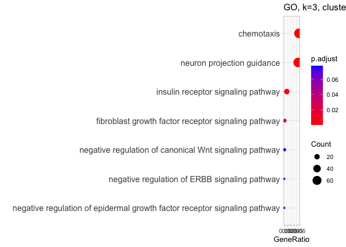
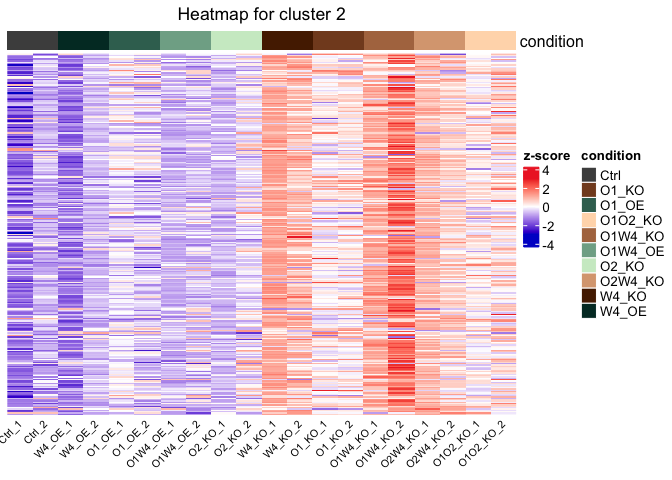
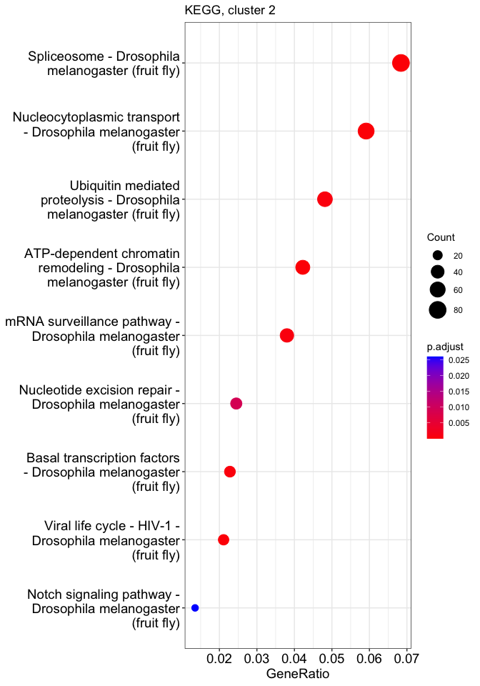

# 03_clust
Qian Hui TAN
2023-09-19

- [<span class="toc-section-number">1</span> Clustering](#clustering)
- [<span class="toc-section-number">2</span> Setup](#setup)
- [<span class="toc-section-number">3</span> Read in
  data](#read-in-data)
- [<span class="toc-section-number">4</span> Likelihood ratio
  test](#likelihood-ratio-test)
- [<span class="toc-section-number">5</span> Determining optimal number
  of clusters](#determining-optimal-number-of-clusters)
  - [<span class="toc-section-number">5.1</span> Silhouette
    plots](#silhouette-plots)
- [<span class="toc-section-number">6</span> Heatmap, varying
  k](#heatmap-varying-k)
- [<span class="toc-section-number">7</span> Kmeans, 3
  clusters](#kmeans-3-clusters)
  - [<span class="toc-section-number">7.1</span> Cluster 1](#cluster-1)
  - [<span class="toc-section-number">7.2</span> Cluster 2](#cluster-2)
  - [<span class="toc-section-number">7.3</span> Cluster 3](#cluster-3)
- [<span class="toc-section-number">8</span> Export cluster genes for
  compilation](#export-cluster-genes-for-compilation)
  - [<span class="toc-section-number">8.1</span> Export GO and KEGG for
    figure](#export-go-and-kegg-for-figure)
- [<span class="toc-section-number">9</span> Summary and
  discussion](#summary-and-discussion)
- [<span class="toc-section-number">10</span> Session
  info](#session-info)

# Clustering

# Setup

``` r
suppressPackageStartupMessages({
    library(DESeq2)

    library(DT)
    library(pheatmap)
    library(clusterProfiler)
    library(ComplexHeatmap)
    library(circlize)
    library(RColorBrewer)
    library(org.Dm.eg.db)
    library(cluster)
    # General tidying up
    library(janitor)
    library(ggrepel)
    library(tidyverse)
    library(reshape2)
    library(knitr)
})

source("../../scripts/R/clustering_functions.R")
source("../../scripts/R/go_kegg_functions.R")
```

``` r
# Initialize the starting seed
set.seed(1)
```

``` r
## If the output directory doesn't exist, create it
if(!dir.exists("../output/03_clust")){
  dir.create("../output/03_clust")
}

output_dir <- "../output/03_clust/"
```

# Read in data

Run DESeq:

``` r
dds = readRDS("../output/01_QC/dds_filt.RDS")
ensembl.genes= readRDS("../output/01_QC/ensembl_genes.RDS")
lfc.threshold = log2(1.5)

# Removing lowly expressed genes, only to be done once at the start of the differential expression step
filter = apply(counts(dds, normalized = TRUE), 1, function(x){ mean(x) >= 10 })
dds = dds[filter, ]

# Check for typos - number of samples in sample_order and colData(dds) should be 

  design(dds)
```

    ~condition

``` r
  dds <- DESeq(dds, test = "LRT", 
               reduced = ~ 1, 
               parallel = TRUE)
```

    using pre-existing size factors

    estimating dispersions

    gene-wise dispersion estimates: 6 workers

    mean-dispersion relationship

    final dispersion estimates, fitting model and testing: 6 workers

``` r
  # use blind = FALSE to account for experimental design
  rld <- rlog(dds, blind = FALSE)
```

# Likelihood ratio test

``` r
res_lrt <- results(dds)

res_lrt$gene_biotype= ensembl.genes$gene_biotype[match(row.names(res_lrt), ensembl.genes$gene_id)]
res_lrt$external_gene_name= ensembl.genes$external_gene_name[match(row.names(res_lrt), ensembl.genes$gene_id)]
#head(res_lrt)
```

``` r
hist(res_lrt$pvalue)
```


Number of significant genes (padj \< 0.1):

``` r
sum(res_lrt$padj < 0.1, na.rm = TRUE)
```

    [1] 7939

``` r
summary(res_lrt)
```


    out of 11157 with nonzero total read count
    adjusted p-value < 0.1
    LFC > 0 (up)       : 3381, 30%
    LFC < 0 (down)     : 4558, 41%
    outliers [1]       : 0, 0%
    low counts [2]     : 0, 0%
    (mean count < 10)
    [1] see 'cooksCutoff' argument of ?results
    [2] see 'independentFiltering' argument of ?results

Checking coefficients:

``` r
resultsNames(dds)
```

     [1] "Intercept"                 "condition_O1_KO_vs_Ctrl"  
     [3] "condition_O1_OE_vs_Ctrl"   "condition_O1O2_KO_vs_Ctrl"
     [5] "condition_O1W4_KO_vs_Ctrl" "condition_O1W4_OE_vs_Ctrl"
     [7] "condition_O2_KO_vs_Ctrl"   "condition_O2W4_KO_vs_Ctrl"
     [9] "condition_W4_KO_vs_Ctrl"   "condition_W4_OE_vs_Ctrl"  

``` r
# Select significant results
significant_results = res_lrt[!is.na(res_lrt$padj) & 
                                    res_lrt$padj < 0.1, ]


rld_signif = assay(rld)[rownames(significant_results), ]

rld_z = t(apply(rld_signif, 1, function(x){ (x - mean(x)) / sd(x)}))
```

# Determining optimal number of clusters

<div class="panel-tabset">

## Elbow plot

``` r
k.max <- 15
wss <- sapply(1:k.max,
 function(k){kmeans(rld_z, k, nstart=100,
 iter.max = 20 )$tot.withinss})

plot(1:k.max, wss,
 type="b", pch = 19, frame = FALSE,
 xlab="Number of clusters K",
 ylab="Total within-clusters sum of squares")
```


That looks like 5 or 6 clusters - it’s hard to tell.

## Average silhouette width

We perform kmeans for 2-10 clusters, and calculate the average
silhouette width for each kmeans.

What’s the best k (maximum average silhouette width)?

``` r
# We will use different methods and try 1-10 clusters.

d <- dist(rld_z)
summary(d)
```

       Min. 1st Qu.  Median    Mean 3rd Qu.    Max. 
      0.000   4.253   6.213   5.828   7.618   8.682 

``` r
set.seed(1)
ks <- 2:10
ASW <- sapply(ks, FUN = function(k) {
  fpc::cluster.stats(d, kmeans(rld_z, centers=k, nstart = 5)$cluster)$avg.silwidth
  })

best_k <- ks[which.max(ASW)]
best_k
```

    [1] 2

``` r
ggplot(as.data.frame(ks, ASW), aes(ks, ASW)) + geom_line() +
  geom_vline(xintercept = best_k, color = "red", linetype = 2) +
  ggtitle("Average silhouette width for varying k clusters")
```

    Warning in as.data.frame.integer(ks, ASW): 'row.names' is not a character
    vector of length 9 -- omitting it. Will be an error!


</div>

2 clusters looks best, but silhouette width constantly decreases until
we reach k = 7. Which means either 3 clusters, or 8 clusters.

Given that our samples have very distinct transcriptional profiles (from
the previous DE section), it is unlikely that 3 clusters will capture
the complexity we need. Hence, we will use 8 clusters instead.

We plot all of these:

## Silhouette plots

<div class="panel-tabset">

### k = 2

``` r
k2_coef <- cluster_kmeans(rld_z = rld_z, nclust = 2, 
                          plot_sil = TRUE)
```


### k = 3

``` r
k3_coef <- cluster_kmeans(rld_z = rld_z, nclust = 3, 
                          plot_sil = TRUE)
```


### k = 4

``` r
k4_coef <- cluster_kmeans(rld_z = rld_z, nclust = 4, 
                          plot_sil = TRUE)
```


### k = 8

``` r
k8_coef <- cluster_kmeans(rld_z = rld_z, nclust = 8, 
                          plot_sil = TRUE)
```


</div>

Either 3 or 6 clusters looks correct. 8 clusters is overclustering.

# Heatmap, varying k

<div class="panel-tabset">

## k = 2

``` r
sample_order = colData(dds)$sample_id

plot_kmeans_heatmap(rld_z, k_coef = k2_coef,  
                    sample_order = sample_order)
```


## k = 3

``` r
row_ann <- as.data.frame(k3_coef$cluster)
colnames(row_ann) = "cluster"

row_ann$cluster = factor(row_ann$cluster, 
                         levels = (1:length(row_ann$cluster)))


sample_order = colData(dds)$sample_id

plot_kmeans_heatmap(rld_z, k_coef = k3_coef,  
                    sample_order = sample_order,
                    annotation_row = row_ann)
```


## k = 8

``` r
row_ann <- as.data.frame(k8_coef$cluster)
colnames(row_ann) = "cluster"

row_ann$cluster = factor(row_ann$cluster, 
                         levels = (1:length(row_ann$cluster)))

# Todo: fix the ugly colors

#| label: heatmap-k6
plot_kmeans_heatmap(rld_z, k_coef = k8_coef,  
                    sample_order = sample_order, 
                    annotation_row = row_ann)
```


</div>

Honestly, k = 3 looks the best. We can proceed with that.

# Kmeans, 3 clusters

``` r
row_ann <- as.data.frame(k3_coef$cluster)
colnames(row_ann) = "cluster"

row_ann$cluster = factor(row_ann$cluster, 
                         levels = (1:length(row_ann$cluster)))


sample_order = colData(dds)$sample_id

plot_kmeans_heatmap(rld_z, k_coef = k3_coef,  
                    sample_order = sample_order,
                    annotation_row = row_ann)
```


``` r
kmeans_cl <- get_cluster_genes(k3_coef, nclust = 3)
```

## Cluster 1

``` r
clusterHeatmap(rld_z, kmeans_cl = kmeans_cl, 
               clust_num = 1,
               sample_order = sample_order,
              cluster_rows = FALSE)
```

    `use_raster` is automatically set to TRUE for a matrix with more than
    2000 rows. You can control `use_raster` argument by explicitly setting
    TRUE/FALSE to it.

    Set `ht_opt$message = FALSE` to turn off this message.

    'magick' package is suggested to install to give better rasterization.

    Set `ht_opt$message = FALSE` to turn off this message.


<div class="panel-tabset">

### Zscore boxplot

``` r
condition_order = c("Ctrl", "W4_OE", "O1_OE", "O1W4_OE", "O2_KO",
                    "W4_KO", "O1_KO", "O1W4_KO",
                    "O2W4_KO", "O1O2_KO")

zscore_boxcondition(kmeans_cl, clust_num = 1, 
                    condition_order = condition_order)
```

    [1] "3535 genes in cluster 1"


### GO - c1

``` r
k3_c1_ego <- plotEGO_dm(clust_target_genes = names((kmeans_cl)[[1]]), 
                     universe = rownames(dds), 
                     title = "GO, k=3, cluster 1")
```

    Running GO for organism = drosophila melanogaster


    [1] "511 enrichments found"

How many enrichments?

``` r
nrow(k3_c1_ego)
```

    [1] 511

### Finding enrichments

``` r
findEGO(k3_c1_ego, "Wnt", print_top_matches = FALSE)
```

    [1] "7 matches found."
    [1] "regulation of Wnt signaling pathway"                   
    [2] "cell-cell signaling by wnt"                            
    [3] "regulation of canonical Wnt signaling pathway"         
    [4] "Wnt signaling pathway"                                 
    [5] "positive regulation of canonical Wnt signaling pathway"
    [6] "positive regulation of Wnt signaling pathway"          
    [7] "canonical Wnt signaling pathway"                       

``` r
findEGO(k3_c1_ego, "hippo", print_top_matches = FALSE)
```

    [1] "4 matches found."
    [1] "regulation of hippo signaling"         
    [2] "hippo signaling"                       
    [3] "negative regulation of hippo signaling"
    [4] "positive regulation of hippo signaling"

``` r
findEGO(k3_c1_ego, "signaling", print_top_matches = FALSE)
```

    [1] "40 matches found."
     [1] "regulation of smoothened signaling pathway"                             
     [2] "cell cycle checkpoint signaling"                                        
     [3] "smoothened signaling pathway"                                           
     [4] "mitotic cell cycle checkpoint signaling"                                
     [5] "positive regulation of smoothened signaling pathway"                    
     [6] "DNA integrity checkpoint signaling"                                     
     [7] "negative regulation of smoothened signaling pathway"                    
     [8] "DNA damage checkpoint signaling"                                        
     [9] "mitotic DNA integrity checkpoint signaling"                             
    [10] "regulation of hippo signaling"                                          
    [11] "hippo signaling"                                                        
    [12] "DNA replication checkpoint signaling"                                   
    [13] "mitotic G2 DNA damage checkpoint signaling"                             
    [14] "Toll signaling pathway"                                                 
    [15] "regulation of Wnt signaling pathway"                                    
    [16] "mitotic DNA damage checkpoint signaling"                                
    [17] "regulation of Toll signaling pathway"                                   
    [18] "negative regulation of hippo signaling"                                 
    [19] "cell-cell signaling by wnt"                                             
    [20] "regulation of canonical Wnt signaling pathway"                          
    [21] "positive regulation of Toll signaling pathway"                          
    [22] "positive regulation of signaling"                                       
    [23] "cell surface receptor signaling pathway involved in cell-cell signaling"
    [24] "Wnt signaling pathway"                                                  
    [25] "positive regulation of canonical Wnt signaling pathway"                 
    [26] "mitotic DNA replication checkpoint signaling"                           
    [27] "positive regulation of Wnt signaling pathway"                           
    [28] "mitotic spindle assembly checkpoint signaling"                          
    [29] "spindle checkpoint signaling"                                           
    [30] "spindle assembly checkpoint signaling"                                  
    [31] "mitotic spindle checkpoint signaling"                                   
    [32] "receptor signaling pathway via JAK-STAT"                                
    [33] "receptor signaling pathway via STAT"                                    
    [34] "canonical Wnt signaling pathway"                                        
    [35] "regulation of receptor signaling pathway via JAK-STAT"                  
    [36] "regulation of receptor signaling pathway via STAT"                      
    [37] "negative regulation of signaling"                                       
    [38] "regulation of sevenless signaling pathway"                              
    [39] "positive regulation of hippo signaling"                                 
    [40] "stress-activated protein kinase signaling cascade"                      

``` r
findEGO(k3_c1_ego, "mito[st]", print_top_matches = FALSE)
```

    [1] "37 matches found."
     [1] "mitotic cell cycle"                                          
     [2] "mitotic cell cycle process"                                  
     [3] "regulation of mitotic cell cycle"                            
     [4] "mitotic cell cycle phase transition"                         
     [5] "regulation of mitotic cell cycle phase transition"           
     [6] "mitotic nuclear division"                                    
     [7] "mitotic cell cycle checkpoint signaling"                     
     [8] "negative regulation of mitotic cell cycle phase transition"  
     [9] "microtubule cytoskeleton organization involved in mitosis"   
    [10] "negative regulation of mitotic cell cycle"                   
    [11] "mitotic sister chromatid segregation"                        
    [12] "regulation of G2/M transition of mitotic cell cycle"         
    [13] "G2/M transition of mitotic cell cycle"                       
    [14] "mitotic spindle organization"                                
    [15] "negative regulation of G2/M transition of mitotic cell cycle"
    [16] "mitotic DNA integrity checkpoint signaling"                  
    [17] "mitotic G2/M transition checkpoint"                          
    [18] "mitotic cytokinesis"                                         
    [19] "mitotic G2 DNA damage checkpoint signaling"                  
    [20] "mitotic DNA damage checkpoint signaling"                     
    [21] "establishment of mitotic spindle localization"               
    [22] "metaphase/anaphase transition of mitotic cell cycle"         
    [23] "regulation of mitotic sister chromatid separation"           
    [24] "mitotic sister chromatid separation"                         
    [25] "mitotic centrosome separation"                               
    [26] "mitotic DNA replication checkpoint signaling"                
    [27] "establishment of mitotic spindle orientation"                
    [28] "mitotic spindle assembly checkpoint signaling"               
    [29] "regulation of mitotic cell cycle, embryonic"                 
    [30] "negative regulation of mitotic sister chromatid segregation" 
    [31] "negative regulation of mitotic metaphase/anaphase transition"
    [32] "mitotic spindle checkpoint signaling"                        
    [33] "negative regulation of mitotic sister chromatid separation"  
    [34] "regulation of mitotic sister chromatid segregation"          
    [35] "regulation of mitotic nuclear division"                      
    [36] "regulation of mitotic metaphase/anaphase transition"         
    [37] "mitotic metaphase plate congression"                         

``` r
findEGO(k3_c1_ego, "senes|apop|death", print_top_matches = FALSE)
```

    [1] "3 matches found."
    [1] "programmed cell death" "cell death"            "apoptotic process"    

``` r
findEGO(k3_c1_ego, "transcript|transl", print_top_matches = FALSE)
```

    [1] "20 matches found."
     [1] "transcription initiation at RNA polymerase II promoter"                                  
     [2] "DNA-templated transcription initiation"                                                  
     [3] "cytoplasmic translation"                                                                 
     [4] "DNA-templated transcription elongation"                                                  
     [5] "translation"                                                                             
     [6] "transcription elongation by RNA polymerase II promoter"                                  
     [7] "maturation of SSU-rRNA from tricistronic rRNA transcript (SSU-rRNA, 5.8S rRNA, LSU-rRNA)"
     [8] "regulation of DNA-templated transcription elongation"                                    
     [9] "post-transcriptional gene silencing"                                                     
    [10] "post-transcriptional regulation of gene expression"                                      
    [11] "post-transcriptional gene silencing by RNA"                                              
    [12] "negative regulation of translation"                                                      
    [13] "transcription preinitiation complex assembly"                                            
    [14] "regulation of translation"                                                               
    [15] "positive regulation of DNA-binding transcription factor activity"                        
    [16] "regulation of transcription elongation by RNA polymerase II"                             
    [17] "negative regulation of DNA-templated transcription, elongation"                          
    [18] "ncRNA transcription"                                                                     
    [19] "positive regulation of DNA-templated transcription, elongation"                          
    [20] "regulation of DNA-binding transcription factor activity"                                 

``` r
findEGO(k3_c1_ego, "adhes", print_top_matches = FALSE)
```

    [1] "0 matches found."
    character(0)

``` r
findEGO(k3_c1_ego, "diff|prolif", print_top_matches = FALSE)
```

    [1] "9 matches found."
    [1] "oocyte differentiation"                                       
    [2] "negative regulation of cell population proliferation"         
    [3] "cell population proliferation"                                
    [4] "negative regulation of neuroblast proliferation"              
    [5] "negative regulation of neural precursor cell proliferation"   
    [6] "regulation of R7 cell differentiation"                        
    [7] "germarium-derived oocyte differentiation"                     
    [8] "regulation of photoreceptor cell differentiation"             
    [9] "regulation of compound eye photoreceptor cell differentiation"

``` r
findEGO(k3_c1_ego, "migrat|taxi", print_top_matches = FALSE)
```

    [1] "0 matches found."
    character(0)

### Custom EGO

``` r
interesting_pathways <- c("Wnt signaling pathway", 
                          "hippo signaling",
                          "smoothened signaling pathway",
                          "mitotic cell cycle",
                          "programmed cell death", 
                          "cell population proliferation")

custom_ego(k3_c1_ego, interesting_pathways,
           title = "GO, k=3, cluster 1", 
           font_size = 12)
```



``` r
c1_go_table <- custom_ego_table(k3_c1_ego, interesting_pathways)

c1_go_table
```

| Description                   | GeneRatio |  p.adjust | geneID                                                                                                                                                                                                                                                                                                                                                                                                                                                                                                                                                                                                                                                                                                                                                                                                                                                                                                                                                                                                                                                                                                                                                                                                                                                                                                                                                                                                                        |
|:------------------------------|:----------|----------:|:------------------------------------------------------------------------------------------------------------------------------------------------------------------------------------------------------------------------------------------------------------------------------------------------------------------------------------------------------------------------------------------------------------------------------------------------------------------------------------------------------------------------------------------------------------------------------------------------------------------------------------------------------------------------------------------------------------------------------------------------------------------------------------------------------------------------------------------------------------------------------------------------------------------------------------------------------------------------------------------------------------------------------------------------------------------------------------------------------------------------------------------------------------------------------------------------------------------------------------------------------------------------------------------------------------------------------------------------------------------------------------------------------------------------------|
| mitotic cell cycle            | 244/3008  | 0.0000000 | Act5C/bru1/asp/aub/aurA/awd/ben/brm/chic/csw/CycA/CycB/dsh/dup/fzy/Hmr/Grip91/dlg1/eIF4A/l(2)gl/l(3)mbt/sti/Rcc1/Map205/twe/mor/mr/mud/mus101/mus304/Myb/ncd/pim/plu/polo/PpV/pum/rl/shi/smo/spn-E/sub/Su(var)205/thr/alphaTub84B/alphaTub84D/Pp1-87B/Cdk1/mts/Klp61F/Klp67A/shtd/B52/wapl/Su(H)/RpII15/tws/Eip63E/PCNA/PpD3/Dsor1/CycD/Arf79F/CycE/dia/fbl/eff/Mad/tsr/Wee1/Arp53D/ctp/Dp/Syx1A/l(2)dtl/pnut/Mtor/Cdk5/Rho1/prod/noi/glu/CycB3/Lis-1/PTP-ER/lok/14-3-3epsilon/Ran/mre11/asun/Pkn/chb/DCTN2-p50/Pp4-19C/Orc6/san/aurB/Dlc90F/Bub3/SkpA/Cdc16/Rad17/Mcm6/JTBR/dgt4/Rok/Mad1/Nipped-B/Hus1-like/Su(var)2-HP2/Grip75/Grip163/Apc2/Eb1/Kmn1/RecQ5/ana2/SMC2/ball/Pol31/ric8a/CG3530/CHORD/Aos1/eIF3g1/Nek2/Aladin/Psf3/PPP4R2r/Klp10A/Aven/Sap30/CG8188/CG8173/Rab35/Wdr62/Fign/Spindly/Mnn1/Nuf2/CG5181/borr/CG6443/BuGZ/CG10336/Grip71/Mcm10/geminin/CG15237/mms4/dgt5/mars/nopo/dgt3/Rae1/Slik/JMJD5/Psf1/Mfap1/Sse/mad2/Cdc6/nudE/Syx13/Cep135/Skp2/PEK/Cks85A/Tctp/Lkb1/Rrp6/Mau2/cal1/CG13599/spas/Dis3/Mink/Sld5/CG5003/dgt6/CycG/CG17493/pont/pins/p115/Kat60/cana/MED22/mus81/ago/Capr/Chro/tefu/Haspin/Rif1/CG30291/Prp38/Nnf1b/Tap42/Claspin/APC4/Synd/CG34025/Zwilch/endos/ALiX/tum/alph/DCTN6-p27/Spc25/alphaSnap/lmgA/cno/pzg/zld/bora/pds5/gwl/mei-38/vtd/Incenp/grp/scra/nej/mi/SmD2/Xpd/aPKC/CG43295/Patronin/Cdk7/l(3)72Ab/BubR1/Caf1-55/Det/smt3/Smr/Sf3a1/sau/Ptp61F/rump/Tlk/Top2/betaTub56D |
| smoothened signaling pathway  | 56/3008   | 0.0000038 | bam/bur/Pka-C1/cos/flw/fu/Gbeta13F/dco/Pp1-13C/Pp1alpha-96A/smo/Su(dx)/Su(var)2-10/mts/Rap1/tws/Su(fu)/lwr/Gug/eff/Uch-L5/CkIalpha/Ubc4/Cul1/HDAC1/Pp4-19C/Tnpo/Roc1a/par-6/wdb/botv/Ulp1/Smurf/disp/sotv/PPP4R2r/Usp7/Hrs/Nedd8/Herc4/UbcE2M/hyx/krz/dlp/gish/Nedd4/cno/Pka-R1/Pp2A-29B/Gprk1/pic/nej/aPKC/Uba3/smt3/ttv                                                                                                                                                                                                                                                                                                                                                                                                                                                                                                                                                                                                                                                                                                                                                                                                                                                                                                                                                                                                                                                                                                     |
| hippo signaling               | 45/3008   | 0.0011527 | Pka-C1/l(2)gl/dco/sti/Su(dx)/tor/mts/Rap1/Rox8/pll/msn/CkIalpha/Cul1/RtGEF/14-3-3epsilon/lig/Mekk1/SkpA/Tsc1/CG7028/Smurf/pod1/Usp7/Tao/Pez/Fgop2/Dlg5/Git/Magi/Rae1/Herc4/mats/Rassf/Slmap/Prosap/mnb/Pp2A-29B/hpo/lic/aPKC/Sik3/Src64B/Patronin/wap/elgi                                                                                                                                                                                                                                                                                                                                                                                                                                                                                                                                                                                                                                                                                                                                                                                                                                                                                                                                                                                                                                                                                                                                                                    |
| cell population proliferation | 128/3008  | 0.0117183 | bam/baz/brm/cad/CycA/CycB/EcR/Galphai/Gbeta13F/hb/l(2)gl/l(3)mbt/msl-3/mor/mud/Myb/polo/Ras85D/rl/tub/Cdk1/mts/hop/enc/tws/gig/Rox8/brat/Rac1/Cdc42/CycE/pll/lwr/CG10939/DCTN3-p24/Pfdn2/Cdc37/Snr1/alien/Rho1/RpS21/Dref/Lis-1/HDAC1/pgc/Stat92E/Atu/Cbl/dom/Idgf2/Nup154/Vps25/dlt/flfl/Bap60/Roc1a/HDAC3/par-6/Tsc1/Dronc/Apc2/drosha/CSN5/CSN3/CSN1b/ana2/ric8a/heix/hfp/Lnk/CG5033/CSN7/Pdcd4/CG9123/DENR/Pez/Mnn1/Ing5/CG10336/Nedd8/Mlf/Ntan1/Rae1/enok/Slik/RIOK1/Cep135/Smn/Zif/MAGE/Lkb1/smp-30/Ns1/CG7044/mats/p53/Nup358/Cul5/pasha/conu/rept/pont/pins/Prosap/CG17059/ago/key/dome/vito/snama/Nedd4/cno/zld/Tango9/Utx/hpo/Axud1/mi/aPKC/osa/Tl/wcd/AGO1/scrib/Sgt1/Doa/Ptp61F/Syx7                                                                                                                                                                                                                                                                                                                                                                                                                                                                                                                                                                                                                                                                                                                              |
| Wnt signaling pathway         | 54/3008   | 0.0300275 | arm/dsh/flw/gro/dco/hyd/Pp1alpha-96A/Pp1-87B/mts/tws/por/gig/Eip63E/Ssdp/nmo/Rho1/Vps26/CkIalpha/Cul1/Usp47/spen/CtBP/SkpA/Roc1a/Cdc16/Axn/Apc2/Tnks/botv/Nulp1/sotv/Nek2/CycY/Gint3/Vps35/wls/Rnf146/CG11523/hyx/RanBP3/lgs/rept/pont/Prosap/dlp/pygo/tum/gish/hpo/lic/nej/osa/ttv/RpS12                                                                                                                                                                                                                                                                                                                                                                                                                                                                                                                                                                                                                                                                                                                                                                                                                                                                                                                                                                                                                                                                                                                                     |
| programmed cell death         | 122/3008  | 0.0581967 | arm/Cam/Pka-C1/cos/DNaseII/EcR/l(2)gl/dco/mod(mdg4)/Ras85D/sesB/shi/smo/Su(var)205/sws/tub/hdc/CycE/pll/Dcp-1/Sep1/ctp/Dp/BRWD3/pnut/Cdk5/mof/Cul1/Dref/crq/RpL14/lok/Drice/Cbl/Pdk1/Idgf2/Nup154/Vps25/qkr58E-3/Mekk1/Drep1/SkpA/HDAC3/Tip60/CG14812/msk/Tak1/Dronc/Drep4/Drep2/cathD/CG13373/Coa8/Pink1/Atg5/Atg101/Tao/Naa20A/CG4238/alpha4GT1/Daxx/Mabi/Nf-YB/Mcm10/DUBAI/Ptp52F/Dcr-2/nopo/Atg7/zda/RYBP/sigmar/Usp5/l(3)psg2/CG7546/Atg18a/BI-1/Srrm1/PDCD-5/CG9231/MAGE/Lkb1/Prx3/Prx5/Idh3b/PSR/mats/p53/Miro/XNP/Sid/Atg16/Fis1/rept/CG15456/scyl/tefu/Naam/Tengl3/CG32176/CG32202/vito/CG32579/Atg8a/snama/out/Tango9/Utx/scny/Atg1/hpo/Trf2/aPKC/Ire1/norpA/Cdk7/ebi/Det/Fhos/Pak/lola/Psn                                                                                                                                                                                                                                                                                                                                                                                                                                                                                                                                                                                                                                                                                                                         |

``` r
write_csv(k3_c1_ego, file = paste0(output_dir, "k3_c1_ego.csv"))
```

### KEGG - c1

``` r
# Get entrez ids
c1_entrez <- na.omit(ensembl.genes[ensembl.genes$gene_id %in% names((kmeans_cl)[[1]]), ]$entrezgene_id)

# Run KEGG
k3_c1_ekegg <- plotKEGG_dm(c1_entrez, title = "KEGG, cluster 1")
```

    Running KEGG for organism = drosophila melanogaster

    Reading KEGG annotation online: "https://rest.kegg.jp/link/dme/pathway"...

    Reading KEGG annotation online: "https://rest.kegg.jp/list/pathway/dme"...

    Reading KEGG annotation online: "https://rest.kegg.jp/conv/ncbi-geneid/dme"...


    [1] "9 enrichments found"

``` r
k3_c1_ekegg
```

|          | ID       | Description                                                              | GeneRatio | BgRatio  |    pvalue |  p.adjust |    qvalue | geneID                                                                                                                                                                                                                                                                                                                                                                                                                                                                                                        | Count |
|:---------|:---------|:-------------------------------------------------------------------------|:----------|:---------|----------:|----------:|----------:|:--------------------------------------------------------------------------------------------------------------------------------------------------------------------------------------------------------------------------------------------------------------------------------------------------------------------------------------------------------------------------------------------------------------------------------------------------------------------------------------------------------------|------:|
| dme03013 | dme03013 | Nucleocytoplasmic transport - Drosophila melanogaster (fruit fly)        | 70/1185   | 99/3487  | 0.0000000 | 0.0000000 | 0.0000000 | mago/sbr/RanGAP/lwr/Nup214/Ref1/Mtor/Hel25E/Ran/emb/Nup154/Cse1/Cbp80/Cbp20/Bin1/Dbp80/Kap-alpha1/Tnpo/mbo/msk/Kap-alpha3/Nup93-1/Nxt1/Upf2/Aladin/Nup35/Elys/Nup205/tho2/Tnpo-SR/Nup50/Gle1/tsu/Phax/Nup54/Nup62/Rae1/Pym/Upf3/thoc5/thoc7/thoc6/Srrm1/Hpr1/CG7483/RnpS1/Pnn/Ranbp9/CG14712/Nup93-2/Nup133/Nup98-96/Ndc1/Nup37/Nup358/CG18787/Arts/Apl/Ranbp16/Nup153/Karybeta3/Snup/CG42304/cdm/Nup160/Acn/Nxf3/smt3/ebo/Gp210                                                                              |    70 |
| dme03040 | dme03040 | Spliceosome - Drosophila melanogaster (fruit fly)                        | 81/1185   | 141/3487 | 0.0000000 | 0.0000003 | 0.0000003 | crn/SmF/Hrb98DE/l(1)10Bb/mago/snf/B52/Bx42/U2af50/Ref1/Hel25E/noi/Spx/U2af38/ytr/Cbp80/Cbp20/CG2685/l(1)G0007/Prp18/CG4119/x16/hfp/Tango4/CG1622/CG6227/Usp39/Sf3b1/tho2/CG3542/Sf3b2/Phf5a/CG6686/CG10333/Dhx15/tsu/CG12343/Prp8/CG9346/Cypl/Sf3b3/CG2021/CG11586/CG6610/Sf3b6/CG6418/CG10418/Sf3a2/Prp31/U4-U6-60K/Prp3/CG14641/Hpr1/CG7483/CG6015/PQBP1/BCAS2/CG15525/CG17454/c12.1/Sf3b5/Prp38/LSm3/Spf45/pea/LSm7/Prp19/SmD2/SmE/SNRPG/snRNP-U1-C/scaf6/SmD1/SmB/Acn/l(3)72Ab/Cdc5/Sf3a1/HnRNP-K/SF2/caz |    81 |
| dme03082 | dme03082 | ATP-dependent chromatin remodeling - Drosophila melanogaster (fruit fly) | 50/1185   | 80/3487  | 0.0000001 | 0.0000050 | 0.0000047 | Act5C/brm/E(bx)/E(Pc)/His2Av/pho/mor/Uch-L5/Iswi/Snr1/Arp6/HDAC1/dom/Bap60/Tip60/BCL7-like/CG8677/MRG15/CG11970/MBD-like/MTA1-like/Bap111/CDK2AP1/Arp8/CG31917/Gas41/CG7154/YL-1/d4/CG10395/MrgBP/CG18004/DMAP1/Eaf6/Arp5/polybromo/Brd8/rept/pont/CG12659/Bap170/Chrac-16/Chrac-14/CG33695/Ino80/e(y)3/osa/Mi-2/Rcd5/Caf1-55                                                                                                                                                                                 |    50 |
| dme03250 | dme03250 | Viral life cycle - HIV-1 - Drosophila melanogaster (fruit fly)           | 25/1185   | 33/3487  | 0.0000010 | 0.0000297 | 0.0000278 | BicD/Fur1/Fur2/TH1/Snr1/Su(Tpl)/dod/Cdk9/Ran/Gcn5/emb/ear/NELF-B/fal/spt4/Hrs/Tnpo-SR/Cpsf6/Nup358/Jasper/Spt5/Nup153/ALiX/nej/Vps4                                                                                                                                                                                                                                                                                                                                                                           |    25 |
| dme03022 | dme03022 | Basal transcription factors - Drosophila melanogaster (fruit fly)        | 27/1185   | 40/3487  | 0.0000140 | 0.0003298 | 0.0003089 | e(y)1/hay/TfIIB/Taf4/TfIIFalpha/Trf/Taf1/Taf5/Taf6/TfIIFbeta/TfIIA-L/Taf12/Taf11/Taf2/TfIIA-S/Taf8/Taf7/Taf10b/Taf10/Tfb4/Taf13/Ssl1/mrn/Trf2/Xpd/Cdk7/Tfb5                                                                                                                                                                                                                                                                                                                                                   |    27 |
| dme04120 | dme04120 | Ubiquitin mediated proteolysis - Drosophila melanogaster (fruit fly)     | 57/1185   | 107/3487 | 0.0000243 | 0.0004783 | 0.0004480 | ben/fzy/hyd/mr/sina/Su(dx)/Su(var)2-10/RpL40/RpS27A/shtd/lwr/eff/Ubc2/Ubc4/Cul1/Cbl/EloB/CG2924/SkpA/Roc1a/Cdc16/SkpC/Ubc10/STUB1/Smurf/Uba2/Aos1/UbcE2H/CG8188/CG4502/Cul2/CG15237/CG7220/CG7747/CG3356/Herc4/UbcE2M/Cul6/RhoBTB/Skp2/Cul5/CG2218/sip3/ago/Roc2/APC4/Ube3a/Ubi-p5E/CG33981/lmgA/Nedd4/pic/Prp19/Uba3/Traf6/EloC/Ubc7                                                                                                                                                                         |    57 |
| dme03015 | dme03015 | mRNA surveillance pathway - Drosophila melanogaster (fruit fly)          | 45/1185   | 80/3487  | 0.0000299 | 0.0005041 | 0.0004721 | flw/mago/Pp1-13C/Pp1alpha-96A/sbr/su(f)/Pp1-87B/mts/Hrb27C/tws/Ref1/Hel25E/Clp/Cbp80/Cbp20/Bin1/Cpsf160/Dbp80/wdb/CstF64/Cpsf100/Nxt1/Upf2/Wdr82/Gle1/tsu/cbc/Pym/Upf3/Cpsf6/Srrm1/eRF1/Fip1/CG7483/RnpS1/Pnn/Smg6/CstF50/HBS1/Wdr33/Pp2A-29B/Acn/Nxf3/caz/Rnmt                                                                                                                                                                                                                                               |    45 |
| dme03420 | dme03420 | Nucleotide excision repair - Drosophila melanogaster (fruit fly)         | 29/1185   | 51/3487  | 0.0006167 | 0.0090959 | 0.0085198 | hay/mei-9/RpII215/Xpc/RpII15/Gnf1/PCNA/Roc1a/RpII33/Rad23/Pol31/Ercc1/RfC38/Tfb4/RfC3/Rpb11/Rpb5/Ssl1/Chrac-14/Rpb7/pic/RfC4/mrn/Xpd/Rpb12/RpII140/Cdk7/Rpb4/Tfb5                                                                                                                                                                                                                                                                                                                                             |    29 |
| dme04330 | dme04330 | Notch signaling pathway - Drosophila melanogaster (fruit fly)            | 16/1185   | 25/3487  | 0.0020061 | 0.0263021 | 0.0246362 | dsh/gro/H/Su(H)/Bx42/HDAC1/spen/Gcn5/CtBP/Atx-1/aph-1/CG6843/Nct/pen-2/nej/Psn                                                                                                                                                                                                                                                                                                                                                                                                                                |    16 |

``` r
interesting_pathways = c("Ubiquitin mediated proteolysis",
                         "Basal transcription factors",
                         "Nucleotide excision repair",
                         "Notch signaling pathway")

custom_ekegg(k3_c1_ekegg, interesting_pathways,
             title = "KEGG, cluster 1")
```


``` r
c1_kegg_table <- custom_kegg_table(k3_c1_ekegg, interesting_pathways)

c1_kegg_table
```

|          | Description                    | GeneRatio |  p.adjust | geneID                                                                                                                                                                                                                                                                                                                                |
|:---------|:-------------------------------|:----------|----------:|:--------------------------------------------------------------------------------------------------------------------------------------------------------------------------------------------------------------------------------------------------------------------------------------------------------------------------------------|
| dme03022 | Basal transcription factors    | 27/1185   | 0.0003298 | e(y)1/hay/TfIIB/Taf4/TfIIFalpha/Trf/Taf1/Taf5/Taf6/TfIIFbeta/TfIIA-L/Taf12/Taf11/Taf2/TfIIA-S/Taf8/Taf7/Taf10b/Taf10/Tfb4/Taf13/Ssl1/mrn/Trf2/Xpd/Cdk7/Tfb5                                                                                                                                                                           |
| dme04120 | Ubiquitin mediated proteolysis | 57/1185   | 0.0004783 | ben/fzy/hyd/mr/sina/Su(dx)/Su(var)2-10/RpL40/RpS27A/shtd/lwr/eff/Ubc2/Ubc4/Cul1/Cbl/EloB/CG2924/SkpA/Roc1a/Cdc16/SkpC/Ubc10/STUB1/Smurf/Uba2/Aos1/UbcE2H/CG8188/CG4502/Cul2/CG15237/CG7220/CG7747/CG3356/Herc4/UbcE2M/Cul6/RhoBTB/Skp2/Cul5/CG2218/sip3/ago/Roc2/APC4/Ube3a/Ubi-p5E/CG33981/lmgA/Nedd4/pic/Prp19/Uba3/Traf6/EloC/Ubc7 |
| dme03420 | Nucleotide excision repair     | 29/1185   | 0.0090959 | hay/mei-9/RpII215/Xpc/RpII15/Gnf1/PCNA/Roc1a/RpII33/Rad23/Pol31/Ercc1/RfC38/Tfb4/RfC3/Rpb11/Rpb5/Ssl1/Chrac-14/Rpb7/pic/RfC4/mrn/Xpd/Rpb12/RpII140/Cdk7/Rpb4/Tfb5                                                                                                                                                                     |
| dme04330 | Notch signaling pathway        | 16/1185   | 0.0263021 | dsh/gro/H/Su(H)/Bx42/HDAC1/spen/Gcn5/CtBP/Atx-1/aph-1/CG6843/Nct/pen-2/nej/Psn                                                                                                                                                                                                                                                        |

### Summary

</div>

## Cluster 2

``` r
clusterHeatmap(rld_z, kmeans_cl = kmeans_cl, 
               clust_num = 2, sample_order = sample_order,
              cluster_rows = FALSE)
```



<div class="panel-tabset">

### Zscore-boxplot

``` r
zscore_boxcondition(kmeans_cl, clust_num = 2, condition_order)
```

    [1] "1439 genes in cluster 2"

    Warning: Removed 1 rows containing non-finite values (`stat_boxplot()`).


### GO - c2

``` r
k3_c2_ego <- plotEGO_dm(clust_target_genes = names((kmeans_cl)[[2]]), 
                     universe = rownames(dds), 
                     title = "GO, k=8, cluster 2")
```

    Running GO for organism = drosophila melanogaster


    [1] "554 enrichments found"

### Finding enrichments

``` r
findEGO(k3_c2_ego, "Wnt", print_top_matches = FALSE)
```

    [1] "2 matches found."
    [1] "negative regulation of Wnt signaling pathway"          
    [2] "negative regulation of canonical Wnt signaling pathway"

``` r
findEGO(k3_c2_ego, "DNA", print_top_matches = FALSE)
```

    [1] "2 matches found."
    [1] "positive regulation of DNA-templated transcription"
    [2] "negative regulation of DNA-templated transcription"

``` r
findEGO(k3_c2_ego, "signal", print_top_matches = FALSE)
```

    [1] "29 matches found."
     [1] "enzyme-linked receptor protein signaling pathway"                         
     [2] "regulation of Ras protein signal transduction"                            
     [3] "transmembrane receptor protein tyrosine kinase signaling pathway"         
     [4] "regulation of small GTPase mediated signal transduction"                  
     [5] "regulation of intracellular signal transduction"                          
     [6] "negative regulation of signaling"                                         
     [7] "negative regulation of signal transduction"                               
     [8] "positive regulation of intracellular signal transduction"                 
     [9] "small GTPase mediated signal transduction"                                
    [10] "Ras protein signal transduction"                                          
    [11] "positive regulation of Ras protein signal transduction"                   
    [12] "positive regulation of small GTPase mediated signal transduction"         
    [13] "insulin receptor signaling pathway"                                       
    [14] "epidermal growth factor receptor signaling pathway"                       
    [15] "ERBB signaling pathway"                                                   
    [16] "positive regulation of signaling"                                         
    [17] "positive regulation of signal transduction"                               
    [18] "positive regulation of insulin receptor signaling pathway"                
    [19] "regulation of Rab protein signal transduction"                            
    [20] "fibroblast growth factor receptor signaling pathway"                      
    [21] "vascular endothelial growth factor receptor signaling pathway"            
    [22] "negative regulation of Wnt signaling pathway"                             
    [23] "regulation of insulin receptor signaling pathway"                         
    [24] "negative regulation of epidermal growth factor receptor signaling pathway"
    [25] "negative regulation of ERBB signaling pathway"                            
    [26] "negative regulation of intracellular signal transduction"                 
    [27] "negative regulation of canonical Wnt signaling pathway"                   
    [28] "regulation of epidermal growth factor receptor signaling pathway"         
    [29] "regulation of ERBB signaling pathway"                                     

``` r
findEGO(k3_c2_ego, "repair", print_top_matches = FALSE)
```

    [1] "0 matches found."
    character(0)

``` r
findEGO(k3_c2_ego, "mito[st]", print_top_matches = FALSE)
```

    [1] "2 matches found."
    [1] "mitotic cell cycle, embryonic"                               
    [2] "negative regulation of G1/S transition of mitotic cell cycle"

``` r
findEGO(k3_c2_ego, "immun|interleuk", print_top_matches = FALSE)
```

    [1] "0 matches found."
    character(0)

``` r
findEGO(k3_c2_ego, "autophag", print_top_matches = FALSE)
```

    [1] "0 matches found."
    character(0)

``` r
findEGO(k3_c2_ego, "splic", print_top_matches = FALSE)
```

    [1] "0 matches found."
    character(0)

``` r
findEGO(k3_c2_ego, "senes|apop|death", print_top_matches = FALSE)
```

    [1] "15 matches found."
     [1] "regulation of programmed cell death"                          
     [2] "programmed cell death"                                        
     [3] "programmed cell death involved in cell development"           
     [4] "cell death"                                                   
     [5] "regulation of apoptotic process"                              
     [6] "regulation of cell death"                                     
     [7] "larval midgut cell programmed cell death"                     
     [8] "positive regulation of programmed cell death"                 
     [9] "positive regulation of cell death"                            
    [10] "negative regulation of programmed cell death"                 
    [11] "apoptotic process"                                            
    [12] "negative regulation of apoptotic process"                     
    [13] "positive regulation of apoptotic process"                     
    [14] "regulation of retinal cell programmed cell death"             
    [15] "regulation of compound eye retinal cell programmed cell death"

``` r
findEGO(k3_c2_ego, "transcript|transl", print_top_matches = FALSE)
```

    [1] "9 matches found."
    [1] "positive regulation of DNA-templated transcription"                  
    [2] "positive regulation of nucleic acid-templated transcription"         
    [3] "negative regulation of DNA-templated transcription"                  
    [4] "negative regulation of nucleic acid-templated transcription"         
    [5] "positive regulation of transcription by RNA polymerase II"           
    [6] "negative regulation of transcription by RNA polymerase II"           
    [7] "tRNA aminoacylation for protein translation"                         
    [8] "positive regulation of translation"                                  
    [9] "positive regulation of transcription elongation by RNA polymerase II"

``` r
findEGO(k3_c2_ego, "adhes", print_top_matches = FALSE)
```

    [1] "5 matches found."
    [1] "positive regulation of cell adhesion"     
    [2] "positive regulation of cell-cell adhesion"
    [3] "regulation of cell adhesion"              
    [4] "regulation of cell-cell adhesion"         
    [5] "cell adhesion"                            

``` r
findEGO(k3_c2_ego, "diff|prolif", print_top_matches = FALSE)
```

    [1] "50 matches found."
     [1] "cell morphogenesis involved in neuron differentiation"     
     [2] "regulation of cell differentiation"                        
     [3] "cell morphogenesis involved in differentiation"            
     [4] "epithelial cell differentiation"                           
     [5] "sex differentiation"                                       
     [6] "compound eye photoreceptor cell differentiation"           
     [7] "photoreceptor cell differentiation"                        
     [8] "eye photoreceptor cell differentiation"                    
     [9] "regulation of cell population proliferation"               
    [10] "positive regulation of cell differentiation"               
    [11] "positive regulation of cell population proliferation"      
    [12] "cell population proliferation"                             
    [13] "regulation of neural precursor cell proliferation"         
    [14] "neuroblast differentiation"                                
    [15] "positive regulation of neuroblast proliferation"           
    [16] "regulation of neuroblast proliferation"                    
    [17] "positive regulation of neural precursor cell proliferation"
    [18] "negative regulation of cell differentiation"               
    [19] "neural precursor cell proliferation"                       
    [20] "neuroblast proliferation"                                  
    [21] "regulation of neuron differentiation"                      
    [22] "stem cell differentiation"                                 
    [23] "cardioblast differentiation"                               
    [24] "R7 cell differentiation"                                   
    [25] "crystal cell differentiation"                              
    [26] "hemocyte differentiation"                                  
    [27] "columnar/cuboidal epithelial cell differentiation"         
    [28] "muscle cell differentiation"                               
    [29] "regulation of stem cell proliferation"                     
    [30] "plasmatocyte differentiation"                              
    [31] "stem cell proliferation"                                   
    [32] "regulation of crystal cell differentiation"                
    [33] "regulation of glial cell proliferation"                    
    [34] "renal filtration cell differentiation"                     
    [35] "nephrocyte differentiation"                                
    [36] "glial cell differentiation"                                
    [37] "cardiocyte differentiation"                                
    [38] "myotube differentiation"                                   
    [39] "negative regulation of hemocyte differentiation"           
    [40] "mesodermal cell differentiation"                           
    [41] "positive regulation of neuron differentiation"             
    [42] "oenocyte differentiation"                                  
    [43] "lymph gland crystal cell differentiation"                  
    [44] "compound eye cone cell differentiation"                    
    [45] "regulation of stem cell differentiation"                   
    [46] "regulation of hemocyte differentiation"                    
    [47] "glial cell proliferation"                                  
    [48] "R3/R4 cell differentiation"                                
    [49] "negative regulation of neuron differentiation"             
    [50] "negative regulation of photoreceptor cell differentiation" 

``` r
findEGO(k3_c2_ego, "migrat|taxi", print_top_matches = FALSE)
```

    [1] "19 matches found."
     [1] "cell migration"                                               
     [2] "chemotaxis"                                                   
     [3] "tissue migration"                                             
     [4] "epithelial cell migration"                                    
     [5] "epithelium migration"                                         
     [6] "ameboidal-type cell migration"                                
     [7] "taxis"                                                        
     [8] "regulation of cell migration"                                 
     [9] "epithelial cell migration, open tracheal system"              
    [10] "positive regulation of cell migration"                        
    [11] "ovarian follicle cell migration"                              
    [12] "regulation of epithelial cell migration"                      
    [13] "border follicle cell migration"                               
    [14] "neuron migration"                                             
    [15] "glial cell migration"                                         
    [16] "regulation of chemotaxis"                                     
    [17] "regulation of epithelial cell migration, open tracheal system"
    [18] "germ cell migration"                                          
    [19] "positive regulation of border follicle cell migration"        

### Custom EGO

``` r
interesting_pathways <- c(
  # Wnt
  "negative regulation of Wnt signaling pathway",
  # pathways
  "ERBB signaling pathway", 
  "epidermal growth factor receptor signaling pathway", 
  "Ras protein signal transduction",
  "insulin receptor signaling pathway",
  "vascular endothelial growth factor receptor signaling pathway", 
  "fibroblast growth factor receptor signaling pathway",
  "cell death",
  "cell adhesion",
  "chemotaxis"
  
  )

custom_ego(k3_c2_ego, interesting_pathways, 
           title = "GO, k=3, cluster 2", 
           font_size = 10)
```


``` r
c2_go_table <- custom_ego_table(k3_c2_ego, interesting_pathways)

c2_go_table
```

| Description                                                   | GeneRatio |  p.adjust | geneID                                                                                                                                                                                                                                                                                                                                                                                         |
|:--------------------------------------------------------------|:----------|----------:|:-----------------------------------------------------------------------------------------------------------------------------------------------------------------------------------------------------------------------------------------------------------------------------------------------------------------------------------------------------------------------------------------------|
| chemotaxis                                                    | 73/1274   | 0.0000035 | eya/D/dpp/en/E(z)/grn/Sos/robo2/sens/peb/ras/ptc/Nrt/Ptp4E/Ten-m/pros/zfh1/hh/otk/robo1/comm/hep/trn/sqz/Sema1a/babo/fra/shot/gcm/mirr/Shc/drl/Vang/fz2/Tor/stan/msps/Rich/Fmr1/nerfin-1/SoxN/raptor/Nf-YC/hiw/erm/beat-IIIc/CdGAPr/ckn/unc-5/Toll-7/Lrt/Toll-6/Vav/boi/Alk/wun2/SCAR/Liprin-alpha/Mical/jeb/vvl/psidin/wb/Dbx/mid/hts/sli/ab/Ten-a/S6k/InR/Sac1/Sema5c                        |
| Ras protein signal transduction                               | 37/1274   | 0.0013242 | ca/Sos/sty/betaggt-I/Nf1/mbc/RhoGEF2/CG3630/Sbf/RhoGAP1A/siz/Rich/Sec71/CG4853/pns/RhoGAP68F/Als2/CG7369/Rab23/RhoGAP92B/CG6607/Lztr1/Efa6/RhoU/CG34393/step/C3G/Mob4/Ziz/raskol/Rabex-5/CG43658/garz/PsGEF/Cdep/PDZ-GEF/cv-c                                                                                                                                                                  |
| cell death                                                    | 76/1274   | 0.0031562 | abd-A/Abd-B/eya/cn/ec/en/fkh/ft/kto/sens/Met/pnt/rst/Egfr/ptc/Ubi-p63E/hid/sc/ex/Itpr/hep/Akt1/wts/klu/Pi3K59F/Apc/Rbf/pcm/Tor/syd/brk/E2f2/TBPH/drpr/Fmr1/raptor/CG14441/HUWE1/AIF/CG4230/CYLD/CG17019/SCCRO3/Atg9/CG10914/yki/NijA/Atg17/FBXO11/trus/Dcr-1/CG15547/wun2/Atg2/CG17230/Tre1/Drak/sav/Tab2/spin/psidin/Clbn/bun/Diap1/Vps15/Ubr3/kibra/Sarm/Myc/bel/hppy/Atg6/rdx/Bruce/Duox/wg |
| insulin receptor signaling pathway                            | 21/1274   | 0.0069532 | fkh/Hsp83/ImpL2/Akt1/Pi3K21B/Tor/Fmr1/raptor/rictor/Sin1/Mkp3/srl/HDAC4/step/Mob4/Myc/Lpin/Ns3/PRAS40/S6k/InR                                                                                                                                                                                                                                                                                  |
| epidermal growth factor receptor signaling pathway            | 20/1274   | 0.0093786 | Ama/aop/Sos/pnt/Egfr/ttk/vn/Ptp4E/CanA1/phyl/sty/Shc/edl/rno/Mkp3/Vav/Socs36E/step/tay/hppy                                                                                                                                                                                                                                                                                                    |
| ERBB signaling pathway                                        | 20/1274   | 0.0093786 | Ama/aop/Sos/pnt/Egfr/ttk/vn/Ptp4E/CanA1/phyl/sty/Shc/edl/rno/Mkp3/Vav/Socs36E/step/tay/hppy                                                                                                                                                                                                                                                                                                    |
| fibroblast growth factor receptor signaling pathway           | 12/1274   | 0.0300193 | aop/Sos/pnt/Ptp4E/bnl/sty/Shc/stumps/CG13398/ths/grh/btl                                                                                                                                                                                                                                                                                                                                       |
| vascular endothelial growth factor receptor signaling pathway | 12/1274   | 0.0300193 | aop/Sos/Ptp4E/hep/Akt1/Shc/mbc/Tor/slpr/Vav/PRAS40/S6k                                                                                                                                                                                                                                                                                                                                         |
| negative regulation of Wnt signaling pathway                  | 12/1274   | 0.0518911 | aop/nkd/otk/wts/phyl/Apc/crol/Sin3A/fz4/SoxN/HUWE1/Duba                                                                                                                                                                                                                                                                                                                                        |
| cell adhesion                                                 | 42/1274   | 0.0967379 | Ama/aop/bib/ft/robo2/peb/rst/Nrt/Ten-m/hh/otk/robo1/trn/fra/Hem/Ret/glec/crol/sns/stan/seq/hbs/Grip/Megf8/beat-IIIc/wash/FAM21/p130CAS/NijA/Strump/Fit2/Cad74A/boi/SCAR/Invadolysin/RanBPM/Sec23/Sec24CD/sli/CG45263/Ten-a/ds                                                                                                                                                                  |

``` r
write_csv(k3_c2_ego, file = paste0(output_dir, "k3_c2_ego.csv"))
```

### KEGG - c2

``` r
# Get the entrez IDs
c2_entrez <- na.omit(ensembl.genes[ensembl.genes$gene_id %in% names((kmeans_cl)[[2]]), ]$entrezgene_id)
# Run KEGG
k3_c2_ekegg <- plotKEGG_dm(c2_entrez, title = "KEGG, cluster 2")
```

    Running KEGG for organism = drosophila melanogaster



    [1] "4 enrichments found"

``` r
interesting_pathways = c("Endocytosis", 
                         "MAPK signaling pathway - fly",
                         "Hippo signaling pathway - fly")

c2_kegg_table <- custom_kegg_table(k3_c2_ekegg, 
                                   interesting_pathways)

c2_kegg_table
```

|          | Description                   | GeneRatio |  p.adjust | geneID                                                                                                                                                                                      |
|:---------|:------------------------------|:----------|----------:|:--------------------------------------------------------------------------------------------------------------------------------------------------------------------------------------------|
| dme04144 | Endocytosis                   | 31/431    | 0.0054133 | Hsp68/Egfr/babo/Hsp70Ba/Hsp70Bc/Past1/sktl/WASp/siz/Sara/Rip11/Sec71/CG8243/wash/FAM21/Vps20/Eps-15/Strump/Arpc3A/Usp8/Asap/CG31064/Efa6/Hsp70Bbb/step/Rbsn-5/AP-2mu/garz/AP-2alpha/InR/btl |
| dme04013 | MAPK signaling pathway - fly  | 25/431    | 0.0054133 | aop/dpp/Jra/Sos/peb/pnt/raw/Egfr/ttk/vn/hid/pros/hep/Mef2/phyl/Ask1/sty/Shark/Shc/edl/p38b/slpr/CYLD/Tab2/Duox                                                                              |
| dme04391 | Hippo signaling pathway - fly | 17/431    | 0.0077243 | fj/ft/hth/tsh/vn/ex/wts/jub/yki/sav/Patj/crb/d/kibra/Myc/wg/ds                                                                                                                              |

``` r
write.csv(k3_c2_ekegg, file = paste0(output_dir, "k3_c2_ekegg.csv"))
```

### Summary

</div>

## Cluster 3

``` r
clusterHeatmap(rld_z, kmeans_cl = kmeans_cl, 
               clust_num = 3, sample_order = sample_order,
              cluster_rows = FALSE)
```

    `use_raster` is automatically set to TRUE for a matrix with more than
    2000 rows. You can control `use_raster` argument by explicitly setting
    TRUE/FALSE to it.

    Set `ht_opt$message = FALSE` to turn off this message.

    'magick' package is suggested to install to give better rasterization.

    Set `ht_opt$message = FALSE` to turn off this message.


<div class="panel-tabset">

### Zscore boxplot

``` r
zscore_boxcondition(kmeans_cl, clust_num = 3, condition_order)
```

    [1] "2965 genes in cluster 3"

    Warning: Removed 4 rows containing non-finite values (`stat_boxplot()`).


### GO - c3

``` r
k3_c3_ego <- plotEGO_dm(clust_target_genes = names((kmeans_cl)[[3]]), 
                     universe = rownames(dds), 
                     title = "GO, k=3, cluster 3")
```

    Running GO for organism = drosophila melanogaster


    [1] "177 enrichments found"

### Finding enrichments

``` r
findEGO(k3_c3_ego, "Wnt", print_top_matches = FALSE)
```

    [1] "0 matches found."
    character(0)

``` r
findEGO(k3_c3_ego, "hippo", print_top_matches = FALSE)
```

    [1] "0 matches found."
    character(0)

``` r
findEGO(k3_c3_ego, "signaling", print_top_matches = FALSE)
```

    [1] "16 matches found."
     [1] "trans-synaptic signaling"                                                 
     [2] "G protein-coupled receptor signaling pathway"                             
     [3] "synaptic signaling"                                                       
     [4] "anterograde trans-synaptic signaling"                                     
     [5] "regulation of trans-synaptic signaling"                                   
     [6] "adenylate cyclase-modulating G protein-coupled receptor signaling pathway"
     [7] "adenylate cyclase-activating G protein-coupled receptor signaling pathway"
     [8] "adrenergic receptor signaling pathway"                                    
     [9] "adenylate cyclase-activating adrenergic receptor signaling pathway"       
    [10] "adenylate cyclase-inhibiting G protein-coupled receptor signaling pathway"
    [11] "cell-cell signaling"                                                      
    [12] "neuropeptide signaling pathway"                                           
    [13] "cGMP-mediated signaling"                                                  
    [14] "cyclic-nucleotide-mediated signaling"                                     
    [15] "second-messenger-mediated signaling"                                      
    [16] "phospholipase C-activating G protein-coupled receptor signaling pathway"  

``` r
findEGO(k3_c3_ego, "mito[st]", print_top_matches = FALSE)
```

    [1] "0 matches found."
    character(0)

``` r
findEGO(k3_c3_ego, "senes|apop|death", print_top_matches = FALSE)
```

    [1] "0 matches found."
    character(0)

``` r
findEGO(k3_c3_ego, "transcript|transl", print_top_matches = FALSE)
```

    [1] "0 matches found."
    character(0)

``` r
findEGO(k3_c3_ego, "adhes", print_top_matches = FALSE)
```

    [1] "7 matches found."
    [1] "cell adhesion"                                                              
    [2] "cell-cell adhesion via plasma-membrane adhesion molecules"                  
    [3] "cell-cell adhesion"                                                         
    [4] "homophilic cell adhesion via plasma membrane adhesion molecules"            
    [5] "heterophilic cell-cell adhesion via plasma membrane cell adhesion molecules"
    [6] "cell-substrate adhesion"                                                    
    [7] "cell-matrix adhesion"                                                       

``` r
findEGO(k3_c3_ego, "diff|prolif", print_top_matches = FALSE)
```

    [1] "2 matches found."
    [1] "muscle cell differentiation"         
    [2] "striated muscle cell differentiation"

``` r
findEGO(k3_c3_ego, "migrat|taxi", print_top_matches = FALSE)
```

    [1] "3 matches found."
    [1] "taxis"      "gravitaxis" "chemotaxis"

``` r
findEGO(k3_c3_ego, "devel", print_top_matches = FALSE)
```

    [1] "8 matches found."
    [1] "chitin-based cuticle development" "cuticle development"             
    [3] "striated muscle cell development" "muscle cell development"         
    [5] "muscle structure development"     "muscle organ development"        
    [7] "mesoderm development"             "axon development"                

``` r
interesting_pathways <- c("cell adhesion", 
                          "chemotaxis", 
                          "cuticle development")

c3_go_table <- custom_ego_table(k3_c3_ego, interesting_pathways)

c3_go_table
```

| Description         | GeneRatio |  p.adjust | geneID                                                                                                                                                                                                                                                                                                                                                                                                                                                                                                                                                                                                                                           |
|:--------------------|:----------|----------:|:-------------------------------------------------------------------------------------------------------------------------------------------------------------------------------------------------------------------------------------------------------------------------------------------------------------------------------------------------------------------------------------------------------------------------------------------------------------------------------------------------------------------------------------------------------------------------------------------------------------------------------------------------|
| cuticle development | 100/2241  | 0.0000000 | amd/Ddc/ect/Gld/kkv/knk/m/Pu/sha/Ser/Ccp84Ag/Ccp84Ad/Ccp84Ac/Ccp84Ab/ple/Cyp4g1/fng/Acp1/pio/Lcp65Ag2/Lcp65Af/Lcp65Ac/Lcp65Ab2/Alas/Cht2/Gasp/Vajk3/Cpr35B/Vajk1/TwdlT/Cpr11A/obst-A/snsl/obst-E/TwdlE/Vajk2/Cpr47Ef/Twdlbeta/Cpr49Ac/Cpr49Ae/Cpr49Ag/Cpr50Cb/Cpr51A/resilin/Cpr56F/Cpr62Bb/Cpr62Bc/Cht7/Cpr64Ab/Cpr64Ad/Cpr65Ea/Cpr65Eb/Cpr65Ec/Cpr66Cb/Cpr67Fa1/Cpr76Bc/Cpr78Cc/TwdlF/TwdlG/Cht5/TwdlW/Cpr92F/TwdlM/TwdlP/TwdlL/TwdlO/TwdlN/TwdlD/TwdlQ/TwdlC/Cpr97Ea/Cpr97Eb/snu/Cpr100A/FASN2/Vajk4/fred/Cpr66D/Cpr65Av/TwdlY/TwdlX/dpy/Cpr31A/Idgf5/Sec61alpha/Cpr47Eg/Lcp65Ag3/puc/Tb/CG34461/pot/mmy/drd/serp/rtv/verm/dsx-c73A/sdt/f/stw |
| cell adhesion       | 93/2241   | 0.0000005 | by/CG17716/Fas2/Fas3/fw/if/Gli/sas/LanA/m/rk/Vinc/mew/aos/Con/Itgbn/cora/tutl/sinu/Tig/beat-Ia/Nrx-IV/RhoL/CadN/nrv2/klg/mspo/Cad96Ca/caps/Flo1/wrapper/Timp/Ndg/SPARC/kirre/bdl/prc/beat-Ic/alpha-Catr/CG9095/bves/Tsp/Nlg2/CG17739/CG15080/CG13506/CG10339/Mmp1/zye/CG7166/NijC/beat-Vc/beat-Va/beat-Vb/Cad88C/Cad89D/beat-IIb/beat-IIa/beat-IV/Cad96Cb/beat-VI/Cad99C/Cals/Pax/mesh/Nlg1/fred/Ccn/beat-IIIb/dyl/Nlg3/Nlg4/beat-VII/rhea/mfas/Dscam3/Cad86C/plx/LanB1/CadN2/nrm/CG43333/tx/Sema2b/Nrg/CG44153/Dscam2/beat-IIIa/Zasp52/LanB2/otk2/tyn/disco-r                                                                                   |
| chemotaxis          | 90/2241   | 0.0719364 | bsk/Fas2/Fas3/FER/Glt/if/Lim3/sas/LanA/pk/sm/tup/ct/Ptp99A/mew/fru/eIF2beta/nvy/dac/Con/Wnt5/Wnt4/tutl/Moe/Tig/beat-Ia/Rac2/cher/tap/CadN/NetA/NetB/Rab6/side/wun/ko/Nrk/Dad/Pka-R2/caps/Cdk5alpha/jbug/bdl/beat-Ic/CG6867/wgn/daw/Oli/Dscam1/Mmp2/Drl-2/Hr51/CG15611/spz5/RhoGEF64C/beat-Vc/beat-Va/beat-Vb/beat-IIb/beat-IIa/beat-VI/DIP-gamma/RhoGAP100F/robo3/CG30456/Unc-115a/Trim9/gogo/beat-IIIb/dpr11/beta-Spec/mmy/Mp/Dscam3/conv/haf/NT1/pdm3/CadN2/Acsl/Hmgcr/dally/dysc/Sema2b/Nrg/CG44153/Dscam2/beat-IIIa/ap/trol                                                                                                                  |

``` r
custom_ego(k3_c3_ego, interesting_pathways, 
           title = "GO, k=3, cluster 3")
```


``` r
write_csv(k3_c3_ego, file = paste0(output_dir, "k3_c3_ego.csv"))
```

### KEGG - c3

Run KEGG enrichment

``` r
c3_entrez <- na.omit(ensembl.genes[ensembl.genes$gene_id %in% names((kmeans_cl)[[3]]), ]$entrezgene_id)

k3_c3_ekegg <- plotKEGG_dm(c3_entrez, title = "KEGG, cluster 3")
```

    Running KEGG for organism = drosophila melanogaster


    [1] "22 enrichments found"

### Custom KEGG

``` r
k3_c3_ekegg
```

|          | ID       | Description                                                                       | GeneRatio | BgRatio  |    pvalue |  p.adjust |    qvalue | geneID                                                                                                                                                                                                                                                                            | Count |
|:---------|:---------|:----------------------------------------------------------------------------------|:----------|:---------|----------:|----------:|----------:|:----------------------------------------------------------------------------------------------------------------------------------------------------------------------------------------------------------------------------------------------------------------------------------|------:|
| dme04080 | dme04080 | Neuroactive ligand-receptor interaction - Drosophila melanogaster (fruit fly)     | 36/536    | 67/3487  | 0.0000000 | 0.0000000 | 0.0000000 | mAChR-A/alphaTry/5-HT1A/Rdl/5-HT7/GluRIA/TkR99D/Lcch3/betaTry/deltaTry/gammaTry/Nmdar1/epsilonTry/zetaTry/Dop1R1/Try29F/Lgr1/mGluR/AkhR/GABA-B-R2/CCKLR-17D3/GABA-B-R3/CG16957/CCHa2-R/Dh44-R2/CrzR/mAChR-B/lambdaTry/kappaTry/Dh31-R/Nmdar2/Dop2R/GABA-B-R1/5-HT1B/GluRIB/Dop1R2 |    36 |
| dme01240 | dme01240 | Biosynthesis of cofactors - Drosophila melanogaster (fruit fly)                   | 38/536    | 138/3487 | 0.0001318 | 0.0068399 | 0.0047571 | Pu/v/l(3)02640/Alp4/Alas/Ugt35A1/Ugt37C1/Ugt37B1/CG12116/CG4407/Naprt/CG15629/Coq6/Nfs1/Ugt301D1/Alp12/CG8080/Alp6/Alp7/Alp8/CG3803/GC/Alp9/Pbgs/Pmm2/CG7430/Hpd/CG12170/CG2767/Alp5/Ugt317A1/Ugt303A1/Ugt35E2/Ugt37D1/Ugt37C2/sgl/FeCH/Alp1                                      |    38 |
| dme00514 | dme00514 | Other types of O-glycan biosynthesis - Drosophila melanogaster (fruit fly)        | 15/536    | 38/3487  | 0.0002579 | 0.0068399 | 0.0047571 | rt/fng/tgy/CG3119/CG2975/Pgant2/Pgant5/CG8708/GlcAT-P/Pgant8/Pgant9/CG31915/Pgant4/CG34056/tw                                                                                                                                                                                     |    15 |
| dme00600 | dme00600 | Sphingolipid metabolism - Drosophila melanogaster (fruit fly)                     | 13/536    | 31/3487  | 0.0003294 | 0.0068399 | 0.0047571 | Gal/Sply/wun/Sk1/laza/CG11438/CG11437/CG11426/CDase/Hexo2/bwa/Gba1b/Ect3                                                                                                                                                                                                          |    13 |
| dme04146 | dme04146 | Peroxisome - Drosophila melanogaster (fruit fly)                                  | 27/536    | 91/3487  | 0.0003423 | 0.0068399 | 0.0047571 | Cat/Idh/ry/ScpX/Pex5/Mfe2/Pex12/CG9527/CG17597/CG17544/CG1441/ADPS/Pex11/CG8306/CG5065/CG10672/Pex7/CG3961/CG17562/CG17560/CG13827/CG12268/wat/CG12355/CG30427/CG33671/Acsl                                                                                                       |    27 |
| dme04512 | dme04512 | ECM-receptor interaction - Drosophila melanogaster (fruit fly)                    | 7/536     | 11/3487  | 0.0003664 | 0.0068399 | 0.0047571 | Col4a1/LanA/vkg/CG3168/Tsp/LanB1/LanB2                                                                                                                                                                                                                                            |     7 |
| dme00785 | dme00785 | Lipoic acid metabolism - Drosophila melanogaster (fruit fly)                      | 9/536     | 18/3487  | 0.0005927 | 0.0094840 | 0.0065960 | ppl/Pdha/CG6415/CG33791/CG7430/CG8199/CG3999/Pdhb/CG1544                                                                                                                                                                                                                          |     9 |
| dme04142 | dme04142 | Lysosome - Drosophila melanogaster (fruit fly)                                    | 32/536    | 123/3487 | 0.0013003 | 0.0175558 | 0.0122099 | Gal/Tsp42Ee/Tsp42Ed/Tsp42Ea/MFS10/Bace/LManIII/LManV/LManVI/Tsp29Fa/CG5731/CG17134/Vha100-5/CG4847/CG13510/CG11459/Npc2b/CG17283/Vha100-4/Sgsh/CG6656/CG17119/Npc2g/Npc2h/CG13516/Hexo2/CG30269/Gba1b/CG33128/Ect3/CG42565/Npc1b                                                  |    32 |
| dme00520 | dme00520 | Amino sugar and nucleotide sugar metabolism - Drosophila melanogaster (fruit fly) | 16/536    | 48/3487  | 0.0014450 | 0.0175558 | 0.0122099 | kkv/Pgm1/Cht2/CG17065/Gale/Cht7/Pmm2/Cht5/CG6218/Gfat2/Gnpnat/Hexo2/mmy/sgl/Cht6/Galk                                                                                                                                                                                             |    16 |
| dme01212 | dme01212 | Fatty acid metabolism - Drosophila melanogaster (fruit fly)                       | 17/536    | 53/3487  | 0.0016753 | 0.0175558 | 0.0122099 | ScpX/Mfe2/CG9527/Hacd1/CG17597/CG17544/ACC/CG18609/CG9149/CG3961/CG3902/CG12170/CG8630/CG9747/CG9743/FASN2/Acsl                                                                                                                                                                   |    17 |
| dme00512 | dme00512 | Mucin type O-glycan biosynthesis - Drosophila melanogaster (fruit fly)            | 10/536    | 24/3487  | 0.0017242 | 0.0175558 | 0.0122099 | tgy/CG3119/CG2975/Pgant2/Pgant5/CG8708/Pgant8/Pgant9/Pgant4/CG34056                                                                                                                                                                                                               |    10 |
| dme00730 | dme00730 | Thiamine metabolism - Drosophila melanogaster (fruit fly)                         | 9/536     | 21/3487  | 0.0023250 | 0.0198853 | 0.0138300 | Alp4/Nfs1/Alp12/Alp6/Alp7/Alp8/Alp9/Alp5/Alp1                                                                                                                                                                                                                                     |     9 |
| dme00830 | dme00830 | Retinol metabolism - Drosophila melanogaster (fruit fly)                          | 12/536    | 33/3487  | 0.0024568 | 0.0198853 | 0.0138300 | Adh/Ugt35A1/Ugt37C1/Ugt37B1/CG15629/Ugt301D1/CG10672/Ugt317A1/Ugt303A1/Ugt35E2/Ugt37D1/Ugt37C2                                                                                                                                                                                    |    12 |
| dme01040 | dme01040 | Biosynthesis of unsaturated fatty acids - Drosophila melanogaster (fruit fly)     | 10/536    | 25/3487  | 0.0024857 | 0.0198853 | 0.0138300 | ScpX/Mfe2/CG9527/Hacd1/CG17597/CG17544/CG18609/CG8630/CG9747/CG9743                                                                                                                                                                                                               |    10 |
| dme00350 | dme00350 | Tyrosine metabolism - Drosophila melanogaster (fruit fly)                         | 9/536     | 22/3487  | 0.0034081 | 0.0254475 | 0.0176984 | Adh/amd/Ddc/ple/Faa/Hpd/yellow-f2/hgo/Tdc2                                                                                                                                                                                                                                        |     9 |
| dme00053 | dme00053 | Ascorbate and aldarate metabolism - Drosophila melanogaster (fruit fly)           | 12/536    | 35/3487  | 0.0043094 | 0.0301659 | 0.0209800 | Ugt35A1/Ugt37C1/Ugt37B1/Ugt301D1/CG6910/CG2767/Ugt317A1/Ugt303A1/Ugt35E2/Ugt37D1/Ugt37C2/sgl                                                                                                                                                                                      |    12 |
| dme00230 | dme00230 | Purine metabolism - Drosophila melanogaster (fruit fly)                           | 24/536    | 92/3487  | 0.0049069 | 0.0316190 | 0.0219906 | Pgm1/rut/ry/Ac76E/Gyc32E/Gycalpha99B/Gycbeta100B/Papss/CG6106/veil/CG16758/AdenoK/Adgf-A/Pde6/Gyc88E/Gyc89Db/ACXD/NT5E-2/CG32301/CG32305/CG34357/Pde9/Pde1c/Pde8                                                                                                                  |    24 |
| dme00790 | dme00790 | Folate biosynthesis - Drosophila melanogaster (fruit fly)                         | 13/536    | 40/3487  | 0.0050816 | 0.0316190 | 0.0219906 | Hn/Pu/ple/Alp4/CG12116/Alp12/Alp6/Alp7/Alp8/Alp9/GstO3/Alp5/Alp1                                                                                                                                                                                                                  |    13 |
| dme00860 | dme00860 | Porphyrin metabolism - Drosophila melanogaster (fruit fly)                        | 14/536    | 45/3487  | 0.0057390 | 0.0338298 | 0.0235282 | l(3)02640/Alas/Ugt35A1/Ugt37C1/Ugt37B1/Ugt301D1/CG3803/Pbgs/Ugt317A1/Ugt303A1/Ugt35E2/Ugt37D1/Ugt37C2/FeCH                                                                                                                                                                        |    14 |
| dme00983 | dme00983 | Drug metabolism - other enzymes - Drosophila melanogaster (fruit fly)             | 24/536    | 94/3487  | 0.0065643 | 0.0367601 | 0.0255663 | ry/CRMP/Ugt35A1/Ugt37C1/Ugt37B1/CG17224/CG8360/CG8353/Ugt301D1/GstE1/GstE11/pyd3/CG6330/Ugt317A1/Ugt303A1/Ugt35E2/Ugt37D1/Ugt37C2/GstD10/GstE6/GstE5/GstE2/GstE10/Nlg4                                                                                                            |    24 |
| dme00561 | dme00561 | Glycerolipid metabolism - Drosophila melanogaster (fruit fly)                     | 13/536    | 42/3487  | 0.0080343 | 0.0428495 | 0.0298013 | wun/Agpat1/CG1941/Agpat4/laza/CG11438/CG11437/CG11426/CG2767/CG31140/Dgk/CG34384/Mulk                                                                                                                                                                                             |    13 |
| dme00410 | dme00410 | beta-Alanine metabolism - Drosophila melanogaster (fruit fly)                     | 9/536     | 25/3487  | 0.0091138 | 0.0463975 | 0.0322689 | b/Gad1/CRMP/CG17896/CG9527/CG17544/CG5618/pyd3/CG5044                                                                                                                                                                                                                             |     9 |

``` r
custom_ego_table(k3_c3_ekegg, 
                 interesting_pathways = c("Coronavirus disease - COVID-19", 
                                          "Ribosome"))
```

| Description | GeneRatio | p.adjust | geneID |
|:------------|:----------|---------:|:-------|

``` r
interesting_pathways <- c("ECM-receptor interaction", "Lysosome", 
                          "Fatty acid metabolism")

c3_kegg_table <- custom_kegg_table(k3_c3_ekegg, interesting_pathways)

c3_kegg_table
```

|          | Description              | GeneRatio |  p.adjust | geneID                                                                                                                                                                                                                           |
|:---------|:-------------------------|:----------|----------:|:---------------------------------------------------------------------------------------------------------------------------------------------------------------------------------------------------------------------------------|
| dme04512 | ECM-receptor interaction | 7/536     | 0.0068399 | Col4a1/LanA/vkg/CG3168/Tsp/LanB1/LanB2                                                                                                                                                                                           |
| dme04142 | Lysosome                 | 32/536    | 0.0175558 | Gal/Tsp42Ee/Tsp42Ed/Tsp42Ea/MFS10/Bace/LManIII/LManV/LManVI/Tsp29Fa/CG5731/CG17134/Vha100-5/CG4847/CG13510/CG11459/Npc2b/CG17283/Vha100-4/Sgsh/CG6656/CG17119/Npc2g/Npc2h/CG13516/Hexo2/CG30269/Gba1b/CG33128/Ect3/CG42565/Npc1b |
| dme01212 | Fatty acid metabolism    | 17/536    | 0.0175558 | ScpX/Mfe2/CG9527/Hacd1/CG17597/CG17544/ACC/CG18609/CG9149/CG3961/CG3902/CG12170/CG8630/CG9747/CG9743/FASN2/Acsl                                                                                                                  |

### Summary

</div>

# Export cluster genes for compilation

``` r
# Convert cluster genes to data frame
df_cluster <- as.data.frame(unlist(kmeans_cl))
colnames(df_cluster) <- "cluster"
df_cluster$ensembl_gene_id <- rownames(df_cluster)

# Genes that are expressed but not in cluster - not significant. 
not_signif <- rownames(dds)[!rownames(dds) %in% df_cluster$ensembl_gene_id]
df_ns <- data.frame(ensembl_gene_id = not_signif, 
                    cluster = "NS")

# Combine both
df_combined <- rbind(df_cluster, df_ns)

# Add gene biotype
df_combined$gene_biotype = ensembl.genes$gene_biotype[match(df_combined$ensembl_gene_id, 
                                                            ensembl.genes$gene_id)]
# Add gene name
df_combined$gene_name = ensembl.genes$external_gene_name[match(df_combined$ensembl_gene_id, 
                                                            ensembl.genes$gene_id)]

# Export

write.csv(df_combined, file = paste0(output_dir, "cluster_genes.csv"))
```

## Export GO and KEGG for figure

``` r
c1_go_table$cluster = 1
c2_go_table$cluster = 2
c3_go_table$cluster = 3

go_tables <- rbind(c1_go_table, c2_go_table, c3_go_table)

write.csv(go_tables, file = paste0(output_dir, "go_tables.csv"))

c1_kegg_table$cluster = 1
c2_kegg_table$cluster = 2
c3_kegg_table$cluster = 3

kegg_tables <- rbind(c1_kegg_table, c2_kegg_table, c3_kegg_table)

write.csv(kegg_tables, file = paste0(output_dir, "kegg_tables.csv"))
```

# Summary and discussion

# Session info

``` r
sessionInfo()
```

    R version 4.2.2 (2022-10-31)
    Platform: aarch64-apple-darwin20 (64-bit)
    Running under: macOS Ventura 13.1

    Matrix products: default
    BLAS:   /Library/Frameworks/R.framework/Versions/4.2-arm64/Resources/lib/libRblas.0.dylib
    LAPACK: /Library/Frameworks/R.framework/Versions/4.2-arm64/Resources/lib/libRlapack.dylib

    locale:
    [1] en_US.UTF-8/en_US.UTF-8/en_US.UTF-8/C/en_US.UTF-8/en_US.UTF-8

    attached base packages:
    [1] grid      stats4    stats     graphics  grDevices utils     datasets 
    [8] methods   base     

    other attached packages:
     [1] knitr_1.42                  reshape2_1.4.4             
     [3] forcats_1.0.0               stringr_1.5.0              
     [5] dplyr_1.1.3                 purrr_1.0.1                
     [7] readr_2.1.3                 tidyr_1.3.0                
     [9] tibble_3.2.1                tidyverse_1.3.2            
    [11] ggrepel_0.9.3               ggplot2_3.4.2              
    [13] janitor_2.2.0               cluster_2.1.4              
    [15] org.Dm.eg.db_3.16.0         AnnotationDbi_1.60.2       
    [17] RColorBrewer_1.1-3          circlize_0.4.15            
    [19] ComplexHeatmap_2.14.0       clusterProfiler_4.7.1.003  
    [21] pheatmap_1.0.12             DT_0.27                    
    [23] DESeq2_1.38.3               SummarizedExperiment_1.28.0
    [25] Biobase_2.58.0              MatrixGenerics_1.10.0      
    [27] matrixStats_1.0.0           GenomicRanges_1.50.2       
    [29] GenomeInfoDb_1.34.9         IRanges_2.32.0             
    [31] S4Vectors_0.36.2            BiocGenerics_0.44.0        

    loaded via a namespace (and not attached):
      [1] utf8_1.2.3             tidyselect_1.2.0       RSQLite_2.3.1         
      [4] htmlwidgets_1.6.1      BiocParallel_1.32.6    scatterpie_0.2.1      
      [7] munsell_0.5.0          codetools_0.2-19       withr_2.5.0           
     [10] colorspace_2.1-0       GOSemSim_2.24.0        rstudioapi_0.14       
     [13] robustbase_0.95-0      DOSE_3.24.2            labeling_0.4.2        
     [16] GenomeInfoDbData_1.2.9 polyclip_1.10-4        bit64_4.0.5           
     [19] farver_2.1.1           downloader_0.4         vctrs_0.6.3           
     [22] treeio_1.22.0          generics_0.1.3         gson_0.1.0            
     [25] xfun_0.37              timechange_0.2.0       diptest_0.76-0        
     [28] R6_2.5.1               doParallel_1.0.17      clue_0.3-64           
     [31] graphlayouts_1.0.0     locfit_1.5-9.7         flexmix_2.3-18        
     [34] bitops_1.0-7           cachem_1.0.8           fgsea_1.24.0          
     [37] gridGraphics_0.5-1     DelayedArray_0.24.0    vroom_1.6.1           
     [40] scales_1.2.1           ggraph_2.1.0           nnet_7.3-18           
     [43] enrichplot_1.18.4      googlesheets4_1.0.1    gtable_0.3.3          
     [46] tidygraph_1.2.3        rlang_1.1.1            GlobalOptions_0.1.2   
     [49] splines_4.2.2          lazyeval_0.2.2         gargle_1.3.0          
     [52] broom_1.0.3            yaml_2.3.7             modelr_0.1.10         
     [55] backports_1.4.1        qvalue_2.30.0          tools_4.2.2           
     [58] ggplotify_0.1.1        Rcpp_1.0.11            plyr_1.8.8            
     [61] zlibbioc_1.44.0        RCurl_1.98-1.12        GetoptLong_1.0.5      
     [64] viridis_0.6.3          cowplot_1.1.1          haven_2.5.1           
     [67] fs_1.6.2               magrittr_2.0.3         data.table_1.14.8     
     [70] reprex_2.0.2           googledrive_2.0.0      hms_1.1.3             
     [73] patchwork_1.1.2        evaluate_0.20          xtable_1.8-4          
     [76] HDO.db_0.99.1          XML_3.99-0.14          mclust_6.0.0          
     [79] readxl_1.4.1           gridExtra_2.3          shape_1.4.6           
     [82] compiler_4.2.2         crayon_1.5.2           shadowtext_0.1.2      
     [85] htmltools_0.5.4        ggfun_0.1.1            tzdb_0.3.0            
     [88] geneplotter_1.76.0     aplot_0.1.10           lubridate_1.9.1       
     [91] DBI_1.1.3              tweenr_2.0.2           dbplyr_2.3.3          
     [94] MASS_7.3-58.2          fpc_2.2-10             Matrix_1.5-4.1        
     [97] cli_3.6.1              parallel_4.2.2         igraph_1.5.0          
    [100] pkgconfig_2.0.3        xml2_1.3.5             foreach_1.5.2         
    [103] ggtree_3.6.2           annotate_1.76.0        XVector_0.38.0        
    [106] rvest_1.0.3            snakecase_0.11.0       yulab.utils_0.0.6     
    [109] digest_0.6.33          Biostrings_2.66.0      rmarkdown_2.20        
    [112] cellranger_1.1.0       fastmatch_1.1-3        tidytree_0.4.4        
    [115] kernlab_0.9-32         modeltools_0.2-23      rjson_0.2.21          
    [118] lifecycle_1.0.3        nlme_3.1-162           jsonlite_1.8.7        
    [121] viridisLite_0.4.2      fansi_1.0.4            pillar_1.9.0          
    [124] lattice_0.20-45        DEoptimR_1.0-11        KEGGREST_1.38.0       
    [127] fastmap_1.1.1          httr_1.4.6             GO.db_3.16.0          
    [130] glue_1.6.2             png_0.1-8              prabclus_2.3-2        
    [133] iterators_1.0.14       bit_4.0.5              ggforce_0.4.1         
    [136] class_7.3-21           stringi_1.7.12         blob_1.2.4            
    [139] memoise_2.0.1          ape_5.7-1             
