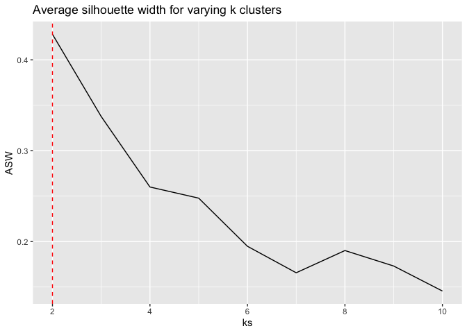
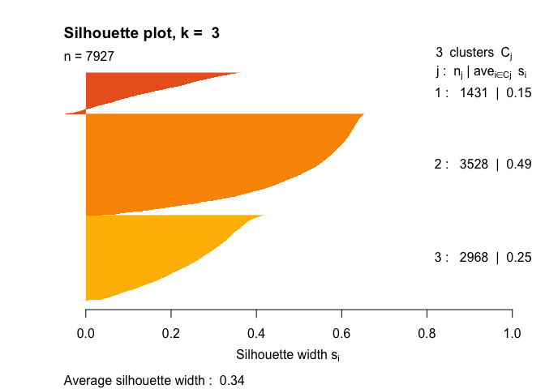
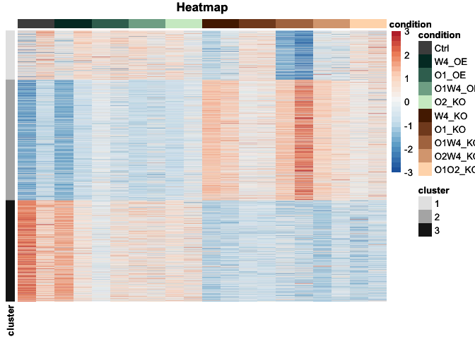
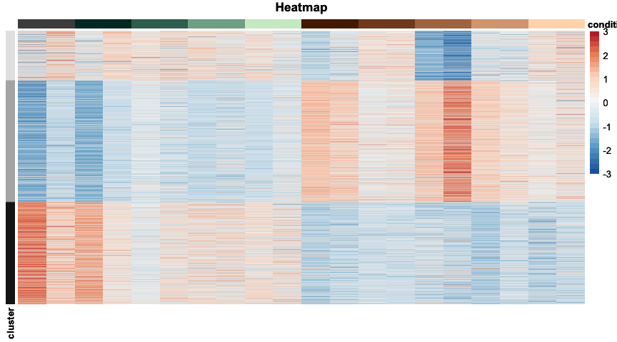
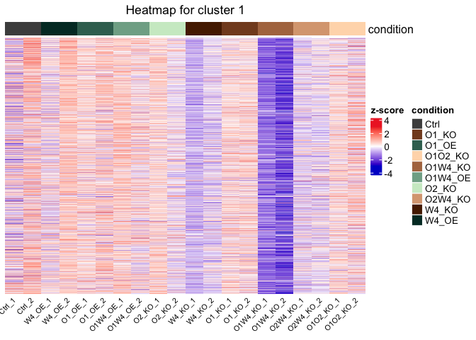
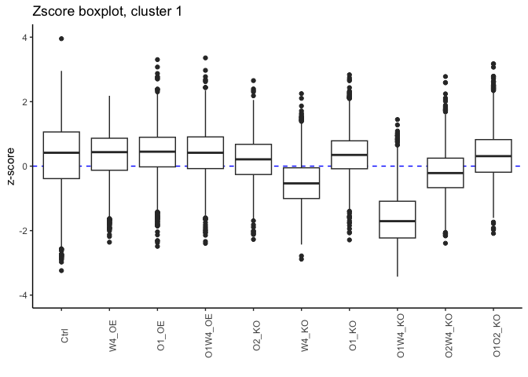
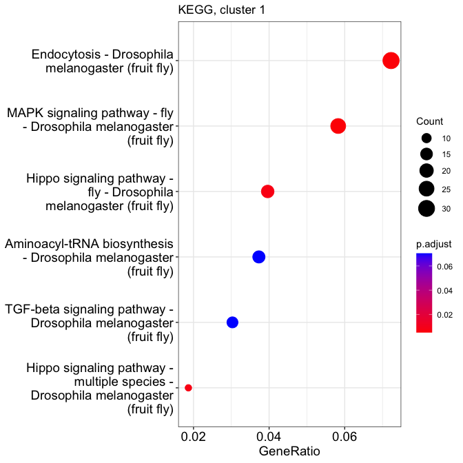
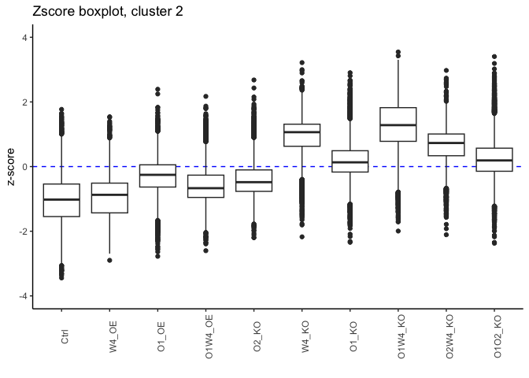
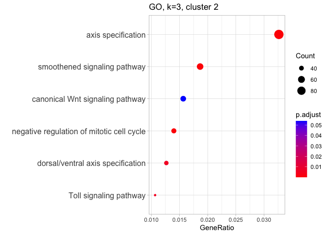
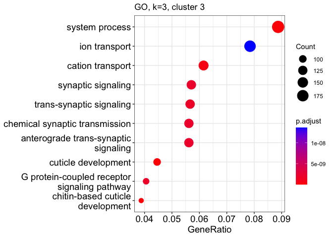

# 03_clust
Qian Hui TAN
2023-10-05

- [<span class="toc-section-number">1</span> Clustering](#clustering)
- [<span class="toc-section-number">2</span> Setup](#setup)
- [<span class="toc-section-number">3</span> Read in
  data](#read-in-data)
- [<span class="toc-section-number">4</span> Likelihood ratio
  test](#likelihood-ratio-test)
- [<span class="toc-section-number">5</span> Determining optimal number
  of clusters](#determining-optimal-number-of-clusters)
- [<span class="toc-section-number">6</span> Heatmap](#heatmap)
  - [<span class="toc-section-number">6.1</span> Kmeans, 3
    clusters](#kmeans-3-clusters)
  - [<span class="toc-section-number">6.2</span> Cluster 1](#cluster-1)
  - [<span class="toc-section-number">6.3</span> Cluster 2](#cluster-2)
  - [<span class="toc-section-number">6.4</span> Cluster 3](#cluster-3)
- [<span class="toc-section-number">7</span> Exports](#exports)
- [<span class="toc-section-number">8</span> Export cluster genes for
  compilation](#export-cluster-genes-for-compilation)
- [<span class="toc-section-number">9</span> Summary and
  discussion](#summary-and-discussion)
- [<span class="toc-section-number">10</span> Session
  info](#session-info)

# Clustering

# Setup

``` r
suppressPackageStartupMessages({
    library(DESeq2)
    library(pheatmap)
    library(clusterProfiler)
    library(ComplexHeatmap)
    library(circlize)
    library(org.Dm.eg.db)
    library(RColorBrewer)
    # General tidying up
    library(tidyverse)
    library(reshape2)
    library(knitr)
    library(grid)
})

source("../../scripts/R/clustering_functions.R")
source("../../scripts/R/go_kegg_functions.R")
```

``` r
# Initialize the starting seed
set.seed(1)
```

``` r
## If the output directory doesn't exist, create it
if(!dir.exists("../output/03_clust")){
  dir.create("../output/03_clust")
}

output_dir <- "../output/03_clust/"
```

# Read in data

Run DESeq:

``` r
dds = readRDS("../output/01_QC/dds_filt.RDS")
ensembl.genes= readRDS("../output/01_QC/ensembl_genes.RDS")
lfc.threshold = log2(1.5)

# Removing lowly expressed genes, only to be done once at the start of the differential expression step
filter = apply(counts(dds, normalized = TRUE), 1, function(x){ mean(x) >= 10 })
dds = dds[filter, ]

# Check for typos - number of samples in sample_order and colData(dds) should be 

  design(dds)
```

    ~condition

``` r
  dds <- DESeq(dds, test = "LRT", 
               reduced = ~ 1, 
               parallel = TRUE)
```

    using pre-existing size factors

    estimating dispersions

    gene-wise dispersion estimates: 6 workers

    mean-dispersion relationship

    final dispersion estimates, fitting model and testing: 6 workers

``` r
  # use blind = FALSE to account for experimental design
  rld <- rlog(dds, blind = FALSE)
```

``` r
# export dds_filt

saveRDS(dds, file = paste0(output_dir, "dds_filt.RDS"))
```

# Likelihood ratio test

``` r
res_lrt <- results(dds)

res_lrt$gene_biotype= ensembl.genes$gene_biotype[match(row.names(res_lrt), ensembl.genes$gene_id)]
res_lrt$external_gene_name= ensembl.genes$external_gene_name[match(row.names(res_lrt), ensembl.genes$gene_id)]

res_lrt$ensembl_gene_id = rownames(res_lrt)
#head(res_lrt)
```

``` r
hist(res_lrt$pvalue)
```


Number of significant genes (padj \< 0.1):

``` r
sum(res_lrt$padj < 0.1, na.rm = TRUE)
```

    [1] 7927

``` r
summary(res_lrt)
```


    out of 11145 with nonzero total read count
    adjusted p-value < 0.1
    LFC > 0 (up)       : 3378, 30%
    LFC < 0 (down)     : 4549, 41%
    outliers [1]       : 0, 0%
    low counts [2]     : 0, 0%
    (mean count < 10)
    [1] see 'cooksCutoff' argument of ?results
    [2] see 'independentFiltering' argument of ?results

Checking coefficients:

``` r
resultsNames(dds)
```

     [1] "Intercept"                 "condition_O1_KO_vs_Ctrl"  
     [3] "condition_O1_OE_vs_Ctrl"   "condition_O1O2_KO_vs_Ctrl"
     [5] "condition_O1W4_KO_vs_Ctrl" "condition_O1W4_OE_vs_Ctrl"
     [7] "condition_O2_KO_vs_Ctrl"   "condition_O2W4_KO_vs_Ctrl"
     [9] "condition_W4_KO_vs_Ctrl"   "condition_W4_OE_vs_Ctrl"  

``` r
# Select significant results
significant_results = res_lrt[!is.na(res_lrt$padj) & 
                                    res_lrt$padj < 0.1, ]


rld_signif = assay(rld)[rownames(significant_results), ]

rld_z = t(apply(rld_signif, 1, function(x){ (x - mean(x)) / sd(x)}))
```

# Determining optimal number of clusters

<div class="panel-tabset">

## Elbow plot

``` r
k.max <- 15
wss <- sapply(1:k.max,
 function(k){kmeans(rld_z, k, nstart=100,
 iter.max = 20 )$tot.withinss})

plot(1:k.max, wss,
 type="b", pch = 19, frame = FALSE,
 xlab="Number of clusters K",
 ylab="Total within-clusters sum of squares")
```


## Average silhouette width

We perform kmeans for 2-10 clusters, and calculate the average
silhouette width for each kmeans.

What’s the best k (maximum average silhouette width)?

``` r
# We will use different methods and try 1-10 clusters.

d <- dist(rld_z)
summary(d)
```

       Min. 1st Qu.  Median    Mean 3rd Qu.    Max. 
      0.000   4.249   6.214   5.827   7.619   8.681 

``` r
set.seed(1)
ks <- 2:10
ASW <- sapply(ks, FUN = function(k) {
  fpc::cluster.stats(d, kmeans(rld_z, centers=k, nstart = 5)$cluster)$avg.silwidth
  })

best_k <- ks[which.max(ASW)]
best_k
```

    [1] 2

### ASW

``` r
ggplot(as.data.frame(ks, ASW), aes(ks, ASW)) + geom_line() +
  geom_vline(xintercept = best_k, color = "red", linetype = 2) +
  ggtitle("Average silhouette width for varying k clusters")
```

    Warning in as.data.frame.integer(ks, ASW): 'row.names' is not a character
    vector of length 9 -- omitting it. Will be an error!



2 clusters looks best, but silhouette width constantly decreases until
we reach k = 7. Which means either 3 clusters, or 8 clusters.

## Silhouette plots

### k = 3

``` r
k3_coef <- cluster_kmeans(rld_z = rld_z, nclust = 3, 
                          plot_sil = TRUE)
```



</div>

# Heatmap

``` r
sample_order = colData(dds)$sample_id
condition_order <- c("Ctrl", 
                     "W4_OE", "O1_OE", "O1W4_OE", "O2_KO", 
                     "W4_KO", "O1_KO", "O1W4_KO", "O2W4_KO", "O1O2_KO")

#### ------ Row and column annotations ----- ####
row_ann <- as.data.frame(k3_coef$cluster)
colnames(row_ann) = "cluster"
row_ann$cluster = factor(row_ann$cluster, 
                         levels = (1:length(row_ann$cluster)))

col_ann <- data.frame(condition = rep(condition_order, each = 2))
rownames(col_ann) <- sample_order

ann_colors = list(
    condition = c("Ctrl" = "grey30",
                  # OE
                  "W4_OE" = '#00362d', "O1_OE" = '#3a6f60', 
                  "O1W4_OE" = '#80ac95', "O2_KO" = '#ceebcb',
                  # KO
                  "W4_KO" = '#552200', "O1_KO" = '#834a25', 
                  "O1W4_KO" = '#b0764f', "O2W4_KO" = '#daa680', 
                  "O1O2_KO" = '#ffdab8'),
    cluster = c("1" = "grey90", "2" = "grey70", "3" = "grey10")
)

col_colors <- c("darkgrey", #Ctrls
                '#00362d', '#3a6f60', '#80ac95', '#ceebcb', #OEs
                '#552200', '#834a25', '#b0764f', '#daa680', '#ffdab8' #KOs
                )
```

## Kmeans, 3 clusters

``` r
heatmap_plot <- plot_kmeans_heatmap(rld_z, k_coef = k3_coef,  
                    sample_order = sample_order,
                    labels_col = condition_order, 
                    show_rownames = FALSE,
                    show_colnames = FALSE, 
                    annotation_row = row_ann, 
                    annotation_col = col_ann,
                    annotation_colors = ann_colors)

heatmap_plot
```



``` r
saveRDS(heatmap_plot, file = paste0(output_dir, "heatmap_plot.RDS"))
```

``` r
# save this

ggsave(filename = c("../figures/03_clust/heatmap.pdf"),
       plot = heatmap_plot,
       width = 210, 
       height = 145, 
       device = "pdf",
       dpi = "retina",
       units = c("mm"))
```

``` r
# Same plot as above, but remove the legend

heatmap_noleg <- plot_kmeans_heatmap(rld_z, k_coef = k3_coef,  
                    sample_order = sample_order,
                    labels_col = condition_order, 
                    show_rownames = FALSE,
                    show_colnames = FALSE, 
                    annotation_row = row_ann, 
                    annotation_col = col_ann,
                    annotation_colors = ann_colors, 
                    annotation_legend = FALSE)

heatmap_noleg
```



``` r
saveRDS(heatmap_noleg, file = paste0(output_dir, "heatmap_noleg.RDS"))
```

``` r
ggsave(filename = c("../figures/03_clust/heatmap_noleg.svg"),
       plot = heatmap_noleg,
       width = 210, 
       height = 145, 
       device = "svg",
       units = c("mm"))
```

``` r
kmeans_cl <- get_cluster_genes(k3_coef, nclust = 3)
```

## Cluster 1

``` r
ha = HeatmapAnnotation(condition = rep(condition_order, each = 2),
                       col = ann_colors)


clusterHeatmap(rld_z, kmeans_cl = kmeans_cl, 
               clust_num = 1,
               sample_order = sample_order,
              cluster_rows = FALSE,
              font_size = 8,
              top_annotation = ha
)
```



<div class="panel-tabset">

### Zscore boxplot

``` r
zscore_boxcondition(kmeans_cl, clust_num = 1, 
                    condition_order = condition_order)
```

    [1] "1431 genes in cluster 1"

    Warning: Removed 1 rows containing non-finite values (`stat_boxplot()`).



### GO - c1

``` r
k3_c1_ego <- plotEGO_dm(clust_target_genes = names((kmeans_cl)[[1]]), 
                     universe = rownames(dds), 
                     title = "GO, k=3, cluster 1")
```

    Running GO for organism = drosophila melanogaster


    [1] "555 enrichments found"

How many enrichments?

``` r
nrow(k3_c1_ego)
```

    [1] 555

### Finding enrichments

``` r
findEGO(k3_c1_ego, "Wnt", print_top_matches = FALSE)
```

    [1] "2 matches found."
    [1] "negative regulation of Wnt signaling pathway"          
    [2] "negative regulation of canonical Wnt signaling pathway"

``` r
findEGO(k3_c1_ego, "hippo", print_top_matches = FALSE)
```

    [1] "0 matches found."
    character(0)

``` r
findEGO(k3_c1_ego, "signaling", print_top_matches = FALSE)
```

    [1] "17 matches found."
     [1] "enzyme-linked receptor protein signaling pathway"                         
     [2] "transmembrane receptor protein tyrosine kinase signaling pathway"         
     [3] "negative regulation of signaling"                                         
     [4] "insulin receptor signaling pathway"                                       
     [5] "epidermal growth factor receptor signaling pathway"                       
     [6] "ERBB signaling pathway"                                                   
     [7] "positive regulation of signaling"                                         
     [8] "positive regulation of insulin receptor signaling pathway"                
     [9] "fibroblast growth factor receptor signaling pathway"                      
    [10] "vascular endothelial growth factor receptor signaling pathway"            
    [11] "negative regulation of Wnt signaling pathway"                             
    [12] "regulation of insulin receptor signaling pathway"                         
    [13] "negative regulation of epidermal growth factor receptor signaling pathway"
    [14] "negative regulation of ERBB signaling pathway"                            
    [15] "negative regulation of canonical Wnt signaling pathway"                   
    [16] "regulation of epidermal growth factor receptor signaling pathway"         
    [17] "regulation of ERBB signaling pathway"                                     

``` r
findEGO(k3_c1_ego, "mito[st]", print_top_matches = FALSE)
```

    [1] "2 matches found."
    [1] "mitotic cell cycle, embryonic"                               
    [2] "negative regulation of G1/S transition of mitotic cell cycle"

``` r
findEGO(k3_c1_ego, "senes|apop|death", print_top_matches = FALSE)
```

    [1] "15 matches found."
     [1] "regulation of programmed cell death"                          
     [2] "programmed cell death"                                        
     [3] "regulation of apoptotic process"                              
     [4] "regulation of cell death"                                     
     [5] "cell death"                                                   
     [6] "programmed cell death involved in cell development"           
     [7] "positive regulation of programmed cell death"                 
     [8] "positive regulation of cell death"                            
     [9] "larval midgut cell programmed cell death"                     
    [10] "negative regulation of programmed cell death"                 
    [11] "apoptotic process"                                            
    [12] "negative regulation of apoptotic process"                     
    [13] "positive regulation of apoptotic process"                     
    [14] "regulation of retinal cell programmed cell death"             
    [15] "regulation of compound eye retinal cell programmed cell death"

``` r
findEGO(k3_c1_ego, "neuro", print_top_matches = FALSE)
```

    [1] "27 matches found."
     [1] "neuron projection development"                        
     [2] "cell morphogenesis involved in neuron differentiation"
     [3] "neuron projection morphogenesis"                      
     [4] "regulation of neurogenesis"                           
     [5] "neuron projection guidance"                           
     [6] "neuron fate commitment"                               
     [7] "regulation of neuron projection development"          
     [8] "positive regulation of neurogenesis"                  
     [9] "neuroblast differentiation"                           
    [10] "positive regulation of neuroblast proliferation"      
    [11] "regulation of neuroblast proliferation"               
    [12] "neuroblast proliferation"                             
    [13] "regulation of neuron differentiation"                 
    [14] "neuroblast fate commitment"                           
    [15] "neuroblast development"                               
    [16] "neuron recognition"                                   
    [17] "synaptic assembly at neuromuscular junction"          
    [18] "neuron migration"                                     
    [19] "neuron remodeling"                                    
    [20] "neuroblast fate determination"                        
    [21] "neuromuscular junction development"                   
    [22] "neuron maturation"                                    
    [23] "positive regulation of neuron projection development" 
    [24] "positive regulation of neuron differentiation"        
    [25] "negative regulation of neuron projection development" 
    [26] "regulation of neuromuscular junction development"     
    [27] "negative regulation of neuron differentiation"        

``` r
findEGO(k3_c1_ego, "transcript|transl", print_top_matches = FALSE)
```

    [1] "9 matches found."
    [1] "positive regulation of DNA-templated transcription"                  
    [2] "positive regulation of nucleic acid-templated transcription"         
    [3] "negative regulation of DNA-templated transcription"                  
    [4] "negative regulation of nucleic acid-templated transcription"         
    [5] "positive regulation of transcription by RNA polymerase II"           
    [6] "negative regulation of transcription by RNA polymerase II"           
    [7] "tRNA aminoacylation for protein translation"                         
    [8] "positive regulation of translation"                                  
    [9] "positive regulation of transcription elongation by RNA polymerase II"

``` r
findEGO(k3_c1_ego, "migrat|taxi", print_top_matches = FALSE)
```

    [1] "19 matches found."
     [1] "cell migration"                                               
     [2] "chemotaxis"                                                   
     [3] "tissue migration"                                             
     [4] "epithelial cell migration"                                    
     [5] "epithelium migration"                                         
     [6] "ameboidal-type cell migration"                                
     [7] "taxis"                                                        
     [8] "regulation of cell migration"                                 
     [9] "epithelial cell migration, open tracheal system"              
    [10] "positive regulation of cell migration"                        
    [11] "ovarian follicle cell migration"                              
    [12] "regulation of epithelial cell migration"                      
    [13] "border follicle cell migration"                               
    [14] "neuron migration"                                             
    [15] "glial cell migration"                                         
    [16] "regulation of chemotaxis"                                     
    [17] "regulation of epithelial cell migration, open tracheal system"
    [18] "germ cell migration"                                          
    [19] "positive regulation of border follicle cell migration"        

### Custom EGO

``` r
interesting_pathways <- c("negative regulation of canonical Wnt signaling pathway", 
                          # signaling
                          "negative regulation of ERBB signaling pathway",
                          "negative regulation of epidermal growth factor receptor signaling pathway",
                          "insulin receptor signaling pathway",
                          "fibroblast growth factor receptor signaling pathway",
                          "neuron projection guidance",
                          "chemotaxis")

custom_ego(k3_c1_ego, interesting_pathways,
           title = "GO, k=3, cluster 1", 
           font_size = 12)
```


``` r
c1_go_table <- custom_ego_table(k3_c1_ego, interesting_pathways)

c1_go_table
```

| Description                                                               | GeneRatio |  p.adjust | geneID                                                                                                                                                                                                                                                                                                                                                                  |
|:--------------------------------------------------------------------------|:----------|----------:|:------------------------------------------------------------------------------------------------------------------------------------------------------------------------------------------------------------------------------------------------------------------------------------------------------------------------------------------------------------------------|
| chemotaxis                                                                | 73/1268   | 0.0000030 | eya/D/dpp/en/E(z)/grn/Sos/robo2/sens/peb/ras/ptc/Nrt/Ptp4E/Ten-m/pros/zfh1/hh/otk/robo1/comm/hep/trn/sqz/Sema1a/babo/fra/shot/gcm/mirr/Shc/drl/Vang/fz2/Tor/stan/msps/Rich/Fmr1/nerfin-1/SoxN/raptor/Nf-YC/hiw/erm/beat-IIIc/CdGAPr/ckn/unc-5/Toll-7/Lrt/Toll-6/Vav/boi/Alk/wun2/SCAR/Liprin-alpha/Mical/jeb/vvl/psidin/wb/Dbx/mid/hts/sli/ab/Ten-a/S6k/InR/Sac1/Sema5c |
| neuron projection guidance                                                | 69/1268   | 0.0000150 | eya/D/en/E(z)/grn/Sos/robo2/sens/peb/ras/ptc/Nrt/Ptp4E/Ten-m/pros/zfh1/otk/robo1/comm/hep/trn/sqz/Sema1a/babo/fra/shot/gcm/mirr/Shc/drl/Vang/fz2/Tor/stan/msps/Rich/Fmr1/nerfin-1/SoxN/raptor/Nf-YC/hiw/erm/beat-IIIc/CdGAPr/ckn/unc-5/Toll-7/Toll-6/Vav/boi/Alk/SCAR/Liprin-alpha/Mical/jeb/vvl/psidin/wb/Dbx/mid/hts/sli/ab/Ten-a/S6k/InR/Sac1/Sema5c                 |
| insulin receptor signaling pathway                                        | 21/1268   | 0.0066212 | fkh/Hsp83/ImpL2/Akt1/Pi3K21B/Tor/Fmr1/raptor/rictor/Sin1/Mkp3/srl/HDAC4/step/Mob4/Myc/Lpin/Ns3/PRAS40/S6k/InR                                                                                                                                                                                                                                                           |
| fibroblast growth factor receptor signaling pathway                       | 12/1268   | 0.0292525 | aop/Sos/pnt/Ptp4E/bnl/sty/Shc/stumps/CG13398/ths/grh/btl                                                                                                                                                                                                                                                                                                                |
| negative regulation of epidermal growth factor receptor signaling pathway | 10/1268   | 0.0656670 | Ptp4E/CanA1/sty/edl/rno/Mkp3/Vav/Socs36E/tay/hppy                                                                                                                                                                                                                                                                                                                       |
| negative regulation of ERBB signaling pathway                             | 10/1268   | 0.0656670 | Ptp4E/CanA1/sty/edl/rno/Mkp3/Vav/Socs36E/tay/hppy                                                                                                                                                                                                                                                                                                                       |
| negative regulation of canonical Wnt signaling pathway                    | 11/1268   | 0.0777024 | aop/nkd/otk/wts/phyl/Apc/Sin3A/fz4/SoxN/HUWE1/Duba                                                                                                                                                                                                                                                                                                                      |

``` r
write_csv(k3_c1_ego, file = paste0(output_dir, "k3_c1_ego.csv"))
```

### KEGG - c1

``` r
# Get entrez ids
c1_entrez <- na.omit(ensembl.genes[ensembl.genes$gene_id %in% names((kmeans_cl)[[1]]), ]$entrezgene_id)

kegg_universe = ensembl.genes[ensembl.genes$ensembl_gene_id %in% rownames(dds), ]$entrezgene_id

# Run KEGG
k3_c1_ekegg <- plotKEGG_dm(c1_entrez, 
                           universe = kegg_universe, title = "KEGG, cluster 1")
```

    Running KEGG for organism = drosophila melanogaster

    Reading KEGG annotation online: "https://rest.kegg.jp/link/dme/pathway"...

    Reading KEGG annotation online: "https://rest.kegg.jp/list/pathway/dme"...

    Reading KEGG annotation online: "https://rest.kegg.jp/conv/ncbi-geneid/dme"...

    `universe` is not in character and will be ignored...



    [1] "6 enrichments found"

``` r
nrow(k3_c1_ekegg)
```

    [1] 6

``` r
write.csv(k3_c1_ekegg, file = paste0(output_dir, "k3_c1_ekegg.csv"),
          row.names = FALSE)
```

### Custom KEGG

``` r
interesting_pathways = c("Endocytosis", 
                         "MAPK signaling pathway - fly",
                         "Hippo signaling pathway - fly",
                         "TGF-beta signaling pathway")

c1_kegg_table <- custom_kegg_table(k3_c1_ekegg, 
                                   interesting_pathways)

c1_kegg_table
```

|          | Description                   | GeneRatio |  p.adjust | geneID                                                                                                                                                                                      |
|:---------|:------------------------------|:----------|----------:|:--------------------------------------------------------------------------------------------------------------------------------------------------------------------------------------------|
| dme04144 | Endocytosis                   | 31/429    | 0.0049860 | Hsp68/Egfr/babo/Hsp70Ba/Hsp70Bc/Past1/sktl/WASp/siz/Sara/Rip11/Sec71/CG8243/wash/FAM21/Vps20/Eps-15/Strump/Arpc3A/Usp8/Asap/CG31064/Efa6/Hsp70Bbb/step/Rbsn-5/AP-2mu/garz/AP-2alpha/InR/btl |
| dme04013 | MAPK signaling pathway - fly  | 25/429    | 0.0049860 | aop/dpp/Jra/Sos/peb/pnt/raw/Egfr/ttk/vn/hid/pros/hep/Mef2/phyl/Ask1/sty/Shark/Shc/edl/p38b/slpr/CYLD/Tab2/Duox                                                                              |
| dme04391 | Hippo signaling pathway - fly | 17/429    | 0.0074585 | fj/ft/hth/tsh/vn/ex/wts/jub/yki/sav/Patj/crb/d/kibra/Myc/wg/ds                                                                                                                              |
| dme04350 | TGF-beta signaling pathway    | 13/429    | 0.0703918 | dpp/emc/sog/babo/Rbf/Sin3A/gbb/E2f2/Sara/vis/achi/Myc/S6k                                                                                                                                   |

### Summary

</div>

## Cluster 2

``` r
clusterHeatmap(rld_z, kmeans_cl = kmeans_cl, 
               clust_num = 2, sample_order = sample_order,
              cluster_rows = FALSE,
              font_size = 8,
              top_annotation  = ha)
```

    `use_raster` is automatically set to TRUE for a matrix with more than
    2000 rows. You can control `use_raster` argument by explicitly setting
    TRUE/FALSE to it.

    Set `ht_opt$message = FALSE` to turn off this message.

    'magick' package is suggested to install to give better rasterization.

    Set `ht_opt$message = FALSE` to turn off this message.


<div class="panel-tabset">

### Zscore-boxplot

``` r
zscore_boxcondition(kmeans_cl, clust_num = 2, condition_order)
```

    [1] "3528 genes in cluster 2"



### GO - c2

``` r
k3_c2_ego <- plotEGO_dm(clust_target_genes = names((kmeans_cl)[[2]]), 
                     universe = rownames(dds), 
                     title = "GO, k=3, cluster 2")
```

    Running GO for organism = drosophila melanogaster


    [1] "513 enrichments found"

### Finding enrichments

``` r
findEGO(k3_c2_ego, "Wnt", print_top_matches = FALSE)
```

    [1] "7 matches found."
    [1] "regulation of Wnt signaling pathway"                   
    [2] "cell-cell signaling by wnt"                            
    [3] "regulation of canonical Wnt signaling pathway"         
    [4] "Wnt signaling pathway"                                 
    [5] "positive regulation of canonical Wnt signaling pathway"
    [6] "positive regulation of Wnt signaling pathway"          
    [7] "canonical Wnt signaling pathway"                       

``` r
findEGO(k3_c2_ego, "signal", print_top_matches = FALSE)
```

    [1] "45 matches found."
     [1] "regulation of smoothened signaling pathway"                             
     [2] "cell cycle checkpoint signaling"                                        
     [3] "smoothened signaling pathway"                                           
     [4] "mitotic cell cycle checkpoint signaling"                                
     [5] "positive regulation of smoothened signaling pathway"                    
     [6] "DNA integrity checkpoint signaling"                                     
     [7] "negative regulation of smoothened signaling pathway"                    
     [8] "DNA damage checkpoint signaling"                                        
     [9] "signal transduction in response to DNA damage"                          
    [10] "mitotic DNA integrity checkpoint signaling"                             
    [11] "regulation of hippo signaling"                                          
    [12] "hippo signaling"                                                        
    [13] "DNA replication checkpoint signaling"                                   
    [14] "mitotic G2 DNA damage checkpoint signaling"                             
    [15] "Toll signaling pathway"                                                 
    [16] "regulation of Wnt signaling pathway"                                    
    [17] "mitotic DNA damage checkpoint signaling"                                
    [18] "positive regulation of signal transduction"                             
    [19] "negative regulation of signal transduction"                             
    [20] "regulation of Toll signaling pathway"                                   
    [21] "negative regulation of hippo signaling"                                 
    [22] "cell-cell signaling by wnt"                                             
    [23] "regulation of canonical Wnt signaling pathway"                          
    [24] "positive regulation of Toll signaling pathway"                          
    [25] "positive regulation of signaling"                                       
    [26] "cell surface receptor signaling pathway involved in cell-cell signaling"
    [27] "Wnt signaling pathway"                                                  
    [28] "positive regulation of canonical Wnt signaling pathway"                 
    [29] "mitotic DNA replication checkpoint signaling"                           
    [30] "positive regulation of Wnt signaling pathway"                           
    [31] "mitotic spindle assembly checkpoint signaling"                          
    [32] "spindle checkpoint signaling"                                           
    [33] "spindle assembly checkpoint signaling"                                  
    [34] "mitotic spindle checkpoint signaling"                                   
    [35] "receptor signaling pathway via JAK-STAT"                                
    [36] "receptor signaling pathway via STAT"                                    
    [37] "regulation of intracellular signal transduction"                        
    [38] "canonical Wnt signaling pathway"                                        
    [39] "regulation of receptor signaling pathway via JAK-STAT"                  
    [40] "regulation of receptor signaling pathway via STAT"                      
    [41] "negative regulation of signaling"                                       
    [42] "negative regulation of intracellular signal transduction"               
    [43] "regulation of sevenless signaling pathway"                              
    [44] "positive regulation of hippo signaling"                                 
    [45] "stress-activated protein kinase signaling cascade"                      

``` r
findEGO(k3_c2_ego, "autophag", print_top_matches = FALSE)
```

    [1] "4 matches found."
    [1] "autophagy"                             
    [2] "process utilizing autophagic mechanism"
    [3] "macroautophagy"                        
    [4] "regulation of autophagy"               

``` r
findEGO(k3_c2_ego, "senes|apop|death", print_top_matches = FALSE)
```

    [1] "3 matches found."
    [1] "programmed cell death" "cell death"            "apoptotic process"    

``` r
findEGO(k3_c2_ego, "adhes", print_top_matches = FALSE)
```

    [1] "0 matches found."
    character(0)

``` r
findEGO(k3_c2_ego, "neuro", print_top_matches = FALSE)
```

    [1] "4 matches found."
    [1] "negative regulation of neuroblast proliferation"    
    [2] "asymmetric neuroblast division"                     
    [3] "neuroblast division"                                
    [4] "establishment or maintenance of neuroblast polarity"

``` r
findEGO(k3_c2_ego, "axis|cuti", print_top_matches = FALSE)
```

    [1] "9 matches found."
    [1] "axis specification"                                                               
    [2] "oocyte axis specification"                                                        
    [3] "anterior/posterior axis specification, embryo"                                    
    [4] "embryonic axis specification"                                                     
    [5] "anterior/posterior axis specification"                                            
    [6] "maternal determination of anterior/posterior axis, embryo"                        
    [7] "oocyte anterior/posterior axis specification"                                     
    [8] "dorsal/ventral axis specification"                                                
    [9] "intracellular mRNA localization involved in anterior/posterior axis specification"

``` r
findEGO(k3_c2_ego, "diff|prolif|mitot", print_top_matches = FALSE)
```

    [1] "45 matches found."
     [1] "mitotic cell cycle"                                           
     [2] "mitotic cell cycle process"                                   
     [3] "regulation of mitotic cell cycle"                             
     [4] "mitotic cell cycle phase transition"                          
     [5] "oocyte differentiation"                                       
     [6] "regulation of mitotic cell cycle phase transition"            
     [7] "mitotic nuclear division"                                     
     [8] "mitotic cell cycle checkpoint signaling"                      
     [9] "negative regulation of mitotic cell cycle phase transition"   
    [10] "negative regulation of mitotic cell cycle"                    
    [11] "mitotic sister chromatid segregation"                         
    [12] "regulation of G2/M transition of mitotic cell cycle"          
    [13] "G2/M transition of mitotic cell cycle"                        
    [14] "mitotic spindle organization"                                 
    [15] "negative regulation of G2/M transition of mitotic cell cycle" 
    [16] "mitotic DNA integrity checkpoint signaling"                   
    [17] "mitotic G2/M transition checkpoint"                           
    [18] "mitotic cytokinesis"                                          
    [19] "mitotic G2 DNA damage checkpoint signaling"                   
    [20] "mitotic DNA damage checkpoint signaling"                      
    [21] "negative regulation of cell population proliferation"         
    [22] "establishment of mitotic spindle localization"                
    [23] "cell population proliferation"                                
    [24] "metaphase/anaphase transition of mitotic cell cycle"          
    [25] "regulation of mitotic sister chromatid separation"            
    [26] "mitotic sister chromatid separation"                          
    [27] "mitotic centrosome separation"                                
    [28] "mitotic DNA replication checkpoint signaling"                 
    [29] "establishment of mitotic spindle orientation"                 
    [30] "negative regulation of neuroblast proliferation"              
    [31] "negative regulation of neural precursor cell proliferation"   
    [32] "mitotic spindle assembly checkpoint signaling"                
    [33] "regulation of mitotic cell cycle, embryonic"                  
    [34] "negative regulation of mitotic sister chromatid segregation"  
    [35] "negative regulation of mitotic metaphase/anaphase transition" 
    [36] "mitotic spindle checkpoint signaling"                         
    [37] "negative regulation of mitotic sister chromatid separation"   
    [38] "regulation of mitotic sister chromatid segregation"           
    [39] "regulation of mitotic nuclear division"                       
    [40] "regulation of R7 cell differentiation"                        
    [41] "germarium-derived oocyte differentiation"                     
    [42] "regulation of photoreceptor cell differentiation"             
    [43] "regulation of compound eye photoreceptor cell differentiation"
    [44] "regulation of mitotic metaphase/anaphase transition"          
    [45] "mitotic metaphase plate congression"                          

``` r
findEGO(k3_c2_ego, "migrat|taxi", print_top_matches = FALSE)
```

    [1] "0 matches found."
    character(0)

### Custom EGO

``` r
interesting_pathways <- c(
  # Wnt
  "canonical Wnt signaling pathway",
  # pathways
  "smoothened signaling pathway",
  "Toll signaling pathway",
  # axis specification
  "dorsal/ventral axis specification",
  "axis specification",
  "negative regulation of mitotic cell cycle"
  
  )

custom_ego(k3_c2_ego, interesting_pathways, 
           title = "GO, k=3, cluster 2", 
           font_size = 12)
```



``` r
c2_go_table <- custom_ego_table(k3_c2_ego, interesting_pathways)

c2_go_table
```

| Description                               | GeneRatio |  p.adjust | geneID                                                                                                                                                                                                                                                                                                                                                                                                                                                                                                                     |
|:------------------------------------------|:----------|----------:|:---------------------------------------------------------------------------------------------------------------------------------------------------------------------------------------------------------------------------------------------------------------------------------------------------------------------------------------------------------------------------------------------------------------------------------------------------------------------------------------------------------------------------|
| smoothened signaling pathway              | 56/3002   | 0.0000037 | bam/bur/Pka-C1/cos/flw/fu/Gbeta13F/dco/Pp1-13C/Pp1alpha-96A/smo/Su(dx)/Su(var)2-10/mts/Rap1/tws/Su(fu)/lwr/Gug/eff/Uch-L5/CkIalpha/Ubc4/Cul1/HDAC1/Pp4-19C/Tnpo/Roc1a/par-6/wdb/botv/Ulp1/Smurf/disp/sotv/PPP4R2r/Usp7/Hrs/Nedd8/Herc4/UbcE2M/hyx/krz/dlp/gish/Nedd4/cno/Pka-R1/Pp2A-29B/Gprk1/pic/nej/aPKC/Uba3/smt3/ttv                                                                                                                                                                                                  |
| axis specification                        | 98/3002   | 0.0000392 | aub/baz/bcd/BicD/cact/cad/Pka-C1/chic/cni/csw/cup/ea/flw/gd/fs(1)K10/grk/hb/dlg1/wek/l(2)gl/pho/mago/mus301/ndl/pum/Ras85D/rl/sax/Sce/snk/spir/spn-B/spn-D/spn-E/spz/Sry-delta/stau/swa/Tm1/tor/RasGAP1/fs(1)h/Hrb27C/enc/orb/fs(1)M3/faf/Parp/Dsor1/pll/heph/Dp/Syx1A/ksr/Lis-1/Rab11/csul/mael/Cbl/14-3-3epsilon/lig/asun/DCTN2-p50/Vps25/Rok/gus/Grip75/CSN5/Mkrn1/Rab35/cactin/papi/tsu/Myd88/tej/krimp/TBCB/DCP1/CG7483/CG9925/armi/spn-F/Pka-R1/capt/lic/aPKC/Tl/cic/milt/psq/vret/scrib/sqd/jvl/qin/spoon/rump/Ge-1 |
| negative regulation of mitotic cell cycle | 42/3002   | 0.0000588 | brm/mor/mus101/mus304/smo/Cdk1/B52/Dsor1/Mad/Wee1/l(2)dtl/Mtor/lok/mre11/aurB/Bub3/Rad17/Mad1/Hus1-like/RecQ5/Aven/CG8173/Mnn1/CG5181/BuGZ/CG10336/CG15237/mms4/mad2/Cdc6/Tctp/CycG/mus81/Chro/tefu/Rif1/Claspin/Zwilch/grp/Xpd/CG43295/BubR1                                                                                                                                                                                                                                                                              |
| Toll signaling pathway                    | 32/3002   | 0.0052864 | cact/ea/gd/gro/wek/ndl/snk/spz/tub/pll/lwr/Ulp1/Spn88Ea/Spn27A/Uba2/Aos1/cactin/Hrs/Myd88/Dcr-2/Herc4/mop/dgrn/puf/grass/krz/GNBP1/26-29-p/Tl/smt3/Traf6/Doa                                                                                                                                                                                                                                                                                                                                                               |
| dorsal/ventral axis specification         | 38/3002   | 0.0057209 | BicD/cact/cni/csw/ea/flw/gd/grk/wek/mus301/ndl/snk/spn-B/spn-D/spn-E/spz/enc/orb/faf/Parp/pll/Dp/Lis-1/mael/Cbl/lig/asun/CSN5/cactin/tsu/Myd88/krimp/Tl/cic/milt/sqd/jvl/spoon                                                                                                                                                                                                                                                                                                                                             |
| canonical Wnt signaling pathway           | 47/3002   | 0.0538860 | arm/dsh/flw/gro/dco/hyd/Pp1alpha-96A/Pp1-87B/mts/tws/Eip63E/Ssdp/nmo/Rho1/CkIalpha/Cul1/Usp47/spen/CtBP/SkpA/Roc1a/Cdc16/Axn/Apc2/Tnks/botv/Nulp1/sotv/Nek2/CycY/Gint3/Rnf146/CG11523/hyx/RanBP3/lgs/rept/pont/dlp/pygo/tum/gish/hpo/lic/nej/ttv/RpS12                                                                                                                                                                                                                                                                     |

``` r
write.csv(k3_c2_ego, file = paste0(output_dir, "k3_c2_ego.csv"))
```

### KEGG - c2

``` r
# Get the entrez IDs
c2_entrez <- na.omit(ensembl.genes[ensembl.genes$gene_id %in% names((kmeans_cl)[[2]]), ]$entrezgene_id)
# Run KEGG
k3_c2_ekegg <- plotKEGG_dm(c2_entrez, 
                           universe = kegg_universe, 
                           title = "KEGG, cluster 2")
```

    Running KEGG for organism = drosophila melanogaster

    `universe` is not in character and will be ignored...


    [1] "9 enrichments found"

``` r
nrow(k3_c2_ekegg)
```

    [1] 9

``` r
k3_c2_ekegg
```

|          | ID       | Description                                                              | GeneRatio | BgRatio  |    pvalue |  p.adjust |    qvalue | geneID                                                                                                                                                                                                                                                                                                                                                                                                                                                                                                        | Count |
|:---------|:---------|:-------------------------------------------------------------------------|:----------|:---------|----------:|----------:|----------:|:--------------------------------------------------------------------------------------------------------------------------------------------------------------------------------------------------------------------------------------------------------------------------------------------------------------------------------------------------------------------------------------------------------------------------------------------------------------------------------------------------------------|------:|
| dme03013 | dme03013 | Nucleocytoplasmic transport - Drosophila melanogaster (fruit fly)        | 70/1184   | 99/3488  | 0.0000000 | 0.0000000 | 0.0000000 | mago/sbr/RanGAP/lwr/Nup214/Ref1/Mtor/Hel25E/Ran/emb/Nup154/Cse1/Cbp80/Cbp20/Bin1/Dbp80/Kap-alpha1/Tnpo/mbo/msk/Kap-alpha3/Nup93-1/Nxt1/Upf2/Aladin/Nup35/Elys/Nup205/tho2/Tnpo-SR/Nup50/Gle1/tsu/Phax/Nup54/Nup62/Rae1/Pym/Upf3/thoc5/thoc7/thoc6/Srrm1/Hpr1/CG7483/RnpS1/Pnn/Ranbp9/CG14712/Nup93-2/Nup133/Nup98-96/Ndc1/Nup37/Nup358/CG18787/Arts/Apl/Ranbp16/Nup153/Karybeta3/Snup/CG42304/cdm/Nup160/Acn/Nxf3/smt3/ebo/Gp210                                                                              |    70 |
| dme03040 | dme03040 | Spliceosome - Drosophila melanogaster (fruit fly)                        | 81/1184   | 141/3488 | 0.0000000 | 0.0000003 | 0.0000003 | crn/SmF/Hrb98DE/l(1)10Bb/mago/snf/B52/Bx42/U2af50/Ref1/Hel25E/noi/Spx/U2af38/ytr/Cbp80/Cbp20/CG2685/l(1)G0007/Prp18/CG4119/x16/hfp/Tango4/CG1622/CG6227/Usp39/Sf3b1/tho2/CG3542/Sf3b2/Phf5a/CG6686/CG10333/Dhx15/tsu/CG12343/Prp8/CG9346/Cypl/Sf3b3/CG2021/CG11586/CG6610/Sf3b6/CG6418/CG10418/Sf3a2/Prp31/U4-U6-60K/Prp3/CG14641/Hpr1/CG7483/CG6015/PQBP1/BCAS2/CG15525/CG17454/c12.1/Sf3b5/Prp38/LSm3/Spf45/pea/LSm7/Prp19/SmD2/SmE/SNRPG/snRNP-U1-C/scaf6/SmD1/SmB/Acn/l(3)72Ab/Cdc5/Sf3a1/HnRNP-K/SF2/caz |    81 |
| dme03082 | dme03082 | ATP-dependent chromatin remodeling - Drosophila melanogaster (fruit fly) | 50/1184   | 81/3488  | 0.0000002 | 0.0000085 | 0.0000080 | Act5C/brm/E(bx)/E(Pc)/His2Av/pho/mor/Uch-L5/Iswi/Snr1/Arp6/HDAC1/dom/Bap60/Tip60/BCL7-like/CG8677/MRG15/CG11970/MBD-like/MTA1-like/Bap111/CDK2AP1/Arp8/CG31917/Gas41/CG7154/YL-1/d4/CG10395/MrgBP/CG18004/DMAP1/Eaf6/Arp5/polybromo/Brd8/rept/pont/CG12659/Bap170/Chrac-16/Chrac-14/CG33695/Ino80/e(y)3/osa/Mi-2/Rcd5/Caf1-55                                                                                                                                                                                 |    50 |
| dme03250 | dme03250 | Viral life cycle - HIV-1 - Drosophila melanogaster (fruit fly)           | 25/1184   | 33/3488  | 0.0000010 | 0.0000290 | 0.0000271 | BicD/Fur1/Fur2/TH1/Snr1/Su(Tpl)/dod/Cdk9/Ran/Gcn5/emb/ear/NELF-B/fal/spt4/Hrs/Tnpo-SR/Cpsf6/Nup358/Jasper/Spt5/Nup153/ALiX/nej/Vps4                                                                                                                                                                                                                                                                                                                                                                           |    25 |
| dme03022 | dme03022 | Basal transcription factors - Drosophila melanogaster (fruit fly)        | 27/1184   | 40/3488  | 0.0000136 | 0.0003221 | 0.0003017 | e(y)1/hay/TfIIB/Taf4/TfIIFalpha/Trf/Taf1/Taf5/Taf6/TfIIFbeta/TfIIA-L/Taf12/Taf11/Taf2/TfIIA-S/Taf8/Taf7/Taf10b/Taf10/Tfb4/Taf13/Ssl1/mrn/Trf2/Xpd/Cdk7/Tfb5                                                                                                                                                                                                                                                                                                                                                   |    27 |
| dme04120 | dme04120 | Ubiquitin mediated proteolysis - Drosophila melanogaster (fruit fly)     | 57/1184   | 107/3488 | 0.0000234 | 0.0004606 | 0.0004314 | ben/fzy/hyd/mr/sina/Su(dx)/Su(var)2-10/RpL40/RpS27A/shtd/lwr/eff/Ubc2/Ubc4/Cul1/Cbl/EloB/CG2924/SkpA/Roc1a/Cdc16/SkpC/Ubc10/STUB1/Smurf/Uba2/Aos1/UbcE2H/CG8188/CG4502/Cul2/CG15237/CG7220/CG7747/CG3356/Herc4/UbcE2M/Cul6/RhoBTB/Skp2/Cul5/CG2218/sip3/ago/Roc2/APC4/Ube3a/Ubi-p5E/CG33981/lmgA/Nedd4/pic/Prp19/Uba3/Traf6/EloC/Ubc7                                                                                                                                                                         |    57 |
| dme03015 | dme03015 | mRNA surveillance pathway - Drosophila melanogaster (fruit fly)          | 45/1184   | 80/3488  | 0.0000290 | 0.0004881 | 0.0004571 | flw/mago/Pp1-13C/Pp1alpha-96A/sbr/su(f)/Pp1-87B/mts/Hrb27C/tws/Ref1/Hel25E/Clp/Cbp80/Cbp20/Bin1/Cpsf160/Dbp80/wdb/CstF64/Cpsf100/Nxt1/Upf2/Wdr82/Gle1/tsu/cbc/Pym/Upf3/Cpsf6/Srrm1/eRF1/Fip1/CG7483/RnpS1/Pnn/Smg6/CstF50/HBS1/Wdr33/Pp2A-29B/Acn/Nxf3/caz/Rnmt                                                                                                                                                                                                                                               |    45 |
| dme03420 | dme03420 | Nucleotide excision repair - Drosophila melanogaster (fruit fly)         | 29/1184   | 51/3488  | 0.0006037 | 0.0089049 | 0.0083409 | hay/mei-9/RpII215/Xpc/RpII15/Gnf1/PCNA/Roc1a/RpII33/Rad23/Pol31/Ercc1/RfC38/Tfb4/RfC3/Rpb11/Rpb5/Ssl1/Chrac-14/Rpb7/pic/RfC4/mrn/Xpd/Rpb12/RpII140/Cdk7/Rpb4/Tfb5                                                                                                                                                                                                                                                                                                                                             |    29 |
| dme04330 | dme04330 | Notch signaling pathway - Drosophila melanogaster (fruit fly)            | 16/1184   | 25/3488  | 0.0019792 | 0.0259490 | 0.0243055 | dsh/gro/H/Su(H)/Bx42/HDAC1/spen/Gcn5/CtBP/Atx-1/aph-1/CG6843/Nct/pen-2/nej/Psn                                                                                                                                                                                                                                                                                                                                                                                                                                |    16 |

``` r
interesting_pathways = c("Notch signaling pathway",
                         "Nucleotide excision repair")

c2_kegg_table <- custom_kegg_table(k3_c2_ekegg, 
                                   interesting_pathways)

c2_kegg_table
```

|          | Description                | GeneRatio |  p.adjust | geneID                                                                                                                                                            |
|:---------|:---------------------------|:----------|----------:|:------------------------------------------------------------------------------------------------------------------------------------------------------------------|
| dme03420 | Nucleotide excision repair | 29/1184   | 0.0089049 | hay/mei-9/RpII215/Xpc/RpII15/Gnf1/PCNA/Roc1a/RpII33/Rad23/Pol31/Ercc1/RfC38/Tfb4/RfC3/Rpb11/Rpb5/Ssl1/Chrac-14/Rpb7/pic/RfC4/mrn/Xpd/Rpb12/RpII140/Cdk7/Rpb4/Tfb5 |
| dme04330 | Notch signaling pathway    | 16/1184   | 0.0259490 | dsh/gro/H/Su(H)/Bx42/HDAC1/spen/Gcn5/CtBP/Atx-1/aph-1/CG6843/Nct/pen-2/nej/Psn                                                                                    |

``` r
write.csv(k3_c2_ekegg, file = paste0(output_dir, "k3_c2_ekegg.csv"),
          row.names = FALSE)
```

### Summary

</div>

## Cluster 3

``` r
clusterHeatmap(rld_z, kmeans_cl = kmeans_cl, 
               clust_num = 3, sample_order = sample_order,
              cluster_rows = FALSE,
              font_size = 8, 
              top_annotation = ha)
```

    `use_raster` is automatically set to TRUE for a matrix with more than
    2000 rows. You can control `use_raster` argument by explicitly setting
    TRUE/FALSE to it.

    Set `ht_opt$message = FALSE` to turn off this message.

    'magick' package is suggested to install to give better rasterization.

    Set `ht_opt$message = FALSE` to turn off this message.


<div class="panel-tabset">

### Zscore boxplot

``` r
zscore_boxcondition(kmeans_cl, clust_num = 3, condition_order)
```

    [1] "2968 genes in cluster 3"

    Warning: Removed 4 rows containing non-finite values (`stat_boxplot()`).


### GO - c3

``` r
k3_c3_ego <- plotEGO_dm(clust_target_genes = names((kmeans_cl)[[3]]), 
                     universe = rownames(dds), 
                     title = "GO, k=3, cluster 3")
```

    Running GO for organism = drosophila melanogaster



    [1] "176 enrichments found"

### Finding enrichments

``` r
findEGO(k3_c3_ego, "Wnt", print_top_matches = FALSE)
```

    [1] "0 matches found."
    character(0)

``` r
findEGO(k3_c3_ego, "hippo", print_top_matches = FALSE)
```

    [1] "0 matches found."
    character(0)

``` r
findEGO(k3_c3_ego, "signaling", print_top_matches = FALSE)
```

    [1] "16 matches found."
     [1] "trans-synaptic signaling"                                                 
     [2] "G protein-coupled receptor signaling pathway"                             
     [3] "synaptic signaling"                                                       
     [4] "anterograde trans-synaptic signaling"                                     
     [5] "regulation of trans-synaptic signaling"                                   
     [6] "adenylate cyclase-modulating G protein-coupled receptor signaling pathway"
     [7] "adenylate cyclase-activating G protein-coupled receptor signaling pathway"
     [8] "adrenergic receptor signaling pathway"                                    
     [9] "adenylate cyclase-activating adrenergic receptor signaling pathway"       
    [10] "adenylate cyclase-inhibiting G protein-coupled receptor signaling pathway"
    [11] "cell-cell signaling"                                                      
    [12] "neuropeptide signaling pathway"                                           
    [13] "cGMP-mediated signaling"                                                  
    [14] "cyclic-nucleotide-mediated signaling"                                     
    [15] "second-messenger-mediated signaling"                                      
    [16] "phospholipase C-activating G protein-coupled receptor signaling pathway"  

``` r
findEGO(k3_c3_ego, "mito[st]", print_top_matches = FALSE)
```

    [1] "0 matches found."
    character(0)

``` r
findEGO(k3_c3_ego, "senes|apop|death", print_top_matches = FALSE)
```

    [1] "0 matches found."
    character(0)

``` r
findEGO(k3_c3_ego, "transcript|transl", print_top_matches = FALSE)
```

    [1] "0 matches found."
    character(0)

``` r
findEGO(k3_c3_ego, "adhes", print_top_matches = FALSE)
```

    [1] "7 matches found."
    [1] "cell adhesion"                                                              
    [2] "cell-cell adhesion via plasma-membrane adhesion molecules"                  
    [3] "cell-cell adhesion"                                                         
    [4] "homophilic cell adhesion via plasma membrane adhesion molecules"            
    [5] "heterophilic cell-cell adhesion via plasma membrane cell adhesion molecules"
    [6] "cell-substrate adhesion"                                                    
    [7] "cell-matrix adhesion"                                                       

``` r
findEGO(k3_c3_ego, "diff|prolif", print_top_matches = FALSE)
```

    [1] "2 matches found."
    [1] "muscle cell differentiation"         
    [2] "striated muscle cell differentiation"

``` r
findEGO(k3_c3_ego, "migrat|taxi", print_top_matches = FALSE)
```

    [1] "3 matches found."
    [1] "taxis"      "gravitaxis" "chemotaxis"

``` r
findEGO(k3_c3_ego, "devel", print_top_matches = FALSE)
```

    [1] "8 matches found."
    [1] "chitin-based cuticle development" "cuticle development"             
    [3] "striated muscle cell development" "muscle cell development"         
    [5] "muscle structure development"     "muscle organ development"        
    [7] "mesoderm development"             "axon development"                

``` r
findEGO(k3_c3_ego, "junc", print_top_matches = FALSE)
```

    [1] "6 matches found."
    [1] "tight junction assembly"     "tight junction organization"
    [3] "septate junction assembly"   "cell junction organization" 
    [5] "apical junction assembly"    "cell-cell junction assembly"

### Custom EGO

``` r
interesting_pathways <- c("cell adhesion", 
                          "chemotaxis", 
                          "cuticle development",
                          "tight junction assembly",
                          "apical junction assembly",
                          "septate junction assembly")

c3_go_table <- custom_ego_table(k3_c3_ego, interesting_pathways)

c3_go_table
```

| Description               | GeneRatio |  p.adjust | geneID                                                                                                                                                                                                                                                                                                                                                                                                                                                                                                                                                                                                                                           |
|:--------------------------|:----------|----------:|:-------------------------------------------------------------------------------------------------------------------------------------------------------------------------------------------------------------------------------------------------------------------------------------------------------------------------------------------------------------------------------------------------------------------------------------------------------------------------------------------------------------------------------------------------------------------------------------------------------------------------------------------------|
| cuticle development       | 100/2243  | 0.0000000 | amd/Ddc/ect/Gld/kkv/knk/m/Pu/sha/Ser/Ccp84Ag/Ccp84Ad/Ccp84Ac/Ccp84Ab/ple/Cyp4g1/fng/Acp1/pio/Lcp65Ag2/Lcp65Af/Lcp65Ac/Lcp65Ab2/Alas/Cht2/Gasp/Vajk3/Cpr35B/Vajk1/TwdlT/Cpr11A/obst-A/snsl/obst-E/TwdlE/Vajk2/Cpr47Ef/Twdlbeta/Cpr49Ac/Cpr49Ae/Cpr49Ag/Cpr50Cb/Cpr51A/resilin/Cpr56F/Cpr62Bb/Cpr62Bc/Cht7/Cpr64Ab/Cpr64Ad/Cpr65Ea/Cpr65Eb/Cpr65Ec/Cpr66Cb/Cpr67Fa1/Cpr76Bc/Cpr78Cc/TwdlF/TwdlG/Cht5/TwdlW/Cpr92F/TwdlM/TwdlP/TwdlL/TwdlO/TwdlN/TwdlD/TwdlQ/TwdlC/Cpr97Ea/Cpr97Eb/snu/Cpr100A/FASN2/Vajk4/fred/Cpr66D/Cpr65Av/TwdlY/TwdlX/dpy/Cpr31A/Idgf5/Sec61alpha/Cpr47Eg/Lcp65Ag3/puc/Tb/CG34461/pot/mmy/drd/serp/rtv/verm/dsx-c73A/sdt/f/stw |
| cell adhesion             | 93/2243   | 0.0000006 | by/CG17716/Fas2/Fas3/fw/if/Gli/sas/LanA/m/rk/Vinc/mew/aos/Con/Itgbn/cora/tutl/sinu/Tig/beat-Ia/Nrx-IV/RhoL/CadN/nrv2/klg/mspo/Cad96Ca/caps/Flo1/wrapper/Timp/Ndg/SPARC/kirre/bdl/prc/beat-Ic/alpha-Catr/CG9095/bves/Tsp/Nlg2/CG17739/CG15080/CG13506/CG10339/Mmp1/zye/CG7166/NijC/beat-Vc/beat-Va/beat-Vb/Cad88C/Cad89D/beat-IIb/beat-IIa/beat-IV/Cad96Cb/beat-VI/Cad99C/Cals/Pax/mesh/Nlg1/fred/Ccn/beat-IIIb/dyl/Nlg3/Nlg4/beat-VII/rhea/mfas/Dscam3/Cad86C/plx/LanB1/CadN2/nrm/CG43333/tx/Sema2b/Nrg/CG44153/Dscam2/beat-IIIa/Zasp52/LanB2/otk2/tyn/disco-r                                                                                   |
| tight junction assembly   | 23/2243   | 0.0007587 | Gli/Atpalpha/sinu/pck/Nrx-IV/nrv2/wun/Tsp2A/moody/bark/kune/CG13704/crim/Tsf2/CG9628/Ssk/M6/mesh/vari/bou/sdt/Nrg/CG44325                                                                                                                                                                                                                                                                                                                                                                                                                                                                                                                        |
| septate junction assembly | 20/2243   | 0.0039903 | Gli/Atpalpha/sinu/pck/Nrx-IV/nrv2/wun/Tsp2A/moody/kune/CG13704/crim/Tsf2/CG9628/Ssk/mesh/vari/bou/Nrg/CG44325                                                                                                                                                                                                                                                                                                                                                                                                                                                                                                                                    |
| apical junction assembly  | 21/2243   | 0.0411065 | Gli/Atpalpha/sinu/pck/Nrx-IV/nrv2/wun/Tsp2A/moody/kune/CG13704/crim/Tsf2/CG9628/Ssk/mesh/vari/bou/sdt/Nrg/CG44325                                                                                                                                                                                                                                                                                                                                                                                                                                                                                                                                |
| chemotaxis                | 90/2243   | 0.0745460 | bsk/Fas2/Fas3/FER/Glt/if/Lim3/sas/LanA/pk/sm/tup/ct/Ptp99A/mew/fru/eIF2beta/nvy/dac/Con/Wnt5/Wnt4/tutl/Moe/Tig/beat-Ia/Rac2/cher/tap/CadN/NetA/NetB/Rab6/side/wun/ko/Nrk/Dad/Pka-R2/caps/Cdk5alpha/jbug/bdl/beat-Ic/CG6867/wgn/daw/Oli/Dscam1/Mmp2/Drl-2/Hr51/CG15611/spz5/RhoGEF64C/beat-Vc/beat-Va/beat-Vb/beat-IIb/beat-IIa/beat-VI/DIP-gamma/RhoGAP100F/robo3/CG30456/Unc-115a/Trim9/gogo/beat-IIIb/dpr11/beta-Spec/mmy/Mp/Dscam3/conv/haf/NT1/pdm3/CadN2/Acsl/Hmgcr/dally/dysc/Sema2b/Nrg/CG44153/Dscam2/beat-IIIa/ap/trol                                                                                                                  |

``` r
custom_ego(k3_c3_ego, interesting_pathways, 
           title = "GO, k=3, cluster 3")
```


``` r
write_csv(k3_c3_ego, file = paste0(output_dir, "k3_c3_ego.csv"))
```

### KEGG - c3

Run KEGG enrichment

``` r
c3_entrez <- na.omit(ensembl.genes[ensembl.genes$gene_id %in% names((kmeans_cl)[[3]]), ]$entrezgene_id)

k3_c3_ekegg <- plotKEGG_dm(c3_entrez, title = "KEGG, cluster 3", 
                           universe = kegg_universe)
```

    Running KEGG for organism = drosophila melanogaster

    `universe` is not in character and will be ignored...


    [1] "32 enrichments found"

``` r
nrow(k3_c3_ekegg)
```

    [1] 32

``` r
k3_c3_ekegg
```

|          | ID       | Description                                                                        | GeneRatio | BgRatio  |    pvalue |  p.adjust |    qvalue | geneID                                                                                                                                                                                                                                                                            | Count |
|:---------|:---------|:-----------------------------------------------------------------------------------|:----------|:---------|----------:|----------:|----------:|:----------------------------------------------------------------------------------------------------------------------------------------------------------------------------------------------------------------------------------------------------------------------------------|------:|
| dme04080 | dme04080 | Neuroactive ligand-receptor interaction - Drosophila melanogaster (fruit fly)      | 36/538    | 67/3488  | 0.0000000 | 0.0000000 | 0.0000000 | mAChR-A/alphaTry/5-HT1A/Rdl/5-HT7/GluRIA/TkR99D/Lcch3/betaTry/deltaTry/gammaTry/Nmdar1/epsilonTry/zetaTry/Dop1R1/Try29F/Lgr1/mGluR/AkhR/GABA-B-R2/CCKLR-17D3/GABA-B-R3/CG16957/CCHa2-R/Dh44-R2/CrzR/mAChR-B/lambdaTry/kappaTry/Dh31-R/Nmdar2/Dop2R/GABA-B-R1/5-HT1B/GluRIB/Dop1R2 |    36 |
| dme01240 | dme01240 | Biosynthesis of cofactors - Drosophila melanogaster (fruit fly)                    | 38/538    | 138/3488 | 0.0001420 | 0.0069926 | 0.0048633 | Pu/v/l(3)02640/Alp4/Alas/Ugt35A1/Ugt37C1/Ugt37B1/CG12116/CG4407/Naprt/CG15629/Coq6/Nfs1/Ugt301D1/Alp12/CG8080/Alp6/Alp7/Alp8/CG3803/GC/Alp9/Pbgs/Pmm2/CG7430/Hpd/CG12170/CG2767/Alp5/Ugt317A1/Ugt303A1/Ugt35E2/Ugt37D1/Ugt37C2/sgl/FeCH/Alp1                                      |    38 |
| dme00514 | dme00514 | Other types of O-glycan biosynthesis - Drosophila melanogaster (fruit fly)         | 15/538    | 38/3488  | 0.0002682 | 0.0069926 | 0.0048633 | rt/fng/tgy/CG3119/CG2975/Pgant2/Pgant5/CG8708/GlcAT-P/Pgant8/Pgant9/CG31915/Pgant4/CG34056/tw                                                                                                                                                                                     |    15 |
| dme00600 | dme00600 | Sphingolipid metabolism - Drosophila melanogaster (fruit fly)                      | 13/538    | 31/3488  | 0.0003412 | 0.0069926 | 0.0048633 | Gal/Sply/wun/Sk1/laza/CG11438/CG11437/CG11426/CDase/Hexo2/bwa/Gba1b/Ect3                                                                                                                                                                                                          |    13 |
| dme04146 | dme04146 | Peroxisome - Drosophila melanogaster (fruit fly)                                   | 27/538    | 91/3488  | 0.0003625 | 0.0069926 | 0.0048633 | Cat/Idh/ry/ScpX/Pex5/Mfe2/Pex12/CG9527/CG17597/CG17544/CG1441/ADPS/Pex11/CG8306/CG5065/CG10672/Pex7/CG3961/CG17562/CG17560/CG13827/CG12268/wat/CG12355/CG30427/CG33671/Acsl                                                                                                       |    27 |
| dme04512 | dme04512 | ECM-receptor interaction - Drosophila melanogaster (fruit fly)                     | 7/538     | 11/3488  | 0.0003746 | 0.0069926 | 0.0048633 | Col4a1/LanA/vkg/CG3168/Tsp/LanB1/LanB2                                                                                                                                                                                                                                            |     7 |
| dme00785 | dme00785 | Lipoic acid metabolism - Drosophila melanogaster (fruit fly)                       | 9/538     | 18/3488  | 0.0006085 | 0.0097365 | 0.0067716 | ppl/Pdha/CG6415/CG33791/CG7430/CG8199/CG3999/Pdhb/CG1544                                                                                                                                                                                                                          |     9 |
| dme04142 | dme04142 | Lysosome - Drosophila melanogaster (fruit fly)                                     | 32/538    | 123/3488 | 0.0013796 | 0.0180365 | 0.0125442 | Gal/Tsp42Ee/Tsp42Ed/Tsp42Ea/MFS10/Bace/LManIII/LManV/LManVI/Tsp29Fa/CG5731/CG17134/Vha100-5/CG4847/CG13510/CG11459/Npc2b/CG17283/Vha100-4/Sgsh/CG6656/CG17119/Npc2g/Npc2h/CG13516/Hexo2/CG30269/Gba1b/CG33128/Ect3/CG42565/Npc1b                                                  |    32 |
| dme00520 | dme00520 | Amino sugar and nucleotide sugar metabolism - Drosophila melanogaster (fruit fly)  | 16/538    | 48/3488  | 0.0015004 | 0.0180365 | 0.0125442 | kkv/Pgm1/Cht2/CG17065/Gale/Cht7/Pmm2/Cht5/CG6218/Gfat2/Gnpnat/Hexo2/mmy/sgl/Cht6/Galk                                                                                                                                                                                             |    16 |
| dme01212 | dme01212 | Fatty acid metabolism - Drosophila melanogaster (fruit fly)                        | 17/538    | 53/3488  | 0.0017416 | 0.0180365 | 0.0125442 | ScpX/Mfe2/CG9527/Hacd1/CG17597/CG17544/ACC/CG18609/CG9149/CG3961/CG3902/CG12170/CG8630/CG9747/CG9743/FASN2/Acsl                                                                                                                                                                   |    17 |
| dme00512 | dme00512 | Mucin type O-glycan biosynthesis - Drosophila melanogaster (fruit fly)             | 10/538    | 24/3488  | 0.0017714 | 0.0180365 | 0.0125442 | tgy/CG3119/CG2975/Pgant2/Pgant5/CG8708/Pgant8/Pgant9/Pgant4/CG34056                                                                                                                                                                                                               |    10 |
| dme00730 | dme00730 | Thiamine metabolism - Drosophila melanogaster (fruit fly)                          | 9/538     | 21/3488  | 0.0023831 | 0.0204188 | 0.0142010 | Alp4/Nfs1/Alp12/Alp6/Alp7/Alp8/Alp9/Alp5/Alp1                                                                                                                                                                                                                                     |     9 |
| dme00830 | dme00830 | Retinol metabolism - Drosophila melanogaster (fruit fly)                           | 12/538    | 33/3488  | 0.0025316 | 0.0204188 | 0.0142010 | Adh/Ugt35A1/Ugt37C1/Ugt37B1/CG15629/Ugt301D1/CG10672/Ugt317A1/Ugt303A1/Ugt35E2/Ugt37D1/Ugt37C2                                                                                                                                                                                    |    12 |
| dme01040 | dme01040 | Biosynthesis of unsaturated fatty acids - Drosophila melanogaster (fruit fly)      | 10/538    | 25/3488  | 0.0025523 | 0.0204188 | 0.0142010 | ScpX/Mfe2/CG9527/Hacd1/CG17597/CG17544/CG18609/CG8630/CG9747/CG9743                                                                                                                                                                                                               |    10 |
| dme00350 | dme00350 | Tyrosine metabolism - Drosophila melanogaster (fruit fly)                          | 9/538     | 22/3488  | 0.0034915 | 0.0260697 | 0.0181312 | Adh/amd/Ddc/ple/Faa/Hpd/yellow-f2/hgo/Tdc2                                                                                                                                                                                                                                        |     9 |
| dme00053 | dme00053 | Ascorbate and aldarate metabolism - Drosophila melanogaster (fruit fly)            | 12/538    | 35/3488  | 0.0044360 | 0.0310520 | 0.0215963 | Ugt35A1/Ugt37C1/Ugt37B1/Ugt301D1/CG6910/CG2767/Ugt317A1/Ugt303A1/Ugt35E2/Ugt37D1/Ugt37C2/sgl                                                                                                                                                                                      |    12 |
| dme00230 | dme00230 | Purine metabolism - Drosophila melanogaster (fruit fly)                            | 24/538    | 92/3488  | 0.0051315 | 0.0325873 | 0.0226641 | Pgm1/rut/ry/Ac76E/Gyc32E/Gycalpha99B/Gycbeta100B/Papss/CG6106/veil/CG16758/AdenoK/Adgf-A/Pde6/Gyc88E/Gyc89Db/ACXD/NT5E-2/CG32301/CG32305/CG34357/Pde9/Pde1c/Pde8                                                                                                                  |    24 |
| dme00790 | dme00790 | Folate biosynthesis - Drosophila melanogaster (fruit fly)                          | 13/538    | 40/3488  | 0.0052373 | 0.0325873 | 0.0226641 | Hn/Pu/ple/Alp4/CG12116/Alp12/Alp6/Alp7/Alp8/Alp9/GstO3/Alp5/Alp1                                                                                                                                                                                                                  |    13 |
| dme00860 | dme00860 | Porphyrin metabolism - Drosophila melanogaster (fruit fly)                         | 14/538    | 45/3488  | 0.0059219 | 0.0349079 | 0.0242780 | l(3)02640/Alas/Ugt35A1/Ugt37C1/Ugt37B1/Ugt301D1/CG3803/Pbgs/Ugt317A1/Ugt303A1/Ugt35E2/Ugt37D1/Ugt37C2/FeCH                                                                                                                                                                        |    14 |
| dme00983 | dme00983 | Drug metabolism - other enzymes - Drosophila melanogaster (fruit fly)              | 24/538    | 94/3488  | 0.0068571 | 0.0383995 | 0.0267065 | ry/CRMP/Ugt35A1/Ugt37C1/Ugt37B1/CG17224/CG8360/CG8353/Ugt301D1/GstE1/GstE11/pyd3/CG6330/Ugt317A1/Ugt303A1/Ugt35E2/Ugt37D1/Ugt37C2/GstD10/GstE6/GstE5/GstE2/GstE10/Nlg4                                                                                                            |    24 |
| dme00561 | dme00561 | Glycerolipid metabolism - Drosophila melanogaster (fruit fly)                      | 13/538    | 42/3488  | 0.0082715 | 0.0441147 | 0.0306813 | wun/Agpat1/CG1941/Agpat4/laza/CG11438/CG11437/CG11426/CG2767/CG31140/Dgk/CG34384/Mulk                                                                                                                                                                                             |    13 |
| dme00410 | dme00410 | beta-Alanine metabolism - Drosophila melanogaster (fruit fly)                      | 9/538     | 25/3488  | 0.0093221 | 0.0474580 | 0.0330065 | b/Gad1/CRMP/CG17896/CG9527/CG17544/CG5618/pyd3/CG5044                                                                                                                                                                                                                             |     9 |
| dme01250 | dme01250 | Biosynthesis of nucleotide sugars - Drosophila melanogaster (fruit fly)            | 10/538    | 30/3488  | 0.0113729 | 0.0553809 | 0.0385168 | Pgm1/Gale/CG6910/Pmm2/CG6218/Gfat2/Gnpnat/mmy/sgl/Galk                                                                                                                                                                                                                            |    10 |
| dme00564 | dme00564 | Glycerophospholipid metabolism - Drosophila melanogaster (fruit fly)               | 17/538    | 63/3488  | 0.0122179 | 0.0554130 | 0.0385391 | Ace/ChAT/wun/Gpo1/CG4757/Agpat1/CG7149/Agpat4/laza/CG11438/CG11437/CG11426/CLS/CG18815/CG31140/Dgk/CG34384                                                                                                                                                                        |    17 |
| dme00980 | dme00980 | Metabolism of xenobiotics by cytochrome P450 - Drosophila melanogaster (fruit fly) | 18/538    | 68/3488  | 0.0123690 | 0.0554130 | 0.0385391 | Adh/Ugt35A1/Ugt37C1/Ugt37B1/CG3609/Ugt301D1/GstE1/GstE11/Ugt317A1/Ugt303A1/Ugt35E2/Ugt37D1/Ugt37C2/GstD10/GstE6/GstE5/GstE2/GstE10                                                                                                                                                |    18 |
| dme00511 | dme00511 | Other glycan degradation - Drosophila melanogaster (fruit fly)                     | 8/538     | 22/3488  | 0.0131435 | 0.0559855 | 0.0389373 | Gal/CG5613/LManIII/LManV/LManVI/Hexo2/Gba1b/Ect3                                                                                                                                                                                                                                  |     8 |
| dme00760 | dme00760 | Nicotinate and nicotinamide metabolism - Drosophila melanogaster (fruit fly)       | 7/538     | 18/3488  | 0.0134965 | 0.0559855 | 0.0389373 | Sirt4/Naprt/CG8080/veil/CG16758/Sirt2/NT5E-2                                                                                                                                                                                                                                      |     7 |
| dme00040 | dme00040 | Pentose and glucuronate interconversions - Drosophila melanogaster (fruit fly)     | 14/538    | 50/3488  | 0.0159070 | 0.0636282 | 0.0442527 | Ugt35A1/Ugt37C1/Ugt37B1/CG3609/Ugt301D1/Had2/CG2767/CG3534/Ugt317A1/Ugt303A1/Ugt35E2/Ugt37D1/Ugt37C2/sgl                                                                                                                                                                          |    14 |
| dme00982 | dme00982 | Drug metabolism - cytochrome P450 - Drosophila melanogaster (fruit fly)            | 17/538    | 66/3488  | 0.0194179 | 0.0749934 | 0.0521571 | Adh/Ugt35A1/Ugt37C1/Ugt37B1/Ugt301D1/GstE1/GstE11/Ugt317A1/Ugt303A1/Ugt35E2/Ugt37D1/Ugt37C2/GstD10/GstE6/GstE5/GstE2/GstE10                                                                                                                                                       |    17 |
| dme04145 | dme04145 | Phagosome - Drosophila melanogaster (fruit fly)                                    | 20/538    | 82/3488  | 0.0213403 | 0.0796704 | 0.0554099 | alphaTub85E/betaTub97EF/Calr/Sec61beta/Nos/Rac2/RhoL/Rab7/Sec61gamma/Tsp/Vha100-5/VhaM9.7-a/CG11459/Vha100-4/Vha36-3/Sdic2/Sec61alpha/Vha68-2/Vha68-1/Vha13                                                                                                                       |    20 |
| dme02010 | dme02010 | ABC transporters - Drosophila melanogaster (fruit fly)                             | 11/538    | 38/3488  | 0.0243233 | 0.0878778 | 0.0611180 | Mdr65/CG3156/CG1824/CG1494/CG4822/CG5853/CG10226/CG4562/CG11069/Mrp4/CG17646                                                                                                                                                                                                      |    11 |
| dme00250 | dme00250 | Alanine, aspartate and glutamate metabolism - Drosophila melanogaster (fruit fly)  | 9/538     | 29/3488  | 0.0258530 | 0.0904855 | 0.0629316 | Gs1/Gad1/Ass/CG7860/Argl/CG9674/P5CDh1/Ssadh/Gfat2                                                                                                                                                                                                                                |     9 |

``` r
write.csv(k3_c3_ekegg, file = paste0(output_dir, "k3_c3_ekegg.csv"),
          row.names = FALSE)
```

### Custom KEGG

``` r
interesting_pathways <- c("ECM-receptor interaction",
                          "Neuroactive ligand-receptor interaction",
                          "Lysosome", 
                          "Fatty acid metabolism")

c3_kegg_table <- custom_kegg_table(k3_c3_ekegg, interesting_pathways)

c3_kegg_table
```

|          | Description                             | GeneRatio |  p.adjust | geneID                                                                                                                                                                                                                                                                            |
|:---------|:----------------------------------------|:----------|----------:|:----------------------------------------------------------------------------------------------------------------------------------------------------------------------------------------------------------------------------------------------------------------------------------|
| dme04080 | Neuroactive ligand-receptor interaction | 36/538    | 0.0000000 | mAChR-A/alphaTry/5-HT1A/Rdl/5-HT7/GluRIA/TkR99D/Lcch3/betaTry/deltaTry/gammaTry/Nmdar1/epsilonTry/zetaTry/Dop1R1/Try29F/Lgr1/mGluR/AkhR/GABA-B-R2/CCKLR-17D3/GABA-B-R3/CG16957/CCHa2-R/Dh44-R2/CrzR/mAChR-B/lambdaTry/kappaTry/Dh31-R/Nmdar2/Dop2R/GABA-B-R1/5-HT1B/GluRIB/Dop1R2 |
| dme04512 | ECM-receptor interaction                | 7/538     | 0.0069926 | Col4a1/LanA/vkg/CG3168/Tsp/LanB1/LanB2                                                                                                                                                                                                                                            |
| dme04142 | Lysosome                                | 32/538    | 0.0180365 | Gal/Tsp42Ee/Tsp42Ed/Tsp42Ea/MFS10/Bace/LManIII/LManV/LManVI/Tsp29Fa/CG5731/CG17134/Vha100-5/CG4847/CG13510/CG11459/Npc2b/CG17283/Vha100-4/Sgsh/CG6656/CG17119/Npc2g/Npc2h/CG13516/Hexo2/CG30269/Gba1b/CG33128/Ect3/CG42565/Npc1b                                                  |
| dme01212 | Fatty acid metabolism                   | 17/538    | 0.0180365 | ScpX/Mfe2/CG9527/Hacd1/CG17597/CG17544/ACC/CG18609/CG9149/CG3961/CG3902/CG12170/CG8630/CG9747/CG9743/FASN2/Acsl                                                                                                                                                                   |

### Summary

</div>

# Exports

``` r
# to make the plots
saveRDS(rld_z, file = paste0(output_dir, "rld_z.RDS"))
saveRDS(kmeans_cl, file = paste0(output_dir, "kmeans_cl.RDS"))
```

# Export cluster genes for compilation

``` r
# Convert cluster genes to data frame
df_cluster <- as.data.frame(unlist(kmeans_cl))
colnames(df_cluster) <- "cluster"
df_cluster$ensembl_gene_id <- rownames(df_cluster)

# Genes that are expressed but not in cluster - not significant. 
not_signif <- rownames(dds)[!rownames(dds) %in% df_cluster$ensembl_gene_id]
df_ns <- data.frame(ensembl_gene_id = not_signif, 
                    cluster = "NS")

# Combine both
df_combined <- rbind(df_cluster, df_ns)

# Add gene biotype
df_combined$gene_biotype = ensembl.genes$gene_biotype[match(df_combined$ensembl_gene_id, 
                                                            ensembl.genes$gene_id)]
# Add gene name
df_combined$gene_name = ensembl.genes$external_gene_name[match(df_combined$ensembl_gene_id, 
                                                               ensembl.genes$gene_id)]

# Add pvalue
df_combined$pvalue = res_lrt$pvalue[match(df_combined$ensembl_gene_id, 
                                          res_lrt$ensembl_gene_id)]
# Add padj
df_combined$padj = res_lrt$padj[match(df_combined$ensembl_gene_id, 
                                          res_lrt$ensembl_gene_id)]

# Arrange
df_combined <- df_combined %>% 
  dplyr::select(ensembl_gene_id, pvalue, padj, 
                gene_biotype, gene_name, cluster)

# Export
write.csv(df_combined, file = paste0(output_dir, "cluster_genes.csv"),
          row.names = FALSE)
```

# Summary and discussion

# Session info

``` r
sessionInfo()
```

    R version 4.2.2 (2022-10-31)
    Platform: aarch64-apple-darwin20 (64-bit)
    Running under: macOS Ventura 13.1

    Matrix products: default
    BLAS:   /Library/Frameworks/R.framework/Versions/4.2-arm64/Resources/lib/libRblas.0.dylib
    LAPACK: /Library/Frameworks/R.framework/Versions/4.2-arm64/Resources/lib/libRlapack.dylib

    locale:
    [1] en_US.UTF-8/en_US.UTF-8/en_US.UTF-8/C/en_US.UTF-8/en_US.UTF-8

    attached base packages:
    [1] grid      stats4    stats     graphics  grDevices utils     datasets 
    [8] methods   base     

    other attached packages:
     [1] knitr_1.42                  reshape2_1.4.4             
     [3] forcats_1.0.0               stringr_1.5.0              
     [5] dplyr_1.1.3                 purrr_1.0.1                
     [7] readr_2.1.3                 tidyr_1.3.0                
     [9] tibble_3.2.1                ggplot2_3.4.2              
    [11] tidyverse_1.3.2             RColorBrewer_1.1-3         
    [13] org.Dm.eg.db_3.16.0         AnnotationDbi_1.60.2       
    [15] circlize_0.4.15             ComplexHeatmap_2.14.0      
    [17] clusterProfiler_4.7.1.003   pheatmap_1.0.12            
    [19] DESeq2_1.38.3               SummarizedExperiment_1.28.0
    [21] Biobase_2.58.0              MatrixGenerics_1.10.0      
    [23] matrixStats_1.0.0           GenomicRanges_1.50.2       
    [25] GenomeInfoDb_1.34.9         IRanges_2.32.0             
    [27] S4Vectors_0.36.2            BiocGenerics_0.44.0        

    loaded via a namespace (and not attached):
      [1] utf8_1.2.3             tidyselect_1.2.0       RSQLite_2.3.1         
      [4] BiocParallel_1.32.6    scatterpie_0.2.1       munsell_0.5.0         
      [7] ragg_1.2.5             codetools_0.2-19       withr_2.5.0           
     [10] colorspace_2.1-0       GOSemSim_2.24.0        rstudioapi_0.14       
     [13] robustbase_0.95-0      DOSE_3.24.2            labeling_0.4.2        
     [16] GenomeInfoDbData_1.2.9 polyclip_1.10-4        bit64_4.0.5           
     [19] farver_2.1.1           downloader_0.4         vctrs_0.6.3           
     [22] treeio_1.22.0          generics_0.1.3         gson_0.1.0            
     [25] xfun_0.37              timechange_0.2.0       diptest_0.76-0        
     [28] R6_2.5.1               doParallel_1.0.17      clue_0.3-64           
     [31] graphlayouts_1.0.0     locfit_1.5-9.7         flexmix_2.3-18        
     [34] bitops_1.0-7           cachem_1.0.8           fgsea_1.24.0          
     [37] gridGraphics_0.5-1     DelayedArray_0.24.0    vroom_1.6.1           
     [40] scales_1.2.1           ggraph_2.1.0           nnet_7.3-18           
     [43] enrichplot_1.18.4      googlesheets4_1.0.1    gtable_0.3.3          
     [46] tidygraph_1.2.3        rlang_1.1.1            systemfonts_1.0.4     
     [49] GlobalOptions_0.1.2    splines_4.2.2          lazyeval_0.2.2        
     [52] gargle_1.3.0           broom_1.0.3            yaml_2.3.7            
     [55] modelr_0.1.10          backports_1.4.1        qvalue_2.30.0         
     [58] tools_4.2.2            ggplotify_0.1.1        Rcpp_1.0.11           
     [61] plyr_1.8.8             zlibbioc_1.44.0        RCurl_1.98-1.12       
     [64] GetoptLong_1.0.5       viridis_0.6.3          cowplot_1.1.1         
     [67] haven_2.5.1            ggrepel_0.9.3          cluster_2.1.4         
     [70] fs_1.6.2               magrittr_2.0.3         data.table_1.14.8     
     [73] reprex_2.0.2           googledrive_2.0.0      hms_1.1.3             
     [76] patchwork_1.1.2        evaluate_0.20          xtable_1.8-4          
     [79] HDO.db_0.99.1          XML_3.99-0.14          mclust_6.0.0          
     [82] readxl_1.4.1           gridExtra_2.3          shape_1.4.6           
     [85] compiler_4.2.2         crayon_1.5.2           shadowtext_0.1.2      
     [88] htmltools_0.5.4        ggfun_0.1.1            tzdb_0.3.0            
     [91] geneplotter_1.76.0     aplot_0.1.10           lubridate_1.9.1       
     [94] DBI_1.1.3              tweenr_2.0.2           dbplyr_2.3.3          
     [97] MASS_7.3-58.2          fpc_2.2-10             Matrix_1.5-4.1        
    [100] cli_3.6.1              parallel_4.2.2         igraph_1.5.0          
    [103] pkgconfig_2.0.3        xml2_1.3.5             foreach_1.5.2         
    [106] svglite_2.1.1          ggtree_3.6.2           annotate_1.76.0       
    [109] XVector_0.38.0         rvest_1.0.3            yulab.utils_0.0.6     
    [112] digest_0.6.33          Biostrings_2.66.0      rmarkdown_2.20        
    [115] cellranger_1.1.0       fastmatch_1.1-3        tidytree_0.4.4        
    [118] kernlab_0.9-32         modeltools_0.2-23      rjson_0.2.21          
    [121] lifecycle_1.0.3        nlme_3.1-162           jsonlite_1.8.7        
    [124] viridisLite_0.4.2      fansi_1.0.4            pillar_1.9.0          
    [127] lattice_0.20-45        KEGGREST_1.38.0        fastmap_1.1.1         
    [130] httr_1.4.6             DEoptimR_1.0-11        GO.db_3.16.0          
    [133] glue_1.6.2             png_0.1-8              prabclus_2.3-2        
    [136] iterators_1.0.14       bit_4.0.5              ggforce_0.4.1         
    [139] class_7.3-21           stringi_1.7.12         blob_1.2.4            
    [142] textshaping_0.3.6      memoise_2.0.1          ape_5.7-1             
