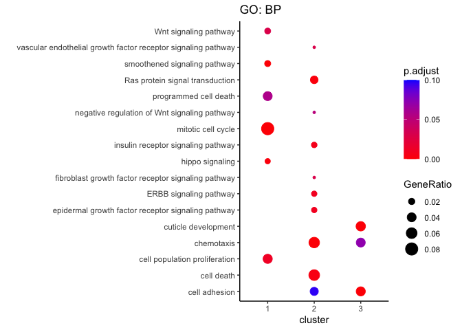
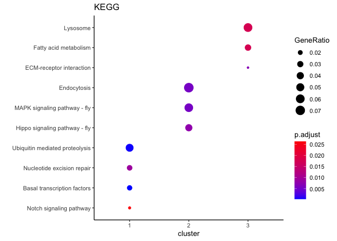

# 04_compile
Qian Hui TAN
2023-09-19

- [<span class="toc-section-number">1</span> 04_compile](#compile)
  - [<span class="toc-section-number">1.1</span> Read in
    files](#read-in-files)
- [<span class="toc-section-number">2</span> GO plot](#go-plot)
  - [<span class="toc-section-number">2.1</span> KEGG](#kegg)

# 04_compile

``` r
suppressPackageStartupMessages({
  library(tidyverse)
})


## If the output directory doesn't exist, create it
if(!dir.exists("output/04_compile")){
  dir.create("output/04_compile")
}
```

    Warning in dir.create("output/04_compile"): cannot create dir
    'output/04_compile', reason 'No such file or directory'

``` r
output_dir <- "output/04_compile/"

knitr::opts_chunk$set(#fig.width=12, fig.height=8, 
                      fig.path='../figures/04_compile/',
                      dev=c("png"))
```

## Read in files

``` r
df_go <- read.csv("../output/03_clust/go_tables.csv")
df_kegg <- read.csv("../output/03_clust/kegg_tables.csv")
```

``` r
df_go$cluster = factor(df_go$cluster, levels = c(1, 2, 3))
df_go$GeneRatio = DOSE::parse_ratio(df_go$GeneRatio)
```

``` r
df_go %>% 
  arrange(cluster, GeneRatio) 
```

|   X | Description                                                   | GeneRatio |  p.adjust | geneID                                                                                                                                                                                                                                                                                                                                                                                                                                                                                                                                                                                                                                                                                                                                                                                                                                                                                                                                                                                                                                                                                                                                                                                                                                                                                                                                                                                                                        | cluster |
|----:|:--------------------------------------------------------------|----------:|----------:|:------------------------------------------------------------------------------------------------------------------------------------------------------------------------------------------------------------------------------------------------------------------------------------------------------------------------------------------------------------------------------------------------------------------------------------------------------------------------------------------------------------------------------------------------------------------------------------------------------------------------------------------------------------------------------------------------------------------------------------------------------------------------------------------------------------------------------------------------------------------------------------------------------------------------------------------------------------------------------------------------------------------------------------------------------------------------------------------------------------------------------------------------------------------------------------------------------------------------------------------------------------------------------------------------------------------------------------------------------------------------------------------------------------------------------|:--------|
|   3 | hippo signaling                                               | 0.0149601 | 0.0011527 | Pka-C1/l(2)gl/dco/sti/Su(dx)/tor/mts/Rap1/Rox8/pll/msn/CkIalpha/Cul1/RtGEF/14-3-3epsilon/lig/Mekk1/SkpA/Tsc1/CG7028/Smurf/pod1/Usp7/Tao/Pez/Fgop2/Dlg5/Git/Magi/Rae1/Herc4/mats/Rassf/Slmap/Prosap/mnb/Pp2A-29B/hpo/lic/aPKC/Sik3/Src64B/Patronin/wap/elgi                                                                                                                                                                                                                                                                                                                                                                                                                                                                                                                                                                                                                                                                                                                                                                                                                                                                                                                                                                                                                                                                                                                                                                    | 1       |
|   5 | Wnt signaling pathway                                         | 0.0179521 | 0.0300275 | arm/dsh/flw/gro/dco/hyd/Pp1alpha-96A/Pp1-87B/mts/tws/por/gig/Eip63E/Ssdp/nmo/Rho1/Vps26/CkIalpha/Cul1/Usp47/spen/CtBP/SkpA/Roc1a/Cdc16/Axn/Apc2/Tnks/botv/Nulp1/sotv/Nek2/CycY/Gint3/Vps35/wls/Rnf146/CG11523/hyx/RanBP3/lgs/rept/pont/Prosap/dlp/pygo/tum/gish/hpo/lic/nej/osa/ttv/RpS12                                                                                                                                                                                                                                                                                                                                                                                                                                                                                                                                                                                                                                                                                                                                                                                                                                                                                                                                                                                                                                                                                                                                     | 1       |
|   2 | smoothened signaling pathway                                  | 0.0186170 | 0.0000038 | bam/bur/Pka-C1/cos/flw/fu/Gbeta13F/dco/Pp1-13C/Pp1alpha-96A/smo/Su(dx)/Su(var)2-10/mts/Rap1/tws/Su(fu)/lwr/Gug/eff/Uch-L5/CkIalpha/Ubc4/Cul1/HDAC1/Pp4-19C/Tnpo/Roc1a/par-6/wdb/botv/Ulp1/Smurf/disp/sotv/PPP4R2r/Usp7/Hrs/Nedd8/Herc4/UbcE2M/hyx/krz/dlp/gish/Nedd4/cno/Pka-R1/Pp2A-29B/Gprk1/pic/nej/aPKC/Uba3/smt3/ttv                                                                                                                                                                                                                                                                                                                                                                                                                                                                                                                                                                                                                                                                                                                                                                                                                                                                                                                                                                                                                                                                                                     | 1       |
|   6 | programmed cell death                                         | 0.0405585 | 0.0581967 | arm/Cam/Pka-C1/cos/DNaseII/EcR/l(2)gl/dco/mod(mdg4)/Ras85D/sesB/shi/smo/Su(var)205/sws/tub/hdc/CycE/pll/Dcp-1/Sep1/ctp/Dp/BRWD3/pnut/Cdk5/mof/Cul1/Dref/crq/RpL14/lok/Drice/Cbl/Pdk1/Idgf2/Nup154/Vps25/qkr58E-3/Mekk1/Drep1/SkpA/HDAC3/Tip60/CG14812/msk/Tak1/Dronc/Drep4/Drep2/cathD/CG13373/Coa8/Pink1/Atg5/Atg101/Tao/Naa20A/CG4238/alpha4GT1/Daxx/Mabi/Nf-YB/Mcm10/DUBAI/Ptp52F/Dcr-2/nopo/Atg7/zda/RYBP/sigmar/Usp5/l(3)psg2/CG7546/Atg18a/BI-1/Srrm1/PDCD-5/CG9231/MAGE/Lkb1/Prx3/Prx5/Idh3b/PSR/mats/p53/Miro/XNP/Sid/Atg16/Fis1/rept/CG15456/scyl/tefu/Naam/Tengl3/CG32176/CG32202/vito/CG32579/Atg8a/snama/out/Tango9/Utx/scny/Atg1/hpo/Trf2/aPKC/Ire1/norpA/Cdk7/ebi/Det/Fhos/Pak/lola/Psn                                                                                                                                                                                                                                                                                                                                                                                                                                                                                                                                                                                                                                                                                                                         | 1       |
|   4 | cell population proliferation                                 | 0.0425532 | 0.0117183 | bam/baz/brm/cad/CycA/CycB/EcR/Galphai/Gbeta13F/hb/l(2)gl/l(3)mbt/msl-3/mor/mud/Myb/polo/Ras85D/rl/tub/Cdk1/mts/hop/enc/tws/gig/Rox8/brat/Rac1/Cdc42/CycE/pll/lwr/CG10939/DCTN3-p24/Pfdn2/Cdc37/Snr1/alien/Rho1/RpS21/Dref/Lis-1/HDAC1/pgc/Stat92E/Atu/Cbl/dom/Idgf2/Nup154/Vps25/dlt/flfl/Bap60/Roc1a/HDAC3/par-6/Tsc1/Dronc/Apc2/drosha/CSN5/CSN3/CSN1b/ana2/ric8a/heix/hfp/Lnk/CG5033/CSN7/Pdcd4/CG9123/DENR/Pez/Mnn1/Ing5/CG10336/Nedd8/Mlf/Ntan1/Rae1/enok/Slik/RIOK1/Cep135/Smn/Zif/MAGE/Lkb1/smp-30/Ns1/CG7044/mats/p53/Nup358/Cul5/pasha/conu/rept/pont/pins/Prosap/CG17059/ago/key/dome/vito/snama/Nedd4/cno/zld/Tango9/Utx/hpo/Axud1/mi/aPKC/osa/Tl/wcd/AGO1/scrib/Sgt1/Doa/Ptp61F/Syx7                                                                                                                                                                                                                                                                                                                                                                                                                                                                                                                                                                                                                                                                                                                              | 1       |
|   1 | mitotic cell cycle                                            | 0.0811170 | 0.0000000 | Act5C/bru1/asp/aub/aurA/awd/ben/brm/chic/csw/CycA/CycB/dsh/dup/fzy/Hmr/Grip91/dlg1/eIF4A/l(2)gl/l(3)mbt/sti/Rcc1/Map205/twe/mor/mr/mud/mus101/mus304/Myb/ncd/pim/plu/polo/PpV/pum/rl/shi/smo/spn-E/sub/Su(var)205/thr/alphaTub84B/alphaTub84D/Pp1-87B/Cdk1/mts/Klp61F/Klp67A/shtd/B52/wapl/Su(H)/RpII15/tws/Eip63E/PCNA/PpD3/Dsor1/CycD/Arf79F/CycE/dia/fbl/eff/Mad/tsr/Wee1/Arp53D/ctp/Dp/Syx1A/l(2)dtl/pnut/Mtor/Cdk5/Rho1/prod/noi/glu/CycB3/Lis-1/PTP-ER/lok/14-3-3epsilon/Ran/mre11/asun/Pkn/chb/DCTN2-p50/Pp4-19C/Orc6/san/aurB/Dlc90F/Bub3/SkpA/Cdc16/Rad17/Mcm6/JTBR/dgt4/Rok/Mad1/Nipped-B/Hus1-like/Su(var)2-HP2/Grip75/Grip163/Apc2/Eb1/Kmn1/RecQ5/ana2/SMC2/ball/Pol31/ric8a/CG3530/CHORD/Aos1/eIF3g1/Nek2/Aladin/Psf3/PPP4R2r/Klp10A/Aven/Sap30/CG8188/CG8173/Rab35/Wdr62/Fign/Spindly/Mnn1/Nuf2/CG5181/borr/CG6443/BuGZ/CG10336/Grip71/Mcm10/geminin/CG15237/mms4/dgt5/mars/nopo/dgt3/Rae1/Slik/JMJD5/Psf1/Mfap1/Sse/mad2/Cdc6/nudE/Syx13/Cep135/Skp2/PEK/Cks85A/Tctp/Lkb1/Rrp6/Mau2/cal1/CG13599/spas/Dis3/Mink/Sld5/CG5003/dgt6/CycG/CG17493/pont/pins/p115/Kat60/cana/MED22/mus81/ago/Capr/Chro/tefu/Haspin/Rif1/CG30291/Prp38/Nnf1b/Tap42/Claspin/APC4/Synd/CG34025/Zwilch/endos/ALiX/tum/alph/DCTN6-p27/Spc25/alphaSnap/lmgA/cno/pzg/zld/bora/pds5/gwl/mei-38/vtd/Incenp/grp/scra/nej/mi/SmD2/Xpd/aPKC/CG43295/Patronin/Cdk7/l(3)72Ab/BubR1/Caf1-55/Det/smt3/Smr/Sf3a1/sau/Ptp61F/rump/Tlk/Top2/betaTub56D | 1       |
|  13 | fibroblast growth factor receptor signaling pathway           | 0.0094192 | 0.0300193 | aop/Sos/pnt/Ptp4E/bnl/sty/Shc/stumps/CG13398/ths/grh/btl                                                                                                                                                                                                                                                                                                                                                                                                                                                                                                                                                                                                                                                                                                                                                                                                                                                                                                                                                                                                                                                                                                                                                                                                                                                                                                                                                                      | 2       |
|  14 | vascular endothelial growth factor receptor signaling pathway | 0.0094192 | 0.0300193 | aop/Sos/Ptp4E/hep/Akt1/Shc/mbc/Tor/slpr/Vav/PRAS40/S6k                                                                                                                                                                                                                                                                                                                                                                                                                                                                                                                                                                                                                                                                                                                                                                                                                                                                                                                                                                                                                                                                                                                                                                                                                                                                                                                                                                        | 2       |
|  15 | negative regulation of Wnt signaling pathway                  | 0.0094192 | 0.0518911 | aop/nkd/otk/wts/phyl/Apc/crol/Sin3A/fz4/SoxN/HUWE1/Duba                                                                                                                                                                                                                                                                                                                                                                                                                                                                                                                                                                                                                                                                                                                                                                                                                                                                                                                                                                                                                                                                                                                                                                                                                                                                                                                                                                       | 2       |
|  11 | epidermal growth factor receptor signaling pathway            | 0.0156986 | 0.0093786 | Ama/aop/Sos/pnt/Egfr/ttk/vn/Ptp4E/CanA1/phyl/sty/Shc/edl/rno/Mkp3/Vav/Socs36E/step/tay/hppy                                                                                                                                                                                                                                                                                                                                                                                                                                                                                                                                                                                                                                                                                                                                                                                                                                                                                                                                                                                                                                                                                                                                                                                                                                                                                                                                   | 2       |
|  12 | ERBB signaling pathway                                        | 0.0156986 | 0.0093786 | Ama/aop/Sos/pnt/Egfr/ttk/vn/Ptp4E/CanA1/phyl/sty/Shc/edl/rno/Mkp3/Vav/Socs36E/step/tay/hppy                                                                                                                                                                                                                                                                                                                                                                                                                                                                                                                                                                                                                                                                                                                                                                                                                                                                                                                                                                                                                                                                                                                                                                                                                                                                                                                                   | 2       |
|  10 | insulin receptor signaling pathway                            | 0.0164835 | 0.0069532 | fkh/Hsp83/ImpL2/Akt1/Pi3K21B/Tor/Fmr1/raptor/rictor/Sin1/Mkp3/srl/HDAC4/step/Mob4/Myc/Lpin/Ns3/PRAS40/S6k/InR                                                                                                                                                                                                                                                                                                                                                                                                                                                                                                                                                                                                                                                                                                                                                                                                                                                                                                                                                                                                                                                                                                                                                                                                                                                                                                                 | 2       |
|   8 | Ras protein signal transduction                               | 0.0290424 | 0.0013242 | ca/Sos/sty/betaggt-I/Nf1/mbc/RhoGEF2/CG3630/Sbf/RhoGAP1A/siz/Rich/Sec71/CG4853/pns/RhoGAP68F/Als2/CG7369/Rab23/RhoGAP92B/CG6607/Lztr1/Efa6/RhoU/CG34393/step/C3G/Mob4/Ziz/raskol/Rabex-5/CG43658/garz/PsGEF/Cdep/PDZ-GEF/cv-c                                                                                                                                                                                                                                                                                                                                                                                                                                                                                                                                                                                                                                                                                                                                                                                                                                                                                                                                                                                                                                                                                                                                                                                                 | 2       |
|  16 | cell adhesion                                                 | 0.0329670 | 0.0967379 | Ama/aop/bib/ft/robo2/peb/rst/Nrt/Ten-m/hh/otk/robo1/trn/fra/Hem/Ret/glec/crol/sns/stan/seq/hbs/Grip/Megf8/beat-IIIc/wash/FAM21/p130CAS/NijA/Strump/Fit2/Cad74A/boi/SCAR/Invadolysin/RanBPM/Sec23/Sec24CD/sli/CG45263/Ten-a/ds                                                                                                                                                                                                                                                                                                                                                                                                                                                                                                                                                                                                                                                                                                                                                                                                                                                                                                                                                                                                                                                                                                                                                                                                 | 2       |
|   7 | chemotaxis                                                    | 0.0572998 | 0.0000035 | eya/D/dpp/en/E(z)/grn/Sos/robo2/sens/peb/ras/ptc/Nrt/Ptp4E/Ten-m/pros/zfh1/hh/otk/robo1/comm/hep/trn/sqz/Sema1a/babo/fra/shot/gcm/mirr/Shc/drl/Vang/fz2/Tor/stan/msps/Rich/Fmr1/nerfin-1/SoxN/raptor/Nf-YC/hiw/erm/beat-IIIc/CdGAPr/ckn/unc-5/Toll-7/Lrt/Toll-6/Vav/boi/Alk/wun2/SCAR/Liprin-alpha/Mical/jeb/vvl/psidin/wb/Dbx/mid/hts/sli/ab/Ten-a/S6k/InR/Sac1/Sema5c                                                                                                                                                                                                                                                                                                                                                                                                                                                                                                                                                                                                                                                                                                                                                                                                                                                                                                                                                                                                                                                       | 2       |
|   9 | cell death                                                    | 0.0596546 | 0.0031562 | abd-A/Abd-B/eya/cn/ec/en/fkh/ft/kto/sens/Met/pnt/rst/Egfr/ptc/Ubi-p63E/hid/sc/ex/Itpr/hep/Akt1/wts/klu/Pi3K59F/Apc/Rbf/pcm/Tor/syd/brk/E2f2/TBPH/drpr/Fmr1/raptor/CG14441/HUWE1/AIF/CG4230/CYLD/CG17019/SCCRO3/Atg9/CG10914/yki/NijA/Atg17/FBXO11/trus/Dcr-1/CG15547/wun2/Atg2/CG17230/Tre1/Drak/sav/Tab2/spin/psidin/Clbn/bun/Diap1/Vps15/Ubr3/kibra/Sarm/Myc/bel/hppy/Atg6/rdx/Bruce/Duox/wg                                                                                                                                                                                                                                                                                                                                                                                                                                                                                                                                                                                                                                                                                                                                                                                                                                                                                                                                                                                                                                | 2       |
|  19 | chemotaxis                                                    | 0.0401606 | 0.0719364 | bsk/Fas2/Fas3/FER/Glt/if/Lim3/sas/LanA/pk/sm/tup/ct/Ptp99A/mew/fru/eIF2beta/nvy/dac/Con/Wnt5/Wnt4/tutl/Moe/Tig/beat-Ia/Rac2/cher/tap/CadN/NetA/NetB/Rab6/side/wun/ko/Nrk/Dad/Pka-R2/caps/Cdk5alpha/jbug/bdl/beat-Ic/CG6867/wgn/daw/Oli/Dscam1/Mmp2/Drl-2/Hr51/CG15611/spz5/RhoGEF64C/beat-Vc/beat-Va/beat-Vb/beat-IIb/beat-IIa/beat-VI/DIP-gamma/RhoGAP100F/robo3/CG30456/Unc-115a/Trim9/gogo/beat-IIIb/dpr11/beta-Spec/mmy/Mp/Dscam3/conv/haf/NT1/pdm3/CadN2/Acsl/Hmgcr/dally/dysc/Sema2b/Nrg/CG44153/Dscam2/beat-IIIa/ap/trol                                                                                                                                                                                                                                                                                                                                                                                                                                                                                                                                                                                                                                                                                                                                                                                                                                                                                               | 3       |
|  18 | cell adhesion                                                 | 0.0414993 | 0.0000005 | by/CG17716/Fas2/Fas3/fw/if/Gli/sas/LanA/m/rk/Vinc/mew/aos/Con/Itgbn/cora/tutl/sinu/Tig/beat-Ia/Nrx-IV/RhoL/CadN/nrv2/klg/mspo/Cad96Ca/caps/Flo1/wrapper/Timp/Ndg/SPARC/kirre/bdl/prc/beat-Ic/alpha-Catr/CG9095/bves/Tsp/Nlg2/CG17739/CG15080/CG13506/CG10339/Mmp1/zye/CG7166/NijC/beat-Vc/beat-Va/beat-Vb/Cad88C/Cad89D/beat-IIb/beat-IIa/beat-IV/Cad96Cb/beat-VI/Cad99C/Cals/Pax/mesh/Nlg1/fred/Ccn/beat-IIIb/dyl/Nlg3/Nlg4/beat-VII/rhea/mfas/Dscam3/Cad86C/plx/LanB1/CadN2/nrm/CG43333/tx/Sema2b/Nrg/CG44153/Dscam2/beat-IIIa/Zasp52/LanB2/otk2/tyn/disco-r                                                                                                                                                                                                                                                                                                                                                                                                                                                                                                                                                                                                                                                                                                                                                                                                                                                                | 3       |
|  17 | cuticle development                                           | 0.0446229 | 0.0000000 | amd/Ddc/ect/Gld/kkv/knk/m/Pu/sha/Ser/Ccp84Ag/Ccp84Ad/Ccp84Ac/Ccp84Ab/ple/Cyp4g1/fng/Acp1/pio/Lcp65Ag2/Lcp65Af/Lcp65Ac/Lcp65Ab2/Alas/Cht2/Gasp/Vajk3/Cpr35B/Vajk1/TwdlT/Cpr11A/obst-A/snsl/obst-E/TwdlE/Vajk2/Cpr47Ef/Twdlbeta/Cpr49Ac/Cpr49Ae/Cpr49Ag/Cpr50Cb/Cpr51A/resilin/Cpr56F/Cpr62Bb/Cpr62Bc/Cht7/Cpr64Ab/Cpr64Ad/Cpr65Ea/Cpr65Eb/Cpr65Ec/Cpr66Cb/Cpr67Fa1/Cpr76Bc/Cpr78Cc/TwdlF/TwdlG/Cht5/TwdlW/Cpr92F/TwdlM/TwdlP/TwdlL/TwdlO/TwdlN/TwdlD/TwdlQ/TwdlC/Cpr97Ea/Cpr97Eb/snu/Cpr100A/FASN2/Vajk4/fred/Cpr66D/Cpr65Av/TwdlY/TwdlX/dpy/Cpr31A/Idgf5/Sec61alpha/Cpr47Eg/Lcp65Ag3/puc/Tb/CG34461/pot/mmy/drd/serp/rtv/verm/dsx-c73A/sdt/f/stw                                                                                                                                                                                                                                                                                                                                                                                                                                                                                                                                                                                                                                                                                                                                                                              | 3       |

# GO plot

``` r
ggplot(df_go, aes(x = cluster, y = Description, 
                  size = GeneRatio, color = p.adjust)) +
  geom_point() +
  scale_color_gradient(low = "red", high = "blue", limits = c(0, 0.1), 
                       breaks = c(seq(0, 0.1, 0.05))) +
  theme_classic() +
  labs(title = "GO: BP",
       y = "")
```



- need to figure out how to reorder this

## KEGG

``` r
str(df_kegg)
```

    'data.frame':   10 obs. of  6 variables:
     $ X          : chr  "dme03022" "dme04120" "dme03420" "dme04330" ...
     $ Description: chr  "Basal transcription factors" "Ubiquitin mediated proteolysis" "Nucleotide excision repair" "Notch signaling pathway" ...
     $ GeneRatio  : chr  "27/1185" "57/1185" "29/1185" "16/1185" ...
     $ p.adjust   : num  0.00033 0.000478 0.009096 0.026302 0.005413 ...
     $ geneID     : chr  "e(y)1/hay/TfIIB/Taf4/TfIIFalpha/Trf/Taf1/Taf5/Taf6/TfIIFbeta/TfIIA-L/Taf12/Taf11/Taf2/TfIIA-S/Taf8/Taf7/Taf10b/"| __truncated__ "ben/fzy/hyd/mr/sina/Su(dx)/Su(var)2-10/RpL40/RpS27A/shtd/lwr/eff/Ubc2/Ubc4/Cul1/Cbl/EloB/CG2924/SkpA/Roc1a/Cdc1"| __truncated__ "hay/mei-9/RpII215/Xpc/RpII15/Gnf1/PCNA/Roc1a/RpII33/Rad23/Pol31/Ercc1/RfC38/Tfb4/RfC3/Rpb11/Rpb5/Ssl1/Chrac-14/"| __truncated__ "dsh/gro/H/Su(H)/Bx42/HDAC1/spen/Gcn5/CtBP/Atx-1/aph-1/CG6843/Nct/pen-2/nej/Psn" ...
     $ cluster    : int  1 1 1 1 2 2 2 3 3 3

``` r
df_kegg$GeneRatio = DOSE::parse_ratio(df_kegg$GeneRatio)


df_kegg$cluster = factor(df_kegg$cluster)

df_keggplot <- df_kegg %>% 
  arrange(cluster, GeneRatio)


df_keggplot$Description = factor(df_keggplot$Description, levels = df_keggplot$Description)
```

``` r
ggplot(df_keggplot, aes(x = cluster, y = Description, 
                    size = GeneRatio, color = p.adjust)) +
  geom_point() +
  scale_color_gradient(low = "blue", high = "red") +
  theme_classic() +
  labs(title = "KEGG", 
       y = "")
```



``` r
sessionInfo()
```

    R version 4.2.2 (2022-10-31)
    Platform: aarch64-apple-darwin20 (64-bit)
    Running under: macOS Ventura 13.1

    Matrix products: default
    BLAS:   /Library/Frameworks/R.framework/Versions/4.2-arm64/Resources/lib/libRblas.0.dylib
    LAPACK: /Library/Frameworks/R.framework/Versions/4.2-arm64/Resources/lib/libRlapack.dylib

    locale:
    [1] en_US.UTF-8/en_US.UTF-8/en_US.UTF-8/C/en_US.UTF-8/en_US.UTF-8

    attached base packages:
    [1] stats     graphics  grDevices utils     datasets  methods   base     

    other attached packages:
    [1] forcats_1.0.0   stringr_1.5.0   dplyr_1.1.3     purrr_1.0.1    
    [5] readr_2.1.3     tidyr_1.3.0     tibble_3.2.1    ggplot2_3.4.2  
    [9] tidyverse_1.3.2

    loaded via a namespace (and not attached):
     [1] bitops_1.0-7           fs_1.6.2               lubridate_1.9.1       
     [4] bit64_4.0.5            HDO.db_0.99.1          httr_1.4.6            
     [7] GenomeInfoDb_1.34.9    tools_4.2.2            backports_1.4.1       
    [10] utf8_1.2.3             R6_2.5.1               DBI_1.1.3             
    [13] BiocGenerics_0.44.0    colorspace_2.1-0       withr_2.5.0           
    [16] tidyselect_1.2.0       bit_4.0.5              compiler_4.2.2        
    [19] cli_3.6.1              rvest_1.0.3            Biobase_2.58.0        
    [22] xml2_1.3.5             labeling_0.4.2         scales_1.2.1          
    [25] digest_0.6.33          rmarkdown_2.20         DOSE_3.24.2           
    [28] XVector_0.38.0         pkgconfig_2.0.3        htmltools_0.5.4       
    [31] dbplyr_2.3.3           fastmap_1.1.1          rlang_1.1.1           
    [34] readxl_1.4.1           rstudioapi_0.14        RSQLite_2.3.1         
    [37] farver_2.1.1           generics_0.1.3         jsonlite_1.8.7        
    [40] BiocParallel_1.32.6    GOSemSim_2.24.0        googlesheets4_1.0.1   
    [43] RCurl_1.98-1.12        magrittr_2.0.3         GO.db_3.16.0          
    [46] GenomeInfoDbData_1.2.9 Matrix_1.5-4.1         Rcpp_1.0.11           
    [49] munsell_0.5.0          S4Vectors_0.36.2       fansi_1.0.4           
    [52] lifecycle_1.0.3        stringi_1.7.12         yaml_2.3.7            
    [55] zlibbioc_1.44.0        plyr_1.8.8             qvalue_2.30.0         
    [58] grid_4.2.2             blob_1.2.4             parallel_4.2.2        
    [61] crayon_1.5.2           lattice_0.20-45        splines_4.2.2         
    [64] Biostrings_2.66.0      haven_2.5.1            cowplot_1.1.1         
    [67] hms_1.1.3              KEGGREST_1.38.0        knitr_1.42            
    [70] pillar_1.9.0           fgsea_1.24.0           reshape2_1.4.4        
    [73] codetools_0.2-19       stats4_4.2.2           fastmatch_1.1-3       
    [76] reprex_2.0.2           glue_1.6.2             evaluate_0.20         
    [79] data.table_1.14.8      modelr_0.1.10          png_0.1-8             
    [82] vctrs_0.6.3            tzdb_0.3.0             cellranger_1.1.0      
    [85] gtable_0.3.3           cachem_1.0.8           xfun_0.37             
    [88] broom_1.0.3            googledrive_2.0.0      gargle_1.3.0          
    [91] AnnotationDbi_1.60.2   memoise_2.0.1          IRanges_2.32.0        
    [94] timechange_0.2.0      
