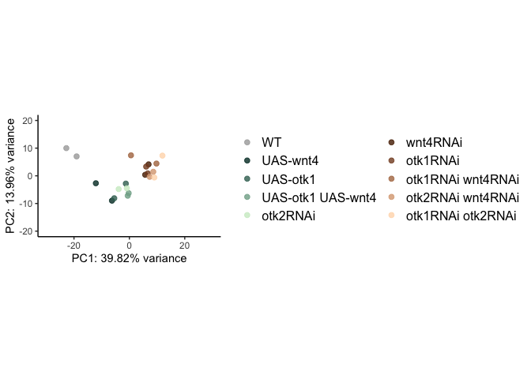
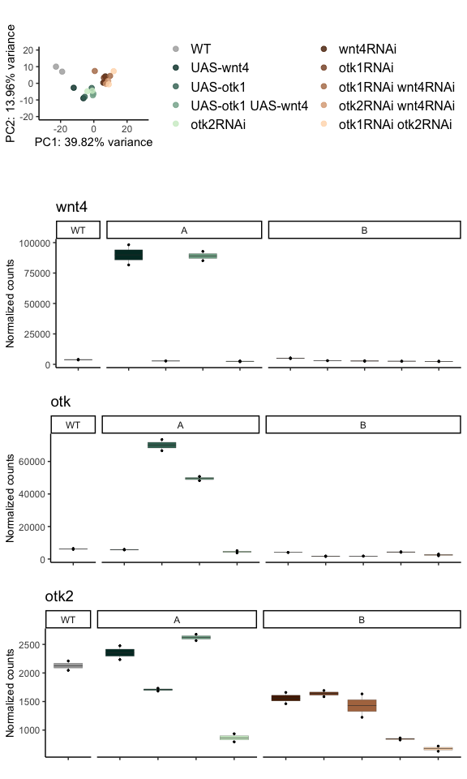

# 04_compile
Qian Hui TAN
2023-10-05

- [<span class="toc-section-number">1</span> 04_compile](#compile)
- [<span class="toc-section-number">2</span> Setup](#setup)
  - [<span class="toc-section-number">2.1</span> Load
    libraries](#load-libraries)
- [<span class="toc-section-number">3</span> Main paper
  plots](#main-paper-plots)
  - [<span class="toc-section-number">3.1</span> Heatmap](#heatmap)
  - [<span class="toc-section-number">3.2</span> GO](#go)
    - [<span class="toc-section-number">3.2.1</span> Read in
      terms](#read-in-terms)
    - [<span class="toc-section-number">3.2.2</span> Pick
      terms](#pick-terms)
    - [<span class="toc-section-number">3.2.3</span> Plot](#plot)
  - [<span class="toc-section-number">3.3</span> KEGG](#kegg)
    - [<span class="toc-section-number">3.3.1</span> Plot](#plot-1)
- [<span class="toc-section-number">4</span> Supplementary
  data](#supplementary-data)
  - [<span class="toc-section-number">4.1</span> wnt4, otk1, otk2
    counts](#wnt4-otk1-otk2-counts)
  - [<span class="toc-section-number">4.2</span> PCA](#pca)
    - [<span class="toc-section-number">4.2.1</span> PCA
      plot](#pca-plot)
  - [<span class="toc-section-number">4.3</span> zscore
    boxplots](#zscore-boxplots)
    - [<span class="toc-section-number">4.3.1</span> Cluster
      boxplots](#cluster-boxplots)
    - [<span class="toc-section-number">4.3.2</span> Cluster boxplots,
      no legend](#cluster-boxplots-no-legend)
  - [<span class="toc-section-number">4.4</span> Representative gene
    plots](#representative-gene-plots)
    - [<span class="toc-section-number">4.4.1</span> Cluster
      1](#cluster-1-2)
    - [<span class="toc-section-number">4.4.2</span> Cluster
      2](#cluster-2-2)
    - [<span class="toc-section-number">4.4.3</span> Cluster
      3](#cluster-3-2)
- [<span class="toc-section-number">5</span> Putting it
  together](#putting-it-together)
  - [<span class="toc-section-number">5.1</span> Main
    figure](#main-figure)
  - [<span class="toc-section-number">5.2</span> Supplementary Figure
    1](#supplementary-figure-1)
  - [<span class="toc-section-number">5.3</span> Supplementary Figure
    2](#supplementary-figure-2)
- [<span class="toc-section-number">6</span>
  sessionInfo()](#sessioninfo)

# 04_compile

In this notebook, we compile all the figures required for our RNA seq
data.

# Setup

## Load libraries

``` r
suppressPackageStartupMessages({
  library(tidyverse)
  library(pheatmap)
  library(grid)
  library(gridExtra)
  library(DESeq2)
})
```

``` r
## If the output directory doesn't exist, create it
if(!dir.exists("../output/04_compile")){
  dir.create("../output/04_compile")
}

output_dir <- "../output/04_compile/"

knitr::opts_chunk$set(#fig.width=12, fig.height=8, 
                      fig.path='../figures/04_compile/',
                      dev=c("png"))

source("../../scripts/R/go_kegg_functions.R")
```

``` r
# Setup

# Define colors
col_colors <- c("darkgrey", #Ctrls
                '#00362d', '#3a6f60', '#80ac95', '#ceebcb', #OEs
                '#552200', '#834a25', '#b0764f', '#daa680', '#ffdab8' #KOs
                )

# Define order
condition_full_order <- c("WT", 
                          "UAS-wnt4", "UAS-otk1", "UAS-otk1, UAS-wnt4", "otk2RNAi", 
                          "wnt4RNAi", "otk1RNAi", "otk1RNAi wnt4RNAi", "otk2RNAi wnt4RNAi",
                          "otk1RNAi otk2RNAi")
```

``` r
# Read in files

# Heatmap
heatmap <- readRDS("../output/03_clust/heatmap_noleg.RDS")


# GO, KEGG

# PCA
pca <- readRDS("../output/01_QC/pca_rmrna.RDS")
rld_filt <- readRDS("../output/01_QC/rld_filt.RDS")

# Zscore boxplots, representatitve gene plots
dds <- readRDS("../output/03_clust/dds_filt.RDS")
rld_z <- readRDS("../output/03_clust/rld_z.RDS")
kmeans_cl <- readRDS("../output/03_clust/kmeans_cl.RDS")
```

# Main paper plots

## Heatmap

``` r
p1 <- heatmap$gtable

plot(p1)
```


## GO

### Read in terms

``` r
c1_go <- read.csv("../output/03_clust/k3_c1_ego.csv")
c2_go <- read.csv("../output/03_clust/k3_c2_ego.csv")
c3_go <- read.csv("../output/03_clust/k3_c3_ego.csv")

c1_go$cluster = "I"
c2_go$cluster = "II"
c3_go$cluster = "III"

df_go_all <- rbind(c1_go, c2_go, c3_go)
df_go_all$GeneRatio = DOSE::parse_ratio(df_go_all$GeneRatio)
```

``` r
df_go_all<- df_go_all %>% 
  dplyr::select(Description, GeneRatio, p.adjust, Count, cluster, geneID) %>%
  group_by(cluster) %>% 
  arrange(desc(GeneRatio))

# export
write.csv(df_go_all, file = paste0(output_dir, "go_all.csv"), 
          row.names = FALSE)
```

### Pick terms

``` r
findterm <- function(term, df_go_all){
  df_subset <- df_go_all[grep(term, df_go_all$Description), ] %>% 
  group_by(cluster) %>% 
  arrange(cluster, desc(GeneRatio))
  
  return(df_subset)
}
```

``` r
# don't print this chunk during knitting - it's very long
findterm("axis spec", df_go_all)
findterm("[Hh]ippo", df_go_all)
findterm("[Ww]nt", df_go_all)
findterm("mitot|prolif", df_go_all)
findterm("pathway", df_go_all)
findterm("apop|senes|death", df_go_all)
findterm("adhes", df_go_all)
findterm("migrat|taxi", df_go_all)
findterm("junction", df_go_all)
```

:::

### Plot

``` r
terms_of_interest <- c(
  # cluster I
  "canonical Wnt signaling pathway",
  "axis specification",
  "negative regulation of mitotic cell cycle",
  "smoothened signaling pathway",
  # cluster II
  "negative regulation of Wnt signaling pathway",
  "insulin receptor signaling pathway", 
  "epidermal growth factor receptor signaling pathway",
  "ERBB signaling pathway", 
  "fibroblast growth factor receptor signaling pathway",
  "vascular endothelial growth factor receptor signaling pathway",
  # cluster III
  "neuron projection guidance",
  "cuticle development",
  "tight junction assembly", 
  "apical junction assembly",
  "septate junction assembly",
  "chemotaxis")
```

``` r
df_go_renamed <- df_go_all %>%
  dplyr::filter(Description %in% terms_of_interest) %>% 
  mutate(Description = str_to_sentence(Description)) %>% 
  mutate(Description = case_when(
    Description == "Smoothened signaling pathway" ~ "Hh signaling",
    Description == "Epidermal growth factor receptor signaling pathway" ~ "EGF receptor signaling",
    Description == "Canonical wnt signaling pathway" ~ "Canonical Wnt signaling",
    Description == "Erbb signaling pathway" ~ "ERBB signaling pathway",
    Description == "Fibroblast growth factor receptor signaling pathway" ~ "FGF receptor signaling",
    Description == "Vascular endothelial growth factor receptor signaling pathway" ~ "VEGF receptor signaling",
    Description == "Negative regulation of wnt signaling pathway" ~ "Negative regulation of Wnt signaling pathway",
    TRUE ~ as.character(Description)
  ))
```

``` r
go_plot <- df_go_renamed %>% 
  mutate(cluster = factor(cluster, levels = c("I", "II", "III"))) %>% 
  group_by(cluster) %>% 
  arrange(desc(GeneRatio)) %>% 
  mutate(Description = factor(Description, levels = Description)) %>% 
  ggplot(aes(x = cluster, y = Description)) +
  geom_point(aes(colour = p.adjust, size = GeneRatio)) +
  labs(title = "GO:BP", x = "Cluster", y = NULL) +
  scale_color_continuous(low="red", high="blue", 
                         guide = guide_colorbar(reverse=TRUE),
                         limits = c(0, 0.1), breaks = c(seq(0, 0.1, 0.05))) + 
  scale_y_discrete(labels = function(x) str_wrap(x, width = 30),
                   limits=rev) +
  guides(colour = guide_colorbar(title = "p.adjust", reverse = TRUE),
         size = guide_legend(title = "Gene Ratio")) +
  theme_bw() +
  theme(axis.text.x = element_text(size = 12), 
        axis.text.y = element_text(size = 12),
        legend.title = element_text(size = 12),
        legend.text = element_text(size = 12),
        title = element_blank()) 

go_plot
```


## KEGG

<div class="panel-tabset">

### Reading in data

``` r
c1_kegg <- read.csv("../output/03_clust/k3_c1_ekegg.csv")
c2_kegg <- read.csv("../output/03_clust/k3_c2_ekegg.csv")
c3_kegg <- read.csv("../output/03_clust/k3_c3_ekegg.csv")

c1_kegg$cluster = "I"
c2_kegg$cluster = "II"
c3_kegg$cluster = "III"

df_kegg <- rbind(c1_kegg, c2_kegg, c3_kegg)
df_kegg$GeneRatio = DOSE::parse_ratio(df_kegg$GeneRatio)

df_kegg$cluster = factor(df_kegg$cluster, levels = c("I", "II", "III"))

# Remove the trailing Drosophila melanogaster label from Description
df_kegg$Description = gsub(" - Drosophila melanogaster (fruit fly)", "", 
                           df_kegg$Description,
                           fixed = TRUE)

# export
write.csv(df_kegg, file = paste0(output_dir, "kegg_all.csv"), 
          row.names = FALSE)
```

### All KEGG terms

``` r
df_kegg
```

| ID       | Description                                  | GeneRatio | BgRatio  |    pvalue |  p.adjust |    qvalue | geneID                                                                                                                                                                                                                                                                                                                                                                                                                                                                                                        | Count | cluster |
|:---------|:---------------------------------------------|----------:|:---------|----------:|----------:|----------:|:--------------------------------------------------------------------------------------------------------------------------------------------------------------------------------------------------------------------------------------------------------------------------------------------------------------------------------------------------------------------------------------------------------------------------------------------------------------------------------------------------------------|------:|:--------|
| dme04144 | Endocytosis                                  | 0.0722611 | 125/3488 | 0.0000676 | 0.0049860 | 0.0045697 | Hsp68/Egfr/babo/Hsp70Ba/Hsp70Bc/Past1/sktl/WASp/siz/Sara/Rip11/Sec71/CG8243/wash/FAM21/Vps20/Eps-15/Strump/Arpc3A/Usp8/Asap/CG31064/Efa6/Hsp70Bbb/step/Rbsn-5/AP-2mu/garz/AP-2alpha/InR/btl                                                                                                                                                                                                                                                                                                                   |    31 | I       |
| dme04013 | MAPK signaling pathway - fly                 | 0.0582751 | 93/3488  | 0.0000860 | 0.0049860 | 0.0045697 | aop/dpp/Jra/Sos/peb/pnt/raw/Egfr/ttk/vn/hid/pros/hep/Mef2/phyl/Ask1/sty/Shark/Shc/edl/p38b/slpr/CYLD/Tab2/Duox                                                                                                                                                                                                                                                                                                                                                                                                |    25 | I       |
| dme04391 | Hippo signaling pathway - fly                | 0.0396270 | 56/3488  | 0.0002459 | 0.0074585 | 0.0068359 | fj/ft/hth/tsh/vn/ex/wts/jub/yki/sav/Patj/crb/d/kibra/Myc/wg/ds                                                                                                                                                                                                                                                                                                                                                                                                                                                |    17 | I       |
| dme04392 | Hippo signaling pathway - multiple species   | 0.0186480 | 16/3488  | 0.0002572 | 0.0074585 | 0.0068359 | ft/ex/wts/jub/yki/sav/kibra/ds                                                                                                                                                                                                                                                                                                                                                                                                                                                                                |     8 | I       |
| dme04350 | TGF-beta signaling pathway                   | 0.0303030 | 47/3488  | 0.0033257 | 0.0703918 | 0.0645152 | dpp/emc/sog/babo/Rbf/Sin3A/gbb/E2f2/Sara/vis/achi/Myc/S6k                                                                                                                                                                                                                                                                                                                                                                                                                                                     |    13 | I       |
| dme00970 | Aminoacyl-tRNA biosynthesis                  | 0.0372960 | 64/3488  | 0.0036410 | 0.0703918 | 0.0645152 | AspRS/GluProRS/TrpRS/SerRS-m/ValRS/LeuRS-m/AlaRS-m/alpha-PheRS/Pstk/SerRS/MetRS/ValRS-m/TrpRS-m/beta-PheRS/PheRS-m/LeuRS                                                                                                                                                                                                                                                                                                                                                                                      |    16 | I       |
| dme03013 | Nucleocytoplasmic transport                  | 0.0591216 | 99/3488  | 0.0000000 | 0.0000000 | 0.0000000 | mago/sbr/RanGAP/lwr/Nup214/Ref1/Mtor/Hel25E/Ran/emb/Nup154/Cse1/Cbp80/Cbp20/Bin1/Dbp80/Kap-alpha1/Tnpo/mbo/msk/Kap-alpha3/Nup93-1/Nxt1/Upf2/Aladin/Nup35/Elys/Nup205/tho2/Tnpo-SR/Nup50/Gle1/tsu/Phax/Nup54/Nup62/Rae1/Pym/Upf3/thoc5/thoc7/thoc6/Srrm1/Hpr1/CG7483/RnpS1/Pnn/Ranbp9/CG14712/Nup93-2/Nup133/Nup98-96/Ndc1/Nup37/Nup358/CG18787/Arts/Apl/Ranbp16/Nup153/Karybeta3/Snup/CG42304/cdm/Nup160/Acn/Nxf3/smt3/ebo/Gp210                                                                              |    70 | II      |
| dme03040 | Spliceosome                                  | 0.0684122 | 141/3488 | 0.0000000 | 0.0000003 | 0.0000003 | crn/SmF/Hrb98DE/l(1)10Bb/mago/snf/B52/Bx42/U2af50/Ref1/Hel25E/noi/Spx/U2af38/ytr/Cbp80/Cbp20/CG2685/l(1)G0007/Prp18/CG4119/x16/hfp/Tango4/CG1622/CG6227/Usp39/Sf3b1/tho2/CG3542/Sf3b2/Phf5a/CG6686/CG10333/Dhx15/tsu/CG12343/Prp8/CG9346/Cypl/Sf3b3/CG2021/CG11586/CG6610/Sf3b6/CG6418/CG10418/Sf3a2/Prp31/U4-U6-60K/Prp3/CG14641/Hpr1/CG7483/CG6015/PQBP1/BCAS2/CG15525/CG17454/c12.1/Sf3b5/Prp38/LSm3/Spf45/pea/LSm7/Prp19/SmD2/SmE/SNRPG/snRNP-U1-C/scaf6/SmD1/SmB/Acn/l(3)72Ab/Cdc5/Sf3a1/HnRNP-K/SF2/caz |    81 | II      |
| dme03082 | ATP-dependent chromatin remodeling           | 0.0422297 | 81/3488  | 0.0000002 | 0.0000085 | 0.0000080 | Act5C/brm/E(bx)/E(Pc)/His2Av/pho/mor/Uch-L5/Iswi/Snr1/Arp6/HDAC1/dom/Bap60/Tip60/BCL7-like/CG8677/MRG15/CG11970/MBD-like/MTA1-like/Bap111/CDK2AP1/Arp8/CG31917/Gas41/CG7154/YL-1/d4/CG10395/MrgBP/CG18004/DMAP1/Eaf6/Arp5/polybromo/Brd8/rept/pont/CG12659/Bap170/Chrac-16/Chrac-14/CG33695/Ino80/e(y)3/osa/Mi-2/Rcd5/Caf1-55                                                                                                                                                                                 |    50 | II      |
| dme03250 | Viral life cycle - HIV-1                     | 0.0211149 | 33/3488  | 0.0000010 | 0.0000290 | 0.0000271 | BicD/Fur1/Fur2/TH1/Snr1/Su(Tpl)/dod/Cdk9/Ran/Gcn5/emb/ear/NELF-B/fal/spt4/Hrs/Tnpo-SR/Cpsf6/Nup358/Jasper/Spt5/Nup153/ALiX/nej/Vps4                                                                                                                                                                                                                                                                                                                                                                           |    25 | II      |
| dme03022 | Basal transcription factors                  | 0.0228041 | 40/3488  | 0.0000136 | 0.0003221 | 0.0003017 | e(y)1/hay/TfIIB/Taf4/TfIIFalpha/Trf/Taf1/Taf5/Taf6/TfIIFbeta/TfIIA-L/Taf12/Taf11/Taf2/TfIIA-S/Taf8/Taf7/Taf10b/Taf10/Tfb4/Taf13/Ssl1/mrn/Trf2/Xpd/Cdk7/Tfb5                                                                                                                                                                                                                                                                                                                                                   |    27 | II      |
| dme04120 | Ubiquitin mediated proteolysis               | 0.0481419 | 107/3488 | 0.0000234 | 0.0004606 | 0.0004314 | ben/fzy/hyd/mr/sina/Su(dx)/Su(var)2-10/RpL40/RpS27A/shtd/lwr/eff/Ubc2/Ubc4/Cul1/Cbl/EloB/CG2924/SkpA/Roc1a/Cdc16/SkpC/Ubc10/STUB1/Smurf/Uba2/Aos1/UbcE2H/CG8188/CG4502/Cul2/CG15237/CG7220/CG7747/CG3356/Herc4/UbcE2M/Cul6/RhoBTB/Skp2/Cul5/CG2218/sip3/ago/Roc2/APC4/Ube3a/Ubi-p5E/CG33981/lmgA/Nedd4/pic/Prp19/Uba3/Traf6/EloC/Ubc7                                                                                                                                                                         |    57 | II      |
| dme03015 | mRNA surveillance pathway                    | 0.0380068 | 80/3488  | 0.0000290 | 0.0004881 | 0.0004571 | flw/mago/Pp1-13C/Pp1alpha-96A/sbr/su(f)/Pp1-87B/mts/Hrb27C/tws/Ref1/Hel25E/Clp/Cbp80/Cbp20/Bin1/Cpsf160/Dbp80/wdb/CstF64/Cpsf100/Nxt1/Upf2/Wdr82/Gle1/tsu/cbc/Pym/Upf3/Cpsf6/Srrm1/eRF1/Fip1/CG7483/RnpS1/Pnn/Smg6/CstF50/HBS1/Wdr33/Pp2A-29B/Acn/Nxf3/caz/Rnmt                                                                                                                                                                                                                                               |    45 | II      |
| dme03420 | Nucleotide excision repair                   | 0.0244932 | 51/3488  | 0.0006037 | 0.0089049 | 0.0083409 | hay/mei-9/RpII215/Xpc/RpII15/Gnf1/PCNA/Roc1a/RpII33/Rad23/Pol31/Ercc1/RfC38/Tfb4/RfC3/Rpb11/Rpb5/Ssl1/Chrac-14/Rpb7/pic/RfC4/mrn/Xpd/Rpb12/RpII140/Cdk7/Rpb4/Tfb5                                                                                                                                                                                                                                                                                                                                             |    29 | II      |
| dme04330 | Notch signaling pathway                      | 0.0135135 | 25/3488  | 0.0019792 | 0.0259490 | 0.0243055 | dsh/gro/H/Su(H)/Bx42/HDAC1/spen/Gcn5/CtBP/Atx-1/aph-1/CG6843/Nct/pen-2/nej/Psn                                                                                                                                                                                                                                                                                                                                                                                                                                |    16 | II      |
| dme04080 | Neuroactive ligand-receptor interaction      | 0.0669145 | 67/3488  | 0.0000000 | 0.0000000 | 0.0000000 | mAChR-A/alphaTry/5-HT1A/Rdl/5-HT7/GluRIA/TkR99D/Lcch3/betaTry/deltaTry/gammaTry/Nmdar1/epsilonTry/zetaTry/Dop1R1/Try29F/Lgr1/mGluR/AkhR/GABA-B-R2/CCKLR-17D3/GABA-B-R3/CG16957/CCHa2-R/Dh44-R2/CrzR/mAChR-B/lambdaTry/kappaTry/Dh31-R/Nmdar2/Dop2R/GABA-B-R1/5-HT1B/GluRIB/Dop1R2                                                                                                                                                                                                                             |    36 | III     |
| dme01240 | Biosynthesis of cofactors                    | 0.0706320 | 138/3488 | 0.0001420 | 0.0069926 | 0.0048633 | Pu/v/l(3)02640/Alp4/Alas/Ugt35A1/Ugt37C1/Ugt37B1/CG12116/CG4407/Naprt/CG15629/Coq6/Nfs1/Ugt301D1/Alp12/CG8080/Alp6/Alp7/Alp8/CG3803/GC/Alp9/Pbgs/Pmm2/CG7430/Hpd/CG12170/CG2767/Alp5/Ugt317A1/Ugt303A1/Ugt35E2/Ugt37D1/Ugt37C2/sgl/FeCH/Alp1                                                                                                                                                                                                                                                                  |    38 | III     |
| dme00514 | Other types of O-glycan biosynthesis         | 0.0278810 | 38/3488  | 0.0002682 | 0.0069926 | 0.0048633 | rt/fng/tgy/CG3119/CG2975/Pgant2/Pgant5/CG8708/GlcAT-P/Pgant8/Pgant9/CG31915/Pgant4/CG34056/tw                                                                                                                                                                                                                                                                                                                                                                                                                 |    15 | III     |
| dme00600 | Sphingolipid metabolism                      | 0.0241636 | 31/3488  | 0.0003412 | 0.0069926 | 0.0048633 | Gal/Sply/wun/Sk1/laza/CG11438/CG11437/CG11426/CDase/Hexo2/bwa/Gba1b/Ect3                                                                                                                                                                                                                                                                                                                                                                                                                                      |    13 | III     |
| dme04146 | Peroxisome                                   | 0.0501859 | 91/3488  | 0.0003625 | 0.0069926 | 0.0048633 | Cat/Idh/ry/ScpX/Pex5/Mfe2/Pex12/CG9527/CG17597/CG17544/CG1441/ADPS/Pex11/CG8306/CG5065/CG10672/Pex7/CG3961/CG17562/CG17560/CG13827/CG12268/wat/CG12355/CG30427/CG33671/Acsl                                                                                                                                                                                                                                                                                                                                   |    27 | III     |
| dme04512 | ECM-receptor interaction                     | 0.0130112 | 11/3488  | 0.0003746 | 0.0069926 | 0.0048633 | Col4a1/LanA/vkg/CG3168/Tsp/LanB1/LanB2                                                                                                                                                                                                                                                                                                                                                                                                                                                                        |     7 | III     |
| dme00785 | Lipoic acid metabolism                       | 0.0167286 | 18/3488  | 0.0006085 | 0.0097365 | 0.0067716 | ppl/Pdha/CG6415/CG33791/CG7430/CG8199/CG3999/Pdhb/CG1544                                                                                                                                                                                                                                                                                                                                                                                                                                                      |     9 | III     |
| dme04142 | Lysosome                                     | 0.0594796 | 123/3488 | 0.0013796 | 0.0180365 | 0.0125442 | Gal/Tsp42Ee/Tsp42Ed/Tsp42Ea/MFS10/Bace/LManIII/LManV/LManVI/Tsp29Fa/CG5731/CG17134/Vha100-5/CG4847/CG13510/CG11459/Npc2b/CG17283/Vha100-4/Sgsh/CG6656/CG17119/Npc2g/Npc2h/CG13516/Hexo2/CG30269/Gba1b/CG33128/Ect3/CG42565/Npc1b                                                                                                                                                                                                                                                                              |    32 | III     |
| dme00520 | Amino sugar and nucleotide sugar metabolism  | 0.0297398 | 48/3488  | 0.0015004 | 0.0180365 | 0.0125442 | kkv/Pgm1/Cht2/CG17065/Gale/Cht7/Pmm2/Cht5/CG6218/Gfat2/Gnpnat/Hexo2/mmy/sgl/Cht6/Galk                                                                                                                                                                                                                                                                                                                                                                                                                         |    16 | III     |
| dme01212 | Fatty acid metabolism                        | 0.0315985 | 53/3488  | 0.0017416 | 0.0180365 | 0.0125442 | ScpX/Mfe2/CG9527/Hacd1/CG17597/CG17544/ACC/CG18609/CG9149/CG3961/CG3902/CG12170/CG8630/CG9747/CG9743/FASN2/Acsl                                                                                                                                                                                                                                                                                                                                                                                               |    17 | III     |
| dme00512 | Mucin type O-glycan biosynthesis             | 0.0185874 | 24/3488  | 0.0017714 | 0.0180365 | 0.0125442 | tgy/CG3119/CG2975/Pgant2/Pgant5/CG8708/Pgant8/Pgant9/Pgant4/CG34056                                                                                                                                                                                                                                                                                                                                                                                                                                           |    10 | III     |
| dme00730 | Thiamine metabolism                          | 0.0167286 | 21/3488  | 0.0023831 | 0.0204188 | 0.0142010 | Alp4/Nfs1/Alp12/Alp6/Alp7/Alp8/Alp9/Alp5/Alp1                                                                                                                                                                                                                                                                                                                                                                                                                                                                 |     9 | III     |
| dme00830 | Retinol metabolism                           | 0.0223048 | 33/3488  | 0.0025316 | 0.0204188 | 0.0142010 | Adh/Ugt35A1/Ugt37C1/Ugt37B1/CG15629/Ugt301D1/CG10672/Ugt317A1/Ugt303A1/Ugt35E2/Ugt37D1/Ugt37C2                                                                                                                                                                                                                                                                                                                                                                                                                |    12 | III     |
| dme01040 | Biosynthesis of unsaturated fatty acids      | 0.0185874 | 25/3488  | 0.0025523 | 0.0204188 | 0.0142010 | ScpX/Mfe2/CG9527/Hacd1/CG17597/CG17544/CG18609/CG8630/CG9747/CG9743                                                                                                                                                                                                                                                                                                                                                                                                                                           |    10 | III     |
| dme00350 | Tyrosine metabolism                          | 0.0167286 | 22/3488  | 0.0034915 | 0.0260697 | 0.0181312 | Adh/amd/Ddc/ple/Faa/Hpd/yellow-f2/hgo/Tdc2                                                                                                                                                                                                                                                                                                                                                                                                                                                                    |     9 | III     |
| dme00053 | Ascorbate and aldarate metabolism            | 0.0223048 | 35/3488  | 0.0044360 | 0.0310520 | 0.0215963 | Ugt35A1/Ugt37C1/Ugt37B1/Ugt301D1/CG6910/CG2767/Ugt317A1/Ugt303A1/Ugt35E2/Ugt37D1/Ugt37C2/sgl                                                                                                                                                                                                                                                                                                                                                                                                                  |    12 | III     |
| dme00230 | Purine metabolism                            | 0.0446097 | 92/3488  | 0.0051315 | 0.0325873 | 0.0226641 | Pgm1/rut/ry/Ac76E/Gyc32E/Gycalpha99B/Gycbeta100B/Papss/CG6106/veil/CG16758/AdenoK/Adgf-A/Pde6/Gyc88E/Gyc89Db/ACXD/NT5E-2/CG32301/CG32305/CG34357/Pde9/Pde1c/Pde8                                                                                                                                                                                                                                                                                                                                              |    24 | III     |
| dme00790 | Folate biosynthesis                          | 0.0241636 | 40/3488  | 0.0052373 | 0.0325873 | 0.0226641 | Hn/Pu/ple/Alp4/CG12116/Alp12/Alp6/Alp7/Alp8/Alp9/GstO3/Alp5/Alp1                                                                                                                                                                                                                                                                                                                                                                                                                                              |    13 | III     |
| dme00860 | Porphyrin metabolism                         | 0.0260223 | 45/3488  | 0.0059219 | 0.0349079 | 0.0242780 | l(3)02640/Alas/Ugt35A1/Ugt37C1/Ugt37B1/Ugt301D1/CG3803/Pbgs/Ugt317A1/Ugt303A1/Ugt35E2/Ugt37D1/Ugt37C2/FeCH                                                                                                                                                                                                                                                                                                                                                                                                    |    14 | III     |
| dme00983 | Drug metabolism - other enzymes              | 0.0446097 | 94/3488  | 0.0068571 | 0.0383995 | 0.0267065 | ry/CRMP/Ugt35A1/Ugt37C1/Ugt37B1/CG17224/CG8360/CG8353/Ugt301D1/GstE1/GstE11/pyd3/CG6330/Ugt317A1/Ugt303A1/Ugt35E2/Ugt37D1/Ugt37C2/GstD10/GstE6/GstE5/GstE2/GstE10/Nlg4                                                                                                                                                                                                                                                                                                                                        |    24 | III     |
| dme00561 | Glycerolipid metabolism                      | 0.0241636 | 42/3488  | 0.0082715 | 0.0441147 | 0.0306813 | wun/Agpat1/CG1941/Agpat4/laza/CG11438/CG11437/CG11426/CG2767/CG31140/Dgk/CG34384/Mulk                                                                                                                                                                                                                                                                                                                                                                                                                         |    13 | III     |
| dme00410 | beta-Alanine metabolism                      | 0.0167286 | 25/3488  | 0.0093221 | 0.0474580 | 0.0330065 | b/Gad1/CRMP/CG17896/CG9527/CG17544/CG5618/pyd3/CG5044                                                                                                                                                                                                                                                                                                                                                                                                                                                         |     9 | III     |
| dme01250 | Biosynthesis of nucleotide sugars            | 0.0185874 | 30/3488  | 0.0113729 | 0.0553809 | 0.0385168 | Pgm1/Gale/CG6910/Pmm2/CG6218/Gfat2/Gnpnat/mmy/sgl/Galk                                                                                                                                                                                                                                                                                                                                                                                                                                                        |    10 | III     |
| dme00564 | Glycerophospholipid metabolism               | 0.0315985 | 63/3488  | 0.0122179 | 0.0554130 | 0.0385391 | Ace/ChAT/wun/Gpo1/CG4757/Agpat1/CG7149/Agpat4/laza/CG11438/CG11437/CG11426/CLS/CG18815/CG31140/Dgk/CG34384                                                                                                                                                                                                                                                                                                                                                                                                    |    17 | III     |
| dme00980 | Metabolism of xenobiotics by cytochrome P450 | 0.0334572 | 68/3488  | 0.0123690 | 0.0554130 | 0.0385391 | Adh/Ugt35A1/Ugt37C1/Ugt37B1/CG3609/Ugt301D1/GstE1/GstE11/Ugt317A1/Ugt303A1/Ugt35E2/Ugt37D1/Ugt37C2/GstD10/GstE6/GstE5/GstE2/GstE10                                                                                                                                                                                                                                                                                                                                                                            |    18 | III     |
| dme00511 | Other glycan degradation                     | 0.0148699 | 22/3488  | 0.0131435 | 0.0559855 | 0.0389373 | Gal/CG5613/LManIII/LManV/LManVI/Hexo2/Gba1b/Ect3                                                                                                                                                                                                                                                                                                                                                                                                                                                              |     8 | III     |
| dme00760 | Nicotinate and nicotinamide metabolism       | 0.0130112 | 18/3488  | 0.0134965 | 0.0559855 | 0.0389373 | Sirt4/Naprt/CG8080/veil/CG16758/Sirt2/NT5E-2                                                                                                                                                                                                                                                                                                                                                                                                                                                                  |     7 | III     |
| dme00040 | Pentose and glucuronate interconversions     | 0.0260223 | 50/3488  | 0.0159070 | 0.0636282 | 0.0442527 | Ugt35A1/Ugt37C1/Ugt37B1/CG3609/Ugt301D1/Had2/CG2767/CG3534/Ugt317A1/Ugt303A1/Ugt35E2/Ugt37D1/Ugt37C2/sgl                                                                                                                                                                                                                                                                                                                                                                                                      |    14 | III     |
| dme00982 | Drug metabolism - cytochrome P450            | 0.0315985 | 66/3488  | 0.0194179 | 0.0749934 | 0.0521571 | Adh/Ugt35A1/Ugt37C1/Ugt37B1/Ugt301D1/GstE1/GstE11/Ugt317A1/Ugt303A1/Ugt35E2/Ugt37D1/Ugt37C2/GstD10/GstE6/GstE5/GstE2/GstE10                                                                                                                                                                                                                                                                                                                                                                                   |    17 | III     |
| dme04145 | Phagosome                                    | 0.0371747 | 82/3488  | 0.0213403 | 0.0796704 | 0.0554099 | alphaTub85E/betaTub97EF/Calr/Sec61beta/Nos/Rac2/RhoL/Rab7/Sec61gamma/Tsp/Vha100-5/VhaM9.7-a/CG11459/Vha100-4/Vha36-3/Sdic2/Sec61alpha/Vha68-2/Vha68-1/Vha13                                                                                                                                                                                                                                                                                                                                                   |    20 | III     |
| dme02010 | ABC transporters                             | 0.0204461 | 38/3488  | 0.0243233 | 0.0878778 | 0.0611180 | Mdr65/CG3156/CG1824/CG1494/CG4822/CG5853/CG10226/CG4562/CG11069/Mrp4/CG17646                                                                                                                                                                                                                                                                                                                                                                                                                                  |    11 | III     |
| dme00250 | Alanine, aspartate and glutamate metabolism  | 0.0167286 | 29/3488  | 0.0258530 | 0.0904855 | 0.0629316 | Gs1/Gad1/Ass/CG7860/Argl/CG9674/P5CDh1/Ssadh/Gfat2                                                                                                                                                                                                                                                                                                                                                                                                                                                            |     9 | III     |

</div>

### Plot

``` r
interesting_kegg <- c("Notch signaling pathway", "Nucleotide excision repair", 
                      "MAPK signaling pathway - fly", 
                      "Hippo signaling pathway - fly", 
                      "Neuroactive ligand-receptor interaction")

df_keggplot <- df_kegg %>% 
  dplyr::filter(Description %in% interesting_kegg)
```

``` r
# Some wrangling
df_keggplot <- df_keggplot %>% 
  arrange(cluster, desc(GeneRatio))

df_keggplot$Description = factor(df_keggplot$Description, levels = df_keggplot$Description)
```

``` r
kegg_plot <- ggplot(df_keggplot, aes(x = cluster, y = Description)) +
  geom_point(aes(colour = p.adjust, size = GeneRatio)) +
  labs(title = "KEGG", x = "Cluster", y = NULL) +
  scale_color_continuous(low="red", high="blue", 
                         guide = guide_colorbar(reverse=TRUE),
                         limits = c(0, 0.1), breaks = c(seq(0, 0.1, 0.05))) + 
  scale_y_discrete(labels = function(x) str_wrap(x, width = 30),
                   limits=rev) +
  guides(colour = guide_colorbar(title = "p.adjust", reverse = TRUE),
         size = guide_legend(title = "Gene Ratio")) +
  theme_bw() +
  theme(axis.text.x = element_text(size = 12), 
        axis.text.y = element_text(size = 12),
        legend.title = element_text(size = 12),
        legend.text = element_text(size = 12),
        title = element_blank()) 

kegg_plot
```


# Supplementary data

``` r
gene_boxplot <- function(gene_of_interest, dds, title = "title",
                         axis_labels = FALSE) {
  
  # Get normalized counts
  df_norm <- as.data.frame(counts(dds, normalized = TRUE)[gene_of_interest, ])
  df_norm$sample <- rownames(df_norm)
  colnames(df_norm) <- c("counts", "sample")
  df_norm$sample = factor(df_norm$sample, 
                            levels = colData(dds)$sample_id)
  df_norm$condition = df_norm$sample
  df_norm$condition = gsub("_[0-9]", "", df_norm$condition)
  df_norm$condition = factor(df_norm$condition, 
                               levels = unique(colData(dds)$condition))
  
  df_norm <- df_norm %>% 
    mutate(condition_full = case_when(
      condition == "Ctrl" ~ "WT", 
      condition == "W4_OE" ~ "UAS-wnt4",
      condition == "O1_OE" ~ "UAS-otk1",
      condition == "O1W4_OE" ~ "UAS-otk1, UAS-wnt4",
      condition == "O2_KO" ~ "otk2RNAi",
      condition == "W4_KO" ~ "wnt4RNAi",
      condition == "O1_KO" ~ "otk1RNAi",
      condition == "O1W4_KO" ~ "otk1RNAi wnt4RNAi",
      condition == "O2W4_KO" ~ "otk2RNAi wnt4RNAi",
      condition == "O1O2_KO" ~ "otk1RNAi otk2RNAi"
    )) %>% 
    mutate(group = case_when(
      condition == "Ctrl" ~ "WT", 
      condition %in% c("W4_OE", "O1_OE", "O1W4_OE", "O2_KO") ~ "A",
      condition %in% c("W4_KO", "O1_KO", "O1W4_KO", "O2W4_KO", "O1O2_KO") ~ "B"
    ))
  
    df_norm$condition_full <- factor(df_norm$condition_full, 
                                  levels = (condition_full_order))
    df_norm$group = factor(df_norm$group, levels = c("WT", "A", "B"))
  
  # Plot
  gene_plot <- ggplot(df_norm, aes(x = condition_full, y = counts, 
                                   fill = condition_full)) +
    geom_boxplot(linewidth = 0.1) +
    geom_point(size = 0.5) +
    labs(title = title, 
         x = "", y = "Normalized counts") +
    scale_fill_manual(values = (col_colors)) +
    scale_x_discrete(labels = function(x) str_wrap(x, width = 8)) +
    #scale_y_continuous(expand = c(0, NA), limits = c(0, NA)) +
    theme_classic() +
  theme(legend.position = "none",
        plot.title = element_text(size = 14), 
        axis.text.x = element_text(angle = 90, hjust = -0.1),
        axis.title = element_text(size = 10),
          panel.grid.major = element_blank(), 
          panel.grid.minor = element_blank()) +
    facet_grid(cols = vars(group),
               scales = "free", space = "free",
               drop = TRUE)
  
  
  if(axis_labels == FALSE){
    gene_plot <- gene_plot +
      theme(axis.text.x = element_blank())
  }
  
  return(gene_plot)
  
}
```

## wnt4, otk1, otk2 counts

<div class="panel-tabset">

### Wnt4

``` r
wnt4 <- "FBgn0010453"

wnt4_plot <- gene_boxplot(wnt4, dds, title = "wnt4") +
  ggbreak::scale_y_break(breaks = c(5500, 80000))

wnt4_plot
```


``` r
ggsave(paste0(output_dir, "counts_wnt4.pdf"), wnt4_plot, 
       device = "pdf", 
       width = 200, 
       height = 100, 
       units = "mm"
       )
```

### Otk1

``` r
otk <- "FBgn0004839"

otk1_plot <- gene_boxplot(otk, dds, title = "otk") +
  ggbreak::scale_y_break(c(7000, 45000))

otk1_plot
```


``` r
ggsave(paste0(output_dir, "counts_otk1.pdf"), otk1_plot, 
       device = "pdf", 
       width = 200, 
       height = 100, 
       units = "mm"
       )
```

### Otk2

``` r
otk2 <- "FBgn0267728"

otk2_plot <- gene_boxplot(otk2, dds, title = "otk2") 

otk2_plot
```


``` r
ggsave(paste0(output_dir, "counts_otk2.pdf"), otk2_plot, 
       device = "pdf", 
       width = 200, 
       height = 100, 
       units = "mm"
       )
```

</div>

## PCA

``` r
# QC functions

calculate_pca <- function(rld, intgroup,  
                     title = "title",         
                     xlimits = c(-30, 30), 
                     ylimits = c(-15, 15),
                     manual_colors = NA,
                     label = FALSE, 
                     rearrange_intgroup = FALSE,
                     intgroup_order){
  # Calculations
  ntop = 500
  rv <- rowVars(assay(rld))
  select <- order(rv, decreasing = TRUE)[seq_len(min(ntop, length(rv)))]
  pca = prcomp(t(assay(rld)[select,]))
  percentVar <- pca$sdev^2/sum(pca$sdev^2)
  data <- plotPCA(rld, intgroup = intgroup, 
                  returnData = TRUE)
  percentVar <- round(100 * attr(data, "percentVar"), digits = 2)
  
  if(rearrange_intgroup == TRUE){
    data[[intgroup]] <- factor(data[[intgroup]], 
                               levels = intgroup_order)
  }
  
  return(data)
}
```

### PCA plot

``` r
intgroup = "condition"
title = "PCA"

intgroup_order <- c("Ctrl", 
                    "W4_OE", "O1_OE", "O1W4_OE", "O2_KO",
                    "W4_KO", "O1_KO", "O1W4_KO", "O2W4_KO", "O1O2_KO")

pca_calc <- calculate_pca(rld_filt, intgroup = "condition",
                          title = "PCA",
                          manual_colors = col_colors, 
                          rearrange_intgroup = TRUE,
                          intgroup_order = intgroup_order)
```

    Warning: useNames = NA is deprecated. Instead, specify either useNames = TRUE
    or useNames = TRUE.

``` r
percentVar <- round(100 * attr(pca_calc, "percentVar"), digits = 2)

## Plot the PCA

pca_plot <- ggplot(as.data.frame(pca_calc), aes(x = PC1, y = PC2)) + 
    geom_point(aes(color = as.data.frame(pca_calc)[[intgroup]]), 
               size = 2, alpha = 0.8) +
    labs(title = title,
         colour = intgroup) +
    
    # Add scale annotations
    scale_x_continuous(paste0("PC1: ",percentVar[1],"% variance"),
                       limits = c(-30, 30)) +
    scale_y_continuous(paste0("PC2: ",percentVar[2],"% variance"),
                       limits = c(-20, 20)) +
    # Default: paired
    # scale_color_brewer(palette = "Paired") +
    # specify custom colors
    scale_color_manual(values = col_colors, 
                     labels = c("WT", 
                                "UAS-wnt4", "UAS-otk1", "UAS-otk1 UAS-wnt4", "otk2RNAi", 
                                "wnt4RNAi", "otk1RNAi", "otk1RNAi wnt4RNAi", "otk2RNAi wnt4RNAi", 
                                "otk1RNAi otk2RNAi")) +
    
    # Make 1 unit on x-axis equal to 1 unit on y-axis
    coord_fixed(ratio = 1) +
    theme_classic()

p2 <- pca_plot +
  theme(legend.text = element_text(size = 12), 
        legend.title = element_blank(), 
        plot.title = element_blank(),
        plot.subtitle = element_blank(),
        legend.position = "right"
        ) +
  # Make legend into two columns
  guides(col = guide_legend(nrow = 5, byrow = FALSE))


p2
```



## zscore boxplots

``` r
# label: zscore-func
zscore_boxcondition <- function(rld_z,  kmeans_cl, 
                                clust_num, condition_full_order,
                                print_legend = FALSE){
  
condition_full_order <- c("WT", 
                          "UAS-wnt4", "UAS-otk1", "UAS-otk1, UAS-wnt4", "otk2RNAi", 
                          "wnt4RNAi", "otk1RNAi", "otk1RNAi wnt4RNAi", "otk2RNAi wnt4RNAi", "otk1RNAi otk2RNAi")
  # Get the genes
  c3_genes <- names((kmeans_cl)[[clust_num]])
  
  # Plot the normalized counts
  c3_all <- rld_z[c3_genes, ] %>% 
   reshape2::melt()
  colnames(c3_all) <- c("gene_id", "sample", "vst_z")
  # Reorder conditions
  c3_all$condition <- c3_all$sample
  c3_all$condition <- gsub("_[1-3]", "", c3_all$condition)
  c3_all <- c3_all %>% 
    mutate(condition_full = case_when(
      condition == "Ctrl" ~ "WT", 
      condition == "W4_OE" ~ "UAS-wnt4",
      condition == "O1_OE" ~ "UAS-otk1",
      condition == "O1W4_OE" ~ "UAS-otk1, UAS-wnt4",
      condition == "O2_KO" ~ "otk2RNAi",
      condition == "W4_KO" ~ "wnt4RNAi",
      condition == "O1_KO" ~ "otk1RNAi",
      condition == "O1W4_KO" ~ "otk1RNAi wnt4RNAi",
      condition == "O2W4_KO" ~ "otk2RNAi wnt4RNAi",
      condition == "O1O2_KO" ~ "otk1RNAi otk2RNAi"
    )) %>% 
    mutate(group = case_when(
      condition == "Ctrl" ~ "WT", 
      condition %in% c("W4_OE", "O1_OE", "O1W4_OE", "O2_KO") ~ "A",
      condition %in% c("W4_KO", "O1_KO", "O1W4_KO", "O2W4_KO", "O1O2_KO") ~ "B"
    ))
  
  c3_all$condition_full <- factor(c3_all$condition_full, 
                                  levels = (condition_full_order))
  
  c3_all$group = factor(c3_all$group, levels = c("WT", "A", "B"))
  
  # Plot the zscores
  zscore_plot <- ggplot(c3_all, aes(x = condition_full, y = vst_z, fill = condition_full)) +
    geom_hline(yintercept = 0, color = "blue", linetype = "dashed") +
    geom_boxplot() +
    theme_classic() +
    scale_fill_manual(values = (col_colors)) +
    scale_y_continuous(limits = c(-4, 4)) +
    theme(axis.text.x = element_blank(),
          axis.title = element_text(size = 14),
          legend.title = element_blank(),
          legend.text = element_text(size = 13),
          legend.margin = margin(r = 1.1, l = 1.2, t = 0.5, unit='cm'),
          panel.grid.major = element_blank(), 
          panel.grid.minor = element_blank()) +
    labs(title = paste0("Cluster ", clust_num),
         x = "", 
         y = "z-score") +
    #coord_flip() +
    facet_grid(cols = vars(group),
               scales = "free", space = "free",
               drop = TRUE) +
    guides(fill = guide_legend(nrow = 5, byrow = FALSE))
  
  if(print_legend == FALSE){
    zscore_plot = zscore_plot +
      theme(legend.position = "none")
  }
  
  return(zscore_plot)
}
```

``` r
condition_full_order <- c("WT", 
                          "UAS-wnt4", "UAS-otk1", "UAS-otk1, UAS-wnt4", "otk2RNAi", 
                          "wnt4RNAi", "otk1RNAi", "otk1RNAi wnt4RNAi", "otk2RNAi wnt4RNAi", "otk1RNAi otk2RNAi")
```

### Cluster boxplots

<div class="panel-tabset">

#### Cluster 1

``` r
c1_zbox_withleg <- zscore_boxcondition(rld_z, kmeans_cl, clust_num = 1, condition_full_order,
                               print_legend = TRUE) + 
  labs(title = "Cluster I")

c1_zbox_withleg
```

    Warning: Removed 1 rows containing non-finite values (`stat_boxplot()`).


#### Cluster 2

``` r
zscore_boxcondition(rld_z, kmeans_cl, clust_num = 2, condition_full_order,
                    print_legend = TRUE) + 
  labs(title = "Cluster II")
```


#### Cluster 3

``` r
zscore_boxcondition(rld_z, kmeans_cl, 
                               clust_num = 3, condition_full_order,
                    print_legend = TRUE) +
  labs(title = "Cluster III")
```

    Warning: Removed 4 rows containing non-finite values (`stat_boxplot()`).


</div>

### Cluster boxplots, no legend

<div class="panel-boxplot">

#### Cluster 1

``` r
c1_zbox <- zscore_boxcondition(rld_z, kmeans_cl, 
                               clust_num = 1, condition_full_order) +
  labs(title = "Cluster I")

c1_zbox
```

    Warning: Removed 1 rows containing non-finite values (`stat_boxplot()`).


#### Cluster 2

``` r
c2_zbox <- zscore_boxcondition(rld_z, kmeans_cl, 
                               clust_num = 2, condition_full_order) +
  labs(title = "Cluster II")

c2_zbox
```


#### Cluster 3

``` r
c3_zbox <- zscore_boxcondition(rld_z, kmeans_cl, 
                               clust_num = 3, condition_full_order) +
  labs(title = "Cluster III")

c3_zbox
```

    Warning: Removed 4 rows containing non-finite values (`stat_boxplot()`).


</div>

## Representative gene plots

We read in cluster_genes and then subset relevant genes from KEGG and
GO.

``` r
kegg_genes <- df_kegg %>% 
  pull(geneID) %>% 
  strsplit(split = "/") %>% 
  unlist()

go_genes <- df_go_renamed %>% 
  pull(geneID) %>% 
  strsplit(split = "/") %>% 
  unlist()

go_genes <- unique(go_genes)

cluster_genes <- read.csv("../output/03_clust/cluster_genes.csv")
```

### Cluster 1

<div class="panel-tabset">

#### Ths

``` r
ths <- "FBgn0033652" #thisbe, FGF ligand

c1_ths <- gene_boxplot(ths, dds, title = "Ths")
c1_ths
```


#### EGFR

``` r
egfr <- "FBgn0003731"

c1_egfr <- gene_boxplot(egfr, dds, title = "Egfr")

c1_egfr
```


#### Myc

``` r
Myc <- "FBgn0262656"

gene_boxplot(Myc, dds, title = "Myc")
```


</div>

### Cluster 2

<div class="panel-tabset">

#### Ea

``` r
ea <- "FBgn0000533" # easter - dorsoventral patterning of embryo

c2_ea <- gene_boxplot(ea, dds, "Ea")

c2_ea
```


#### Dsh

``` r
dsh <- "FBgn0000499"
c2_dsh <- gene_boxplot(dsh, dds, title = "Dsh")

c2_dsh
```


#### Baz

``` r
baz <- "FBgn0000163" # bazooka
gene_boxplot(baz, dds, title = "Baz")
```


#### Su(fu)

``` r
sufu <- "FBgn0005355" # negative regulator of hedgehog

gene_boxplot(sufu, dds, title = "Su(fu)")
```


</div>

### Cluster 3

<div class="panel-tabset">

#### Mesh

``` r
mesh <- "FBgn0051004"

c3_mesh <- gene_boxplot(mesh, dds, "Mesh")
c3_mesh
```


#### Gli

``` r
gli <- "FBgn0001987"
c3_gli <- gene_boxplot(gli, dds, "Gli")
c3_gli
```


#### Tektin C

``` r
tektin_c <- "FBgn0035638"
gene_boxplot(tektin_c, dds, "Tektin-C")
```


#### Scaf

``` r
scaf <- "FBgn0033033" # apical-basal polarity
gene_boxplot(scaf, dds, "scaf")
```


</div>

# Putting it together

## Main figure

``` r
final_plot <- grid.arrange(
  p1, go_plot, kegg_plot,
  layout_matrix = rbind(c(1, 1),
                        c(3, 4))
)
```


``` r
final_plot
```

    TableGrob (2 x 2) "arrange": 3 grobs
      z     cells    name           grob
    1 1 (1-1,1-2) arrange gtable[layout]
    2 2 (2-2,1-1) arrange gtable[layout]
    3 3 (2-2,2-2) arrange gtable[layout]

``` r
ggsave(paste0(output_dir, "final_plot.pdf"), final_plot, 
       device = "pdf", 
       width = 260, 
       height = 310, 
       units = "mm"
       )
```

## Supplementary Figure 1

PCA, otk1, otk2, wnt4 counts

``` r
plot_s1 <- grid.arrange(
  p2, 
  wnt4_plot, otk1_plot,
  otk2_plot,
  layout_matrix = rbind(c(1),
                        c(2),
                        c(3),
                        c(4))
)
```



``` r
plot_s1
```

    TableGrob (4 x 1) "arrange": 4 grobs
      z     cells    name           grob
    1 1 (1-1,1-1) arrange gtable[layout]
    2 2 (2-2,1-1) arrange gtable[layout]
    3 3 (3-3,1-1) arrange gtable[layout]
    4 4 (4-4,1-1) arrange gtable[layout]

``` r
ggsave(paste0(output_dir, "suppl_plot1.pdf"), plot_s1, 
       device = "pdf", 
       width = 200, 
       height = 360, 
       units = "mm"
       )
```

## Supplementary Figure 2

zscore boxplots and representative gene boxes

``` r
plot_s2 <- grid.arrange(
  c1_zbox_withleg, 
  c2_zbox, c3_zbox,
  c1_ths, c1_egfr,
  c2_ea, c2_dsh,
  c3_mesh, c3_gli,
  layout_matrix = rbind(c(1),
                        c(2, 3),
                        c(4, 5),
                        c(6, 7),
                        c(8, 9))
)
```

    Warning: Removed 1 rows containing non-finite values (`stat_boxplot()`).

    Warning: Removed 4 rows containing non-finite values (`stat_boxplot()`).


``` r
plot_s2
```

    TableGrob (5 x 2) "arrange": 9 grobs
      z     cells    name           grob
    1 1 (1-1,1-2) arrange gtable[layout]
    2 2 (2-2,1-1) arrange gtable[layout]
    3 3 (2-2,2-2) arrange gtable[layout]
    4 4 (3-3,1-1) arrange gtable[layout]
    5 5 (3-3,2-2) arrange gtable[layout]
    6 6 (4-4,1-1) arrange gtable[layout]
    7 7 (4-4,2-2) arrange gtable[layout]
    8 8 (5-5,1-1) arrange gtable[layout]
    9 9 (5-5,2-2) arrange gtable[layout]

``` r
ggsave(paste0(output_dir, "suppl_plot2.pdf"), plot_s2, 
       device = "pdf", 
       width = 260, 
       height = 310, 
       units = "mm"
       )
```

# sessionInfo()

``` r
sessionInfo()
```

    R version 4.2.2 (2022-10-31)
    Platform: aarch64-apple-darwin20 (64-bit)
    Running under: macOS Ventura 13.1

    Matrix products: default
    BLAS:   /Library/Frameworks/R.framework/Versions/4.2-arm64/Resources/lib/libRblas.0.dylib
    LAPACK: /Library/Frameworks/R.framework/Versions/4.2-arm64/Resources/lib/libRlapack.dylib

    locale:
    [1] en_US.UTF-8/en_US.UTF-8/en_US.UTF-8/C/en_US.UTF-8/en_US.UTF-8

    attached base packages:
    [1] stats4    grid      stats     graphics  grDevices utils     datasets 
    [8] methods   base     

    other attached packages:
     [1] DESeq2_1.38.3               SummarizedExperiment_1.28.0
     [3] Biobase_2.58.0              MatrixGenerics_1.10.0      
     [5] matrixStats_1.0.0           GenomicRanges_1.50.2       
     [7] GenomeInfoDb_1.34.9         IRanges_2.32.0             
     [9] S4Vectors_0.36.2            BiocGenerics_0.44.0        
    [11] gridExtra_2.3               pheatmap_1.0.12            
    [13] forcats_1.0.0               stringr_1.5.0              
    [15] dplyr_1.1.3                 purrr_1.0.1                
    [17] readr_2.1.3                 tidyr_1.3.0                
    [19] tibble_3.2.1                ggplot2_3.4.2              
    [21] tidyverse_1.3.2            

    loaded via a namespace (and not attached):
      [1] googledrive_2.0.0      fgsea_1.24.0           colorspace_2.1-0      
      [4] qvalue_2.30.0          XVector_0.38.0         fs_1.6.2              
      [7] aplot_0.1.10           rstudioapi_0.14        farver_2.1.1          
     [10] bit64_4.0.5            AnnotationDbi_1.60.2   fansi_1.0.4           
     [13] lubridate_1.9.1        xml2_1.3.5             codetools_0.2-19      
     [16] splines_4.2.2          cachem_1.0.8           GOSemSim_2.24.0       
     [19] geneplotter_1.76.0     knitr_1.42             jsonlite_1.8.7        
     [22] broom_1.0.3            annotate_1.76.0        GO.db_3.16.0          
     [25] dbplyr_2.3.3           png_0.1-8              compiler_4.2.2        
     [28] httr_1.4.6             backports_1.4.1        Matrix_1.5-4.1        
     [31] fastmap_1.1.1          gargle_1.3.0           cli_3.6.1             
     [34] htmltools_0.5.4        tools_4.2.2            gtable_0.3.3          
     [37] glue_1.6.2             GenomeInfoDbData_1.2.9 reshape2_1.4.4        
     [40] fastmatch_1.1-3        Rcpp_1.0.11            cellranger_1.1.0      
     [43] vctrs_0.6.3            Biostrings_2.66.0      xfun_0.37             
     [46] rvest_1.0.3            timechange_0.2.0       lifecycle_1.0.3       
     [49] XML_3.99-0.14          googlesheets4_1.0.1    DOSE_3.24.2           
     [52] zlibbioc_1.44.0        scales_1.2.1           ragg_1.2.5            
     [55] hms_1.1.3              parallel_4.2.2         RColorBrewer_1.1-3    
     [58] yaml_2.3.7             memoise_2.0.1          ggfun_0.1.1           
     [61] HDO.db_0.99.1          yulab.utils_0.0.6      stringi_1.7.12        
     [64] RSQLite_2.3.1          BiocParallel_1.32.6    systemfonts_1.0.4     
     [67] rlang_1.1.1            pkgconfig_2.0.3        bitops_1.0-7          
     [70] evaluate_0.20          lattice_0.20-45        patchwork_1.1.2       
     [73] ggbreak_0.1.2          labeling_0.4.2         cowplot_1.1.1         
     [76] bit_4.0.5              tidyselect_1.2.0       plyr_1.8.8            
     [79] magrittr_2.0.3         R6_2.5.1               generics_0.1.3        
     [82] DelayedArray_0.24.0    DBI_1.1.3              pillar_1.9.0          
     [85] haven_2.5.1            withr_2.5.0            KEGGREST_1.38.0       
     [88] RCurl_1.98-1.12        modelr_0.1.10          crayon_1.5.2          
     [91] utf8_1.2.3             tzdb_0.3.0             rmarkdown_2.20        
     [94] locfit_1.5-9.7         readxl_1.4.1           data.table_1.14.8     
     [97] blob_1.2.4             reprex_2.0.2           digest_0.6.33         
    [100] xtable_1.8-4           textshaping_0.3.6      gridGraphics_0.5-1    
    [103] munsell_0.5.0          ggplotify_0.1.1       
